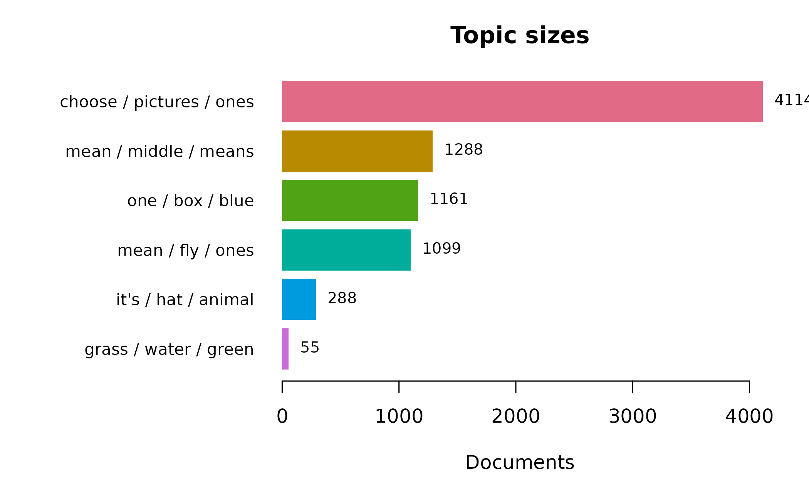
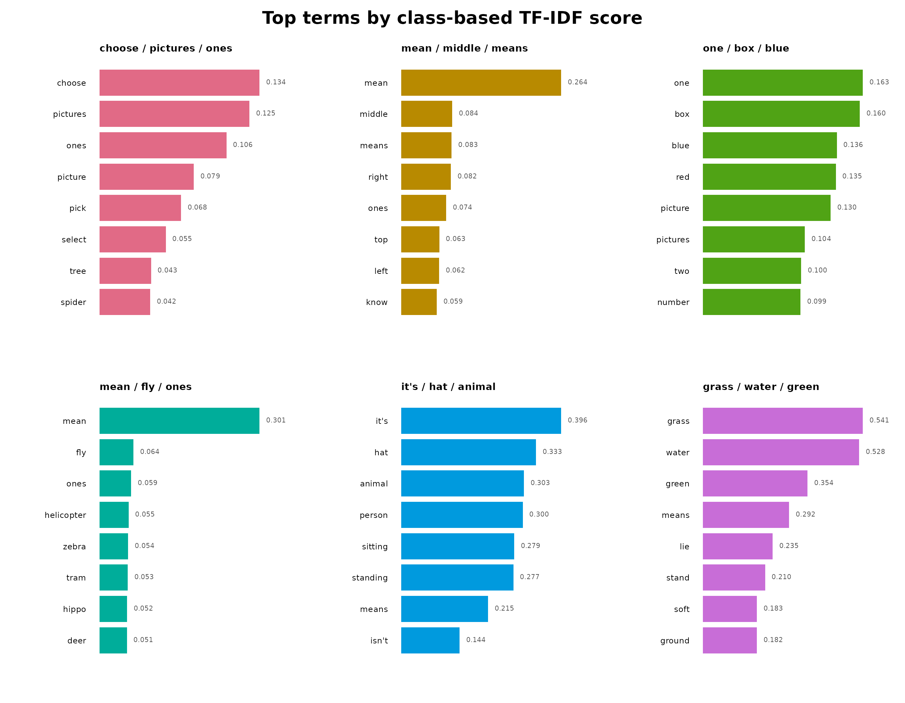
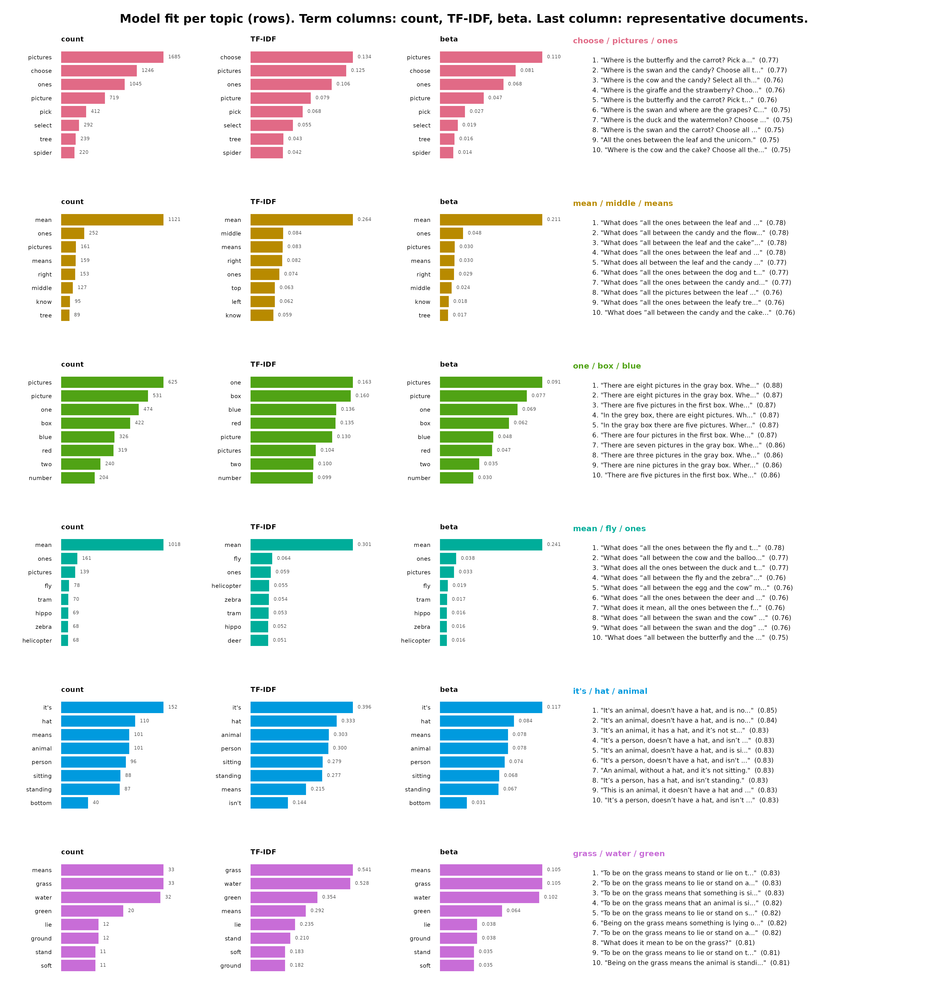

# Semantic Topics in Levebee AI Mathematics Feedback — an sbert Tutorial

## Why this tutorial

The `feedback_translations` dataset bundled with **sbert** contains
8,757 AI-generated feedback messages from the Levebee mathematics
application, translated into English from ten source languages. Nobody
can read nearly nine thousand messages, and many repeat verbatim — “Try
again.” is the most common, appearing 11 times — so simple frequency
lists tell you about templates, not content. Topic modeling answers the
question the raw data cannot: *what kinds of feedback does the system
actually give, and in what proportions?*

The answer has to survive scrutiny, so every step here is deterministic:
rerunning this document reproduces every number, bar, and sentence
exactly. The tutorial builds one six-topic model and then inspects it
from three deliberately different angles:

1.  **Model quality** — coherence and diversity, so you know which
    topics to trust before interpreting any of them.
2.  **Two keyword views per topic** — raw within-topic counts (what the
    topic *says most*) against class-based TF-IDF (what the topic
    *alone* says). These are different lists by construction, and the
    disagreement between them is itself informative.
3.  **Representative sentences** — the centroid-nearest messages, which
    are the auditable evidence that a topic label means what it claims.

| Component | Verb | Question it answers |
|----|----|----|
| Topic model | [`topics()`](https://pak.dynasite.org/sbert/reference/topics.md) | What groups exist, and how big are they? |
| Evaluation | [`coherence()`](https://pak.dynasite.org/sbert/reference/coherence.md), [`topic_diversity()`](https://pak.dynasite.org/sbert/reference/topic_diversity.md) | Which topics are trustworthy? |
| Frequent keywords | `terms(sort_by = "beta")` | What does each topic talk about most? |
| Distinctive keywords | `topic_model$terms` | What does each topic talk about that others do not? |
| Evidence | `topic_model$representatives` | Do real messages support the label? |

``` r

library(sbert)
```

Fourteen revision-pinned models are available; this tutorial uses the
default, `all-MiniLM-L6-v2` (the field’s standard quality-per-megabyte
English embedder). The menu, with each model’s dimension, input limit,
language coverage, and download size:

``` r

models()
```

    ##                                    model dimensions max_tokens      languages
    ## 1                       all-MiniLM-L6-v2        384        256        English
    ## 2                      all-MiniLM-L12-v2        384        128        English
    ## 3                paraphrase-MiniLM-L3-v2        384        128        English
    ## 4              multi-qa-MiniLM-L6-cos-v1        384        512        English
    ## 5  paraphrase-multilingual-MiniLM-L12-v2        384        128  50+ languages
    ## 6                      all-mpnet-base-v2        768        384        English
    ## 7  paraphrase-multilingual-mpnet-base-v2        768        128  50+ languages
    ## 8                      bge-small-en-v1.5        384        512        English
    ## 9                       bge-base-en-v1.5        768        512        English
    ## 10                 multilingual-e5-small        384        512 100+ languages
    ## 11                 nomic-embed-text-v1.5        768       8192        English
    ## 12           jina-embeddings-v2-small-en        512       8192        English
    ## 13                  mxbai-embed-large-v1       1024        512        English
    ## 14                        potion-base-8M        256    1000000        English
    ##    size_mb
    ## 1     90.9
    ## 2    133.6
    ## 3     69.5
    ## 4     90.9
    ## 5    479.4
    ## 6    436.3
    ## 7   1119.2
    ## 8    133.8
    ## 9    436.5
    ## 10   487.4
    ## 11   548.0
    ## 12   130.5
    ## 13  1337.6
    ## 14    30.9

## The corpus, deduplicated

Embedding the same string twice wastes computation and — more
importantly — lets repeated templates skew the clustering geometry:
every copy of a message like “Try again.” acts as another point pulling
on the same centroid.
[`dedupe()`](https://pak.dynasite.org/sbert/reference/dedupe.md)
therefore collapses the corpus to its distinct non-blank messages (each
kind votes once) while keeping the row frequencies, which return as
weights when sizes are reported.

``` r

corpus <- dedupe(feedback_translations$translation)
nrow(corpus)
```

    ## [1] 8005

Three explicit steps turn the corpus into numbers, and each exists for a
reason. Called without arguments, every model function uses the package
default, `all-MiniLM-L6-v2` — a 6-layer distilled English model that is
the field’s standard quality-per-megabyte starter
([`models()`](https://pak.dynasite.org/sbert/reference/models.md) lists
the other thirteen pinned options).
[`model_download()`](https://pak.dynasite.org/sbert/reference/model_download.md)
is the only step that touches the network: it fetches the model’s ONNX
graph (90.4 MB) and tokenizer into the local cache, locked to one
immutable Hugging Face revision and refused unless every byte matches
the SHA-256 hashes pinned inside the package — so the model you run
today is provably the model you run next year. Once the files are
installed the call is a no-op.
[`load_model()`](https://pak.dynasite.org/sbert/reference/load_model.md)
then builds the in-memory model from those verified files: the Rust
tokenizer, the ONNX inference session, and the model’s own settings (384
dimensions, 256-token limit, mean pooling).

[`encode()`](https://pak.dynasite.org/sbert/reference/encode.md) does
the actual work: each message is tokenized into word pieces, run through
the network (one vector per token), mean-pooled into one vector per
message with padding masked out, and L2-normalized. The normalization is
what makes everything downstream cheap — on unit vectors, cosine
similarity is a plain dot product, which is exactly what the k-means
clustering and the centroid distances in the panels below rely on. The
result is an 8,005 × 384 matrix, numerically identical to Python
`SentenceTransformers` output and bit-identical on every rerun — which
is why this tutorial recomputes it (about ten seconds) instead of
shipping a cache file.

``` r

model_download()
minilm <- load_model()
embeddings <- encode(corpus$text, model = minilm)
```

## The six-topic model

Six topics is a reviewed choice for this corpus, not an algorithmic
guess — **sbert** deliberately refuses to pick `n_topics` for you,
because the right granularity depends on what the analysis is *for*
(here: an editorial review of feedback types, where six kinds are
actionable and sixty are not).

``` r

topic_model <- topics(
  corpus$text,
  n_topics = 6,
  embeddings = embeddings,
  n_terms = 8,
  n_representatives = 5
)
topic_model
```

    ## <sbert_topic_model>
    ##   documents: 8005
    ##   topics: 6
    ##   model: precomputed embeddings
    ##   algorithm: deterministic k-means (Lloyd)
    ##   topic sizes: 4114, 1288, 1161, 1099, 288, 55
    ##   between/total SS: 15.2%

### Should you trust these topics?

Interpretation comes *after* evaluation, because a beautifully labeled
topic with poor coherence is a story about noise. NPMI coherence asks
whether a topic’s top terms actually co-occur in its messages (+1 =
always together, −1 = never); diversity asks whether topics share their
vocabulary or own it.

``` r

summary(topic_model)
```

    ## Semantic topic model summary
    ##   documents:            8005
    ##   topics:               6
    ##   model:                precomputed embeddings
    ##   between/total SS:      15.2%
    ##   mean npmi  coherence:  0.1267
    ##   topic topic_diversity:      0.854 (top 10 terms)
    ## 
    ##  topic                    label n_documents proportion coherence
    ##      1 choose / pictures / ones        4114   0.513929 -0.184413
    ##      2    mean / middle / means        1288   0.160899  0.005509
    ##      3         one / box / blue        1161   0.145034  0.221195
    ##      4        mean / fly / ones        1099   0.137289 -0.083529
    ##      5      it's / hat / animal         288   0.035978  0.483772
    ##      6    grass / water / green          55   0.006871  0.317913

``` r

coherence(topic_model, measure = "npmi")
```

    ##   topic                    label measure n_terms    coherence
    ## 1     1 choose / pictures / ones    npmi       8 -0.184412886
    ## 2     2    mean / middle / means    npmi       8  0.005508961
    ## 3     3         one / box / blue    npmi       8  0.221194946
    ## 4     4        mean / fly / ones    npmi       8 -0.083528740
    ## 5     5      it's / hat / animal    npmi       8  0.483772393
    ## 6     6    grass / water / green    npmi       8  0.317913224

Carry these numbers into the per-topic panels below: the topics with the
highest NPMI are the rigid instructional templates (regular phrasing is
exactly what co-occurrence statistics reward), and any topic with
visibly lower coherence should be read through its representative
sentences rather than its keywords.

### Size on two scales

The model counts *distinct* messages, but the application sent some
messages hundreds of times, so editorial priority follows the weighted
share, not the distinct share.
[`topic_sizes()`](https://pak.dynasite.org/sbert/reference/topic_sizes.md)
reports both scales in one call; the gap between `proportion` and
`weighted_share` measures how template-driven each topic is — a topic
whose weighted share far exceeds its distinct share is a small
repertoire of heavily reused messages.

``` r

plot(topic_model, type = "sizes")
```



``` r

topic_sizes(topic_model, weights = corpus$n)
```

    ##   topic                    label n_documents  proportion n_weighted
    ## 1     1 choose / pictures / ones        4114 0.513928795       4390
    ## 2     2    mean / middle / means        1288 0.160899438       1347
    ## 3     3         one / box / blue        1161 0.145034354       1494
    ## 4     4        mean / fly / ones        1099 0.137289194       1128
    ## 5     5      it's / hat / animal         288 0.035977514        326
    ## 6     6    grass / water / green          55 0.006870706         72
    ##   weighted_share
    ## 1    0.501313235
    ## 2    0.153819801
    ## 3    0.170606372
    ## 4    0.128811237
    ## 5    0.037227361
    ## 6    0.008221994

## Two keyword views, one topic

`terms(sort_by = "beta")` returns the empirical probability of each word
given the topic — the *generative* view, dominated by whatever the topic
says most often. The class-based TF-IDF scores in `topic_model$terms`
are the *discriminative* view: they promote words this topic uses and
others do not, and demote the corpus-wide vocabulary (“picture”,
“choose”) that every feedback message shares. Neither list is “the”
keywords; a topic is characterized by the pair. When the two lists
agree, the topic has a vocabulary of its own; when they disagree, the
counts list is telling you about the corpus and only the TF-IDF list
about the topic.

``` r

beta <- terms(topic_model, n = NULL, sort_by = "beta")
head(subset(beta, topic == 1), 8)
```

    ##   topic                    label     term rank      score frequency       beta
    ## 1     1 choose / pictures / ones pictures    1 0.12543830      1685 0.11003004
    ## 2     1 choose / pictures / ones   choose    2 0.13402664      1246 0.08136346
    ## 3     1 choose / pictures / ones     ones    3 0.10629994      1045 0.06823821
    ## 4     1 choose / pictures / ones  picture    4 0.07892443       719 0.04695050
    ## 5     1 choose / pictures / ones     pick    5 0.06819370       412 0.02690349
    ## 6     1 choose / pictures / ones   select    6 0.05547671       292 0.01906752
    ## 7     1 choose / pictures / ones     tree    7 0.04311658       239 0.01560663
    ## 8     1 choose / pictures / ones   spider    8 0.04240590       220 0.01436594

``` r

head(subset(topic_model$terms, topic == 1), 8)
```

    ##   topic                    label     term rank      score frequency
    ## 1     1 choose / pictures / ones   choose    1 0.13402664      1246
    ## 2     1 choose / pictures / ones pictures    2 0.12543830      1685
    ## 3     1 choose / pictures / ones     ones    3 0.10629994      1045
    ## 4     1 choose / pictures / ones  picture    4 0.07892443       719
    ## 5     1 choose / pictures / ones     pick    5 0.06819370       412
    ## 6     1 choose / pictures / ones   select    6 0.05547671       292
    ## 7     1 choose / pictures / ones     tree    7 0.04311658       239
    ## 8     1 choose / pictures / ones   spider    8 0.04240590       220

## The topics at a glance

The two-panel drawing this tutorial once carried by hand is now built
into the package. `plot(topic_model, type = "terms")` shows each topic’s
distinctive class-based TF-IDF terms, each bar annotated with its score:

``` r

plot(topic_model, type = "terms")
```



`type = "fit"` is the whole per-topic report in one figure: for every
topic (one row) it draws all three keyword views — raw within-topic
count, class-based TF-IDF, and generative probability (beta) — followed
by the topic’s centroid-nearest messages with their cosine similarity to
the centroid. Reading across a row shows a label, why it is distinctive,
and the evidence that supports it.

``` r

plot(topic_model, type = "fit", n_terms = 8, n_representatives = 10)
```

 The document text
is clipped to fit; for the full, untruncated evidence behind each topic,
ask for the representatives directly:

``` r

subset(topic_model$representatives, rank <= 2)[
  , c("topic", "rank", "text", "distance")
]
```

    ##    topic rank
    ## 1      1    1
    ## 2      1    2
    ## 6      2    1
    ## 7      2    2
    ## 11     3    1
    ## 12     3    2
    ## 16     4    1
    ## 17     4    2
    ## 21     5    1
    ## 22     5    2
    ## 26     6    1
    ## 27     6    2
    ##                                                                                        text
    ## 1       Where is the butterfly and the carrot? Pick all the pictures that are between them.
    ## 2           Where is the swan and the candy? Choose all the pictures that are between them.
    ## 6                           What does “all the ones between the leaf and the unicorn” mean?
    ## 7                                    What does “all between the candy and the flower” mean?
    ## 11              There are eight pictures in the gray box. Where is there one fewer picture?
    ## 12            There are eight pictures in the gray box. Where are there two fewer pictures?
    ## 16                              What does “all the ones between the fly and the deer” mean?
    ## 17                                    What does "all between the cow and the balloon" mean?
    ## 21                                  It's an animal, doesn't have a hat, and is not sitting.
    ## 22                                 It's an animal, doesn't have a hat, and is not standing.
    ## 26               To be on the grass means to stand or lie on the soft green ground outside.
    ## 27 To be on the grass means to lie or stand on a soft green thing that grows on the ground.
    ##     distance
    ## 1  0.2301158
    ## 2  0.2317346
    ## 6  0.2163106
    ## 7  0.2185925
    ## 11 0.1244105
    ## 12 0.1276533
    ## 16 0.2234504
    ## 17 0.2288911
    ## 21 0.1548222
    ## 22 0.1596835
    ## 26 0.1740130
    ## 27 0.1745096

## Where to go from here

The model built here is reusable, not just describable.
[`predict()`](https://rdrr.io/r/stats/predict.html) assigns any new
feedback message to these six topics without refitting;
[`topic_membership()`](https://pak.dynasite.org/sbert/reference/topic_membership.md)
replaces the hard assignment with graded probabilities when a message
sits between topics; and
[`topic_gamma()`](https://pak.dynasite.org/sbert/reference/topic_gamma.md)
combined with
[`segment()`](https://pak.dynasite.org/sbert/reference/segment.md) shows
when a single multi-sentence message spans several feedback types. For
multilingual work on the *source* messages (the `feedback` column spans
ten languages), change one argument —
`encode(corpus$text, model = "paraphrase-multilingual-MiniLM-L12-v2")` —
and the rest of this document runs unchanged.

    ## [1] "R version 4.6.1 (2026-06-24)"
