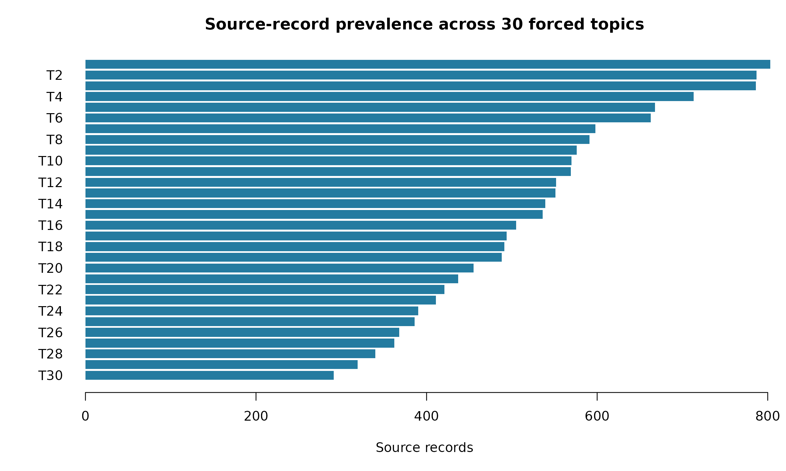
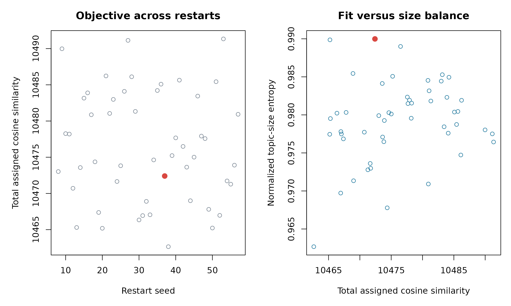
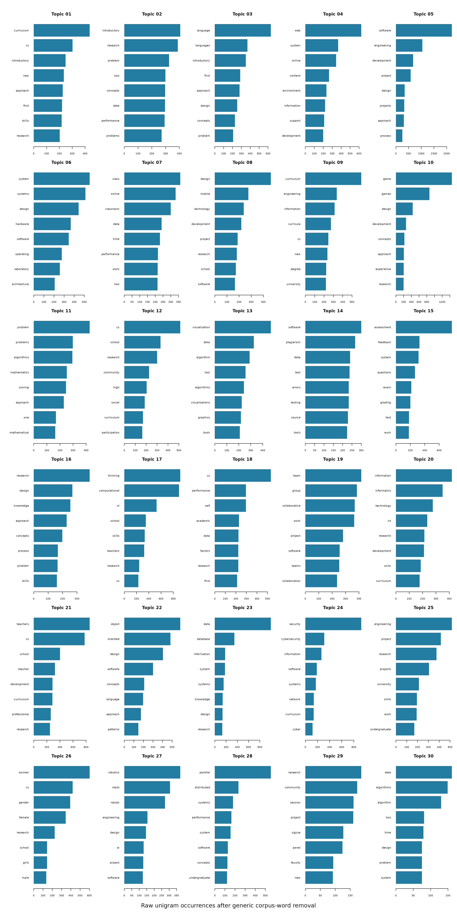

# MCSE Abstract Topics

## Corpus audit

``` r

kpi_values <- c(
  format_count(audit_value[["source_rows"]]),
  format_count(audit_value[["modeled_source_rows"]]),
  format_count(audit_value[["distinct_clean_abstracts"]]),
  format_count(audit_value[["missing_abstracts"]]),
  format_count(audit_value[["placeholder_abstracts"]])
)
kpi_labels <- c(
  "Source records", "Modeled records", "Distinct cleaned abstracts",
  "Missing abstracts", "Placeholder abstracts"
)
kpi_items <- paste0(
  '<div class="kpi"><div class="kpi-value">',
  kpi_values,
  '</div><div class="kpi-label">',
  kpi_labels,
  '</div></div>'
)
cat('<div class="kpi-grid">', paste(kpi_items, collapse = ""), '</div>')
```

16,453

Source records

15,660

Modeled records

15,308

Distinct cleaned abstracts

152

Missing abstracts

641

Placeholder abstracts

The analysis excludes missing abstracts and the literal placeholder
`[NO ABSTRACT AVAILABLE]`. It fits each distinct cleaned abstract once,
then maps the assignment back to every source record. Long abstracts are
represented by sentence-aware chunks combined into one normalized
abstract embedding.

``` r

audit_display <- result$data_audit
audit_display$value <- format_count(audit_display$value)
knitr::kable(
  audit_display,
  col.names = c("Audit metric", "Value"),
  row.names = FALSE
)
```

| Audit metric                   | Value  |
|:-------------------------------|:-------|
| source_rows                    | 16,453 |
| missing_abstracts              | 152    |
| placeholder_abstracts          | 641    |
| modeled_source_rows            | 15,660 |
| distinct_clean_abstracts       | 15,308 |
| duplicate_occurrences          | 352    |
| embedded_chunks                | 17,564 |
| abstracts_with_multiple_chunks | 2,091  |
| model_max_tokens               | 256    |

**Forced topic-count caveat.** Thirty topics were fixed by the analysis
specification. They were not inferred as a uniquely optimal number from
the corpus. Topic IDs are arbitrary and run-specific. Each automatic
label is the exact lead sentence of the centroid-nearest corpus
abstract—not a validated taxonomy or a generated summary. No c-TF-IDF or
keyword score was used for assignments or labels.

## Topic size and label overview

``` r

topic_order <- order(topics$n_source_records)
old_par <- graphics::par(mar = c(5, 5, 3, 1))
graphics::barplot(
  topics$n_source_records[topic_order],
  names.arg = paste0("T", topics$topic[topic_order]),
  horiz = TRUE,
  las = 1,
  col = "#247ba0",
  border = NA,
  xlab = "Source records",
  main = "Source-record prevalence across 30 forced topics"
)
```



``` r

graphics::par(old_par)
```

``` r

topic_display <- topics[
  , c(
    "topic", "canonical_lead_sentence", "canonical_paper_title",
    "n_source_records", "source_record_share", "n_distinct_abstracts",
    "median_cosine_distance", "p90_cosine_distance", "year_min", "year_max"
  )
]
names(topic_display) <- c(
  "Topic", "Exact corpus label", "Canonical paper", "Source records",
  "Share", "Distinct abstracts", "Median distance", "P90 distance",
  "First year", "Last year"
)
topic_display$`Exact corpus label` <- compact_text(
  topic_display$`Exact corpus label`,
  180L
)
topic_display$`Canonical paper` <- compact_text(
  topic_display$`Canonical paper`,
  100L
)
topic_display$Share <- format_percent(topic_display$Share)
topic_display$`Median distance` <- sprintf("%.3f", topic_display$`Median distance`)
topic_display$`P90 distance` <- sprintf("%.3f", topic_display$`P90 distance`)
knitr::kable(topic_display, row.names = FALSE)
```

| Topic | Exact corpus label | Canonical paper | Source records | Share | Distinct abstracts | Median distance | P90 distance | First year | Last year |
|---:|:---|:---|---:|:---|---:|:---|:---|---:|---:|
| 1 | INTRODUCTORY COMPUTING COURSES EMERGED DURING THE SIXTIES, UNDER A VARIETY OF DESIGNATIONS SUCH AS “PROGRAMMING” OR “AUTOMATIC COMPUTING”, OFFERED TO UNIVERSITY STUDENTS IN A BROA… | WHY TEACH INTRODUCTORY COMPUTER SCIENCE? RECONCILING DIVERSE GOALS AND EXPECTATIONS | 803 | 5.1% | 763 | 0.255 | 0.355 | 1968 | 2020 |
| 2 | GOAL-DIRECTED PROBLEM-SOLVING LABS CAN LEAD A STUDENT TO BELIEVE THAT THE MOST IMPORTANT ACHIEVEMENT IN A FIRST PROGRAMMING COURSE IS TO GET PROGRAMS WORKING. | EXPERIENCE REPORT: THINKATHON - COUNTERING AN “I GOT IT WORKING” MENTALITY WITH PENCIL-AND-PAPER EX… | 787 | 5.0% | 777 | 0.271 | 0.361 | 1976 | 2020 |
| 3 | THE FIRST COURSE IN COMPUTER SCIENCE HAS BEEN THE CENTER OF DISCUSSION FOR MANY YEARS, AS MANY STUDENTS AND EDUCATORS HAVE BECOME DISSATISFIED WITH THE CONVENTIONAL TEACHING METHO… | A LECTURE/LABORATORY APPROACH TO THE FIRST COURSE IN PROGRAMMING | 786 | 5.0% | 759 | 0.267 | 0.354 | 1954 | 2020 |
| 4 | TO SUPPORT SCHOOLS IN TEACHING COMPUTER SCIENCE, WE HAVE STARTED THE <INFORMATIK@SCHOOL> PROJECT. | EXPERIENCES IN ONLINE TEACHING AND LEARNING | 713 | 4.6% | 693 | 0.322 | 0.438 | 1984 | 2020 |
| 5 | TRADITIONAL METHODS OF TEACHING SOFTWARE ENGINEERING AT THE UNDERGRADUATE AND GRADUATE LEVELS LACK FULL EFFECTIVENESS DUE TO THE METHOD OF ORGANIZATION OF THE COURSES AND COMPRESS… | TEACHING SOFTWARE DEVELOPMENT IN A STUDIO ENVIRONMENT | 668 | 4.3% | 650 | 0.287 | 0.397 | 1972 | 2020 |
| 6 | STUDIES IN THE FIELD OF COMPUTER SCIENCE COVER ASPECTS OF SCIENCE THAT ATTACH IMPORTANCE TO ANALYSIS AND ASPECTS OF ENGINEERING THAT ATTACH IMPORTANCE TO SYNTHESIS. | KITE MICROPROCESSOR AND CAE FOR COMPUTER SCIENCE | 663 | 4.2% | 650 | 0.338 | 0.480 | 1971 | 2020 |
| 7 | IN THIS ERA OF SMART DEVICES, NEW TECHNOLOGIES, GADGETS, APPS, AND NUMEROUS SYSTEMS AND SERVICES AVAILABLE OVER ONLINE, TEACHING AN INTRODUCTORY PROGRAMMING COURSE BY TRADITIONAL … | ACTIVE AND COLLABORATIVE LEARNING BASED DYNAMIC INSTRUCTIONAL APPROACH IN TEACHING INTRODUCTORY COM… | 598 | 3.8% | 588 | 0.311 | 0.430 | 1974 | 2020 |
| 8 | IN THIS PAPER, WE DESCRIBE A NEW UNDERGRADUATE MODULE FOR NOVICE STUDENTS CONDUCTED ENTIRELY THROUGH DISTANCE LEARNING: MY DIGITAL LIFE (TU100). | STARTING WITH UBICOMP: USING THE SENSEBOARD TO INTRODUCE COMPUTING | 591 | 3.8% | 581 | 0.339 | 0.470 | 1976 | 2020 |
| 9 | THIS POSTER PRESENTATION HIGHLIGHTS THE CURRICULAR RESOURCES AVAILABLE FROM THE TWO-YEAR COLLEGE EDUCATION COMMITTEE (TYCEC), A STANDING COMMITTEE OF THE ACM EDUCATION BOARD. | CURRICULAR RESOURCES FROM THE ACM TWO-YEAR COLLEGE EDUCATION COMMITTEE | 576 | 3.7% | 558 | 0.296 | 0.409 | 1964 | 2020 |
| 10 | GAMES CAN SERVE AS A VALUABLE TOOL FOR ENRICHING COMPUTER SCIENCE EDUCATION, SINCE THEY CAN FACILITATE A NUMBER OF CONDITIONS THAT CAN PROMOTE LEARNING AND INSTIGATE AFFECTIVE CHA… | IF MEMORY SERVES: TOWARDS DESIGNING AND EVALUATING A GAME FOR TEACHING POINTERS TO UNDERGRADUATE ST… | 570 | 3.6% | 567 | 0.273 | 0.467 | 1976 | 2020 |
| 11 | THIS PAPER HAS ATTEMPTED TO DESCRIBE AN APPROACH TO A FIRST COURSE IN THE USE OF COMPUTERS FOR NON-MAJORS IN EITHER COMPUTER SCIENCE OR MATHEMATICS. | AN APPROACH TO THE INTRODUCTORY COMPUTER SCIENCE COURSE FOR NON-MAJORS | 569 | 3.6% | 553 | 0.332 | 0.462 | 1970 | 2020 |
| 12 | MANY STATES THROUGHOUT THE COUNTRY ARE GREATLY IN NEED OF IMPROVEMENT OF THEIR K-12 STEM EDUCATIONAL SYSTEMS AND ALABAMA GENERALLY FALLS WITHIN THE 10 LOWEST PERFORMING STATES WIT… | ENHANCING K-12 EDUCATION WITH ENGINEERING OUTREACH | 552 | 3.5% | 547 | 0.274 | 0.388 | 1972 | 2020 |
| 13 | IT IS SHOWN HOW INTERACTIVE COMPUTER GRAPHICS IS USED IN INTRODUCTORY COMPUTER SCIENCE COURSES AND LABORATORIES AT NORTHEASTERN UNIVERSITY. | INTERACTIVE ANIMATIONS IN COMPUTER SCIENCE | 551 | 3.5% | 536 | 0.310 | 0.460 | 1974 | 2020 |
| 14 | USING AUTOMATED GRADING TOOLS TO PROVIDE FEEDBACK TO STUDENTS IS COMMON IN COMPUTER SCIENCE EDUCATION. | AUTOMATED FEEDBACK FRAMEWORK FOR INTRODUCTORY PROGRAMMING COURSES | 539 | 3.4% | 527 | 0.301 | 0.416 | 1973 | 2020 |
| 15 | AUTOMATED ASSESSMENT TOOLS ARE WIDELY USED AS A MEANS FOR PROVIDING FORMATIVE FEEDBACK TO UNDERGRADUATE STUDENTS IN COMPUTER SCIENCE COURSES WHILE HELPING THOSE COURSES SIMULTANEO… | NUDGING STUDENT LEARNING STRATEGIES USING FORMATIVE FEEDBACK IN AUTOMATICALLY GRADED ASSESSMENTS | 536 | 3.4% | 525 | 0.294 | 0.437 | 1974 | 2020 |
| 16 | THE SUCCESS OF UNIVERSITY-LEVEL EDUCATION DEPENDS ON THE QUALITY OF UNDERLYING SCHOOL EDUCATION AND ANY DEFICIENCY THEREIN MAY BE DETRIMENTAL TO A STUDENT’S CAREER. | ALICE IN OMAN: A STUDY ON OBJECT-FIRST APPROACHES IN COMPUTER SCIENCE EDUCATION | 505 | 3.2% | 496 | 0.335 | 0.449 | 1976 | 2020 |
| 17 | COMPUTATIONAL THINKING (CT) USES CONCEPTS THAT ARE ESSENTIAL TO COMPUTING AND INFORMATION SCIENCE TO SOLVE PROBLEMS, DESIGN AND EVALUATE COMPLEX SYSTEMS, AND UNDERSTAND HUMAN REAS… | CHANGING A GENERATION’S WAY OF THINKING: TEACHING COMPUTATIONAL THINKING THROUGH PROGRAMMING | 494 | 3.2% | 492 | 0.241 | 0.352 | 1976 | 2020 |
| 18 | THE NUMBER OF COMPUTER SCIENCE (CS) COURSES HAS BEEN DRAMATICALLY EXPANDING IN U.S. | THE ASSOCIATION OF HIGH SCHOOL COMPUTER SCIENCE CONTENT AND PEDAGOGY WITH STUDENTS’ SUCCESS IN COLL… | 491 | 3.1% | 486 | 0.309 | 0.445 | 1972 | 2020 |
| 19 | ACTIVE LEARNING IN COMPUTING (ALIC) IS THE FIRST CENTRE FOR EXCELLENCE IN TEACHING AND LEARNING (CETL) PROJECT FOR COMPUTING SCIENCE IN ENGLAND. | EVALUATING THE EXTENT TO WHICH SOCIABILITY AND SOCIAL PRESENCE AFFECTS LEARNING PERFORMANCE | 488 | 3.1% | 475 | 0.292 | 0.394 | 1978 | 2020 |
| 20 | WE DISCUSS THE ROLE OF COMPUTERS AND INFORMATICS IN SCHOOL EDUCATION IN POLAND; ‘INFORMATICS’ GENERALLY STANDS FOR ‘COMPUTER SCIENCE’. | INFORMATICS VERSUS INFORMATION TECHNOLOGY - HOW MUCH INFORMATICS IS NEEDED TO USE INFORMATION TECHN… | 455 | 2.9% | 454 | 0.342 | 0.494 | 1972 | 2020 |
| 21 | LITTLE IS KNOWN ABOUT HOW K-12 COMPUTER SCIENCE (CS) TEACHERS USE TECHNOLOGY AND PROBLEM-BASED LEARNING (PBL) TO TEACH CS CONTENT IN THE CONTEXT OF CS PRINCIPLES CURRICULA. | CS TEACHER EXPERIENCES WITH EDUCATIONAL TECHNOLOGY, PROBLEM-BASED LEARNING, AND A CS PRINCIPLES CUR… | 437 | 2.8% | 434 | 0.262 | 0.361 | 1972 | 2020 |
| 22 | OBJECT-ORIENTED PROGRAMMING IS WIDELY TAUGHT IN INTRODUCTORY COMPUTER SCIENCE COURSES, HOWEVER NO EXISTING OBJECT-ORIENTED PROGRAMMING LANGUAGE IS “THE OBVIOUS CHOICE” FOR A TEACH… | PANEL: DESIGNING THE NEXT EDUCATIONAL PROGRAMMING LANGUAGE | 421 | 2.7% | 399 | 0.278 | 0.439 | 1974 | 2020 |
| 23 | RELATIONAL DATABASES AND OTHER COLLECTIONS OF DATA ARE INCREASINGLY PREVALENT ACROSS A WIDE RANGE OF PROFESSIONS AND DISCIPLINES. | A DATA-CENTRIC INTRODUCTION TO COMPUTER SCIENCE FOR NON-MAJORS | 411 | 2.6% | 404 | 0.351 | 0.515 | 1975 | 2020 |
| 24 | SECURITY IS A CRITICAL ASPECT IN THE DESIGN, DEVELOPMENT, AND TESTING OF SOFTWARE SYSTEMS. | IMPLEMENTATION OF SECURITY MODULES WITH MODEL-ELICITING ACTIVITIES IN COMPUTER SCIENCE COURSES | 390 | 2.5% | 381 | 0.291 | 0.488 | 1976 | 2020 |
| 25 | AN INCREASING NUMBER OF INSTITUTIONS REQUIRE SOFTWARE EN-GINEERING AS PART OF THEIR COMPUTING CURRICULUM. | BEST PRACTICES IN SOFTWARE ENGINEERING PROJECT CLASS MANAGEMENT | 386 | 2.5% | 379 | 0.360 | 0.482 | 1972 | 2020 |
| 26 | GENDER DIFFERENCE APPROACHES TO THE PARTICIPATION OF WOMEN IN COMPUTING HAVE NOT PROVIDED ADEQUATE EXPLANATIONS FOR WOMEN’S DECLINING INTEREST IN COMPUTER SCIENCE (CS) AND RELATED… | DIVERSITY OR DIFFERENCE? NEW RESEARCH SUPPORTS THE CASE FOR A CULTURAL PERSPECTIVE ON WOMEN IN COMP… | 368 | 2.3% | 360 | 0.235 | 0.362 | 1977 | 2020 |
| 27 | MOBILE ROBOTICS IS INHERENTLY A MULTIDISCIPLINARY FIELD DUE TO THE INTERACTION OF HARDWARE, SOFTWARE, AND ELECTRONICS TO CREATE A MACHINE THAT CAN SENSE ITS ENVIRONMENT AND THEN A… | DESIGN OF A MODULAR EDUCATIONAL ROBOTICS PLATFORM FOR MULTIDISCIPLINARY EDUCATION | 362 | 2.3% | 357 | 0.277 | 0.433 | 1983 | 2020 |
| 28 | DESPITE THE FACTS THAT MULTICORE CPUS ARE PRESENT IN VIRTUALLY EVERY PERSONAL COMPUTER OR CELL PHONE AND DISTRIBUTED SYSTEMS IN THE FORM OF CLOUD SERVICES ARE STEADILY PENETRATING… | AN ENTERTAINING APPROACH TO PARALLEL PROGRAMMING EDUCATION | 340 | 2.2% | 335 | 0.318 | 0.506 | 1983 | 2020 |
| 29 | AS WE CELEBRATE THE 50TH SIGCSE SYMPOSIUM, THIS PANEL EXPLORES HOW COMPUTING EDUCATION RESEARCHERS CHART A COURSE INDIVIDUALLY AND AS A COMMUNITY TO BUILD OUR RESEARCH PRACTICES A… | NEGOTIATING VARIED RESEARCH GOALS IN COMPUTING EDUCATION RESEARCH | 319 | 2.0% | 304 | 0.348 | 0.505 | 1970 | 2020 |
| 30 | DATA STRUCTURES (CS2) COURSES AND COURSE BOOKS DO NOT USUALLY PUT MUCH EMPHASIS IN THE PROCESS OF HOW A DATA STRUCTURE IS ENGINEERED OR INVENTED. | A SOFTWARE CRAFTSMAN’S APPROACH TO DATA STRUCTURES | 291 | 1.9% | 278 | 0.466 | 0.699 | 1971 | 2020 |

Cosine distance is not a probability or confidence score. Smaller values
mean that an abstract is closer to its assigned topic centroid.
Assignment margin is the selected-centroid similarity minus the
second-best similarity; smaller margins identify less distinct
assignments.

## Representative papers and canonical abstracts

The four representatives for each topic were selected from the central
quarter of that topic. Rank 1 is the centroid-nearest canonical
abstract. Ranks 2–4 add embedding-space diversity through maximal
marginal relevance. The labels and representatives therefore remain
semantic, full-abstract evidence.

``` r

representative_topic_html <- vapply(
  seq_len(nrow(topics)),
  function(topic_row) {
    topic_id <- topics$topic[[topic_row]]
    topic_representatives <- representatives[
      representatives$topic == topic_id,
      ,
      drop = FALSE
    ]
    topic_representatives <- topic_representatives[
      order(topic_representatives$rank),
      ,
      drop = FALSE
    ]
    paper_html <- vapply(
      seq_len(nrow(topic_representatives)),
      function(representative_row) {
        paper <- topic_representatives[representative_row, , drop = FALSE]
        doi_text <- if (
          is.na(paper$doi[[1L]]) || !nzchar(trimws(paper$doi[[1L]]))
        ) {
          "DOI unavailable"
        } else {
          paste0("DOI: ", html_escape(paper$doi[[1L]]))
        }
        sprintf(
          paste0(
            '<details%s><summary>Rank %d%s · %s (%s)</summary>',
            '<div class="paper-meta">%s · %s · %s · %s · distance %.3f · margin %.4f</div>',
            '<p class="abstract">%s</p></details>'
          ),
          if (paper$rank[[1L]] == 1L) " open" else "",
          paper$rank[[1L]],
          if (paper$rank[[1L]] == 1L) " — canonical" else "",
          html_escape(paper$title[[1L]]),
          html_escape(as.character(paper$year[[1L]])),
          html_escape(paper$authors[[1L]]),
          html_escape(ifelse(is.na(paper$source[[1L]]), "Source unavailable", paper$source[[1L]])),
          doi_text,
          html_escape(paper$source_record_id[[1L]]),
          paper$cosine_distance_to_centroid[[1L]],
          paper$assignment_margin[[1L]],
          html_escape(paper$cleaned_abstract[[1L]])
        )
      },
      character(1)
    )
    sprintf(
      paste0(
        '<div class="topic-block"><h3>Topic %d</h3>',
        '<div class="topic-meta">%s source records · %s distinct abstracts · %s</div>',
        '<div class="canonical-label"><strong>Exact corpus label:</strong> %s</div>',
        '%s</div>'
      ),
      topic_id,
      format_count(topics$n_source_records[[topic_row]]),
      format_count(topics$n_distinct_abstracts[[topic_row]]),
      format_percent(topics$source_record_share[[topic_row]]),
      html_escape(topics$canonical_lead_sentence[[topic_row]]),
      paste(paper_html, collapse = "\n")
    )
  },
  character(1)
)
cat(paste(representative_topic_html, collapse = "\n"))
```

### Topic 1

803 source records · 763 distinct abstracts · 5.1%

**Exact corpus label:** INTRODUCTORY COMPUTING COURSES EMERGED DURING
THE SIXTIES, UNDER A VARIETY OF DESIGNATIONS SUCH AS "PROGRAMMING" OR
"AUTOMATIC COMPUTING", OFFERED TO UNIVERSITY STUDENTS IN A BROAD RANGE
OF DISCIPLINES.

Rank 1 — canonical · WHY TEACH INTRODUCTORY COMPUTER SCIENCE?
RECONCILING DIVERSE GOALS AND EXPECTATIONS (2005)

NIEVERGELT J · LECTURE NOTES IN COMPUTER SCIENCE · DOI:
10.1007/978-3-540-31958-0_12 · 2-S2.0-24344457315 · distance 0.116 ·
margin 0.0907

INTRODUCTORY COMPUTING COURSES EMERGED DURING THE SIXTIES, UNDER A
VARIETY OF DESIGNATIONS SUCH AS "PROGRAMMING" OR "AUTOMATIC COMPUTING",
OFFERED TO UNIVERSITY STUDENTS IN A BROAD RANGE OF DISCIPLINES. WHEREAS
THE CONCEPT OF A "FIRST COURSE IN COMPUTER SCIENCE" SURVIVED FOUR
DECADES, AND EVEN MOVED TO THE HIGH SCHOOL LEVEL, ITS GOALS AND CONTENTS
HAVE BEEN CHANGING EXCESSIVELY, AND HAVE NOT AS YET REACHED A STABLE
STATE. WE REVIEW THE HISTORICAL DEVELOPMENT OF TYPICAL INTRODUCTORY CS
COURSES AND ANALYZE THE FORCES THAT SHAPED THEM. INSPIRED BY MORE MATURE
SCIENCES, AND THE WAY THEIR INTRODUCTORY COURSES EVOLVED OVER CENTURIES
TO SIMULTANEOUSLY MEET DISTINCT EXPECTATIONS, WE ARGUE THAT AN
INTRODUCTORY CS COURSE SHOULD ADDRESS THREE GOALS: THE DEVELOPMENT OF
SKILLS IN PROGRAMMING SOME SIMPLE SYSTEM, APPRECIATION OF INTELLECTUAL
ACHIEVEMENTS, AND THE ROLE OF INFORMATION TECHNOLOGY IN SOCIETY.
ALTHOUGH THIS REQUIREMENT MAY BE CONSIDERED OVERLY AMBITIOUS, WE AIM TO
SHOW THAT IT CAN BE ACHIEVED IF ISSUES ARE PRESENTED IN TERMS OF
WELL-CHOSEN EXAMPLES RATHER THAN IN A GENERAL, ABSTRACT MANNER. ©
SPRINGER-VERLAG BERLIN HEIDELBERG 2005.

Rank 2 · A PROFILE OF UNDERGRADUATE COMPUTER SCIENCE CURRICULA (1995)

JALICS P;GOLDEN D · COMPUTER SCIENCE EDUCATION · DOI:
10.1080/0899340950060205 · 2-S2.0-3943083377 · distance 0.159 · margin
0.0023

THIS ARTICLE PRESENTS THE RESULTS OF A SURVEY ON COMPUTER SCIENCE
CURRICULA SENT TO 185 COMPUTER SCIENCE DEPARTMENTS NATIONALLY IN 1994.
THE SURVEY CONSISTS OF 26 GROUPS OF QUESTIONS THAT PROBE UNDERGRADUATE
COMPUTER SCIENCE CURRICULA. RESULTS FROM 81 UNIVERSITIES ARE REPORTED
AND SHOW THE MAJOR OUTLINES OF WHAT IS TAUGHT IN THIS FAST-CHANGING
FIELD. IT IS HOPED THAT THE RESULTS WILL HELP CURRICULUM DESIGNERS
ASSESS WHAT IS STATE OF THE ART IN THE VARIOUS AREAS OF COMPUTER SCIENCE
CURRICULA. ALSO, IT MIGHT ENCOURAGE THOSE IN INDUSTRY TO GIVE MORE
FEEDBACK ABOUT WHAT SKILLS ARE OF INTEREST TO THEM.

Rank 3 · TEACHING ENTERING STUDENTS TO THINK LIKE COMPUTER SCIENTISTS
(2005)

TURNER EH;TURNER RM · PROCEEDINGS OF THE THIRTY-SIXTH SIGCSE TECHNICAL
SYMPOSIUM ON COMPUTER SCIENCE EDUCATION, SIGCSE 2005 · DOI:
10.1145/1047124.1047451 · 2-S2.0-20444492066 · distance 0.145 · margin
0.1021

THIS PAPER DESCRIBES A NEW COURSE DEVELOPED AT THE UNIVERSITY OF MAINE
TO HELP STUDENTS BETTER UNDERSTAND THE DISCIPLINE OF COMPUTER SCIENCE
AND TO AID US IN RECRUITING AND RETAINING MAJORS. THE COURSE PROVIDES AN
OVERVIEW OF COMPUTER SCIENCE, BUT ALSO, THROUGH FOCUSING ON PARTICULAR
TOPICS AT AN ADVANCED LEVEL, BEGINS TO TEACH STUDENTS HOW COMPUTER
SCIENTISTS THINK ABOUT PROBLEMS. THE COURSE HAS BEEN TAUGHT IN FALL
2002, 2003 AND 2004. THIS PAPER DESCRIBES THE COURSE AND DISCUSSES OUR
RESULTS FROM THE FIRST TWO YEARS.

Rank 4 · AN INSTRUCTIONALLY ACCEPTABLE COST EFFECTIVE APPROACH TO A
GENERAL INTRODUCTORY COURSE (1976)

UNGER EA;AHMED N · ACM SIGCSE BULLETIN · DOI: 10.1145/382220.382466 ·
2-S2.0-84976775852 · distance 0.126 · margin 0.1032

THIS PAPER DESCRIBES ONE APPROACH TO ANSWERING THE NEED FOR AN
INTRODUCTORY COMPUTER SCIENCE COURSE WHICH WILL APPEAL TO A
UNIVERSITY-WIDE AUDIENCE. KANSAS STATE UNIVERSITY AS MANY OTHER
INSTITUTIONS WAS FACES WITH SUCH A CHLLENGE WHEN FINANCIAL CONSTRAINTS
BECAME MORE RIGID. A LARGE INFLUX OF STUDENTS ENTERED THE COMPUTER
SCIENCE PROGRAM, AND MANY OTHER UNITS WITHIN THE UNIVERSITY RECOGNIZED
THE NEED FOR SOME PREPARATION FOR THEIR STUDENTS IN COMPUTER SCIENCE.
OVER A PERIOD OF THREE YEARS THE COURSE DISCUSSED WAS DEVELOPED WITH
LARGE LECTURES AND SMALL LABORATORIES. IT IS A COST-EFFECTIVE SOLUTION
THAT CATERS TO THE NEEDS OF VARIOUS DISCIPLINES.

### Topic 2

787 source records · 777 distinct abstracts · 5.0%

**Exact corpus label:** GOAL-DIRECTED PROBLEM-SOLVING LABS CAN LEAD A
STUDENT TO BELIEVE THAT THE MOST IMPORTANT ACHIEVEMENT IN A FIRST
PROGRAMMING COURSE IS TO GET PROGRAMS WORKING.

Rank 1 — canonical · EXPERIENCE REPORT: THINKATHON - COUNTERING AN "I
GOT IT WORKING" MENTALITY WITH PENCIL-AND-PAPER EXERCISES (2019)

CUTTS QI;BARR M;DORODCHI M;DONALDSON P;DRAPER S;PARKINSON J;SINGER
J;SUNDIN L · ANNUAL CONFERENCE ON INNOVATION AND TECHNOLOGY IN COMPUTER
SCIENCE EDUCATION, ITICSE · DOI: 10.1145/3304221.3319785 ·
2-S2.0-85070857663 · distance 0.129 · margin 0.1042

GOAL-DIRECTED PROBLEM-SOLVING LABS CAN LEAD A STUDENT TO BELIEVE THAT
THE MOST IMPORTANT ACHIEVEMENT IN A FIRST PROGRAMMING COURSE IS TO GET
PROGRAMS WORKING. THIS IS COUNTER TO RESEARCH INDICATING THAT CODE
COMPREHENSION IS AN IMPORTANT DEVELOPMENTAL STEP FOR NOVICE PROGRAMMERS.
WE OBSERVED THIS IN OUR OWN CS-0 INTRODUCTORY PROGRAMMING COURSE, AND
FURTHERMORE, THAT STUDENTS WEREN’T MAKING THE CONNECTION BETWEEN CODE
COMPREHENSION IN LABS AND A FINAL EXAMINATION THAT REQUIRED SOLUTIONS TO
PENCIL-AND-PAPER COMPREHENSION AND WRITING EXERCISES, WHERE SOUND
UNDERSTANDING OF PROGRAMMING CONCEPTS IS ESSENTIAL. REALISING THESE
DEFICIENCIES LATE IN OUR COURSE, WE PUT ON THREE 3-HOUR OPTIONAL
REVISION EVENINGS JUST DAYS BEFORE THE EXAM. BASED ON A MASTERY LEARNING
PHILOSOPHY, STUDENTS WERE EXPECTED TO WORK THROUGH A BANK OF AROUND 200
PENCIL-AND-PAPER EXERCISES. BY COMPARISON WITH A MACHINE-BASED
HACKATHON, WE CALLED THIS A THINKATHON. STUDENTS COMPLETED A PRE AND
POST QUESTIONNAIRE ABOUT THEIR EXPERIENCE OF THE THINKATHON. WHILE WE
FIND THAT THINKATHON ATTENDANCE POSITIVELY INFLUENCES FINAL GRADES, WE
BELIEVE OUR REFLECTION ON THE OVERALL EXPERIENCE IS OF GREATER VALUE. WE
REPORT THAT: RESPECTED METHODS FOR DEVELOPING CODE COMPREHENSION MAY NOT
BE ENOUGH ON THEIR OWN; NOVICES MUST EXERCISE THEIR DEVELOPING SKILLS
AWAY FROM MACHINES; AND THERE ARE SOCIAL LEARNING OUTCOMES IN
PROGRAMMING COURSES, CURRENTLY IMPLICIT, THAT WE SHOULD MAKE EXPLICIT.

Rank 2 · EVALUATION OF PROGRAMMING COMPETENCY USING STUDENT ERROR
PATTERNS (2015)

KIRAN ELN;MOUDGALYA KM · PROCEEDINGS - 2015 INTERNATIONAL CONFERENCE ON
LEARNING AND TEACHING IN COMPUTING AND ENGINEERING, LATICE 2015 · DOI:
10.1109/LaTiCE.2015.16 · 2-S2.0-84942768638 · distance 0.152 · margin
0.0398

COMPUTER PROGRAMMING IS A CHALLENGING SKILL THAT STUDENTS IN COMPUTER
SCIENCE AND RELATED DISCIPLINES ARE EXPECTED TO LEARN. COMPUTER SCIENCE
EDUCATORS AND STUDENTS ARE CONCERNED ABOUT THE FAILURES IN PROGRAMMING
COMPETENCY. PROGRAMMING ERRORS REFLECT VARIOUS DETAILS OF STUDENT
CONCEPTUAL UNDERSTANDING AND PROGRAMMING SKILLS DEVELOPED. THIS PAPER
ATTEMPTS TO PREDICT THE FAILURES IN PROGRAMMING COMPREHENSION AND
DEBUGGING SKILLS BASED ON PROGRAMMING ERRORS GENERATED BY THE LEARNER.
WE CONDUCT A MIXED METHOD APPROACH WITH PRE-POST TEST EXPERIMENTAL
DESIGN TO EVALUATE THE JAVA PROGRAMMING COMPETENCY OF THE LEARNER. WE
ALSO COMPUTE THE ERROR METRICS AND SUPPLEMENT THE COURSE MATERIAL TO
IMPROVE THE COMPETENCY THROUGH SELF-LEARNING SPOKEN TUTORIAL WORKSHOPS.
THE CHARACTERIZATION OF STUDENT PROGRAMMING PATTERNS HELPS TO IDENTIFY
AT RISK STUDENTS AND DETERMINE SPECIFIC INTERVENTIONS. WE ANALYZE THE
COMPILATION ERRORS, COMPUTATIONAL TIME AND COMPUTED ERROR QUOTIENTS TO
PREDICT THE PROGRAMMING BEHAVIOUR. RESULTS OF THE STUDY SHOW THAT
STUDENTS HAVE IMPROVED THEIR PROGRAMMING SKILLS AND BENEFITED FROM THE
APPROACH. IMPLICATIONS OF THIS STUDY IS ALSO HELPFUL TO COMPUTING
EDUCATION PRACTITIONERS, WORKSHOP ORGANIZERS, CONTENT DEVELOPERS AND
REVIEWERS TO IMPROVISE THE COURSE CONTENT.

Rank 3 · LEARNING LOOPS: A REPLICATION STUDY ILLUMINATES IMPACT OF HS
COURSES (2016)

MORRISON B;DECKER A;MARGULIEUX L · ICER 2016 - PROCEEDINGS OF THE 2016
ACM CONFERENCE ON INTERNATIONAL COMPUTING EDUCATION RESEARCH · DOI:
10.1145/2960310.2960330 · 2-S2.0-85000631154 · distance 0.145 · margin
0.0767

A RECENT STUDY ABOUT THE EFFECTIVENESS OF SUBGOAL LABELING IN AN
INTRODUCTORY COMPUTER SCIENCE PROGRAMMING COURSE BOTH SUPPORTED PREVIOUS
RESEARCH AND PRODUCED SOME PUZZLING RESULTS. IN THIS STUDY, WE REPLICATE
THE EXPERIMENT WITH A DIFFERENT STUDENT POPULATION TO DETERMINE IF THE
RESULTS ARE REPEATABLE. WE ALSO GAVE THE EXPERIMENTAL TASK TO STUDENTS
IN A FOLLOW-ON COURSE TO EXPLORE IF THEY HAD INDEED MASTERED THE
PROGRAMMING CONCEPT. WE FOUND THAT THE PREVIOUS PUZZLING RESULTS WERE
REPEATED. IN ADDITION, FOR THE NOVICE PROGRAMMERS, WE FOUND A
STATISTICALLY SIGNIFICANT DIFFERENCE IN PERFORMANCE BASED ON WHETHER THE
STUDENT HAD PREVIOUS PROGRAMMING COURSES IN HIGH SCHOOL. HOWEVER, THIS
PERFORMANCE DIFFERENCE DISAPPEARS IN A FOLLOW-ON COURSE AFTER ALL
STUDENTS HAVE TAKEN AN INTRODUCTORY COMPUTER SCIENCE PROGRAMMING COURSE.
THE RESULTS OF THIS STUDY HAVE IMPLICATIONS FOR HOW QUICKLY STUDENTS ARE
EVALUATED FOR MASTERY OF KNOWLEDGE AND HOW WE GROUP STUDENTS IN
INTRODUCTORY PROGRAMMING COURSES.

Rank 4 · USING COMMUTATIVE ASSESSMENTS TO COMPARE CONCEPTUAL
UNDERSTANDING IN BLOCKS-BASED AND TEXT-BASED PROGRAMS (2015)

WEINTROP D;WILENSKY U · ICER 2015 - PROCEEDINGS OF THE 2015 ACM
CONFERENCE ON INTERNATIONAL COMPUTING EDUCATION RESEARCH · DOI:
10.1145/2787622.2787721 · 2-S2.0-84959279311 · distance 0.173 · margin
0.0670

BLOCKS-BASED PROGRAMMING ENVIRONMENTS ARE BECOMING INCREASINGLY COMMON
IN INTRODUCTORY PROGRAMMING COURSES, BUT TO DATE, LITTLE COMPARATIVE
WORK HAS BEEN DONE TO UNDERSTAND IF AND HOW THIS APPROACH AFFECTS
STUDENTS' EMERGING UNDERSTANDING OF FUNDAMENTAL PROGRAMMING CONCEPTS. IN
AN EFFORT TO UNDERSTAND HOW TOOLS LIKE SCRATCH AND BLOCKLY DIFFER FROM
MORE CONVENTIONAL TEXT-BASED INTRODUCTORY PROGRAMMING LANGUAGES WITH
RESPECT TO CONCEPTUAL UNDERSTANDING, WE DEVELOPED A SET OF "COMMUTATIVE"
ASSESSMENTS. EACH MULTIPLE-CHOICE QUESTION ON THE ASSESSMENT INCLUDES A
SHORT PROGRAM THAT CAN BE DISPLAYED IN EITHER A BLOCKS-BASED OR
TEXT-BASED FORM. THE SET OF POTENTIAL ANSWERS FOR EACH QUESTION INCLUDES
THE CORRECT ANSWER ALONG WITH CHOICES INFORMED BY PRIOR RESEARCH ON
NOVICE PROGRAMMING MISCONCEPTIONS. IN THIS PAPER WE INTRODUCE THE
COMMUTATIVE ASSESSMENT, DISCUSS THE THEORETICAL AND PRACTICAL
MOTIVATIONS FOR THE ASSESSMENT, AND PRESENT FINDINGS FROM A STUDY THAT
USED THE ASSESSMENT. THE STUDY HAD 90 HIGH SCHOOL STUDENTS TAKE THE
ASSESSMENT AT THREE POINTS OVER THE COURSE OF THE FIRST TEN WEEKS OF AN
INTRODUCTION TO PROGRAMMING COURSE, ALTERNATING THE MODALITY (BLOCKS VS.
TEXT) FOR EACH QUESTION OVER THE COURSE OF THE THREE ADMINISTRATIONS OF
THE ASSESSMENT. OUR ANALYSIS REVEALS DIFFERENCES ON PERFORMANCE BETWEEN
BLOCKS-BASED AND TEXT-BASED QUESTIONS AS WELL AS DIFFERENCES IN THE
FREQUENCY OF MISCONCEPTIONS BASED ON THE MODALITY. FUTURE WORK,
POTENTIAL IMPLICATIONS, AND LIMITATIONS OF THESE FINDINGS ARE ALSO
DISCUSSED.

### Topic 3

786 source records · 759 distinct abstracts · 5.0%

**Exact corpus label:** THE FIRST COURSE IN COMPUTER SCIENCE HAS BEEN
THE CENTER OF DISCUSSION FOR MANY YEARS, AS MANY STUDENTS AND EDUCATORS
HAVE BECOME DISSATISFIED WITH THE CONVENTIONAL TEACHING METHODS.

Rank 1 — canonical · A LECTURE/LABORATORY APPROACH TO THE FIRST COURSE
IN PROGRAMMING (1978)

PRATHER RE;SCHLESINGER JD · PAPERS OF THE SIGCSE/CSA TECHNICAL SYMPOSIUM
ON COMPUTER SCIENCE EDUCATION, SIGCSE 1978 · DOI: 10.1145/990555.990599
· 2-S2.0-85053190595 · distance 0.134 · margin 0.0606

THE FIRST COURSE IN COMPUTER SCIENCE HAS BEEN THE CENTER OF DISCUSSION
FOR MANY YEARS, AS MANY STUDENTS AND EDUCATORS HAVE BECOME DISSATISFIED
WITH THE CONVENTIONAL TEACHING METHODS. BASED ON THE TRAINING REQUIRED
BY EARLY COMPUTER SPECIALISTS, WE HAVE TRADITIONALLY CONCERNED OURSELVES
WITH TEACHING A PROGRAMMING LANGUAGE WITHOUT SPECIFICALLY ADDRESSING
OURSELVES TO SUCH CONCEPTS AS PROBLEM SOLVING, ALGORITHM DEVELOPMENT,
STORAGE USAGE, ETC. THIS APPROACH YIELDED SATISFACTORY RESULTS WHILE
PROGRAMMING STUDENTS WERE DRAWN ONLY FROM THOSE FIELDS WHICH DEALT WITH
PROBLEM SOLVING WITHIN THEIR OWN DISCIPLINES-E.G., ENGINEERING,
MATHEMATICS. HOWEVER, PROSPECTIVE PROGRAMMING STUDENTS ARE NOW BEING
DRAWN FROM A WIDER RANGE OF DISCIPLINES. THE INSTRUCTOR IN THE FIRST
PROGRAMMING COURSE IS NO LONGER ABLE TO IGNORE THE CONCEPTS JUST
MENTIONED, WHILE ASSUMING THAT STUDENTS HAVE LEARNED THESE IDEAS IN
OTHER COURSES. © PAPERS OF THE SIGCSE/CSA TECHNICAL SYMPOSIUM ON
COMPUTER SCIENCE EDUCATION, SIGCSE 1978.

Rank 2 · LEARNING PROGRAMMING USING LEARNING OBJECTS (2015)

MAZILU IM;STOICA DN · PROCEEDINGS OF THE INTERNATIONAL CONFERENCE ON
E-LEARNING, ICEL · DOI unavailable · 2-S2.0-84940666398 · distance 0.169
· margin 0.0271

THIS PAPER SUMMARIZES THE EXPERIENCE GATHERED IN TECHNICAL UNIVERSITY OF
CIVIL ENGINEERING FROM EUROPEAN AND TRANS-NATIONAL E-LEARNING PROJECTS
IN THE PAST COUPLE OF YEARS. THE MAIN FOCUS IS ON THE DEVELOPMENT OF
LEARNING OBJECTS (LO) IN LEARNING PROGRAMMING FIELD. THIS PAPER PRESENT
THE IMPLEMENTATION OF THE E-LEARNING TOOLS TO SUPPORT THE IMPROVEMENT OF
PROGRAMMING SKILLS DURING ACADEMIC EDUCATION OR/AND IN THE ADDITIONAL
EDUCATION. THE LOS ARE INTERACTIVE VISUALIZATIONS OF PROGRAM CODE
EXAMPLES OR PROGRAMMING TASKS. THE IDEA OF THE PROGRAM VISUALIZATION LOS
IS DEBUGGER LIKE STEP-BY-STEP PROGRAM EXECUTION IN BOTH FORWARD AND
BACKWARD DIRECTIONS. THE PROGRAM CODE IS HIGHLIGHTED IN EACH IMPORTANT
STEP OF THE PROGRAM EXECUTION AND THE RUN OF THE EXECUTION IN CODE IS
ALSO VISUALIZED BY ARROWS WHEN NECESSARY. IN EACH STEP OF THE PROGRAM
EXECUTION CONSOLE IS VISIBLE AS WELL AS THE MEMORY AREA. THERE ARE ALSO
AREAS FOR THE CONDITIONS AND FOR THE SHORT EXPLANATIONS OF THE CURRENT
STEP. THE MEMORY PART IS THE ONLY ONE WHERE THE LAYOUT CAN BE CHANGED
ACCORDING TO THE SUBJECT AS LEARNING GOAL. THESE CHANGES APPEAR FOR
EXAMPLE IN CASE OF ARRAYS WHEN THE STRUCTURE OF THE ARRAY IS VISUALIZED
THE LOS HAVE BEEN DEVELOPED TO HELP STUDENTS TO UNDERSTAND PROGRAMMING
STRUCTURES MORE EASILY, HAVING THE CAPACITY AND APPROPRIATE PROGRAMMING
SKILLS NEEDED FOR THEIR OPTIMAL INTEGRATION ACCORDING TO THE
REQUIREMENTS OF THE ROMANIAN AND EUROPEAN CURRICULA. A LO CAN COVER ANY
SPECIFIC PROGRAMMING PROBLEM IN ANY PROGRAMMING LANGUAGE. LO CAN ALSO
COVER THE PROBLEM-SOLVING LOGIC AT THE ALGORITHMIC LEVEL. IN THE END IS
PRESENTED A CASE OF STUDY ORGANIZED ON THE SAME COURSE IN TWO YEARS: IN
THE FIRST YEAR STUDENTS DO NOT HAVE THE PROGRAM VISUALIZATION LOS AS
LEARNING MATERIAL AVAILABLE AND IN THE SECOND YEAR THEY HAVE THE PROGRAM
VISUALIZATION LOS AVAILABLE. THE STUDENTS STUDY EXACTLY THE SAME COURSE.
THE EFFECTS OF THE PROGRAM VISUALIZATION LOS ON THE RESULTS ARE THEN
ANALYZED BY THE FINAL COURSE POINTS, GRADES AND ACTIVITY OF THE STUDENTS
AND ALSO WITH A SURVEY ABOUT ALL LEARNING MATERIALS AVAILABLE HELD AT
THE END OF THE COURSE. INTERACTIVE LOS IS AN IDEA THAT MANY TEACHERS
WELCOME IN THEIR SEARCH FOR NEW METHODS AND SUPPORT FOR NOVICE
PROGRAMMING STUDENTS. IT IS QUITE CLEAR THAT STUDENTS BELIEVE THAT LOS
CAN BE USEFUL FOR THEM AS NOVICE PROGRAMMING STUDENTS. BUT IT IS ALSO
SURE THAT MORE INTRODUCTIONS AND BETTER INTEGRATION OF LOS IS NEEDED TO
ENCOURAGE STUDENTS TO USE THEM MORE FREQUENTLY AS A NORMAL PART OF THEIR
PROGRAMMING STUDY.

Rank 3 · A PROGRAMMING LANGUAGES COURSE FOR FRESHMEN (2005)

ANGEL VELAZQUEZ-LTURBIDE J · PROCEEDINGS OF THE 10TH ANNUAL SIGCSE
CONFERENCE ON INNOVATION AND TECHNOLOGY IN COMPUTER SCIENCE EDUCATION ·
DOI unavailable · 2-S2.0-29944446782 · distance 0.139 · margin 0.1050

PROGRAMMING LANGUAGES ARE A PART OF THE CORE OF COMPUTER SCIENCE.
COURSES ON PROGRAMMING LANGUAGES ARE TYPICALLY OFFERED TO JUNIOR OR
SENIOR STUDENTS, AND TEXTBOOKS ARE BASED ON THIS ASSUMPTION. HOWEVER,
OUR COMPUTER SCIENCE CURRICULUM OFFERS THE PROGRAMMING LANGUAGES COURSE
IN THE FIRST YEAR. THIS UNUSUAL SITUATION LED US TO DESIGN IT FROM AN
UNTYPICAL APPROACH. IN THIS PAPER, WE FIRST ANALYZE AND CLASSIFY
PROPOSALS FOR THE PROGRAMMING LANGUAGES COURSE INTO DIFFERENT PURE AND
HYBRID APPROACHES. THEN, WE DESCRIBE A COURSE FOR FRESHMEN BASED ON FOUR
PURE APPROACHES, AND JUSTIFY THE MAIN CHOICES MADE. FINALLY, WE IDENTIFY
THE SOFTWARE USED FOR LABORATORIES AND OUTLINE OUR EXPERIENCE AFTER
TEACHING IT FOR SEVEN YEARS.

Rank 4 · TEACHING AND LEARNING COMPUTER PROGRAMMING: A SURVEY OF STUDENT
PROBLEMS, TEACHING METHODS, AND AUTOMATED INSTRUCTIONAL TOOLS (1980)

ULLOA M · ACM SIGCSE BULLETIN · DOI: 10.1145/989253.989263 ·
2-S2.0-33751282730 · distance 0.139 · margin 0.0898

TO IMPROVE INTRODUCTORY COMPUTER SCIENCE COURSES AND TO UPDATE THE
TEACHING OF COMPUTER PROGRAMMING, NEW TEACHING METHODS EMPHASIZING
STRUCTURED PROGRAMMING AND TOP-DOWN DESIGN HAVE BEEN PRESENTED AND A
VARIETY OF AUTOMATED INSTRUCTIONAL TOOLS HAVE BEEN DEVELOPED. THE
PURPOSE OF THIS PAPER IS: (1) TO SURVEY A NUMBER OF METHODS AND TOOLS
USED IN THE TEACHING OF PROGRAMMING; (2) TO PRESENT, WITH THE AID OF
THIS SURVEY, A NUMBER OF AREAS WHERE BEGINNING PROGRAMMERS EXPERIENCE
DIFFICULTIES; (3) TO PRESENT WAYS OF IMPROVING SOME OF THE TOOLS; AND
(4) TO PROPOSE OTHER POSSIBLE AIDS. THIS PAPER IS ORGANIZED AS FOLLOWS.
SECTION 1 INTRODUCES THE TOPIC AND PURPOSE OF THE PAPER. SECTION 2
REVIEWS SEVERAL TEACHING METHODS DISCUSSED IN THE LITERATURE. SECTION 3
SURVEYS VARIOUS STUDENT-ORIENTED INTERACTIVE AND NONINTERACTIVE TOOLS.
SECTION 4 DISCUSSES NONSTUDENT-ORIENTED AIDS AND PRESENTS ALTERNATIVES
BY DISCUSSING HOW TO ADAPT SIMILAR AIDS TO A STUDENT ENVIRONMENT.
SECTION 5 PROVIDES A SUMMARY OF THE PAPER AND A CONCLUSION. PERTINENT
PROBLEM AREAS AND STUDENTS' VIEWPOINTS ARE PRESENTED IN EACH SECTION.

### Topic 4

713 source records · 693 distinct abstracts · 4.6%

**Exact corpus label:** TO SUPPORT SCHOOLS IN TEACHING COMPUTER SCIENCE,
WE HAVE STARTED THE <INFORMATIK@SCHOOL> PROJECT.

Rank 1 — canonical · EXPERIENCES IN ONLINE TEACHING AND LEARNING (2008)

GOETZ M;EHMANN M;JABLONSKI S;IGLER M · PROCEEDINGS - 3RD INTERNATIONAL
CONFERENCE ON INTERNET AND WEB APPLICATIONS AND SERVICES, ICIW 2008 ·
DOI: 10.1109/ICIW.2008.23 · 2-S2.0-51049093552 · distance 0.150 · margin
0.0758

TO SUPPORT SCHOOLS IN TEACHING COMPUTER SCIENCE, WE HAVE STARTED THE
<INFORMATIK@SCHOOL> PROJECT. IN THIS PROJECT, WHICH IS MEANWHILE FUNDED
BY "OBERFRANKENSTIFTUNG", WE COMMUNICATE COMPUTER SCIENCE CONTENT TO
BEGINNERS AND MATURED STUDENTS. AS THE NUMBER OF PARTICIPATING STUDENTS
IS VERY LARGE IN COMPARISON TO THE NUMBER OF ADVISORS AND BIG DISTANCES
HAVE TO BE BRIDGED, WE SEPARATED STUDENTS INTO TWO GROUPS. STUDENTS FROM
SCHOOLS LOCATED NOT FAR FROM OUR UNIVERSITY ARE TAUGHT IN COMMON
FACE-TO-FACE LESSONS, WHILE FAR-OFF STUDENTS GET TAUGHT THE SAME CONTENT
IN ONLINE LESSONS. IN THIS PAPER WE WANT TO PRESENT THE PROJECT, ITS
PRECONDITIONS AND THE DIDACTICAL AND CONTENT BASED CONCEPTS. WE WILL
INTRODUCE A WEB BASED TECHNICAL ENVIRONMENT WHICH FULFILLS THESE ISSUES
AND FACILITATES REALIZATION OF AFORE MENTIONED ONLINE COURSES. FINALLY,
WE PRESENT LESSONS LEARNED FROM THIS PROJECT AND DRAW CONCLUSIONS
ESPECIALLY CONCERNING THE TECHNICAL PLATFORM WHICH CONSISTS OF HARDWARE
AND SOFTWARE USED.

Rank 2 · TEACHING AND LEARNING IN LIVE ONLINE CLASSROOMS (2007)

SABIN M;HIGGS B · SIGITE'07 - PROCEEDINGS OF THE 2007 ACM INFORMATION
TECHNOLOGY EDUCATION CONFERENCE · DOI: 10.1145/1324302.1324314 ·
2-S2.0-77951148565 · distance 0.177 · margin 0.0432

ONLINE PRESENCE OF INFORMATION AND SERVICES IS PERVASIVE. TEACHING AND
LEARNING ARE NO EXCEPTION. COURSEWARE MANAGEMENT SYSTEMS PLAY AN
IMPORTANT ROLE IN ENHANCING INSTRUCTIONAL DELIVERY FOR EITHER
TRADITIONAL DAY, FULL-TIME STUDENTS OR NON-TRADITIONAL EVENING,
PARTY-TIME ADULT LEARNERS ENROLLED IN ONLINE PROGRAMS. WHILE ONLINE
COURSE MANAGEMENT TOOLS ARE WITH NO DOUBT PRACTICAL, THEY LIMIT,
HOWEVER, LIVE OR SYNCHRONOUS COMMUNICATION TO "CHAT" ROOMS, WHOSE
DISCOURSE HAS LITTLE IN COMMON WITH FACE-TO-FACE CLASS COMMUNICATION. A
MORE RECENT TREND IN ONLINE TEACHING AND LEARNING IS THE ADOPTION AND
INTEGRATION OF WEB CONFERENCING TOOLS TO ENABLE LIVE ONLINE CLASSROOMS
AND RECREATE THE ETHOS OF TRADITIONAL FACE-TO-FACE SESSIONS. IN THIS
PAPER WE PRESENT THE EXPERIENCE WE HAVE HAD WITH THE ADOPTION OF THE
LEARNLINC® WEB CONFERENCING TOOL, AN ILINC COMMUNICATIONS, INC. PRODUCT.
WE HAVE COUPLED LEARNLINC WITH BLACKBOARD®, FOR THE ONLINE AND HYBRID
COMPUTER SCIENCE COURSES WE OFFERED IN THE PAST ACADEMIC YEAR IN THE
EVENING UNDERGRADUATE AND GRADUATE COMPUTER SCIENCE PROGRAMS AT RIVIER
COLLEGE. TWELVE COURSES, ENROLLING OVER 150 STUDENTS, HAVE USED THE
SYNCHRONOUS ONLINE TEACHING CAPABILITIES OF LEARNLINC. STUDENTS WHO TOOK
COURSES IN THE ONLINE OR HYBRID FORMAT COULD EXPERIENCE A COMPARABLE
LEVEL OF INTERACTION, PARTICIPATION, AND COLLABORATION AS IN TRADITIONAL
CLASSES. WE SOLICITED STUDENT FEEDBACK BY ADMINISTERING A STUDENT SURVEY
TO OVER 100 STUDENTS. THE 55% RESPONSE RATE PRODUCED THE DATA FOR THIS
PAPER'S STUDY. WE REPORT ON THE STUDY'S FINDINGS AND SHOW STUDENTS'
RANKINGS OF EVALUATION CRITERIA APPLIED TO HYBRID AND ONLINE
INSTRUCTIONAL FORMATS, WITH OR WITHOUT A WEB CONFERENCING TOOL. OUR
ANALYSIS SHOWS THAT STUDENTS RANKED FAVORABLY LEARNLINC LIVE SESSIONS
ADDED TO BLACKBOARD-ONLY ONLINE CLASSES. IN ADDITION, HOW THEY LEARNED
IN LIVE ONLINE CLASSROOMS WAS FOUND TO BE THE CLOSEST TO THE HYBRID
CLASS EXPERIENCE WITH REGARD TO TEACHING PRACTICES THEY PERCEIVED AS
MOST IMPORTANT TO THEM, SUCH AS SEEKING INSTRUCTOR'S ASSISTANCE,
MANAGING TIME ON TASK, AND EXERCISING PROBLEM SOLVING SKILLS.

Rank 3 · STUDENT STATUS MONITORING TOOL (SSM): PROXY FOR THE REAL WORLD
EXPERT IN ONLINE COURSE DELIVERY (2003)

DARBHAMULLA R;DAS M;LAWHEAD PB · PROCEEDINGS OF THE ANNUAL SIGCSE
CONFERENCE ON INNOVATION AND TECHNOLOGY IN COMPUTER SCIENCE EDUCATION
(ITISCE) · DOI unavailable · 2-S2.0-6344277310 · distance 0.177 · margin
0.1110

DISTANCE EDUCATION HAS ENTERED A NEW ERA, WHERE IT IS NOW POSSIBLE FOR
COURSEWARE TO BE DELIVERED ONLINE IN A VERY EFFECTIVE, EFFICIENT AND
APPEALING MANNER. AT THE INSTITUTE FOR ADVANCED EDUCATION IN GEOSPATIAL
SCIENCE (IAESG), A PROJECT FUNDED BY NASA, IT IS OUR OBJECTIVE TO
DEVELOP A REPOSITORY OF DYNAMIC ONLINE COURSEWORK IN THE FIELD OF
GEOSPATIAL INFORMATION TECHNOLOGY. THESE COURSES ARE INTENDED TO ENHANCE
THE TRADITIONAL UNIVERSITY LEARNING THROUGH VISUALLY RICH CONTENT, AND
ALSO THROUGH CLOSELY EMULATING THE CONCEPT OF AN EXPERT IN A VIRTUAL
ENVIRONMENT. IT THUS BECOMES IMPERATIVE TO ADDRESS A NUMBER OF
PEDAGOGICAL ISSUES IN THE DESIGN OF SUCH A DYNAMIC WEB-BASED COURSE
DELIVERY SYSTEM. TRADITIONAL EDUCATION GENERALLY INVOLVES TWO MAIN
ENTITIES: AN EXPERT, AND SOME FORM OF REFERENCE MATERIAL SUCH AS A
TEXTBOOK. THE EXPERT IMPARTS KNOWLEDGE INTERACTIVELY IN THE REAL WORLD,
AND IS IN SOME SENSE THE MORE 'ACTIVE' OR 'INTELLIGENT' AGENT, WHEREAS
THE TEXTBOOK IS JUST REFERENCE SINCE IT HAS LIMITED SCOPE, AND HENCE IS
THE 'PASSIVE' OR 'STATIC' AGENT. THUS THE PEDAGOGICAL ISSUE THAT NEEDS
THE MOST IMMEDIATE ATTENTION, WHILE DEALING WITH LEARNER-CENTERED ONLINE
COURSE DELIVERY IS THE ISSUE OF HOW TO EMULATE THE REAL-WORLD EXPERT IN
A VIRTUAL LEARNING ENVIRONMENT. WE REALIZE THAT THE ROLE, THE EXPERT
PLAYS IN KNOWLEDGE TRANSFER IS MULTI-FACETED. ONE OF THE ROLES OF THE
EXPERT IS TO USE TRADITIONAL TESTING METHODOLOGIES LIKE QUIZZES AND
EXERCISES TO EVALUATE THE PERFORMANCE OF A LEARNER. IN AN ONLINE
ENVIRONMENT, THE BEST WAY TO ACHIEVE THIS CONTINUOUS EVALUATION IS TO
GET CONSTANT FEEDBACK ON THE PERFORMANCE AND LEARNING STYLE OF THE
STUDENT, VIA 'STUDENT STATUS MONITORING' (SSM) TOOL. THE RESEARCH WE
PRESENT FOCUSES ON THIS PIVOTAL ASPECT OF EFFECTIVE ONLINE LEARNING.

Rank 4 · EVALUATION OF THE EFFECTIVENESS OF A WEB-BASED LEARNING DESIGN
FOR ADULT COMPUTER SCIENCE COURSES (2011)

ANTONIS K;DARADOUMIS T;PAPADAKIS S;SIMOS C · IEEE TRANSACTIONS ON
EDUCATION · DOI: 10.1109/TE.2010.2060263 · 2-S2.0-80051547261 · distance
0.166 · margin 0.0827

THIS PAPER REPORTS ON WORK UNDERTAKEN WITHIN A PILOT STUDY CONCERNED
WITH THE DESIGN, DEVELOPMENT, AND EVALUATION OF ONLINE COMPUTER SCIENCE
TRAINING COURSES. DRAWING ON RECENT DEVELOPMENTS IN E-LEARNING
TECHNOLOGY, THESE COURSES WERE STRUCTURED AROUND THE PRINCIPLES OF A
LEARNER-ORIENTED APPROACH FOR USE WITH ADULT LEARNERS. THE PAPER
DESCRIBES A METHODOLOGICAL FRAMEWORK FOR THE EVALUATION OF THREE MAIN
EDUCATIONAL ISSUES INVOLVED IN THE LEARNING PROCESS OF WEB-BASED
COMPUTER SCIENCE TRAINING COURSES, AND ANALYZES THE RESULTS OF THIS
STUDY WITH THE AIM OF PROVIDING AN IMPROVED LEARNING DESIGN, AND
ENVIRONMENT, FOR THESE COURSES. THE FINDINGS HIGHLIGHT A NUMBER OF
POTENTIAL BARRIERS TO LEARNING AND INDICATE THE FAILED INDICATORS THAT
NEED TO BE IMPROVED IN ORDER TO ENHANCE EFFECTIVE PERFORMANCE. THE
AUTHORS GIVE THEIR VIEWS BOTH ON WAYS TO IMPROVE THE PROPOSED LEARNING
ENVIRONMENT AND ON THE NEED FOR AN OPTIMAL BALANCE BETWEEN ASYNCHRONOUS
AND SYNCHRONOUS ACTIVITIES, ENHANCED COLLABORATION, AND INTERACTIONS
AMONG ADULT LEARNERS AND E-TUTORS.

### Topic 5

668 source records · 650 distinct abstracts · 4.3%

**Exact corpus label:** TRADITIONAL METHODS OF TEACHING SOFTWARE
ENGINEERING AT THE UNDERGRADUATE AND GRADUATE LEVELS LACK FULL
EFFECTIVENESS DUE TO THE METHOD OF ORGANIZATION OF THE COURSES AND
COMPRESSED TIME SCHEDULES.

Rank 1 — canonical · TEACHING SOFTWARE DEVELOPMENT IN A STUDIO
ENVIRONMENT (1991)

TOMAYKO JE · PROCEEDINGS OF THE 22ND SIGCSE TECHNICAL SYMPOSIUM ON
COMPUTER SCIENCE EDUCATION, SIGCSE 1991 · DOI: 10.1145/107004.107070 ·
2-S2.0-84962484567 · distance 0.130 · margin 0.1088

TRADITIONAL METHODS OF TEACHING SOFTWARE ENGINEERING AT THE
UNDERGRADUATE AND GRADUATE LEVELS LACK FULL EFFECTIVENESS DUE TO THE
METHOD OF ORGANIZATION OF THE COURSES AND COMPRESSED TIME SCHEDULES.
THIS PAPER PRESENTS A STUDIO APPROACH TO TEACHING LARGE-SCALE, QUALITY
SOFTWARE DEVELOPMENT THAT USES THE TECHNIQUE OF REFLECTIVE PRACTICE IN A
HIGHLY INTERACTIVE LEARNING ENVIRONMENT OVER A SIXTEEN-MONTH PERIOD. THE
RESULTS OF A PROTOTYPE OFFERING OF THIS COURSE ARE DESCRIBED AND
ANALYZED. THERE IS AN ACCELERATING PROLIFERATION OF COURSES AND DEGREE
PROGRAMS IN SOFTWARE ENGINEERING. MANY OF THESE PROGRAMS DEFINE THE
DIFFERENCE BETWEEN WHAT THEY ARE TRYING TO TEACH AND WHAT TRADITIONAL
COMPUTER SCIENCE DEGREE PROGRAMS TRY TO TEACH IN TERMS OF THE
DIFFERENCES BETWEEN THE METHODS AND TECHNIQUES OF
PROGRAMMING-IN-THE-SMALL VERSUS THOSE OF PROGRAMMING-IN-THE-LARGE.
UNFORTUNATELY, ACADEMIC ENVIRONMENTS DO NOT LEND THEMSELVES TO SUPPORT
THE DEVELOPMENT OF TRULY LARGE SOFTWARE PRODUCTS. THE STRICT QUARTER OR
SEMESTER SYSTEM LIMITS THE DURATION OF A PROJECT. THE CREDIT HOUR
CONCEPT LIMITS THE TIME STUDENTS HAVE TO INTERACT WITH EACH OTHER IN ANY
GIVEN DAY OR WEEK. ALTHOUGH ATTEMPTS HAVE BEEN MADE TO LESSEN THE IMPACT
OF THESE TIME RESTRICTIONS, THEY ARE MORE HOPEFUL THAN HELPFUL. IN
ADDITION TO TIME LIMITATIONS, THERE ARE OTHER WEAKNESSES IN CURRENT
COURSES AND PROGRAMS THAT REDUCE THE QUALITY OF THE EDUCATION OF FUTURE
SOFTWARE ENGINEERS. FOR INSTANCE, THE COMMON "BUILT IT AND GRADUATE"
APPROACH SEVERELY REDUCES THE ABILITY OF THE STUDENTS TO EVALUATE THEIR
WORK AS OPPOSED TO MERELY PERFORMING IT. THE SOFTWARE DEVELOPMENT STUDIO
IN THE CARNEGIE MELLON MASTER OF SOFTWARE ENGINEERING PROGRAM ADDRESSES
THESE PROBLEMS BY EMBEDDING THE STUDENTS' PRODUCTION WORK THROUGHOUT THE
ENTIRE 16-MONTH CURRICULUM AND BY USING HIGHLY INTERACTIVE TEACHING
TECHNIQUES. THIS PAPER FIRST DESCRIBES THE NATURE OF TYPICAL CURRENT
SOFTWARE DEVELOPMENT COURSES, THEN PRESENTS THE PHILOSOPHY THAT
UNDERLIES THE STUDIO, AND FINISHES BY RECOUNTING A PROTOTYPE OFFERING
THAT RESULTED IN SIGNIFICANT LESSONS.

Rank 2 · THE TEACHING OF SOFTWARE ENGINEERING (1983)

SHOOMAN ML · ACM SIGCSE BULLETIN · DOI: 10.1145/952978.801015 ·
2-S2.0-0020703863 · distance 0.149 · margin 0.1641

IT HAS BECOME ABUNDANTLY CLEAR TO ALL THAT DURING THE LAST TWO DECADES
OF THE TWENTIETH CENTURY AND LONG INTO THE TWENTY FIRST, SOFTWARE WILL
BE BOTH THE HEART AND THE BINDING FORCE OF ALL OUR LARGE TECHNOLOGICAL
DEVELOPMENTS. TWO DECADES AGO LARGE SOFTWARE SYSTEMS BEGAN TO BE BORN.
WITHIN THE LAST DECADE, LEADERS IN INDUSTRY, GOVERNMENT, AND THE
UNIVERSITIES HAVE REALIZED THAT SOFTWARE CAN REPRESENT UP TO 90% OF THE
COST OF LARGE COMPUTER PROJECTS. DURING THIS TIME PERIOD, THE TERM
SOFTWARE ENGINEERING HAS EMERGED, WHICH CAN BE DEFINED AS: SOFTWARE
ENGINEERING: THE COLLECTION OF ANALYSIS, DESIGN, TEST, DOCUMENTATION,
AND MANAGEMENT TECHNIQUES NEEDED TO PRODUCE TIMELY SOFTWARE WITHIN
BUDGETED COST. ONE OF THE MAJOR CHALLENGES FACING COMPUTER SCIENCE
DEPARTMENTS IS HOW TO TEACH SOFTWARE ENGINEERING TO THE LARGE NUMBER OF
B.S. AND M.S. STUDENTS WHO ARE NOW STUDYING COMPUTER SCIENCE.

Rank 3 · IMPLEMENTATION OF A SOFTWARE ENGINEERING COURSE FOR COMPUTER
SCIENCE STUDENTS (2000)

CRNKOVIC I;LARSSON M;LÜDERS F · PROCEEDINGS - ASIA-PACIFIC SOFTWARE
ENGINEERING CONFERENCE, APSEC · DOI: 10.1109/APSEC.2000.896725 ·
2-S2.0-14944371890 · distance 0.137 · margin 0.1213

EXPERIENCE FROM INDUSTRY SHOWS THAT GRADUATES IN COMPUTER SCIENCE
GENERALLY LACK MANY OF THE SKILLS REQUIRED IN SOFTWARE DEVELOPMENT
PROJECTS. THIS PRESENTS A CHALLENGE TO ACADEMIC INSTITUTIONS. WE
DESCRIBE OUR EXPERIENCES IN IMPLEMENTING A COURSE IN SOFTWARE
ENGINEERING AT A SWEDISH UNIVERSITY. A SET OF CHALLENGES IS PRESENTED
AND IT IS DESCRIBED HOW THESE WERE MET USING A COMBINATION OF LECTURES
AND PROJECT WORK. THE RESULTS OF THE PROJECTS, THE LESSONS WE HAVE
LEARNED, AND THE FEEDBACK FROM THE STUDENTS ARE DISCUSSED.

Rank 4 · INTEGRATING LITERATE PROGRAMMING AND CLEANROOM SOFTWARE
ENGINEERING TO TEACH SOFTWARE ENGINEERING SKILLS (1997)

AL-MAATI SA;SHOAFF WD · ACM INTERNATIONAL CONFERENCE PROCEEDING SERIES ·
DOI: 10.1145/299359.299375 · 2-S2.0-85029615330 · distance 0.135 ·
margin 0.0843

ONE GOAL OF SOFTWARE ENGINEERING INSTRUCTORS IS TO EDUCATE STUDENTS
ABOUT PRINCIPLES UNDERLYING THE VARIOUS PHASES OF THE SOFTWARE LIFE
CYCLE. INSTRUCTORS WORK TOWARDS PREPARING AND EQUIPPING STUDENTS WITH
KNOWLEDGE AND EXPERIENCE THAT WILL ACCOMMODATE THE STUDENT'S TRANSITION
FROM ACADEMIA TO INDUSTRY. THUS, ALLOWING THE STUDENTS TO BE AN ASSET TO
THE WORK FORCE. TO ACCOMPLISH THIS, WE AS INSTRUCTORS NEED TO TEACH
STUDENTS SOFTWARE ENGINEERING CONCEPTS AT AN EARLY STAGE IN THEIR
COMPUTER SCIENCE EDUCATION. IN THIS PAPER, WE EXAMINE HOW TWO SUCCESSFUL
METHODOLOGIES, EACH PROPOSED BY A RENOWNED COMPUTER SCIENTIST, CAN BE
INTEGRATED TO FURTHER EXTEND THEIR ROLES INTO A TOOL USEFUL FOR STUDENTS
IN LEARNING GOOD SOFTWARE ENGINEERING SKILLS. THIS INTEGRATION EXPANDS
THE ROLE OF LITERATE PROGRAMMING TO SEVERAL LEVELS HIGHER IN THE
SOFTWARE LIFE CYCLE AND AUTOMATES THE BOX STRUCTURE METHODOLOGY TO
DOCUMENT THE ENTIRE SPECIFICATION, DESIGN AND IMPLEMENTATION PHASES OF A
SOFTWARE SYSTEM INTO A SINGLE ARTIFACT.

### Topic 6

663 source records · 650 distinct abstracts · 4.2%

**Exact corpus label:** STUDIES IN THE FIELD OF COMPUTER SCIENCE COVER
ASPECTS OF SCIENCE THAT ATTACH IMPORTANCE TO ANALYSIS AND ASPECTS OF
ENGINEERING THAT ATTACH IMPORTANCE TO SYNTHESIS.

Rank 1 — canonical · KITE MICROPROCESSOR AND CAE FOR COMPUTER SCIENCE
(2002)

SUEYOSHI T;KUGA M;SHIBAMURA H · SYSTEMS AND COMPUTERS IN JAPAN · DOI:
10.1002/scj.10038 · 2-S2.0-0036642230 · distance 0.169 · margin 0.1094

STUDIES IN THE FIELD OF COMPUTER SCIENCE COVER ASPECTS OF SCIENCE THAT
ATTACH IMPORTANCE TO ANALYSIS AND ASPECTS OF ENGINEERING THAT ATTACH
IMPORTANCE TO SYNTHESIS. THEREFORE, THE ABILITY TO MANAGE SYNTHESIS,
REPRESENTED BY SYSTEM DEVELOPMENT AND/OR ITS DESIGN, IS REQUIRED IN
ADDITION TO ANALYSIS IN THE FIELD. ON THE OTHER HAND, ESSENTIAL COURSE
SUBJECTS IN COMPUTER SCIENCE EDUCATION SUCH AS LOGIC CIRCUITS, COMPUTER
ARCHITECTURE, OPERATING SYSTEM, AND COMPILERS HAVE TO BE CLOSELY RELATED
WITH ONE ANOTHER; NEVERTHELESS, THEY TEND TO BE ISOLATED FROM ONE
ANOTHER BECAUSE OF THEIR GREAT SOPHISTICATION AND COMPLICATION. THUS,
CONSISTENT EDUCATION IN COMPUTER SCIENCE BECOMES DIFFICULT. MOREOVER,
EXPERIMENTS, NOT VIRTUAL EXPERIENCES, WHICH INVOLVE THE PLEASURE AND
EMOTION OF CREATION ARE NECESSARY IN HARDWARE EDUCATION. ACCORDINGLY,
SINCE THE BEGINNING OF THE 1990S, WE HAVE DEVELOPED AN EDUCATIONAL
MICROPROCESSOR CALLED KITE USING RECONFIGURABLE LSI, TOGETHER WITH
TEACHING MATERIALS THAT ALLOW STUDENTS TO LEARN ACTIVELY, CONSIDERING
THE ESSENCE OF SYNTHESIS AS RELATED TO COMPREHENSIVE UNDERSTANDING OF
LECTURES AND PRACTICAL USE. THESE TEACHING MATERIALS HAVE BEEN MADE
AVAILABLE TO THE PUBLIC, AND HAVE BEEN INTRODUCED INTO MORE THAN 30
EDUCATIONAL FACILITIES SUCH AS UNIVERSITIES AND COMPANIES. THEY ARE WELL
DESIGNED FOR VARIOUS STAGES OF COMPUTER EDUCATION, VARYING FROM
INTRODUCTORY EDUCATION TO DESIGN EDUCATION, AND SYSTEM SOFTWARE
EDUCATION, PROVIDING AN EFFECTIVE EDUCATION, WITH EXPERIMENTS IN
ADDITION TO LECTURES, AND A CONSISTENT GROUNDING IN COMPUTER SCIENCE.

Rank 2 · A FULL SYSTEM X86 SIMULATOR FOR TEACHING COMPUTER ORGANIZATION
(2011)

BLACK M;KOMALA P · SIGCSE'11 - PROCEEDINGS OF THE 42ND ACM TECHNICAL
SYMPOSIUM ON COMPUTER SCIENCE EDUCATION · DOI: 10.1145/1953163.1953272 ·
2-S2.0-79954434695 · distance 0.194 · margin 0.1628

THIS PAPER DESCRIBES A NEW GRAPHICAL COMPUTER SIMULATOR DEVELOPED FOR
COMPUTER ORGANIZATION STUDENTS. UNLIKE OTHER TEACHING SIMULATORS, OUR
SIMULATOR FAITHFULLY MODELS A COMPLETE PERSONAL COMPUTER, INCLUDING AN
I386 PROCESSOR, PHYSICAL MEMORY, I/O PORTS, FLOPPY AND HARD DISKS,
INTERRUPTS, TIMERS, AND A SERIAL PORT. IT IS CAPABLE OF RUNNING PC
SOFTWARE SUCH AS FREEDOS, WINDOWS, AND MINIX, AND CAN RUN AS A JAVA
APPLET. GRAPHICAL USER INTERFACES ALLOW STUDENTS TO VIEW AND MODIFY THE
PROCESSOR, MEMORY, DISKS, AND HARDWARE DEVICES AT RUNTIME. THE SIMULATOR
INCLUDES A PROCESSOR DEVELOPMENT UTILITY THAT ALLOWS STUDENTS TO DESIGN
THEIR OWN DATAPATH AND CONTROL UNITS, AND RUN THEIR CUSTOM PROCESSOR
ALONGSIDE THE X86 PROCESSOR. THE PAPER DESCRIBES LABS WHERE STUDENTS USE
THE SIMULATOR TO WRITE X86 ASSEMBLY PROGRAMS, DEVICE DRIVERS, HARDWARE
CONTROLLERS; AND DESIGN BOTH SIMPLE AND PIPELINED PROCESSORS.

Rank 3 · MODEL RAILROADING AND COMPUTER FUNDAMENTALS (2007)

MCCORMICK JW · COMPUTER SCIENCE EDUCATION · DOI:
10.1080/08993400601165644 · 2-S2.0-85066203537 · distance 0.188 · margin
0.0994

LESS THAN ONE HALF OF ONE PERCENT OF ALL PROCESSORS MANUFACTURED TODAY
END UP IN COMPUTERS. THE REST ARE EMBEDDED IN OTHER DEVICES SUCH AS
AUTOMOBILES, AIRPLANES, TRAINS, SATELLITES, AND NEARLY EVERY MODERN
ELECTRONIC DEVICE. DEVELOPING SOFTWARE FOR EMBEDDED SYSTEMS REQUIRES A
GREATER KNOWLEDGE OF HARDWARE THAN DEVELOPING FOR A TYPICAL DESKTOP
APPLICATION. DESPITE THE GREAT DEMAND FOR PEOPLE TO DEVELOP REAL-TIME
EMBEDDED SYSTEM SOFTWARE, FEW UNIVERSITIES DEVOTE CLASS TIME TO GIVING
STUDENTS THE NECESSARY SKILLS. IN THIS PAPER I DESCRIBE A COURSE AND
STIMULATING ENVIRONMENT FOR INTRODUCING STUDENTS TO THIS IMPORTANT
DOMAIN. I MAKE ARGUMENTS FOR USING REAL DEVICES RATHER THAN SIMULATIONS
AND FOR USING A COMPUTER-CONTROLLED MODEL RAILROAD. I DESCRIBE THE
COMPUTING AND RAILROAD HARDWARE, LABORATORY ASSIGNMENTS, AND COURSE
PROJECT USED IN MY COURSE. FINALLY, I PRESENT A SUMMARY OF THE
EFFECTIVENESS OF PROGRAMMING LANGUAGE CHOICE BASED ON AN ANALYSIS OF 13
YEARS OF DATA.

Rank 4 · DESIGN OF A MICROCOMPUTER LABORATORY FOR TEACHING COMPUTER
SCIENCE (1981)

WEAVER AC · ACM SIGCSE BULLETIN · DOI: 10.1145/953049.800977 ·
2-S2.0-84976774984 · distance 0.189 · margin 0.1526

ON THE PREMISE THAT MANY OF THE FUNDAMENTAL CONCEPTS OF COMPUTER SCIENCE
CAN BE BETTER TAUGHT IN A HANDS-ON, DEDICATED COMPUTING ENVIRONMENT
(I.E., A MICROCOMPUTER), AS OPPOSED TO A LARGE MULTI-PURPOSE SYSTEM IN
WHICH THE STUDENT IS INSULATED FROM THE MACHINE BY MULTIPLE LAYERS OF
OPERATING SYSTEM SOFTWARE, WE HAVE DEVELOPED A MICROCOMPUTER-BASED
LECTURE/LAB COURSE TO TEACH CPU ORGANIZATION, DIGITAL COMPUTER
ARCHITECTURE, AND ASSEMBLY LANGUAGE PROGRAMMING AS A THIRD UNDERGRADUATE
COURSE IN COMPUTER SCIENCE. BY BEGINNING WITH SIMPLE MACHINE
ORGANIZATIONS AND SIMPLE ASSEMBLY LANGUAGES, AND LATER ON MAKING A
TRANSITION TOWARD MORE COMPLEX ARCHITECTURES AND LANGUAGES, THE TRANSFER
OF KNOWLEDGE AND EXPERIENCE IS POSITIVE AT EVERY STEP. THE SAME
LABORATORY ALSO SUPPORTS A GRADUATE COURSE IN MICROCOMPUTER SYSTEMS
DESIGN WHICH TEACHES HARDWARE TECHNOLOGY, COMPONENT SPECIFICATION,
OPERATING SYSTEM DESIGN, HARDWARE/SOFTWARE TRADEOFFS, AND PRACTICAL
APPLICATIONS SUCH AS PROCESS CONTROL. THIS PAPER OUTLINES THE MOTIVATION
AND JUSTIFICATION FOR THE PROJECT, AND THEN DISCUSSES THE ACTUAL DESIGN
OF THESE COURSES AND THEIR SUPPORTING LABORATORY. THIS PROJECT IS
SUPPORTED IN PART BY TWO GRANTS FROM THE NATIONAL SCIENCE FOUNDATION:
SER-7915929 FOR THE ACQUISITION OF THE MICROCOMPUTER EQUIPMENT AND
SER-8000802 FOR THE DEVELOPMENT OF THE UNDERGRADUATE COURSE MATERIAL.

### Topic 7

598 source records · 588 distinct abstracts · 3.8%

**Exact corpus label:** IN THIS ERA OF SMART DEVICES, NEW TECHNOLOGIES,
GADGETS, APPS, AND NUMEROUS SYSTEMS AND SERVICES AVAILABLE OVER ONLINE,
TEACHING AN INTRODUCTORY PROGRAMMING COURSE BY TRADITIONAL LECTURE
METHOD FACES CHALLENGES TO DRAW STUDENT'S ATTENTION; ESPECIALLY IN THEIR
FRESHMAN YEAR.

Rank 1 — canonical · ACTIVE AND COLLABORATIVE LEARNING BASED DYNAMIC
INSTRUCTIONAL APPROACH IN TEACHING INTRODUCTORY COMPUTER SCIENCE COURSE
WITH PYTHON PROGRAMMING (2020)

RAHMAN MM;SHARKER M;PAUDEL R · 2020 9TH IEEE INTEGRATED STEM EDUCATION
CONFERENCE, ISEC 2020 · DOI: 10.1109/ISEC49744.2020.9280598 ·
2-S2.0-85099019255 · distance 0.170 · margin 0.0138

IN THIS ERA OF SMART DEVICES, NEW TECHNOLOGIES, GADGETS, APPS, AND
NUMEROUS SYSTEMS AND SERVICES AVAILABLE OVER ONLINE, TEACHING AN
INTRODUCTORY PROGRAMMING COURSE BY TRADITIONAL LECTURE METHOD FACES
CHALLENGES TO DRAW STUDENT'S ATTENTION; ESPECIALLY IN THEIR FRESHMAN
YEAR. IN THIS WORK, WE DISCUSS OUR EXPERIENCE IN TEACHING AN
INTRODUCTORY CS COURSE BY INFUSING BOTH INTERACTIVE AND COLLABORATIVE
LEARNING IN PEDAGOGY SO THAT STUDENTS CAN LEARN USING INTERACTIVE
PLATFORMS, TOOLS, TECHNOLOGIES, SYSTEMS, AND SERVICES AS AVAILABLE TO
THEM AND COLLABORATION WITHIN AND AMONG GROUPS. FOR INTERACTIVE
LEARNING, STUDENTS USED AN INTERACTIVE PROGRAMMING ENVIRONMENT (E.G.
REPL. IT CLASSROOM) AS WELL AS ONLINE EBOOKS. WE DESIGNED SEVERAL
IN-CLASS EXERCISES, ASSIGNMENTS, SMALL LAB-BASED PROJECTS WITH EXAMPLE
CODES AND EXPECTED OUTPUTS, AND UNIT TESTS BY USING BUILT-IN UNIT TESTS
LIBRARY. WE ALSO, IN THE MIDDLE OF SEMESTER, INTRODUCED COLLABORATIVE
LEARNING THROUGH TEAMWORK ON WELL-DEFINED PROJECTS DURING THE LEARNING
TIME AND SUBMITTED AT THE END. THE COLLABORATIONS INCLUDE USE OF BASIC
TASK MANAGEMENT TOOLS AND MULTI-PLAYER TOOL OF REPL.IT THAT THE STUDENTS
CAN CRITIC, SUPPLEMENT, IMPROVE PEER WORKS AND LEARN. TO EVALUATE THE
IMPACT OF THIS INFUSION, A PRE-AND POST-SURVEY WERE CONDUCTED ON STUDENT
COHORT IN TWO DIFFERENT SEMESTERS. THE INITIAL EVALUATION OF THE SURVEY
RESULTS AND PERFORMANCES (FINAL PROJECT AND FINAL GRADES) SHOW EVIDENCE
TO CONCLUDE THAT THE PROPOSED PEDAGOGICAL APPROACH INCREASED STUDENT
MOTIVATION AND ENGAGEMENT AND FACILITATED LEARNING TO ENTRY-LEVEL
COMPUTER SCIENCE STUDENTS.

Rank 2 · DATA STRUCTURES IN FLIPPED CLASSROOM: STUDENTS' EFFORT AND
PREFERENCE (2015)

LEE GC;LEE P-L · PROCEEDINGS - 2015 INTERNATIONAL CONFERENCE ON LEARNING
AND TEACHING IN COMPUTING AND ENGINEERING, LATICE 2015 · DOI:
10.1109/LaTiCE.2015.28 · 2-S2.0-84942747394 · distance 0.185 · margin
0.0838

DATA STRUCTURES IS A FUNDAMENTAL COURSE IN ANY COLLEGIATE COMPUTER
SCIENCE PROGRAM. THE COURSE IS TYPICALLY CONDUCTED WITH IN-CLASS
LECTURES WITH HOMEWORK AND PROGRAMMING PROJECTS IN A TEACHER-CENTERED
APPROACH. IN THIS STUDY, WE EXPERIMENTED WITH THE FLIPPED CLASSROOM
MODEL OF LEARNING. STUDENTS WERE ASKED TO WATCH PRE-TAPED LECTURE VIDEOS
BEFORE CLASS. IN ADDITION, WORKSHEETS CONTAINING QUESTIONS THAT WERE
SPECIFICALLY DESIGNED TO REINFORCE KEY CONCEPTS AND ALGORITHMS COVERED
IN THE LECTURES WERE PREPARED FOR IN-CLASS DISCUSSION AND PRACTICE.
STUDENT SURVEY WAS TAKEN AT THE 12TH WEEK OF THE COURSE RIGHT AFTER THE
SECOND OF THREE EXAMS. THE SURVEY SHOWED THAT STUDENTS COULD QUICKLY
ADJUST TO THE NEW MODEL OF LEARNING THAT REQUIRED MORE SELF-DISCIPLINE
FROM THE STUDENTS. STUDENTS ALSO DID PUT IN THE EFFORT TO WATCH THE
LECTURE VIDEOS BEFORE COMING TO CLASS. HOWEVER, STUDENTS INDICATED THAT
FLIPPED CLASSROOM ALSO REQUIRED MORE TIME AND EFFORT ON THEIR PART,
THEREFORE, MORE THAN HALF OF THE STUDENTS DO NOT PREFER TO SEE OTHER
COURSES ALSO CHANGED TO THE FLIPPED CLASSROOM MODEL. STUDENTS'
PERFORMANCE IN THE COURSE (AT THE END OF THE SEMESTER) WILL BE ADDED TO
THE PRESENTATION.

Rank 3 · INCORPORATING ACTIVE LEARNING STRATEGIES AND INSTRUCTOR
PRESENCE INTO AN ONLINE DISCRETE MATHEMATICS CLASS (2020)

IRANI S;DENARO K · ANNUAL CONFERENCE ON INNOVATION AND TECHNOLOGY IN
COMPUTER SCIENCE EDUCATION, ITICSE · DOI: 10.1145/3328778.3366904 ·
2-S2.0-85081615640 · distance 0.200 · margin 0.0438

ONLINE EDUCATION OFFERS AN ATTRACTIVE ALTERNATIVE TO FACE-TO-FACE
CLASSES BY PROVIDING FLEXIBILITY TO STUDENTS AND EFFICIENCIES FOR
EDUCATIONAL INSTITUTIONS. LEVERAGING ONLINE TECHNOLOGY HAS THE POTENTIAL
TO HELP COMPUTER SCIENCE DEPARTMENTS OFFER A QUALITY EDUCATIONAL
EXPERIENCE IN THE FACE OF BURGEONING ENROLLMENTS. HOWEVER, EFFECTIVE
ONLINE COURSE DESIGN IS CRITICAL TO STUDENT SATISFACTION AND LEARNING
OUTCOMES. IN THIS PAPER, WE DESCRIBE THE EXPERIENCE OF CONVERTING A
LARGE FACE-TO-FACE COURSE IN DISCRETE MATHEMATICS TO AN ONLINE FORMAT.
PARTICULAR CARE WAS TAKEN TO INCORPORATE ACTIVE LEARNING STRATEGIES,
SUCH AS CLICKER QUESTIONS AND INTERACTIVE DISCUSSIONS, IN ORDER TO
ENHANCE STUDENT ENGAGEMENT. WE DESCRIBE WAYS IN WHICH WE CULTIVATED AN
ACTIVE INSTRUCTOR PRESENCE IN THE COURSE THROUGH CAREFULLY DESIGNED
PRE-RECORDED VIDEOS, ONLINE VIDEO CONFERENCING, AND PARTICIPATION IN
PIAZZA, AN ONLINE SOCIAL LEARNING PLATFORM. IN-CLASS TESTS WERE
SPECIFICALLY DESIGNED TO PROVIDE A MEANINGFUL COMPARISON OF LEARNING
OUTCOMES BETWEEN A FACE-TO-FACE AND ONLINE OFFERING OF THE COURSE TAUGHT
BY THE SAME INSTRUCTOR. THE RESULTS INDICATE THAT THERE IS NO LOSS IN
STUDENT PERFORMANCE IN THE ONLINE COURSE, EVEN AFTER ACCOUNTING FOR
DEMOGRAPHIC AND ACADEMIC DIFFERENCES BETWEEN THE STUDENTS ENROLLED IN
THE TWO COURSES. THERE IS ALSO NO SIGNIFICANT DIFFERENCE IN PERFORMANCE
FOR AT-RISK STUDENTS. END-OF-QUARTER STUDENT EVALUATIONS SHOW A HIGH
LEVEL OF STUDENT SATISFACTION WITH THE ONLINE FORMAT, ESPECIALLY IN
REGARDS TO THE OPPORTUNITIES TO HAVE QUESTIONS ANSWERED AND THE POSITIVE
PRESENCE OF THE INSTRUCTOR IN THE COURSE.

Rank 4 · USING A STUDENT RESPONSE SYSTEM IN CS1 AND CS2 (2011)

CHAMILLARD AT · SIGCSE'11 - PROCEEDINGS OF THE 42ND ACM TECHNICAL
SYMPOSIUM ON COMPUTER SCIENCE EDUCATION · DOI: 10.1145/1953163.1953253 ·
2-S2.0-79954427582 · distance 0.193 · margin 0.0746

PROFESSORS ARE CONTINUALLY EXPLORING WAYS TO INCREASE THE ENGAGEMENT OF
THEIR STUDENTS, BUT ARE SOMETIMES CONCERNED THAT DOING "FUN" THINGS IN
CLASS COULD ADVERSELY AFFECT STUDENT LEARNING. OVER THE COURSE OF
SEVERAL SEMESTERS, WE HAD THE SAME PROFESSOR TEACH SEVERAL CS1 AND CS2
COURSES FOR COMPUTER SCIENCE AND GAME DEVELOPMENT MAJORS. AS PART OF HIS
CLASSROOM APPROACH, THE PROFESSOR USED A STUDENT RESPONSE SYSTEM TO
ENGAGE THE STUDENTS IN THE FLOW OF THE LECTURE. IN THIS PAPER, WE
EXAMINE THE RELATIONSHIPS BETWEEN STUDENT PARTICIPATION USING THE
STUDENT RESPONSE SYSTEM AND STUDENT PERFORMANCE IN THE COURSE
ASSESSMENTS. WE ALSO EXPLORE THE RELATIONSHIP BETWEEN EACH STUDENT'S
PERCEIVED MASTERY OF COURSE TOPICS AND THEIR DEMONSTRATED MASTERY OF
THOSE TOPICS ON THE FINAL EXAM. FINALLY, WE EXPLORE SEVERAL DIFFERENCES
BETWEEN THE MULTIPLE COURSES INCLUDED IN THE STUDY.

### Topic 8

591 source records · 581 distinct abstracts · 3.8%

**Exact corpus label:** IN THIS PAPER, WE DESCRIBE A NEW UNDERGRADUATE
MODULE FOR NOVICE STUDENTS CONDUCTED ENTIRELY THROUGH DISTANCE LEARNING:
MY DIGITAL LIFE (TU100).

Rank 1 — canonical · STARTING WITH UBICOMP: USING THE SENSEBOARD TO
INTRODUCE COMPUTING (2012)

RICHARDS M;PETRE MARIAN;BANDARA AK · SIGCSE'12 - PROCEEDINGS OF THE 43RD
ACM TECHNICAL SYMPOSIUM ON COMPUTER SCIENCE EDUCATION · DOI:
10.1145/2157136.2157306 · 2-S2.0-84858963198 · distance 0.158 · margin
0.1348

IN THIS PAPER, WE DESCRIBE A NEW UNDERGRADUATE MODULE FOR NOVICE
STUDENTS CONDUCTED ENTIRELY THROUGH DISTANCE LEARNING: MY DIGITAL LIFE
(TU100). THE MODULE HAS BEEN DESIGNED TO LOWER THE BARRIERS TO CREATING
PROGRAMS THAT INTERACT WITH THE WORLD; TU100'S MATERIALS HAVE BEEN
DESIGNED TO EXCITE, ENCOURAGE, REASSURE AND SUPPORT LEARNERS WHO EXPLORE
THE NOVEL TOPIC OF UBIQUITOUS COMPUTING THROUGH PLAYFUL EXPERIMENTATION.
IT INTRODUCES THE FUNDAMENTALS OF COMPUTING BY GIVING STUDENTS THE
CAPABILITY FOR PROGRAMMING A DEVICE, THE SENSEBOARD, WHICH HAS BUILT-IN
INPUT/OUTPUT AND SENSORS. PROGRAMMING IS DONE IN SENSE, AN EXTENSION OF
SCRATCH, WHICH SCAFFOLDS PROGRAMMING AND REDUCES THE SYNTAX BURDEN.
TU100 HAS TAKEN INSPIRATION FROM CHILDHOOD LEARNING AND COMMERCIAL
PRODUCT DESIGN TO PRODUCE COMPELLING, YET ACADEMICALLY RIGOROUS STUDY
MATERIALS.

Rank 2 · TEACHING HUMAN FACTORS TO GRADUATE AND UNDERGRADUATE COMPUTER
SCIENCE STUDENTS (2012)

PASTEL R;BROWN CW;WOLLER-CARTER M;KUMAR S · PROCEEDINGS OF THE HUMAN
FACTORS AND ERGONOMICS SOCIETY · DOI: 10.1177/1071181312561124 ·
2-S2.0-84873470702 · distance 0.230 · margin 0.0333

HUMAN FACTORS (HF) IS NOT A SUBJECT TRADITIONALLY TAUGHT IN THE COMPUTER
SCIENCE (CS) CURRICULUM. THE TRADITIONAL CS CURRICULUM FOCUSES ON THE
COMPUTER (THE MACHINE) AND THE PROGRAMS FOR THE MACHINE. BECAUSE THE
FACULTY WAS NOT INTRODUCED TO HF IN THEIR EDUCATION, STUDYING USERS HAS
NO ROLE IN THEIR DISCIPLINE. UNDERGRADUATE CS STUDENTS ARE MORE
RECEPTIVE TO NEW IDEAS AND CONSEQUENTLY DO NOT DEFINE THEIR DISCIPLINE
AS RIGIDLY. NEVERTHELESS, THEY TYPICALLY CHOSE TO STUDY CS BECAUSE OF
THEIR INTEREST IN THE TECHNOLOGY AND THE MACHINES. ANOTHER CHALLENGE TO
INTRODUCING HF TO THE CS CURRICULUM IS THAT THERE IS NO SPACE IN THE
PROGRAM FOR ANOTHER COURSE. HUMAN-COMPUTER INTERACTION (HCI) IS AN
EXISTING COURSE IN MOST CS CURRICULA THAT CAN BE LEVERAGED TO EXPOSE CS
UNDERGRADUATES TO HF CONCEPTS. THE TRADITIONAL HCI COURSE FOCUSED
PRIMARILY ON THE TECHNOLOGY AND IMPLEMENTATION OF GRAPHICAL USER
INTERFACES. ONLY RECENTLY HAS DESIGN, SPECIFICALLY USER CENTERED DESIGN,
BEEN TAUGHT IN CS HCI COURSES. THIS PAPER DESCRIBES COMBINING
UNDERGRADUATE AND GRADUATE HCI COURSES THAT EXPOSE CS STUDENTS TO HF.
STUDENTS IN THE UNDERGRADUATE HCI COURSE DESIGN AND IMPLEMENTS GROUP
PROJECTS, CONSISTING OF SMART PHONE APPLICATIONS (APPS), AND THE
GRADUATE STUDENTS EVALUATE AND TEST THE APPS. THE CHALLENGES OF
INTRODUCING HF TO CS STUDENTS AND PRINCIPLES FOR OVERCOMING THEM ARE
EXPLAINED, ALONG WITH THE INTERACTIONS BETWEEN THE UNDERGRADUATE AND
GRADUATE STUDENTS.

Rank 3 · AN EXPLORATORY STUDY OF AUGMENTED EMBODIMENT FOR COMPUTATIONAL
THINKING (2019)

CHUNG C-Y;HSIAO I-H · INTERNATIONAL CONFERENCE ON INTELLIGENT USER
INTERFACES, PROCEEDINGS IUI · DOI: 10.1145/3308557.3308676 ·
2-S2.0-85074447140 · distance 0.217 · margin 0.1250

THE CONTIGUITY OF PHYSICAL AND DIGITAL CONTENT OF EMBODIED LEARNING HAS
BEEN SHOWN TO INCREASE STUDENT'S ENGAGEMENT IN EDUCATIONAL CONTEXTS.
APPLICATIONS WITH VARIOUS KINDS OF PHYSICAL INTERACTIONS HAVE BEEN
DEPLOYED TO ENHANCE THE LEARNING EXPERIENCES IN MANY ENGINEERING
DOMAINS. HOWEVER, EVEN THOUGH COMPUTER SCIENCE EDUCATION (CSE) IS ONE OF
ZESTFUL TOPICS IN THE RECENT YEARS, THERE ARE FEW STUDIES FOCUSING ON
THE EMBODIMENT OF CSE MATERIALS, BY WHICH THE ABSTRACT AND INTANGIBLE
CONCEPTS COULD BE TRANSFORMED INTO AN INTUITIVE AFFORDANCE THAT UTILIZES
SENSORIMOTOR EXPERIENCES DURING THE LEARNING PROCESS. WE PROPOSE AN
AUGMENTED EMBODIMENT MOBILE APP DESIGNED FOR COMPUTATIONAL THINKING
(CT), SPECIFICALLY THE DEBUGGING PRACTICES AND ABSTRACTION CONCEPT, THAT
MAKES USE OF GESTURES AND AUGMENTED REALITY FOR LEARNERS TO INTERACT
WITH THE CONTENT. WE EXAMINE THE LOGIC BY THE DESIGN FRAMEWORK FOR
EMBODIED LEARNING AND DISCUSS POTENTIAL EXTENSIONS OF MULTIMODAL
ANALYTICS IN SUCH AN APPLICATION. OUR PRELIMINARY USER STUDY IN A MIDDLE
SCHOOL SHOWS STUDENTS' ENGAGEMENT IN THE APPLICATION, HOWEVER, IT ALSO
REFLECTED SEVERAL DESIGN ISSUES THAT NEED TO BE SOLVED IN THE NEXT
ITERATION. THE FUTURE PLAN OF DATA ANALYSIS AND EXPERIMENTS IS ALSO
DISCUSSED.

Rank 4 · USING PEN-BASED COMPUTERS ACROSS THE COMPUTER SCIENCE
CURRICULUM (2004)

BERQUE D;BONEBRIGHT T;WHITESELL M · SIGCSE BULLETIN (ASSOCIATION FOR
COMPUTING MACHINERY, SPECIAL INTEREST GROUP ON COMPUTER SCIENCE
EDUCATION) · DOI: 10.1145/1028174.971324 · 2-S2.0-33646836288 · distance
0.226 · margin 0.0488

THIS PAPER DESCRIBES OUR USE OF PEN-BASED ELECTRONIC CLASSROOMS TO
ENHANCE SEVERAL COMPUTER SCIENCE COURSES. AFTER PRESENTING OUR
MOTIVATION FOR UNDERTAKING THIS WORK, AND ITS RELEVANCE TO THE GROWING
INTEREST IN USING TABLET PC'S IN THE CLASSROOM, WE PRESENT AN OVERVIEW
OF OUR USE OF THIS TECHNOLOGY TO ENGAGE STUDENTS DURING CLASS. FINALLY,
WE PRESENT THE STUDENTS' REACTION TO THE APPROACH AS MEASURED THROUGH
ATTITUDE SURVEYS AND A FOCUS GROUP.

### Topic 9

576 source records · 558 distinct abstracts · 3.7%

**Exact corpus label:** THIS POSTER PRESENTATION HIGHLIGHTS THE
CURRICULAR RESOURCES AVAILABLE FROM THE TWO-YEAR COLLEGE EDUCATION
COMMITTEE (TYCEC), A STANDING COMMITTEE OF THE ACM EDUCATION BOARD.

Rank 1 — canonical · CURRICULAR RESOURCES FROM THE ACM TWO-YEAR COLLEGE
EDUCATION COMMITTEE (2007)

HAWTHORNE EK;CAMPBELL R;KLEE K · ITICSE 2007: 12TH ANNUAL CONFERENCE ON
INNOVATION AND TECHNOLOGY IN COMPUTER SCIENCE EDUCATION - INCLUSIVE
EDUCATION IN COMPUTER SCIENCE · DOI: 10.1145/1268784.1268875 ·
2-S2.0-34548059696 · distance 0.159 · margin 0.0754

THIS POSTER PRESENTATION HIGHLIGHTS THE CURRICULAR RESOURCES AVAILABLE
FROM THE TWO-YEAR COLLEGE EDUCATION COMMITTEE (TYCEC), A STANDING
COMMITTEE OF THE ACM EDUCATION BOARD. THIS COMMITTEE IS CHARGED WITH
DEVELOPING COMPUTING CURRICULA FOR ASSOCIATE-DEGREE GRANTING
INSTITUTIONS. TO THIS END, THE TYCEC HAS PUBLISHED CURRICULUM GUIDELINES
IN EACH OF THE COMPUTING SUB-DISCIPLINES: COMPUTER SCIENCE, INFORMATION
TECHNOLOGY, COMPUTER ENGINEERING, INFORMATION SYSTEMS, AND SOFTWARE
ENGINEERING.

Rank 2 · ESTABLISHING THE BASIS FOR A CIS (COMPUTER INFORMATION SYSTEMS)
UNDERGRADUATE PROGRAM: ON SEEKING THE BODY OF KNOWLEDGE (2014)

LONGENECKER H;GOSHA K;BABB J;BABB J;JANICKI TN;FEINSTEIN DL · 2014
PROCEEDINGS OF THE INFORMATION SYSTEMS EDUCATORS CONFERENCE, ISECON 2014
· DOI unavailable · 2-S2.0-85084018259 · distance 0.178 · margin 0.0752

THE EVOLUTION OF COMPUTING EDUCATION SPANS A SPECTRUM FROM COMPUTER
SCIENCE (CS) GROUNDED IN THE THEORY OF COMPUTING, TO INFORMATION SYSTEMS
(IS), GROUNDED IN THE ORGANIZATIONAL APPLICATION OF DATA PROCESSING.
THIS PAPER REPORTS A PROJECT FOCUSING ON A PARTICULAR SLICE OF THAT
SPECTRUM COMMONLY LABELED AS COMPUTER INFORMATION SYSTEMS (CIS) AND
REFLECTED IN UNDERGRADUATE ACADEMIC PROGRAMS DESIGNED TO PREPARE
GRADUATES FOR PROFESSIONS AS SOFTWARE DEVELOPERS BUILDING SYSTEMS IN
GOVERNMENT, COMMERCIAL AND NOT-FOR-PROFIT ENTERPRISES. THESE PROGRAMS
WITH VARYING TITLES NUMBER IN THE HUNDREDS. THIS PROJECT IS AN EFFORT TO
DETERMINE IF A COMMON KNOWLEDGE FOOTPRINT CHARACTERIZES CIS. IF SO, AN
EVENTUAL GOAL WOULD BE TO DESCRIBE THE PROPORTIONS OF THOSE ESSENTIAL
KNOWLEDGE COMPONENTS AND PROPOSE GUIDELINES SPECIFICALLY FOR EFFECTIVE
UNDERGRADUATE CIS CURRICULA. PROFESSIONAL COMPUTING SOCIETIES (ACM,
IEEE, AITP (FORMERLY DPMA, ETC.) OVER THE PAST FIFTY YEARS HAVE
SPONSORED CURRICULUM GUIDELINES FOR VARIOUS SLICES OF EDUCATION THAT IN
AGGREGATE OFFER A COMPENDIUM OF KNOWLEDGE AREAS IN COMPUTING. THIS PAPER
DESCRIBES A PROJECT TO DETERMINE THE SUBSET OF THAT COMPENDIUM PERTINENT
TO CIS. THE PROJECT BEGAN BY SURVEYING EXPERIENCED ACADEMIC CURRICULUM
DESIGNERS SELF-IDENTIFIED WITH THE CIS PERSPECTIVE. THE PILOT SURVEY
RESULTS REPORTED HEREIN INDICATE THAT MANY ESSENTIAL KNOWLEDGE AREAS OF
CIS ARE SHARED WITH PUBLISHED IS CURRICULAR GUIDELINES BUT, DESIGN AND
IMPLEMENTATION OF DATABASE SYSTEMS, SOFTWARE DEVELOPMENT AND PROJECT
MANAGEMENT ARE DISTINCTIVE IN CIS. THE NEXT PROJECT PHASE LAUNCHES A
REVISED SURVEY SUITABLE FOR A GENERAL AUDIENCE OF COMPUTING ACADEMICS.
THE INTENTION IS TO TRIANGULATE THE PERSPECTIVES OF A WIDELY VARIED
POPULATION OF COMPUTING ACADEMICS TO FURTHER CRYSTALIZE THE
DISTINCTIVENESS OF CIS AS A WELL-FORMED CLOSELY RELATED DISCIPLINE OF IS
WITH A CORE OF NECESSARY KNOWLEDGE AND SKILLS – THEN TO DEVELOP
CURRICULAR GUIDELINES FOR UNDERGRADUATE CIS EDUCATION.

Rank 3 · BROADER VIEW FOR COMPUTING EDUCATION (1999)

HALSTEAD-NUSSLOCH RICH;MURPHY MIKE;HARBORT BOB · PROCEEDINGS - FRONTIERS
IN EDUCATION CONFERENCE · DOI unavailable · 2-S2.0-0033351592 · distance
0.171 · margin 0.0177

A BROADER VIEW FOR COMPUTING EDUCATION IS DESCRIBED. THE SPECTRUM
DESCRIBED INCLUDES INDIVIDUAL COURSES FOR NARROW SKILL SETS, CONTINUING
EDUCATION CERTIFICATES FOR WELL-DEFINED DOMAINS, CREDIT-BASED
PROFESSIONAL CERTIFICATES FOR RETRAINING, AND THE USUAL UNIVERSITY
DEGREES FOR TRADITIONAL CREDENTIALS. THIS APPROACH WILL BE A USEFUL MAP
FOR BROADENING COMPUTER SCIENCE EDUCATION AND GUIDING INDIVIDUAL
CITIZENS TO CHART A RATIONAL APPROACH THROUGH AN EXPANDING MAZE OF
COMPUTING EDUCATION OPTIONS.

Rank 4 · COURSE AND PROGRAM DESCRIPTIONS (1970)

NARTKER TA · ACM SIGCSE BULLETIN · DOI: 10.1145/873661.873664 ·
2-S2.0-84976796368 · distance 0.165 · margin 0.0344

AT THE CURRENT TIME, THERE IS INTENSE INTEREST IN COMPUTER SCIENCE
EDUCATION WITHIN THE ACADEMIC COMMUNITY. SYMPOSIA HAVE BEEN AND ARE
BEING HELD (4), RECOMMENDATIONS FOR DEGREE PROGRAMS HAVE BEEN MADE (1,
3), A SPECIAL INTEREST GROUP WITHIN ACM (SIGCSE) IS GROWING AND
DISCUSSION AT NATIONAL MEETINGS IS LIVELY. LITTLE INFORMATION IS
AVAILABLE, HOWEVER, ON WHAT SPECIFIC CURRICULUM ARE BEING OFFERED. THIS
REPORT PRESENTS THE CURRICULUM LEADING TO A BACHELOR OF SCIENCE DEGREE
IN COMPUTER SCIENCE WHICH IS CURRENTLY OFFERED AT THE NEW MEXICO
INSTITUTE OF MINING AND TECHNOLOGY. THE CURRICULUM REFLECTS OUR
PREJUDICES AND LOCAL CONSTRAINTS. BECAUSE COMPUTER SCIENCE INVOLVES SUCH
A WIDE SPECTRUM OF SUBJECT MATTER AND BECAUSE NEW MEXICO TECH IS A SMALL
COLLEGE (TOTAL ENROLLMENT IS ABOUT 800 STUDENTS), THE REPORT
SPECIFICALLY ADDRESSES THE PROBLEM OF BUILDING A VIABLE CURRICULUM
WITHIN CONSTRAINTS IMPOSED BY THE SMALL COLLEGE ENVIRONMENT. THE AUTHOR
INVITES ANY QUESTIONS, COMMENTS OR CRITICISM FROM READERS CONCERNED
ABOUT COMPUTER SCIENCE EDUCATION.

### Topic 10

570 source records · 567 distinct abstracts · 3.6%

**Exact corpus label:** GAMES CAN SERVE AS A VALUABLE TOOL FOR ENRICHING
COMPUTER SCIENCE EDUCATION, SINCE THEY CAN FACILITATE A NUMBER OF
CONDITIONS THAT CAN PROMOTE LEARNING AND INSTIGATE AFFECTIVE CHANGE.

Rank 1 — canonical · IF MEMORY SERVES: TOWARDS DESIGNING AND EVALUATING
A GAME FOR TEACHING POINTERS TO UNDERGRADUATE STUDENTS (2018)

MCGILL MM;JOHNSON C;ATLAS J;BOUCHARD D;MESSOM C;POLLOCK I;SCOTT MJ ·
ITICSE-WGR 2017 - PROCEEDINGS OF THE 2017 ITICSE CONFERENCE ON WORKING
GROUP REPORTS · DOI: 10.1145/3174781.3174783 · 2-S2.0-85046901465 ·
distance 0.107 · margin 0.1996

GAMES CAN SERVE AS A VALUABLE TOOL FOR ENRICHING COMPUTER SCIENCE
EDUCATION, SINCE THEY CAN FACILITATE A NUMBER OF CONDITIONS THAT CAN
PROMOTE LEARNING AND INSTIGATE AFFECTIVE CHANGE. AS PART OF THE 22ND ACM
ANNUAL CONFERENCE ON INNOVATION AND TECHNOLOGY IN COMPUTER SCIENCE
EDUCATION (ITICSE 2017), THE WORKING GROUP ON GAME DEVELOPMENT FOR
COMPUTER SCIENCE EDUCATION CONVENED TO EXTEND THEIR PRIOR WORK, A REVIEW
OF THE LITERATURE AND A REVIEW OF OVER 120 EDUCATIONAL GAMES THAT
SUPPORT COMPUTING INSTRUCTION. THE WORKING GROUP BUILDS OFF THIS EARLIER
WORK TO DESIGN AND DEVELOP A PROTOTYPE OF A GAME GROUNDED IN SPECIFIC
LEARNING OBJECTIVES. THEY PROVIDE THE SOURCE CODE FOR THE GAME TO THE
COMPUTING EDUCATION COMMUNITY FOR FURTHER REVIEW, ADAPTATION, AND
EXPLORATION. TO AID THIS ENDEAVOR, THE WORKING GROUP ALSO CHOSE TO
EXPLORE THE RESEARCH METHODS NEEDED TO ESTABLISH VALIDITY, HIGHLIGHTING
A NEED FOR MORE RIGOROUS APPROACHES TO EVALUATE THE EFFECTIVENESS OF THE
USE OF GAMES IN COMPUTER SCIENCE EDUCATION. THIS REPORT PROVIDES TWO
DISTINCT CONTRIBUTIONS TO THE BODY OF KNOWLEDGE IN GAMES FOR COMPUTER
SCIENCE EDUCATION.WE PRESENT AN EXPERIENCE REPORT IN THE FORM OF A CASE
STUDY DESCRIBING THE DESIGN AND DEVELOPMENT OF IF MEMORY SERVES, A GAME
TO SUPPORT TEACHING POINTERS TO UNDERGRADUATE STUDENTS. WE THEN PROPOSE
GUIDELINES TO VALIDATE ITS EFFECTIVENESS ROOTED IN THEORETICAL
APPROACHES FOR EVALUATING LEARNING IN GAMES AND MEDIA.WE INCLUDE AN
INVITATION TO THE COMPUTER SCIENCE EDUCATION COMMUNITY TO EXPLORE THE
GAME'S POTENTIAL IN CLASSROOMS AND REPORT ON ITS ABILITY TO ACHIEVE THE
STATED LEARNING OUTCOMES.

Rank 2 · A SIMPLE FRAMEWORK FOR INTERACTIVE GAMES IN CS1 (2009)

LUXTON-REILLY A;DENNY P · SIGCSE'09 - PROCEEDINGS OF THE 40TH ACM
TECHNICAL SYMPOSIUM ON COMPUTER SCIENCE EDUCATION · DOI:
10.1145/1508865.1508947 · 2-S2.0-77952209982 · distance 0.154 · margin
0.1194

COMPUTER GAMES ARE WIDELY USED IN PROGRAMMING ASSIGNMENTS TO MOTIVATE
STUDENTS. TRADITIONALLY, THESE HAVE BEEN TEXT-BASED GAMES SUCH AS
HANGMAN, BUT AS JAVA HAS BECOME WIDESPREAD, THE USE OF GRAPHICS AND
GRAPHICAL GAMES HAS INCREASED CORRESPONDINGLY. WE REPORT ON A FRAMEWORK
USED AS SCAFFOLDING TO HELP STUDENTS UNDERSTAND HOW TO DESIGN AND
IMPLEMENT A VARIETY OF INTERACTIVE GAMES. WE SHARE OUR EXPERIENCES USING
THIS FRAMEWORK FOR ASSIGNMENTS OVER A NUMBER OF YEARS.

Rank 3 · HELLO CODE: AN ACTIVE PROGRAMMING VIDEO GAME (2018)

WYNN M;BOUCHARD D · PROCEEDINGS OF THE EUROPEAN CONFERENCE ON
GAMES-BASED LEARNING · DOI unavailable · 2-S2.0-85058942769 · distance
0.129 · margin 0.1174

SUCCESSFUL COMPUTER SCIENCE EDUCATORS LEARN AND ADAPT TO THE ABILITIES
AND NEEDS OF THEIR STUDENTS. THE MODERN COMPUTER SCIENCE STUDENT IS
COMFORTABLE WITH TECHNOLOGY, PREFERS A GRAPHICAL PRESENTATION OF
INFORMATION, AND FAVORS LEARNING THROUGH EXPERIENCE AND EXPLORATION.
VIDEO GAMES, A TECHNOLOGY THESE STUDENTS ARE FAMILIAR WITH, PRESENT
PROBLEMS VISUALLY AND ALLOW STUDENTS TO LEARN THROUGH EXPERIMENTATION.
HOWEVER, MANY EXISTING PROGRAMMING VIDEO GAMES ARE DESIGNED FOR
ELEMENTARY SCHOOL STUDENTS AND USE TOY LANGUAGES THAT ARE NOT USEFUL FOR
AUGMENTING A COLLEGE-LEVEL COURSE. OTHER PROGRAMMING GAMES ARE GAMIFIED
PROGRAMMING EXERCISES THAT DO NOT USE VISUALS AND EXPLORATION TO ENGAGE
STUDENTS. WE PRESENT HELLO CODE, A VIDEO GAME FOR INTRODUCTORY COMPUTER
SCIENCE STUDENTS THAT USES THE TRADITIONAL ELEMENTS OF A PLATFORM VIDEO
GAME TO VISUALLY PRESENT PROGRAMMING PROBLEMS THAT ARE SOLVED USING A
REAL-WORLD PROGRAMMING LANGUAGE, PYTHON. HELLO CODE IS OPEN SOURCE AND
WE ENCOURAGE EDUCATORS TO DOWNLOAD IT TO USE OR MODIFY FOR THEIR
CLASSROOM NEEDS. WE REPORT ON OUR EXPERIENCE OF REPLACING TRADITIONAL
PROGRAMMING LAB ACTIVITIES WITH PLAYING LEVELS OF HELLO CODE AND
DESCRIBE A COMPARISON OF STUDENT LEARNING, USING BEFORE AND AFTER
QUIZZES, THAT SHOWS PLAYING HELLO CODE IS COMPARABLE TO TRADITIONAL
PROGRAMMING LAB ACTIVITIES.

Rank 4 · GAMIFICATION TO ENGAGE AND MOTIVATE STUDENTS TO ACHIEVE
COMPUTER SCIENCE LEARNING GOALS (2017)

BUTLER S;AHMED DT · PROCEEDINGS - 2016 INTERNATIONAL CONFERENCE ON
COMPUTATIONAL SCIENCE AND COMPUTATIONAL INTELLIGENCE, CSCI 2016 · DOI:
10.1109/CSCI.2016.0053 · 2-S2.0-85017312397 · distance 0.136 · margin
0.1609

DESPITE RAPID GROWTH AND THE PROMISE OF A LUCRATIVE DEGREE, THE
ATTRITION RATE FOR STUDENTS STUDYING COMPUTER SCIENCE IS HIGH. COMPUTER
SCIENCE LEARNING IS A DIFFICULT, TEDIOUS PROCESS WITH A HEAVY WORKLOAD
WHICH DEMANDS A LOT FROM THOSE STUDYING IT. A STUDENT WHO LOSES
MOTIVATION OR INTEREST IN THE FIELD IS MORE LIKELY TO FIND A NEW AREA OF
STUDY. IN ORDER TO KEEP STUDENTS INTERESTED AND MOTIVATED, DIFFICULT
CONCEPTS NEED TO BE TAUGHT IN NEW, MORE ENGAGING AND INTERACTIVE WAYS
THAT FEEL FUN. STUDENTS ARE WILLING TO TAKE ON HARD, FRUSTRATING, AND
EVEN TIME-CONSUMING CHALLENGES WITHIN VIDEO GAMES FOR INTANGIBLE REWARDS
AND FEELINGS OF ACCOMPLISHMENT. THEREFORE, OUR GOAL IS TO GAMIFY
COMPUTER SCIENCE LEARNING TO ACHIEVE THE SAME LEVELS OF ENGAGEMENT AND
FULFILLMENT AS VIDEO GAMES DO. TO DO SO, WE HAVE BEGUN DEVELOPMENT OF A
SERIOUS GAME THAT INTRODUCES CS CONCEPTS IN A FUN AND INTERACTIVE WAY.
TO MEASURE THE LEVEL OF INTEREST AND ENGAGEMENT BROUGHT ON BY THIS GAME,
WE LET VOLUNTEERS FROM CS AS WELL AS IN OTHER MAJORS PLAY OUR PROTOTYPE.
AFTER PLAYING THE GAMES, EACH VOLUNTEER FILLED OUT A SURVEY COMPARING
THEIR ENJOYMENT IN LEARNING THROUGH GAMES AS OPPOSED TO TRADITIONAL
CLASSROOM LEARNING. WITH THIS FEEDBACK WE CONCLUDED THAT GAMIFICATION IS
KEY IN CHANGING THE LEARNING EXPERIENCE FOR CS STUDENTS AND WILL HELP
THEM ACHIEVE THEIR LEARNING GOALS.

### Topic 11

569 source records · 553 distinct abstracts · 3.6%

**Exact corpus label:** THIS PAPER HAS ATTEMPTED TO DESCRIBE AN APPROACH
TO A FIRST COURSE IN THE USE OF COMPUTERS FOR NON-MAJORS IN EITHER
COMPUTER SCIENCE OR MATHEMATICS.

Rank 1 — canonical · AN APPROACH TO THE INTRODUCTORY COMPUTER SCIENCE
COURSE FOR NON-MAJORS (1977)

COOK RN · PROCEEDINGS OF THE 8TH SIGCSE TECHNICAL SYMPOSIUM ON COMPUTER
SCIENCE EDUCATION, SIGCSE 1977 · DOI: 10.1145/800106.803428 ·
2-S2.0-85032451008 · distance 0.182 · margin 0.0409

THIS PAPER HAS ATTEMPTED TO DESCRIBE AN APPROACH TO A FIRST COURSE IN
THE USE OF COMPUTERS FOR NON-MAJORS IN EITHER COMPUTER SCIENCE OR
MATHEMATICS. THE COURSE OBJECTIVES PRINCIPALLY IS TO PREPARE THE
STUDENTS TO USE THE DIGITAL COMPUTER TO SOLVE PROBLEMS IN THEIR MAJOR
FIELD OF STUDY. BASIC IS CHOSEN AS THE LANGUAGE FOR THE COURSE MAINLY
BECAUSE IT IS EASY TO LEARN AND WIDELY AVAILABLE. IN ORDER TO STRESS
PROBLEM SOLVING AND APPLICATIONS, MANY OF THE TOPICS NORMALLY FOUND IN
INTRODUCTORY COURSES ARE OMITTED: LOW LEVEL LANGUAGES, NUMBER SYSTEMS
AND CONVERSIONS, CHARACTER CODES, HARDWARE CHARACTERISTICS, AND OTHERS.
A THREE PHASE APPROACH TO PROBLEM SOLVING INCLUDING A DETAILED FLOWCHART
OF THE ALGORITHM IS STRESSED AT THE BEGINNING OF THE COURSE AND THEN
USED IN THE APPLICATIONS. VARIOUS APPLICATIONS STUDIED INCLUDE
INFORMATION PROCESSING, CHARACTER STRING MANIPULATION, MATHEMATICAL
METHODS, SIMULATION, PUZZLE SOLVING, LEARNING PROGRAMS, CAI, AND
ECOLOGY. WITH THIS APPROACH THE STUDENTS SEE THAT COMPUTERS CAN DO MORE
THAN SIMPLY "CRUNCH NUMBERS", THEY CAN BE APPLIED TO A WIDE CLASS OF
PROBLEMS (PERHAPS EVEN TO PROBLEMS IN WHICH THE STUDENTS HAVE SOME
PERSONAL INTEREST). BY EMPHASIZING PROBLEM SOLVING RATHER THAN
PRESENTING THE APPLICATIONS MERELY AS EXAMPLES TO ILLUSTRATE BASIC
SYNTAX, THE STUDENTS MAY LEARN AN APPROACH TO PROBLEM SOLVING USING A
DIGITAL COMPUTER WHICH WILL BE APPLICABLE TO THEIR OWN MAJOR FIELD OF
STUDY OR TO OTHER PROBLEMS WHICH THEY ENCOUNTER AFTER THE COURSE IS
OVER.

Rank 2 · STUDENTS' MENTAL MODELS OF RECURSION AT WITS (2007)

SANDERS ID;GALPIN V · ITICSE 2007: 12TH ANNUAL CONFERENCE ON INNOVATION
AND TECHNOLOGY IN COMPUTER SCIENCE EDUCATION - INCLUSIVE EDUCATION IN
COMPUTER SCIENCE · DOI: 10.1145/1268784.1268883 · 2-S2.0-34548088566 ·
distance 0.240 · margin 0.1161

RECURSION IS A CONCEPT WHICH ALL COMPUTER SCIENTISTS SHOULD UNDERSTAND
AND BE ABLE TO USE BUT NOVICES FIND IT DIFFICULT TO MASTER. IN THE
SCHOOL OF COMPUTER SCIENCE AT THE UNIVERSITY OF THE WITWATERSRAND (WITS)
WE HAVE FOR A LONG TIME BEEN CONCERNED ABOUT HOW WE CAN ASSIST OUR
STUDENTS WITH RECURSION \[4, 1, 3\]. ONE THRUST OF OUR RESEARCH IS THE
STUDY OF THE MENTAL MODELS OF RECURSION (C.F. KAHNEY \[2\]) WHICH OUR
FIRST YEAR STUDENTS DEVELOP. MOST OF OUR STUDENTS ENCOUNTER RECURSION
FOR THE FIRST TIME IN OUR FUNDAMENTAL ALGORITHMIC CONCEPTS (FAC) COURSE.
WHEN WE ORIGINALLY INVESTIGATED THE MENTAL MODELS OF OUR STUDENTS WE
NOTED THAT ALTHOUGH MANY OF THEM SEEM TO DEVELOP THE VIABLE COPIES MODEL
THERE ARE STILL MANY THAT DEVELOP MODELS WHICH ARE NON-VIABLE (I.E. THAT
CANNOT BE RELIED ON TO LEAD TO A CORRECT RESULT) \[1\]. THUS WE ADAPTED
THE WAY IN WHICH RECURSION WAS INTRODUCED IN FAC IN 2003, 2004 AND 2005
BY INTRODUCING MORE COMPLEX RECURSIVE ALGORITHMS EARLIER TO HELP IN THE
DEVELOPMENT OF THE COPIES MENTAL MODEL. WE THEN COMPARED THE MENTAL
MODELS DEVELOPED BY THE 2003, 2004 AND 2005 STUDENTS TO THOSE DEVELOPED
BY THE EARLIER GROUP \[3\]. THE RESULTS INDICATE THAT MORE OF THE
STUDENTS WERE DEVELOPING VIABLE MENTAL MODELS OF RECURSION AND THUS THAT
THE CHANGES TO OUR TEACHING WERE BENEFITTING OUR STUDENTS. IN 2006 WE
CHANGED THE PROGRAMING LANGUAGE IN WHICH OUR STUDENTS IMPLEMENT
ALGORITHMS TO PYTHON (FROM SCHEME). IN ESSENCE THE PROGRAMMING LANGUAGE
WAS THE ONLY CHANGE MADE AS THE COURSE WAS STILL TAUGHT IN A
"FUNCTIONAL" STYLE TO EMPHASIZE THE LINK BETWEEN THE FORMAL
SPECIFICATION OF A PROBLEM, THE SOLUTION TO THE PROBLEM AND THE PROGRAM.
WE DID, HOWEVER, FEEL IT WAS IMPORTANT TO ASSESS THE IMPACT OF THE
CHANGE ON OUR STUDENTS' MENTAL MODELS OF RECURSION. WE THUS DID A
SIMILAR STUDY ON THE 2006 STUDENTS TO THAT ON EARLIER COHORTS. THE
STUDENTS' TRACES FROM TWO RECURSIVE ALGORITHMS WERE CATEGORISED INTO THE
MENTAL MODELS PREVIOUSLY OBSERVED \[1, 3\] BY IDENTIFYING HOW THE
STUDENT DEALS WITH THE ACTIVE FLOW, BASE CASE AND PASSIVE FLOW IN THEIR
TRACE AND THEN BY COMBINING THIS INFORMATION INTO AN OVERALL
CATEGORISATION OF THE TRACE FOR THAT ALGORITHM . OVERALL THE RESULTS ARE
IN LINE WITH OUR PREVIOUS RESULTS WHICH SHOWED THAT THE COPIES MODEL IS
THE DOMINANT MODEL FOR A RECURRENCE RELATION TYPE OF RECURSIVE FUNCTION
BUT THAT FOR LIST MANIPULATION PROBLEMS SOME STUDENTS SHOWED AN ACTIVE
OR LOOPING MODEL. THESE RESULTS INDICATE THAT OUR TEACHING APPROACH,
EVEN WITH THE SWITCH TO PYTHON, IS ASSISTING OUR STUDENTS IN DEVELOPING
A VIABLE COPIES MENTAL MODEL OF RECURSION. SUCH A MENTAL MODEL IS MORE
LIKELY TO LEAD TO CORRECT TRACES OF RECURSIVE ALGORITHMS. AN INTERESTING
NEW RESULT WAS THE EMERGENCE OF A PASSIVE MENTAL MODEL. HERE THE
STUDENTS RECOGNISED THAT THE RECURSIVE ALGORITHM WOULD SOMEHOW GET TO
THE BASE CASE AND THEN USED THE BASE CASE PLUS THE IMPLICIT DEFINITION
OF THE FUNCTION IN THE ALGORITHM TO BUILD UP THE REQUIRED SOLUTION. THIS
MODEL MAY HAVE ARISEN BECAUSE THE STUDENTS WERE GIVEN A RECURRENCE IN
TUTORIAL 1 AND ASKED TO CALCULATE WHAT VALUE WOULD BE RETURNED. SOLVING
THE RECURRENCE ESSENTIALLY MEANT WORKING UP FROM THE VALUE WHERE THE
RESULT IS DEFINED DIRECTLY UNTIL THE DESIRED ANSWER IS FOUND. SOME
STUDENTS MAY HAVE ADOPTED THIS AS THEIR MODEL OF RECURSION.

Rank 3 · TEACHING INTRODUCTORY COMPUTER SCIENCE AS THE SCIENCE OF
ALGORITHMS (1990)

BALDWIN DOUGLAS L · ACM SIGCSE BULLETIN · DOI: 10.1145/319059.319084 ·
2-S2.0-0025384854 · distance 0.199 · margin 0.0084

I DISCUSS AN INTRODUCTORY COMPUTER SCIENCE COURSE BASED ON THE IDEA THAT
COMPUTER SCIENCE IS FUNDAMENTALLY THE STUDY OF ABSTRACT COMPUTATION
(I.E., ALGORITHMS) RATHER THAN CONCRETE MECHANISMS THAT CARRY OUT
COMPUTATIONS (I.E., PROGRAMS OR COMPUTERS). THE COURSE SURVEYS
CORRECTNESS AND RESOURCE ANALYSIS COMPUTABILITY AND COMPLEXITY, AND
HARDWARE AND SOFTWARE SYSTEMS FOR TURNING ALGORITHMS INTO PROGRAMS. THE
LESSONS THAT HAVE BEEN LEARNED INCLUDE (1) STUDENTS CAN BE INTRODUCED TO
THE FUNDAMENTAL THEORY OF COMPUTER SCIENCE WITHOUT BEING MATHEMATICALLY
SOPHISTICATED, (2) STUDENTS EXPECT COMPUTER SCIENCE TO BE ABOUT
PROGRAMMING; THE CONFLICT BETWEEN THIS EXPECTATION AND THE REALITY OF
THE COURSE HAS TO BE CONTROLLED SOMEHOW, AND (3) WHILE AN IMPORTANT GOAL
IS TO HELP STUDENTS UNDERSTAND THE RELATION BETWEEN PROGRAMMING AND
THEORY, PROGRAMMING SHOULD BE A RELATIVELY MINOR ACTIVITY IN THE COURSE.

Rank 4 · CONNECT THE DOTS TO PROVE IT: A NOVEL WAY TO LEARN PROOF
CONSTRUCTION (2018)

MCCARTIN-LIM M;WOOLF B;MCGREGOR A · SIGCSE 2018 - PROCEEDINGS OF THE
49TH ACM TECHNICAL SYMPOSIUM ON COMPUTER SCIENCE EDUCATION · DOI:
10.1145/3159450.3159609 · 2-S2.0-85046024208 · distance 0.200 · margin
0.0793

THIS PAPER DESCRIBES A NEW METHOD FOR HELPING STUDENTS IMPROVE THEIR
ABILITY TO DEVELOP PROOFS, A SKILL NECESSARY FOR COMPREHENDING AND
APPRECIATING THE FOUNDATIONAL TOPICS OF COMPUTER SCIENCE. OUR METHOD
TRANSFORMS ORDINARY PEN-AND-PAPER HOMEWORK PROBLEMS INTO A PUZZLE-LIKE
GAME, WHERE STUDENTS CONNECT DOTS TO JUSTIFY ASSERTIONS, IN A QUEST TO
REACH A DESIRED GOAL. WE HAVE IMPLEMENTED A SOFTWARE TUTORING SYSTEM
USING THIS METHOD, FOR STUDENTS TO USE AT HOME AS AN OPTIONAL STUDY AID.
POTENTIALLY, OUR SYSTEM COULD ONE DAY BECOME A FULL REPLACEMENT FOR
TRADITIONAL HAND-WRITTEN HOMEWORK, WHICH HAS THE ADDITIONAL BENEFIT FOR
COURSE INSTRUCTORS OF AUTOMATING THE GRADING OF STUDENT WORK. OUR SYSTEM
IS ALSO EASY TO ADAPT TO ANY CLASS THAT REQUIRES STUDENTS TO WRITE
PROOFS, AND IT IS EASY FOR INSTRUCTORS TO CREATE NEW PROBLEMS TO USE
WITH THIS SYSTEM. THIS STANDS IN CONTRAST TO MANY OTHER EDUCATIONAL
TOOLS FOR TEACHING PROOFS, WHICH ARE LIMITED TO SPECIFIC TOPIC DOMAINS.
WE HAVE DEMONSTRATED THE VERSATILITY OF OUR SYSTEM BY TESTING IT IN TWO
COMPUTER SCIENCE CLASSES AT A LARGE PUBLIC UNIVERSITY. ONE WAS A
SOPHOMORE-LEVEL DISCRETE MATHEMATICS COURSE WHERE THE STUDENTS WERE
LEARNING FIRST-ORDER PREPOSITIONAL LOGIC, AND THE OTHER WAS A
JUNIOR-LEVEL ALGORITHMS COURSE WHERE STUDENTS WERE BEING FIRST EXPOSED
TO THE CONCEPT OF NP-COMPLETENESS. STUDENTS FROM OUR EXPERIMENTS
REPORTED THAT THEY WOULD LIKE OUR SYSTEM TO BE USED IN MORE OF THEIR
CLASSES.

### Topic 12

552 source records · 547 distinct abstracts · 3.5%

**Exact corpus label:** MANY STATES THROUGHOUT THE COUNTRY ARE GREATLY
IN NEED OF IMPROVEMENT OF THEIR K-12 STEM EDUCATIONAL SYSTEMS AND
ALABAMA GENERALLY FALLS WITHIN THE 10 LOWEST PERFORMING STATES WITH
RESPECT TO EDUCATION.

Rank 1 — canonical · ENHANCING K-12 EDUCATION WITH ENGINEERING OUTREACH
(2013)

SEALS C;SMITH EB · ASEE ANNUAL CONFERENCE AND EXPOSITION, CONFERENCE
PROCEEDINGS · DOI unavailable · 2-S2.0-84884322832 · distance 0.129 ·
margin 0.0764

MANY STATES THROUGHOUT THE COUNTRY ARE GREATLY IN NEED OF IMPROVEMENT OF
THEIR K-12 STEM EDUCATIONAL SYSTEMS AND ALABAMA GENERALLY FALLS WITHIN
THE 10 LOWEST PERFORMING STATES WITH RESPECT TO EDUCATION. ACCORDING TO
RANKINGS OF SMARTEST STATES, ALABAMA'S RANKING HAS BEEN CONSISTENTLY
FALLING AND LAST YEAR DROPPED 2% DOWN TO NUMBER 45 OUT OF 50 STATES,
WITH LESS THAN 80% OF THE POPULATION HAVE GRADUATED FROM HIGH SCHOOL
ACCOUNTING FOR MORE THAN HALF OF THE STATE'S INCOME GAP, WHICH IS A HIGH
PERCENTAGE COMPARED TO THE REST OF THE NATION1. THE CURRENT GRADUATION
RATE IN 2006 WAS 66% GRADUATION RATE WHICH IS BELOW THE NATIONAL AVERAGE
OF 69%. OUR PROGRAM HAS BEEN SUPPORTING THE LOCAL COMMUNITY FOR THE LAST
6 YEARS, THROUGH ENGINEERING AND COMPUTING OUTREACH PROGRAMS. THESE
PROGRAMS HAVE IMPROVED STUDENTS STEM EXPOSURE, LOGICAL REASONING,
READING AND PROBLEM-SOLVING SKILLS. WE ACCOMPLISH THIS BY INFUSING
SPECIALIZED COMPUTING AND EDUCATIONAL GAMING TECHNOLOGY INTO THE
CLASSROOM AND AFTERSCHOOL PROGRAMS TO REINVIGORATE K-12 STUDENTS IN OUR
LOCAL AREA AS A MODEL FOR STUDENT COMPUTING ENGAGEMENT. OUR RESEARCH
INVESTIGATES METHODS TO ENERGIZE STUDENTS THROUGH INTRINSIC MOTIVATION
TO WORK HARDER AND TO ACHIEVE A BRIGHTER FUTURE AND TO SUPPORT THE
FUTURE STEM WORKFORCE. WE WANT TO BUILD STEM WORKFORCE BY PROVIDING MORE
TECHNOLOGY TRAINING TO STUDENTS AT EARLIER AGES TO POTENTIALLY INCREASE
FUTURE ENROLLMENTS. WITH TRADITIONAL FEDERAL GRANTS IT IS HARD TO
PROVIDE INTERVENTIONS FOR VERY YOUNG STUDENTS BECAUSE OUTCOMES ARE
HARDER TO SUBSTANTIATE. A PROMINENT PROBLEM CAUSED BY MANY FACTORS HAS
BEEN FALLING ENROLLMENT RATES IN STEM (E.G. COMPUTING BASED MAJORS). IN
1999 MORE STUDENTS THAN EVER WERE INTERESTED IN COMPUTING DEGREES AFTER
THE DOT COM BUST OF 2001, STUDENT INTEREST IN COMPUTER SCIENCE WAS
FALLING WORLDWIDE AND BETWEEN AND REACHING AN ALL-TIME LOW IN 2006 WITH
INCOMING FRESHMAN INTEREST IN COMPUTER SCIENCE DROPPED BY 70% IN THE
U.S. AND BASED ON INFORMATION BY THE HIGHER EDUCATION RESEARCH INSTITUTE
AT UCLA AND ALSO PUBLICIZED BY PUBLICIZED BY DAVID PATTERSON IN CACM,
SEPT. 2005 2. THE TAULBEE SURVEY FOUND THAT COMPUTER SCIENCE ENROLLMENT
AT RESEARCH UNIVERSITIES DROPPED BY 50% 3. IT ALSO INDICATED THAT 84.9%
OF BACHELOR'S DEGREES WERE AWARDED TO MEN IN COMPUTER SCIENCE. AS A
RESULT, LITERATURE WAS EXPLORED TO PROVIDE TOOLS AND IDEAS TO APPLY TO
TAKE A STEP TOWARDS PROVIDING A SOLUTION. THIS TREND IS SLOWLY
IMPROVING, BUT THERE ARE STILL MANY ISSUES THAT CREATE MANY PROBLEMS FOR
COMPUTING (LACK OF COMPREHENSIVE COMPUTER SCIENCE AP, COURSE
CONSISTENCY, IN MANY STATES THERE IS NO CERTIFICATION FOR TEACHERS THAT
ARE ADMINISTERING THIS EXAM, VERY LITTLE EXPOSURE TO COMPUTING OTHER
THAN KEYBOARDING AND CLASS THAT PROVIDE DRILLS AND PRACTICE WITH
PERSONAL PRODUCTIVITY SOFTWARE (E.G. MICROSOFT WORD, EXCEL, POWERPOINT,
ETC.). IN ORDER TO KEEP ATTRACTING THE BRIGHTEST MINDS IN A MORE DIVERSE
CONTEXT, THE COMPUTER SCIENCE COMMUNITY MUST ENSURE THAT NEW
COMPUTING-BASED TECHNOLOGIES AND CURRICULA MEET THE DIVERSE NEEDS OF THE
GLOBAL POPULATION AND FIND WAYS TO ATTRACT AND RETAIN A MORE DIVERSE
STUDENT GROUPS. MENTORING AND MORE EXPOSURE TO COMPUTING CAN INCREASE
RECRUITMENT AND RETENTION. WE HAVE FOUND GREAT INTEREST IN VIDEO GAMES
IN THAT ALL OF OUR K-12 STUDENTS PLAY GAMES, AND WE CAN UTILIZE THIS
INTEREST AS MOTIVATION FOR STUDENTS TO CREATE THEIR OWN VIDEO GAMES AND
ANIMATED STORIES. WE WILL LEVERAGE THE GROWING PHENOMENON OF GAMING
INDUSTRY, AND PLAY IN GENERAL TO DRAW MORE STUDENTS INTO COMPUTING
FIELDS. IN MANY CASES, THIS IS A GREAT TECHNIQUE FOR RECRUITING. IN
SEARCHING FOR INNOVATIVE WAYS TO MAKE COMPUTER SCIENCE MORE APPEALING TO
STUDENTS, EDUCATORS MUST THINK FUNDAMENTALLY ABOUT WHAT CULTURALLY AND
SOCIALLY RELEVANT INNOVATIONS CAN BE USED TO ENRICH COMPUTER SCIENCE AND
RELATED STEM DISCIPLINES. MAKING CHANGES TO THE METHODS OF STUDENT'S
FIRST INTRODUCTION CAN GREATLY AFFECT FUTURE INTERESTS AND ENROLLMENTS.
WHEN CREATING AND MODIFYING CURRICULA, WE MUST IDENTIFY WAYS TO MOTIVATE
STUDENTS OF BOTH GENDERS AND A WIDER VARIETY OF BACKGROUNDS. OUR
RECRUITING INCLUDES TRADITIONAL POPULATIONS THAT ARE ALREADY HIGHLY
INVOLVED IN COMPUTING, BUT ALSO SEES TO RECRUIT BEYOND TRADITIONAL
POPULATIONS. OUR RESEARCH HAS TWO THRUSTS OF TEACHING OBJECT ORIENTED
PROGRAMMING TO VERY YOUNG AUDIENCES AND OF INCREASING STUDENT EXCITEMENT
ABOUT COMPUTING APPLICATIONS WITH THE LONG-TERM GOAL OF INCREASING
INVOLVEMENT IN TECHNOLOGY CLASSES, IN THE USE OF COMPUTER APPLICATIONS
AND INTEREST IN TECHNOLOGY CAREERS. THE GOAL OF THIS WORK WAS TO PROVIDE
CHALLENGING INTERACTIVE ACTIVITIES FOR YOUNG STUDENTS THAT INTEGRATE
THEIR COURSES WITH COMPUTER TECHNOLOGY. THE AUTHORS UTILIZE GAME
DEVELOPMENT AND INTERACTIVE STORYTELLING AS A MOTIVATOR FOR INTRODUCTORY
PROGRAMMING TRAINING. THE AUTHORS IDENTIFIED THAT MANY OF OUR YOUNG
SECOND THROUGH FIFTH GRADE STUDENTS SHOWED MUCH PROMISE AND INGENUITY IN
PROGRAMMING WHEN USING VISUAL PROGRAMMING ENVIRONMENTS. OUR HYPOTHESIS
WAS THAT OUR YOUNG STUDENTS WOULD FARE AS WELL AS INTRODUCTORY COLLEGE
STUDENTS WHEN COMPLETING INTRODUCTORY PROGRAMMING TASKS. THE ENVIRONMENT
UTILIZED FOR THIS EXPERIMENT WAS ALICE 3D AND OUR HOPE WAS THAT OUR
YOUNGSTERS WOULD PERFORM AT LEVELS COMPLIMENTARY TO THOSE OF OUR COLLEGE
STUDENTS TO ILLUSTRATE THAT THERE IS NO AGE LIMIT ON INGENUITY, WHEN THE
PROPER TRAINING AND TOOLS ARE PROVIDED. THIS WORK DISCUSSES THE OUTCOME
OF A COLLEGE INTRODUCTORY ASSIGNMENT THAT WE WOULD GIVE TO BOTH
ELEMENTARY SCHOOL AND COLLEGE STUDENTS ENROLLED IN AN INTRODUCTORY
COMPUTER SCIENCE COURSE. © AMERICAN SOCIETY OF ENGENEERING EDUCATION,
2013.

Rank 2 · THE IMAGES OF COMPUTING: ENGAGING UNDERGRADUATES IN THE BROAD
ISSUES OF COMPUTER SCIENCE (2011)

FRIEZE C · SIGCSE'11 - PROCEEDINGS OF THE 42ND ACM TECHNICAL SYMPOSIUM
ON COMPUTER SCIENCE EDUCATION · DOI: 10.1145/1953163.1953322 ·
2-S2.0-79954438816 · distance 0.145 · margin 0.0856

IN THIS PAPER WE DESCRIBE A NEW COURSE DESIGNED TO GIVE UNDERGRADUATE
STUDENTS, INCLUDING THOSE WHO WILL BE TOMORROW'S COMPUTER SCIENCE
PROFESSIONALS, THE OPPORTUNITY TO THINK BEYOND THE CLASSROOM, TO REACH
OUT AND EXAMINE SOME OF THE BROADER ISSUES SURROUNDING COMPUTING. THIS
"RESEARCH AND ACTION" BASED COURSE - "UNDERSTANDING AND BROADENING THE
IMAGES OF COMPUTING" - EXPLORES THE IMAGES, THE REALITIES AND THE
(MIS)PERCEPTIONS OF COMPUTING THAT INFLUENCE PUBLIC UNDERSTANDING AND
PARTICIPATION IN THE FIELD. STUDENTS HAVE THE OPPORTUNITY TO REFLECT ON
SOME ISSUES OFTEN TAKEN FOR GRANTED E.G. WHAT DO WE MEAN BY COMPUTER
SCIENCE AND HOW DOES IT DIFFER FROM COMPUTING? HOW DO CULTURAL IMAGES,
ATTITUDES AND ACCESS TO RESOURCES IMPACT PARTICIPATION IN COMPUTING? ARE
OUR ATTITUDES TO COMPUTING GENERALIZABLE OR CULTURALLY SPECIFIC? BY
ENGAGING STUDENTS IN CULTURAL ANALYSIS THE COURSE AIMS TO PREPARE THEM
TO BE CRITICAL THINKERS, AND BETTER INFORMED PROFESSIONALS, IN THE
FIELDS THEY HAVE CHOSEN TO ENTER.

Rank 3 · A MIDDLE-SCHOOL CAMP EMPHASIZING DATA SCIENCE AND COMPUTING FOR
SOCIAL GOOD (2019)

BRYANT C;CHEN Y;CHEN Z;GILMOUR J;GUMIDYALA S;HERCE-HAGIWARA B;KOURES
A;LEE SY;MSEKELA J;PHAM AT;REMASH H;REMASH M;SCHOENLE N;ZIMMERMAN
J;ALBRIGHT SD;REBELSKY SA · SIGCSE 2019 - PROCEEDINGS OF THE 50TH ACM
TECHNICAL SYMPOSIUM ON COMPUTER SCIENCE EDUCATION · DOI:
10.1145/3287324.3287510 · 2-S2.0-85064379564 · distance 0.147 · margin
0.0333

THE UNDERREPRESENTATION IN COMPUTER SCIENCE OF WOMEN, DOMESTIC STUDENTS
OF COLOR, AND STUDENTS OF LOWER SOCIOECONOMIC STATUS REMAINS A NATIONAL
ISSUE. RECENT STUDIES DEMONSTRATE TWO CRITICAL FACTORS: PERSISTENT
STEREOTYPES ABOUT “WHO DOES COMPUTER SCIENCE” CAN PRECLUDE INTEREST IN
THE FIELD FOR MEMBERS OF THESE GROUPS; MANY ALSO PERCEIVE COMPUTING AS
“IRRELEVANT” AND “ASOCIAL”. WHILE THESE ISSUES MUST BE ADDRESSED AT
MULTIPLE AGES AND LEVELS, MANY SUGGEST STARTING EARLY, BEFORE STUDENTS
HAVE DEVELOPED STEREOTYPES. AS A STEP IN COMBATING (MIS-)PERCEPTIONS OF
ABILITY AND RELEVANCE, WE DESIGNED AND CONDUCTED A SPECTRUM OF WEEK-LONG
SUMMER “CODE CAMPS” FOR REGIONAL MIDDLE-SCHOOL STUDENTS. THESE CAMPS
EMPHASIZE MEANINGFUL USES OF COMPUTING, BUILDING SELF-EFFICACY, AND
BROADENING UNDERSTANDING OF WHO DOES AND CAN DO COMPUTER SCIENCE. IN
THIS PAPER, WE FOCUS ON OUR “DATA SCIENCE FOR SOCIAL GOOD” (DS4SG) CAMP,
IN WHICH STUDENTS EXPLORED COMPUTATIONAL APPROACHES TO DATA SCIENCE
THROUGH A LENS OF COMPUTING FOR SOCIAL GOOD, DISCOVERING HOW COMPUTING
HELPS THEM NOT ONLY BETTER UNDERSTAND SOCIETAL ISSUES BUT ALSO CONVINCE
OTHERS TO ADDRESS PROBLEMS. WE DISCUSS THE RATIONALE FOR THE CURRICULUM
AND ITS CONTENT, INCLUDING OUR USES OF PAIR PROGRAMMING, PERSONAL
PROJECTS, AND A GROWTH MODEL THAT BRINGS STUDENTS FROM BLOCK-BASED
PROGRAMMING TO PROFESSIONAL JUPYTER DATA NOTEBOOKS. WE CONSIDER THE
SHORT-TERM EFFECTS THE CAMPS HAVE ON STUDENTS' SELF-EFFICACY AND
PERCEPTIONS OF COMPUTER SCIENCE. WE CONCLUDE WITH RECOMMENDATIONS AND
GUIDELINES FOR THOSE INTENDING TO OFFER SIMILAR CAMPS.

Rank 4 · WORLDWIDE, WEB-BASED STUDY OF THE ATTITUDES OF COLLEGE FRESHMEN
TOWARD COMPUTING (2000)

TJADEN BJ;TJADEN BRETT C · PROCEEDINGS OF THE CONFERENCE ON INTEGRATING
TECHNOLOGY INTO COMPUTER SCIENCE EDUCATION, ITICSE · DOI unavailable ·
2-S2.0-0033650328 · distance 0.146 · margin 0.0326

WE PROPOSE TO INITIATE A WORLDWIDE SURVEY OF COLLEGES AND UNIVERSITIES
TO RE-EVALUATE ATTITUDES OF STUDENTS TOWARD COMPUTING COURSES. IN 1985,
A STUDY OF COLLEGE FRESHMEN WAS CONDUCTED TO DETERMINE THEIR ATTITUDES
TOWARD INTRODUCTORY COMPUTER SCIENCE COURSES. AT THAT TIME, ACCESS TO
AND EXPERIENCE WITH COMPUTERS WAS NOT THE NORM FOR THE TYPICAL STUDENT
ABOUT TO ENTER THE UNIVERSITY. THE 1985 STUDY FOUND THAT FEMALES, AS
WELL AS STUDENTS WITH NO COMPUTER EXPERIENCE, REPORTED THE MOST NEGATIVE
ENCOUNTERS WITH COMPUTING. WE INTEND TO EXPAND THE ORIGINAL STUDY,
DELVING INTO WHETHER OR NOT THE PROGRAMMING LANGUAGE LEARNED, COMPILER
AND OPERATING SYSTEM USED, PEER AND PARENTAL ATTITUDES, AS WELL AS OTHER
FACTORS, INFLUENCE A STUDENT'S ATTITUDE TOWARD COMPUTING. WE ARE
PARTICULARLY INTERESTED IN EXAMINING THESE ATTITUDES FROM THE STANDPOINT
OF WOMEN AND MINORITIES, THOSE WHO ARE STILL LEAST LIKELY TO HAVE PRIOR,
IN-DEPTH COMPUTER EXPERIENCE. ADDITIONALLY, WITH THE EASE OF
COMMUNICATION DUE TO EMAIL AND THE INTERNET, WE BELIEVE IT IS OF
INTEREST TO COMPUTING EDUCATORS WORLDWIDE TO PARTICIPATE IN SUCH A
STUDY. WE WILL PROVIDE A SURVEY INSTRUMENT, A SET OF WORLD WIDE WEB
TOOLS, AND A DATABASE. FACULTY AND THEIR CLASSES FROM AROUND THE WORLD
WILL BE ENCOURAGED TO PARTICIPATE. EACH INSTITUTION WILL BE ABLE TO
IMMEDIATELY COMPARE THE PROFILE OF THEIR STUDENTS WITH THOSE OF OTHER
SCHOOLS. WE WILL PROVIDE SEARCH CAPABILITIES ON SEVERAL KEY FIELDS IN
ORDER TO FACILITATE PARTICIPANT DATA ANALYSIS. WE FORESEE THE RESULTS OF
OUR SURVEY GENERATING A DIALOGUE AMONG EDUCATORS AND POSSIBLY CHANGING
THE DIRECTION OF AND/OR WAY IN WHICH COMPUTER SCIENCE IS TAUGHT.

### Topic 13

551 source records · 536 distinct abstracts · 3.5%

**Exact corpus label:** IT IS SHOWN HOW INTERACTIVE COMPUTER GRAPHICS IS
USED IN INTRODUCTORY COMPUTER SCIENCE COURSES AND LABORATORIES AT
NORTHEASTERN UNIVERSITY.

Rank 1 — canonical · INTERACTIVE ANIMATIONS IN COMPUTER SCIENCE (1993)

PROULX VK;FELL HARRIET J;RASALA R · PROCEEDINGS - FRONTIERS IN EDUCATION
CONFERENCE, FIE · DOI: 10.1109/FIE.1993.405416 · 2-S2.0-77954159981 ·
distance 0.117 · margin 0.1330

IT IS SHOWN HOW INTERACTIVE COMPUTER GRAPHICS IS USED IN INTRODUCTORY
COMPUTER SCIENCE COURSES AND LABORATORIES AT NORTHEASTERN UNIVERSITY.
THE AUTHORS EXAMINE THE ADVANTAGES AND SHORTCOMINGS OF THIS APPROACH AND
OUTLINE THEIR PLANS FOR FUTURE RESEARCH AND CURRICULUM DEVELOPMENT.
THREE MAJOR THREADS FORM THE BACKBONE OF THE CURRICULUM DISCUSSED HERE.
THE FIRST IS THE USE OF INTERACTIVE ANIMATION AND EXPERIMENTATION
PROGRAMS TO INTRODUCE AND ILLUSTRATE DYNAMIC PROCESSES, E.G., ALGORITHM
BEHAVIOR OR CHANGES IN DATA STRUCTURES OVER A PERIOD OF TIME. THE SECOND
THREAD IS THE USE OF GRAPHICS IN STUDENT PROGRAMS, NOT ONLY AS
MOTIVATION, BUT ALSO AS A VISUAL FEEDBACK AND DEBUGGING TOOL. THE THIRD,
UNIFYING, THREAD IS THE EXTENSIVE USE OF MODEL PROGRAMS, SHELL DRIVERS,
TOOLKITS, AND PROCEDURES THAT ENCAPSULATE ABSTRACTIONS. THESE
PROGRAMMING TOOLS SUPPORT THE APPRENTICE STYLE LEARNING AND ILLUSTRATE
GOOD SOFTWARE DESIGN AND PRACTICE THROUGHOUT THE CURRICULUM.

Rank 2 · WILLOW: A TOOL FOR INTERACTIVE PROGRAMMING VISUALIZATION TO
HELP IN THE DATA STRUCTURES AND ALGORITHMS TEACHING-LEARNING PROCESS
(2019)

MORAES P;TEIXEIRA L · ACM INTERNATIONAL CONFERENCE PROCEEDING SERIES ·
DOI: 10.1145/3350768.3351303 · 2-S2.0-85073216955 · distance 0.123 ·
margin 0.2156

DATA STRUCTURES AND ALGORITHMS (DSA) ARE ONE OF THE MAIN PILLARS OF
SOFTWARE DEVELOPMENT; HOWEVER, ABSTRACTIONS AROUND THEM ARE HARD TO
TEACH AND TO BE UNDERSTOOD BY STUDENTS. THE MOST COMMON APPROACHES
ADOPTED BY INSTRUCTORS TO DEMONSTRATE THE BEHAVIOR OF DSAS ARE THE USE
OF RESOURCES LIKE SLIDES AND WHITEBOARD SKETCHES TO CREATE PROGRAM
ILLUSTRATIONS. THIS TASK MAY BE SLOW AND TEDIOUS BECAUSE THESE
ILLUSTRATIONS NEED TO BE CONTINUOUSLY UPDATED TO REPRESENT NEW ALGORITHM
INPUTS AND MODIFICATIONS. IN THIS PAPER, WE PROPOSE WILLOW, A TOOL FOR
PROGRAM VISUALIZATION SIMULATION (PVS), WHICH SUPPORTS USER INTERACTIONS
TO MANIPULATE THE GENERATED VISUALIZATIONS. WITH THESE MANIPULATIONS IN
THE VISUALIZATION, WE EXPECT THE USER TO BE ABLE TO CREATE BETTER
EXAMPLES, RESEMBLING ALGORITHM VISUALIZATION SIMULATION TOOLS (AVS),
WHICH ARE SPECIALIZED IN PROVIDING VISUALIZATIONS FOR SPECIFIC DSAS. WE
EVALUATED OUR TOOL THROUGH A PRELIMINARY QUALITATIVE STUDY WITH TEACHING
ASSISTANTS FROM AN INTRODUCTORY COMPUTER SCIENCE COURSE WHO ALL GIVE
REVIEW LESSONS TO THE STUDENTS. OUR PRELIMINARY RESULTS SHOW THAT THE
TOOL WAS WELL ACCEPTED BY THE PARTICIPANTS, BUT WE STILL NEED MORE
STUDIES TO VALIDATE THE USE OF THE TOOL IN CLASSROOMS. WITH THE USE OF
OUR TOOL FEATURES IN THE TEACHING-LEARNING PROCESS, WE EXPECT THAT
INSTRUCTORS MAY BE ABLE TO INTERACTIVELY AND MORE CLEARLY EXPLAIN DSAS
TO THEIR STUDENTS, WITHOUT THE HASSLE OF HOURS CREATING SLIDES OR
DRAWING BY HAND MESSY EXAMPLES OF ALGORITHMS.

Rank 3 · A FRAMEWORK FOR GENERATING AV CONTENT ON-THE-FLY (2007)

RÖßLING G;ACKERMANN T · ELECTRONIC NOTES IN THEORETICAL COMPUTER SCIENCE
· DOI: 10.1016/j.entcs.2007.01.036 · 2-S2.0-34250712853 · distance 0.138
· margin 0.2076

MANY COMPUTER SCIENCE EDUCATORS AGREE THAT THE VISUALIZATION OR
ANIMATION OF DYNAMIC SYSTEMS, ESPECIALLY ALGORITHMS AND DATA STRUCTURES,
SHOULD HELP STUDENTS IN LEARNING ABOUT THIS CENTRAL ASPECT OF COMPUTER
SCIENCE. HOWEVER, MOST EDUCATORS DO NOT USE ALGORITHM VISUALIZATION AND
ANIMATION (AV) SYSTEMS IN THEIR TEACHING. ONE CENTRAL REASON FOR THIS IS
THE TIME NEEDED TO FIND OR GENERATE "APPROPRIATE" CONTENT \[NAPS, T. L.,
G. RÖßLING, V. ALMSTRUM, W. DANN, R. FLEISCHER, C. HUNDHAUSEN, A.
KORHONEN, L. MALMI, M. MCNALLY, S. RODGER AND J. A. VELÁZQUEZ-ITURBIDE,
EXPLORING THE ROLE OF VISUALIZATION AND ENGAGEMENT IN COMPUTER SCIENCE
EDUCATION, ACM SIGCSE BULLETIN 35 (2003), PP. 131-152\]. THIS PAPER
TRIES TO REMEDY THIS BY ILLUSTRATING AN EASY TO USE AND YET FLEXIBLE
FRAMEWORK FOR GENERATING CONTENT ON-THE-FLY - BUT TAILORED TO THE END
USER'S PREFERENCES.

Rank 4 · PROGRAMMING BY EXPERIMENTATION AND EXAMPLE (1992)

BROWN CW;FELL H;PROULX VK;RASALA R · LECTURE NOTES IN COMPUTER SCIENCE
(INCLUDING SUBSERIES LECTURE NOTES IN ARTIFICIAL INTELLIGENCE AND
LECTURE NOTES IN BIOINFORMATICS) · DOI: 10.1007/3-540-55578-1_64 ·
2-S2.0-85029770368 · distance 0.126 · margin 0.0841

IN THIS PAPER WE DESCRIBE OUR LONG TERM PROJECT AIMED AT IMPROVING THE
TEACHING OF THE FIRST YEAR COMPUTER SCIENCE COURSES. THE PROJECT IS
BASED ON EXTENSIVE INDIVIDUALLY DESIGNED ANIMATION AND VISUALIZATION
PROGRAMS. ALL PROGRAMS ARE WRITTEN IN THINK PASCAL FOR THE MACINTOSH,
USING QUICKDRAW TOOLBOX. THERE ARE WRITTEN IN A GOOD MODULAR STYLE WITH
DOCUMENTATION THAT ENABLES STUDENTS TO USE THE SOURCE CODE IN THEIR OWN
PROGRAMS. A SEPARATE COLLECTION OF TOOLS ENABLES STUDENTS TO EASILY
CREATE GRAPHICAL USER INTERFACES. THE PROGRAMS CAN BE USED DURING
LECTURES, IN CLOSED LABS, AS EXAMPLES OF PROGRAMMING STYLE, AND AS TOOLS
TO BE USED BY STUDENTS. WE DESCRIBE THREE EXAMPLES OF THE USE OF OUR
MODULES. THE FIRST IS A MINIPAINT PROGRAMMING PROJECT STUDENTS PROGRAM
AFTER ONLY SIX WEEKS OF INSTRUCTION. IT GIVES THEM GREAT FREEDOM TO
DESIGN THEIR OWN GRAPHIC USER INTERFACE, TEACHES THEM ABOUT SOFTWARE
ENGINEERING AND PROVIDES A CHALLENGE FOR ALL LEVELS OF LEARNERS. THE
SECOND EXAMPLE PRESENTS SEVERAL DIFFERENT VISUALIZATIONS USED IN
PRESENTING RECURSION. THE PROGRAMMING ASSIGNMENT, DRAWING OF RECURSIVE
TREES, REINFORCES STUDENT'S UNDERSTANDING OF THE DIFFERENCE BETWEEN
PASSING PARAMETERS TO RECURSIVE PROCEDURE BY VALUE VS. BY REFERENCE. THE
THIRD EXAMPLE IS A PROGRAM THAT DEMONSTRATES ALL SORTING ALGORITHMS
TYPICALLY INTRODUCED IN THE FIRST YEAR COURSE, AND A NUMBER OF WAYS IT
CAN BE USED IN TEACHING. © SPRINGER-VERLAG BERLIN HEIDELBERG 1992.

### Topic 14

539 source records · 527 distinct abstracts · 3.4%

**Exact corpus label:** USING AUTOMATED GRADING TOOLS TO PROVIDE
FEEDBACK TO STUDENTS IS COMMON IN COMPUTER SCIENCE EDUCATION.

Rank 1 — canonical · AUTOMATED FEEDBACK FRAMEWORK FOR INTRODUCTORY
PROGRAMMING COURSES (2016)

GAO J;PANG B;LUMETTA SS · ANNUAL CONFERENCE ON INNOVATION AND TECHNOLOGY
IN COMPUTER SCIENCE EDUCATION, ITICSE · DOI: 10.1145/2899415.2899440 ·
2-S2.0-84979732358 · distance 0.142 · margin 0.0414

USING AUTOMATED GRADING TOOLS TO PROVIDE FEEDBACK TO STUDENTS IS COMMON
IN COMPUTER SCIENCE EDUCATION. THE FIRST STEP OF AUTOMATED GRADING IS TO
FIND DEFECTS IN THE STUDENT PROGRAM. HOWEVER, FINDING BUGS IN CODE HAS
NEVER BEEN EASY. COMPARING COMPUTATION RESULTS USING A FIXED SET OF TEST
CASES IS STILL THE MOST COMMON WAY TO DETERMINE CORRECTNESS AMONG
CURRENT AUTOMATED GRADING TOOLS. IT TAKES TIME AND EFFORT TO DESIGN A
GOOD SET OF TEST CASES THAT CAN TEST THE STUDENT CODE THOROUGHLY. IN
PRACTICE, TESTS USED FOR GRADING ARE OFTEN INSUFFICIENT FOR ACCURATE
DIAGNOSIS. IN THIS PAPER, WE PRESENT OUR UTILIZATION OF INDUSTRIAL
AUTOMATED TESTING ON STUDENT ASSIGNMENTS IN AN INTRODUCTORY PROGRAMMING
COURSE. WE IMPLEMENTED A FRAMEWORK TO COLLECT STUDENT CODES AND APPLY
INDUSTRIAL AUTOMATED TESTING TO THEIR CODES. THEN WE INTERPRETED THE
RESULTS OBTAINED FROM TESTING IN A WAY THAT STUDENTS CAN UNDERSTAND
EASILY. WE DEPLOYED OUR FRAMEWORK ON FIVE DIFFERENT INTRODUCTORY C
PROGRAMMING ASSIGNMENTS HERE AT THE UNIVERSITY OF ILLINOIS AT
URBANA-CHAMPAIGN. THE RESULTS SHOW THAT THE AUTOMATED FEEDBACK
GENERATION FRAMEWORK CAN DISCOVER MORE ERRORS INSIDE STUDENT SUBMISSIONS
AND CAN PROVIDE TIMELY AND USEFUL FEEDBACK TO BOTH INSTRUCTORS AND
STUDENTS. A TOTAL OF 142 MISSED BUGS WERE FOUND WITHIN 446 SUBMISSIONS.
MORE THAN 50% OF STUDENTS RECEIVED THEIR FEEDBACK WITHIN 3 MINUTES OF
SUBMISSION. WE BELIEVE THAT BASED ON THE CURRENT AUTOMATED TESTING
TOOLS, AN AUTOMATED FEEDBACK FRAMEWORK FOR THE CLASSROOM CAN BENEFIT
BOTH STUDENTS AND INSTRUCTORS, THUS IMPROVING COMPUTER SCIENCE
EDUCATION.

Rank 2 · INVESTIGATING STATIC ANALYSIS ERRORS IN STUDENT JAVA PROGRAMS
(2017)

EDWARDS SH;KANDRU N;RAJAGOPAL MBM · ICER 2017 - PROCEEDINGS OF THE 2017
ACM CONFERENCE ON INTERNATIONAL COMPUTING EDUCATION RESEARCH · DOI:
10.1145/3105726.3106182 · 2-S2.0-85030171964 · distance 0.154 · margin
0.0938

RESEARCH ON STUDENTS LEARNING TO PROGRAM HAS PRODUCED STUDIES ON BOTH
COMPILE-TIME ERRORS (SYNTAX ERRORS) AND RUN-TIME ERRORS (EXCEPTIONS).
BOTH OF THESE TYPES OF ERRORS ARE NATURAL TARGETS, SINCE DETECTION IS
BUILT INTO THE PROGRAMMING LANGUAGE. IN THIS PAPER, WE PRESENT AN
EMPIRICAL INVESTIGATION OF STATIC ANALYSIS ERRORS PRESENT IN
SYNTACTICALLY CORRECT CODE. STATIC ANALYSIS ERRORS CAN BE REVEALED BY
TOOLS THAT EXAMINE A PROGRAM'S SOURCE CODE, BUT THIS ERROR DETECTION IS
TYPICALLY NOT BUILT INTO COMMON PROGRAMMING LANGUAGES AND INSTEAD
REQUIRES SEPARATE TOOLS. STATIC ANALYSIS CAN BE USED TO CHECK FORMATTING
OR COMMENTING EXPECTATIONS, BUT IT ALSO CAN BE USED TO IDENTIFY
PROBLEMATIC CODE OR TO FIND SOME KINDS OF CONCEPTUAL OR LOGIC ERRORS. WE
STUDY NEARLY 10 MILLION STATIC ANALYSIS ERRORS FOUND IN OVER 500
THOUSAND PROGRAM SUBMISSIONS MADE BY STUDENTS OVER A FIVESEMESTER
PERIOD. THE STUDY INCLUDES DATA FROM FOUR SEPARATE COURSES, INCLUDING A
NON-MAJORS INTRODUCTORY COURSE AS WELL AS THE CS1/CS2/CS3 SEQUENCE FOR
CS MAJORS. WE EXAMINE THE DIFFERENCES BETWEEN THE ERROR RATES OF CS
MAJOR AND NON-MAJOR BEGINNERS, AND ALSO EXAMINE HOW THESE PATTERNS
CHANGE OVER TIME AS STUDENTS PROGRESS THROUGH THE CS MAJOR COURSE
SEQUENCE. OUR INVESTIGATION SHOWS THAT WHILE FORMATTING AND JAVADOC
ISSUES ARE THE MOST COMMON, STATIC CHECKS THAT IDENTIFY CODING FLAWS
THAT ARE LIKELY TO BE ERRORS ARE STRONGLY CORRELATED WITH PRODUCING
CORRECT PROGRAMS, EVEN WHEN STUDENTS EVENTUALLY FIX THE PROBLEMS. WITH
EXPERIENCE, STUDENTS PRODUCE FEWER ERRORS, BUT THE ERRORS THAT ARE MOST
FREQUENT ARE CONSISTENT BETWEEN BOTH COMPUTER SCIENCE MAJORS AND
NON-MAJORS, AND ACROSS EXPERIENCE LEVELS. THESE RESULTS CAN HIGHLIGHT
STUDENT STRUGGLES OR MISUNDERSTANDINGS THAT HAVE ESCAPED PAST ANALYSES
FOCUSED ON SYNTAX OR RUN-TIME ERRORS.

Rank 3 · A COMPARISON OF SOFTWARE TOOLS FOR PLAGIARISM DETECTION IN
PROGRAMMING ASSIGNMENTS (2016)

MISIC M;ŠUŠTRAN Z;PROTIĆ J · INTERNATIONAL JOURNAL OF ENGINEERING
EDUCATION · DOI unavailable · 2-S2.0-84961675265 · distance 0.223 ·
margin 0.1662

COMPUTING EDUCATION USUALLY INVOLVES INTENSIVE PRACTICAL TRAINING
THROUGH LABORATORY EXERCISES, PROGRAMMING PROJECTS, AND HOMEWORK
ASSIGNMENTS. THOSE ASSIGNMENTS ARE FREQUENT TARGETS FOR PLAGIARISM. IN
THIS PAPER, WE DISCUSS SOCIAL AND EDUCATIONAL ASPECTS OF THE SOURCE CODE
PLAGIARISM IN ACADEMIC ENVIRONMENT, AND PRESENT AN OVERVIEW OF SOFTWARE
TOOLS FOR SOURCE CODE SIMILARITY DETECTION. WE PRESENT OUR EXPERIENCES
WITH JPLAG, MOSS, AND SPD TOOLS, AND COMPARE THEM USING SIMULATED
PLAGIARISM BASED ON PROGRAMMING ASSIGNMENT SOLUTIONS PRODUCED AFTER 1,
2, 4, AND 8 HOURS OF WORK ON BASELINE VERSION USING MORE THAN 20 TYPES
OF LEXICAL AND STRUCTURAL MODIFICATIONS THAT STUDENTS USE TO HIDE
PLAGIARISM. WE ALSO COMPARE RESULTS OF THE SELECTED TOOLS USED ON
REAL-LIFE STUDENT PROGRAMMING SOLUTIONS FROM THREE DIFFERENT COURSES.
THE COURSES WERE ATTENDED BY 100 TO 300 STUDENTS, AND THE PROGRAMMING
ASSIGNMENT SOLUTIONS VARIED IN SIZE AND COMPLEXITY FROM 50 TO 1000 LINES
OF SOURCE CODE. THE RESULTS SHOW THAT 5-10% OF STUDENTS PLAGIARIZED
THEIR SOLUTIONS. IN OUR EXPERIENCE, JPLAG AND MOSS PROVED TO BE
EFFECTIVE TOOLS FOR PLAGIARISM DETECTION, AS THEY CLEARLY INDICATED
CASES OF SIMILARITY WHICH WERE MANUALLY CONFIRMED BY HUMAN CODE
INSPECTION.

Rank 4 · WORK IN PROGRESS - TESTING RIGHT FROM THE START (2007)

MURPHY MC;YILDIRIM B · PROCEEDINGS - FRONTIERS IN EDUCATION CONFERENCE,
FIE · DOI: 10.1109/FIE.2007.4418143 · 2-S2.0-50049106769 · distance
0.153 · margin 0.0189

WRITING SYNTACTICALLY CORRECT CODE AND UNDERSTANDING ALGORITHM
DEVELOPMENT ARE TWO ESSENTIAL SKILLS MASTERED BY MOST INTRODUCTORY
COMPUTER SCIENCE STUDENTS. ANOTHER IMPORTANT COMPONENT OF PROFESSIONAL
PROGRAMMING IS THOROUGH TESTING TO VERIFY CORRECT DESIGN AND ACCURATE
CODING; HOWEVER THIS TOPIC IS FREQUENTLY COVERED WITH LESS EMPHASIS THAN
IT DESERVES IN THE CORE PROGRAMMING CURRICULA. IN THIS PAPER WE DESCRIBE
INSTRUCTIONAL SOFTWARE THAT WE ARE DEVELOPING TO SUPPORT INTRODUCTORY
LEVEL PROGRAMMING STUDENTS IN COLLABORATIVELY AND INCREMENTALLY
DEVELOPING TEST CASES FOR THE CLASS LIBRARIES THEY IMPLEMENT, AS WELL AS
TO AUTOMATICALLY VALIDATE THEIR IMPLEMENTATIONS. THIS SOFTWARE IS
STRUCTURED AS AN INTERNET APPLICATION WITH A SIMPLIFIED USER INTERFACE
THAT ALLOWS DISTRIBUTED GENERATION OF A COMMON LIBRARY OF TEST CASES AS
WELL AS REMOTE TESTING OF EACH STUDENT'S INDIVIDUAL IMPLEMENTATION. BY
INTEGRATING TESTING AND VALIDATION INTO THE EARLIEST STAGES OF
PROGRAMMING INSTRUCTION, WE ANTICIPATE THAT STUDENTS WILL DEVELOP A
BETTER UNDERSTANDING OF NOT ONLY THE SYNTAX OF THE PROGRAMMING LANGUAGES
THEY ARE USING BUT, MORE IMPORTANTLY, A DEEPER UNDERSTANDING OF THE
SEMANTICS OF THE CODE THEY AUTHOR AND BETTER SUCCESS IN DEBUGGING
INITIAL VERSIONS OF THEIR PROGRAM SOLUTIONS. FURTHERMORE, USING AN
INTERNET BASED INFRASTRUCTURE ALLOWS STUDENTS TO BECOME FAMILIAR WITH
HAVING DIFFERENT ASPECTS OF THE PROGRAM DEVELOPMENT PROCESS ITSELF
PERFORMED BY DIFFERENT (TEAMS) OF INDIVIDUALS, EACH OF WHOM MIGHT BE
GEOGRAPHICALLY DISTRIBUTED: AN IMPORTANT PRACTICAL COMPONENT OF GLOBAL
SOFTWARE ENGINEERING. A FULLY FUNCTIONAL ON-LINE VERSION OF OUR SOFTWARE
IS EXPECTED BY THE END OF SUMMER 2007 AND HUMAN SUBJECTS PROTOCOL
APPROVAL IS EXPECTED FOR FALL 2007 EVALUATION OF THE EFFECTIVENESS OF
OUR SOFTWARE IN INSTRUCTING INTRODUCTORY LEVEL PROGRAMMING STUDENTS.

### Topic 15

536 source records · 525 distinct abstracts · 3.4%

**Exact corpus label:** AUTOMATED ASSESSMENT TOOLS ARE WIDELY USED AS A
MEANS FOR PROVIDING FORMATIVE FEEDBACK TO UNDERGRADUATE STUDENTS IN
COMPUTER SCIENCE COURSES WHILE HELPING THOSE COURSES SIMULTANEOUSLY
SCALE TO MEET STUDENT DEMAND.

Rank 1 — canonical · NUDGING STUDENT LEARNING STRATEGIES USING FORMATIVE
FEEDBACK IN AUTOMATICALLY GRADED ASSESSMENTS (2020)

ZAMPROGNO L;HOLMES R;BANIASSAD E · SPLASH-E 2020 - PROCEEDINGS OF THE
2020 ACM SIGPLAN SYMPOSIUM ON SPLASH-E, CO-LOCATED WITH SPLASH 2020 ·
DOI: 10.1145/3426431.3428654 · 2-S2.0-85097744319 · distance 0.146 ·
margin 0.1154

AUTOMATED ASSESSMENT TOOLS ARE WIDELY USED AS A MEANS FOR PROVIDING
FORMATIVE FEEDBACK TO UNDERGRADUATE STUDENTS IN COMPUTER SCIENCE COURSES
WHILE HELPING THOSE COURSES SIMULTANEOUSLY SCALE TO MEET STUDENT DEMAND.
WHILE FORMATIVE FEEDBACK IS A LAUDABLE GOAL, WE HAVE OBSERVED MANY
STUDENTS TRYING TO DEBUG THEIR SOLUTIONS INTO EXISTENCE USING ONLY THE
FEEDBACK GIVEN, WHILE LOSING CONTEXT OF THE LEARNING GOALS INTENDED BY
THE COURSE STAFF. IN THIS PAPER, WE DETAIL TWO CASE STUDIES FROM SECOND
AND THIRD-YEAR UNDERGRADUATE SOFTWARE ENGINEERING COURSES INDICATING
THAT USING ONLY NUDGES ABOUT WHERE STUDENTS SHOULD FOCUS THEIR EFFORTS
CAN IMPROVE HOW THEY ACT ON GENERATED FEEDBACK. BY CAREFULLY REASONING
ABOUT ERRORS UNCOVERED BY OUR AUTOMATED ASSESSMENT APPROACHES, WE HAVE
BEEN ABLE TO CREATE FEEDBACK FOR STUDENTS THAT HELPS THEM TO REVISIT THE
LEARNING OUTCOMES FOR THE ASSIGNMENT OR COURSE. THIS APPROACH HAS BEEN
APPLIED TO BOTH MULTIPLE-CHOICE FEEDBACK IN AN ONLINE QUIZ TAKING SYSTEM
AND AUTOMATED ASSESSMENT OF STUDENT PROGRAMMING TASKS. WE HAVE FOUND
THAT STUDENT PERFORMANCE HAS NOT SUFFERED AND THAT STUDENTS REFLECT
POSITIVELY ABOUT HOW THEY INVESTIGATE AUTOMATED ASSESSMENT FAILURES.

Rank 2 · MASTERING COGNITIVE DEVELOPMENT THEORY IN COMPUTER SCIENCE
EDUCATION (2013)

GLUGA R;KAY JUDY;LISTER R;SIMON;KLEITMAN S · COMPUTER SCIENCE EDUCATION
· DOI: 10.1080/08993408.2013.768830 · 2-S2.0-84877295911 · distance
0.178 · margin 0.0703

TO DESIGN AN EFFECTIVE COMPUTER SCIENCE CURRICULUM, EDUCATORS REQUIRE A
SYSTEMATIC METHOD OF CLASSIFYING THE DIFFICULTY LEVEL OF LEARNING
ACTIVITIES AND ASSESSMENT TASKS. THIS IS IMPORTANT FOR CURRICULUM DESIGN
AND IMPLEMENTATION AND FOR COMMUNICATION BETWEEN EDUCATORS. DIFFERENT
EDUCATORS MUST BE ABLE TO USE THE METHOD CONSISTENTLY, SO THAT
CLASSIFIED ACTIVITIES AND ASSESSMENTS ARE COMPARABLE ACROSS THE SUBJECTS
OF A DEGREE, AND, IDEALLY, COMPARABLE ACROSS INSTITUTIONS. ONE
WIDESPREAD APPROACH TO SUPPORTING THIS IS TO WRITE LEARNING OBJECTS IN
TERMS OF BLOOM'S TAXONOMY. THIS, OR OTHER SUCH CLASSIFICATIONS, IS
LIKELY TO BE MORE EFFECTIVE IF EDUCATORS CAN USE THEM CONSISTENTLY, IN
THE WAY EXPERTS WOULD USE THEM. TO THIS END, WE PRESENT THE DESIGN AND
EVALUATION OF OUR ONLINE INTERACTIVE WEB-BASED TUTORIAL SYSTEM, WHICH
CAN BE CONFIGURED AND USED TO OFFER TRAINING IN DIFFERENT CLASSIFICATION
SCHEMES. WE REPORT ON RESULTS FROM THREE EVALUATIONS. FIRST, 17 COMPUTER
SCIENCE EDUCATORS COMPLETE A TUTORIAL ON USING BLOOM'S TAXONOMY TO
CLASSIFY PROGRAMMING EXAMINATION QUESTIONS. SECOND, 20 COMPUTER SCIENCE
EDUCATORS COMPLETE A NEO-PIAGETIAN TUTORIAL. THIRD EVALUATION WAS A
COMPARISON OF INTER-RATER RELIABILITY SCORES OF COMPUTER SCIENCE
EDUCATORS CLASSIFYING PROGRAMMING QUESTIONS USING BLOOM'S TAXONOMY,
BEFORE AND AFTER TAKING OUR TUTORIAL. BASED ON THE RESULTS FROM THESE
EVALUATIONS, WE DISCUSS THE EFFECTIVENESS OF OUR TUTORIAL SYSTEM DESIGN
FOR TEACHING COMPUTER SCIENCE EDUCATORS HOW TO SYSTEMATICALLY AND
CONSISTENTLY CLASSIFY PROGRAMMING EXAMINATION QUESTIONS. WE ALSO DISCUSS
THE SUITABILITY OF BLOOM'S TAXONOMY AND NEO-PIAGETIAN THEORY FOR
ACHIEVING THIS GOAL. THE BLOOM'S AND NEO-PIAGETIAN TUTORIALS ARE MADE
AVAILABLE AS A COMMUNITY RESOURCE. THE CONTRIBUTIONS OF THIS PAPER ARE
THE FOLLOWING: THE TUTORIAL SYSTEM FOR LEARNING CLASSIFICATION SCHEMES
FOR THE PURPOSE OF CODING THE DIFFICULTY OF COMPUTING LEARNING
MATERIALS; ITS EVALUATION; NEW INSIGHTS INTO THE CONSISTENCY THAT
COMPUTING EDUCATORS CAN ACHIEVE USING BLOOM; AND FIRST INSIGHTS INTO THE
USE OF NEO-PIAGETIAN THEORY BY A GROUP OF CLASSIFIERS.

Rank 3 · AUTOMATIC GRADING OF STUDENT'S PROGRAMMING ASSIGNMENTS: AN
INTERACTIVE PROCESS AND SUITE OF PROGRAMS (2003)

MORRIS DS · PROCEEDINGS - FRONTIERS IN EDUCATION CONFERENCE, FIE · DOI:
10.1109/FIE.2003.1265998 · 2-S2.0-84935483381 · distance 0.169 · margin
0.0201

A SYSTEM FOR AUTOMATIC GRADING OF PROGRAMMING ASSIGNMENTS IS DESCRIBED
HERE. THIS GRADING SYSTEM CONSISTS OF A SUITE OF PERL AND JAVA PROGRAMS,
LINKED BY A DATABASE, AND DRIVEN BY AN INTERACTIVE, USER-GRADER
CONTROLLED GRADING PROCESS. THE RATIONALE FOR THE PROCESS, THE PROCESS
ITSELF - AND THE PROCESS'S INTERACTION WITH THE PROGRAMS, THE DATABASE,
AND THE USER HIMSELF ARE DISCUSSED. THIS GRADING SYSTEM HAS THE ABILITY
TO DISCOVER AND ACCOMMODATE UN-ANTICIPATED SOLUTIONS BY MEANS OF A
GRADING PROCESS THAT IS HIGHLY INTERACTIVE WITH ITS USER - THE GRADER.
IT ALSO HAS THE ABILITY TO AUTOMATICALLY ACCOMMODATE A WIDE RANGE OF
SIMPLE STUDENT ERRORS, WHICH CAN EASILY BEFUDDLE A MORE NAIVE GRADING
SYSTEM. THIS SYSTEM HAS BEEN USED SINCE THE SPRING 2000 SEMESTER AT
RUTGERS UNIVERSITY, AS A CORE PART OF THE STUDENTS' PERFORMANCE
EVALUATION ACTIVITIES, IN THE INTRODUCTION TO COMPUTER SCIENCE COURSE,
WHERE IT ROUTINELY GRADES SOME 300 - 600 WEEKLY ASSIGNMENTS.

Rank 4 · A LEARNING METHOD BASED ON COLLABORATIVE ASSESSMENT PERFORMED
BY THE STUDENTS: AN APPLICATION TO COMPUTER SCIENCE (2009)

MORA MORA H;SIGNES PONT MT;CAMPS JORDÁ R;GARCÍA CHAMIZO JM · PROCEEDINGS
OF THE CONFERENCE ON INTEGRATING TECHNOLOGY INTO COMPUTER SCIENCE
EDUCATION, ITICSE · DOI: 10.1145/1562877.1563014 · 2-S2.0-77049097397 ·
distance 0.181 · margin 0.1568

THIS PAPER DESCRIBES A NOVEL METHOD OF ASSESSMENT, WHICH IS BEING TESTED
IN THE SUBJECT "BASIC COMPUTER SCIENCE". THIS SUBJECT IS GIVEN IN THE
FIST YEAR OF THE COMPUTER SCIENCE AND ENGINEERING COURSE, AT THE
UNIVERSITY OF ALICANTE. THIS METHOD CONSISTS IN INCLUDING THE STUDENTS
IN THE ASSESSMENT PROCESS OF THEIR OWN WORK, THROUGH CROSSED REVIEWS
WHERE THE STUDENTS IDENTIFY POSSIBLE IMPROVEMENTS IN THEIR CLASSMATE'S
WORK THAT CAN BE PERFORMED IN THE SUCCESSIVE DELIVERIES OF THE SAME
WORK.

### Topic 16

505 source records · 496 distinct abstracts · 3.2%

**Exact corpus label:** THE SUCCESS OF UNIVERSITY-LEVEL EDUCATION
DEPENDS ON THE QUALITY OF UNDERLYING SCHOOL EDUCATION AND ANY DEFICIENCY
THEREIN MAY BE DETRIMENTAL TO A STUDENT’S CAREER.

Rank 1 — canonical · ALICE IN OMAN: A STUDY ON OBJECT-FIRST APPROACHES
IN COMPUTER SCIENCE EDUCATION (2017)

HAYAT K;AL-SHUKAILI NA;SULTAN K · EDUCATION AND INFORMATION TECHNOLOGIES
· DOI: 10.1007/s10639-016-9499-4 · 2-S2.0-85021264135 · distance 0.178 ·
margin 0.0355

THE SUCCESS OF UNIVERSITY-LEVEL EDUCATION DEPENDS ON THE QUALITY OF
UNDERLYING SCHOOL EDUCATION AND ANY DEFICIENCY THEREIN MAY BE
DETRIMENTAL TO A STUDENT’S CAREER. THIS MAY BE MORE GLARING WITH
COMPUTER SCIENCE EDUCATION, GIVEN ITS MERCURIAL NATURE. IN THE
DEVELOPING COUNTRIES, THE COMPUTER SCIENCE SCHOOL CURRICULA ARE USUALLY
STUFFED WITH OBSOLETE, UNNECESSARY AND DRY CONTENTS. THE PROBLEM IS
MULTIPLIED BY THE LACK OF QUALIFIED SCHOOL TEACHERS AND SEPARATE MEDIA
OF INSTRUCTION AT THE SCHOOL AND THE UNIVERSITY. IN THIS PAPER WE ARE
FOCUSING ON THE COMPUTER SCIENCE PEDAGOGY AT SCHOOLS, WITH A POSSIBILITY
OF INTRODUCING APPROACHES, LIKE ALICE. THE LATTER MAY ON ONE HAND BE
APPEALING TO BOTH THE STUDENTS AND TEACHERS AND ON THE OTHER HAND MAY
REQUIRE A LOT LESS TRAINING. WITH THAT IN VIEW, AN EXPERIMENT WAS
DESIGNED TO TEACH ALICE, TO SAMPLED K-12 STUDENTS, AND STUDY THE ENSUED
EFFECTS. THE OUTCOMES WERE REALIZED IN TWO WAYS. ONE, THE ATTENDEES WERE
REQUIRED TO FURNISH A SMALL PROJECT/TASK IN ORDER TO JUDGE THEIR
UNDERSTANDING OF ALICE. TWO, THE STUDENTS WERE SURVEYED FOR THEIR VIEWS
ON ALICE AND POSSIBLE INCLUSION OF SUCH APPROACHES IN THEIR COURSE.
GIVEN THE BRIEF CONTACT TIME, THE RESULTS WERE FOUND TO BE PROMISING AS
MOST OF THE RESPONDENTS WERE IN FAVOR OF A CHANGE IN THE APPROACH
COMPUTER SCIENCE TEACHING. THE TASKS WERE WELL RECEIVED BY THE
RESPONDENTS AND MOST OF THEM CARRIED OUT THE TASKS ASSIGNED TO THEM,
ENTHUSIASTICALLY. ENGLISH LANGUAGE COMPREHENSION WAS THE SINGLE LARGEST
PROBLEM AND THAT’S WHY THE STUDENTS DEMONSTRATED RELUCTANCE IN ADDING
DIALOGUES ON PART OF THE CHARACTERS. AS FAR AS THE RESPONSES TO THE
QUESTIONNAIRE WERE CONCERNED, AN OVERWHELMING MAJORITY HAD A FAVORABLE
OPINION OF THE APPROACH. THEY FOUND IT EASY TO USE, UNDERSTAND,
COMPREHEND AND CONSIDERED IT USEFUL IN INITIATING A NOVICE TO
PROGRAMMING. THEY EVEN RATED IT SUPERIOR TO THEIR CURRENT SYLLABUS. SOME
QUESTIONS WERE CHOSEN FROM THE FUTURISTIC POINT OF VIEW AND THE
RESPONSES WERE MORE THAN EXPECTED AS THE STUDENTS FELT MOTIVATED TOWARDS
STUDYING IT AFTER COMING ACROSS ALICE. THE ONLY THING THE RESPONDENTS
INSISTED WAS THE INCLUSION ARABIC LANGUAGE SUPPORT IN THE FUTURE
VERSIONS OF ALICE.

Rank 2 · UNCOVERING STRUCTURE BEHIND FUNCTION - THE EXPERIMENT AS
TEACHING METHOD IN COMPUTER SCIENCE EDUCATION (2012)

SCHULTE C · ACM INTERNATIONAL CONFERENCE PROCEEDING SERIES · DOI:
10.1145/2481449.2481460 · 2-S2.0-84878439036 · distance 0.182 · margin
0.0536

THERE ARE LOTS OF REPORTS ABOUT ACTIVITIES THAT AIM AT FOSTERING AND
MAINTAINING INTEREST IN COMPUTING. THESE ACTIVITIES RELY ON DIFFERENT
IDEAS THAT SHOULD HELP TO INVOLVE NOVICES AND YOUNG LEARNERS. IN THIS
ARTICLE EXAMPLES ARE GIVEN AND EXPLAINED FROM A DISCIPLINESPECIFIC
PERSPECTIVE BASED ON THE NOTION OF A DUAL NATURE OF DIGITAL ARTIFACTS,
WHICH HAS TO BE RECONSTRUCTED AND INTEGRATED DURING THE PROCESS OF
COMPUTER SCIENCE EDUCATION. THE CLAIM IS THAT LEARNERS EITHER FOCUS ON
THE INTERNAL COMPUTATIONAL PROPERTIES: THE STRUCTURE, OR ON THE MORE
EXTERNAL REASONS TO USE THEM: THE FUNCTION - BUT RARELY ARE ABLE TO
DEVELOP AN INTEGRATED PERSPECTIVE ON BOTH SIDES. THEREFORE LEARNING
EXPERIENCES SHOULD BE DESIGNED TO BRIDGE THESE PERSPECTIVES AND ENABLE
TO PERCEIVE THE DUAL NATURE OF DIGITAL ARTIFACTS. THIS IDEA OF BRIDGES
BETWEEN STRUCTURE AND FUNCTION IS USED TO DESIGN AND ANALYZE LEARNING
ACTIVITIES WITH REGARD TO THEIR POTENTIAL IN FOSTERING AND MAINTAINING
INTEREST IN COMPUTER SCIENCE, ESPECIALLY TO THOSE NOT ALREADY
INTERESTED. THIS ARTICLE PRESENTS AND DISCUSSES THREE EXAMPLES FOR SUCH
EXPERIMENTS. BASED ON THIS, GUIDELINES FOR EXPERIMENTS AS TEACHING
METHOD, AND QUESTIONS FOR FURTHER RESEARCH ARE DERIVED.

Rank 3 · MEASURING THE IMPACT OF A LEARNER CENTRIC PEDAGOGICAL TECHNIQUE
FOR A CORE COMPETENCY OF A COURSE IN DATA BASE MANAGEMENT SYSTEMS (2010)

PINTO Y · 2010 INTERNATIONAL CONFERENCE ON TECHNOLOGY FOR EDUCATION, T4E
2010 · DOI: 10.1109/T4E.2010.5550115 · 2-S2.0-77956547986 · distance
0.192 · margin 0.0473

COMPUTER SCIENCE EDUCATION FACES TWO MAJOR PROBLEMS - ONE BEING THE
CONTINUOUS EVOLVEMENT OF THE DISCIPLINE ITSELF, AND, SECONDLY, THE ISSUE
OF APPROPRIATE EMPLOYMENT OF GRADUATING STUDENTS. INSTRUCTORS AND
EDUCATORS NEED TO PERIODICALLY REINVENT AND RESTRUCTURE THEIR CURRICULUM
TO KEEP THEIR LEARNERS ABREAST. AN EFFECTIVE APPROACH IS TO STRUCTURE
THE CURRICULUM BY DEFINING THE REQUISITE COMPETENCIES AS THE
INSTRUCTIONAL GOALS AND SUBSEQUENTLY DEFINING THE CONCEPTUAL
REQUIREMENTS TO ACHIEVE THESE GOALS. WHEN THE OUTCOMES OF LEARNING ARE
CLEARLY SPECIFIED, ACTIVITIES MUST BE DESIGNED AND ASSESSMENTS LOGICALLY
DONE TO CONFIRM TO WHAT DEGREE THE REQUIRED LEARNING HAS BEEN ACHIEVED.
CERTAIN INSTRUCTIONAL PEDAGOGIES MAY HELP STUDENTS TO ACQUIRE THE MENTAL
PROCESSES FOR LEARNING MORE EFFICIENTLY, AND TO ABLY ANALOGIZE AND
ANNOTATE THE ACQUIRED SKILL. THOUGHTFUL AND DETAILED PLANNING,
UNDERSTANDING OF THE STAKEHOLDERS AND THEIR NEEDS, AND AN APPROPRIATE
TESTING AND FEEDBACK MECHANISM CAN MAXIMIZE THE BENEFITS AND MINIMIZE
THE NEGATIVES OF A LEARNING ENVIRONMENT. THIS PAPER DESCRIBES A STUDY
PERFORMED ON ONE SUCH LEARNER CENTRIC PEDAGOGICAL APPROACH. THE RESULTS
OF THIS ANALYSIS ARE EXPECTED TO THROW LIGHT ABOUT THE IMPACT OF A
COMPETENCY BASED ACTIVITY IN THE PRESENCE OF A HOMOGENOUS GROUP
FORMATION. THE PAPER DESCRIBES THE IMPLEMENTATION AND EXAMINES THE
LEARNING EFFECTIVENESS OF A COLLABORATIVE, PEER-REVIEWED,
LEARNER-CENTRIC ACTIVITY BASED INSTRUCTIONAL DESIGN APPROACH FOR A CORE
COMPETENCY IN A COURSE ON DATA BASE MANAGEMENT SYSTEMS AT THE MASTERS
LEVEL PROGRAM IN COMPUTER SCIENCE.

Rank 4 · PARTIAL SOLUTION FOR A PROBLEM OF DEVELOPING A LARGE NUMBER OF
ELEARNING RESOURCES (2016)

PUTNIK Z;IVANOVIĆ M;BUDIMAC Z;BOTHE K · INTERNATIONAL JOURNAL OF HUMAN
CAPITAL AND INFORMATION TECHNOLOGY PROFESSIONALS · DOI:
10.4018/IJHCITP.2016070105 · 2-S2.0-84980018578 · distance 0.181 ·
margin 0.0513

THROUGH A CAREFUL ORGANIZATION OF A TEACHING CURRICULUM AT THEIR
DEPARTMENT, THE AUTHORS MANAGED TO ORGANIZE NICE AND FRUITFUL
COOPERATION WITH THEIR STUDENTS IN THE ELEARNING AREA. IN PARTICULAR,
WHAT THEY FIND AS THE MOST POSITIVE RESULT IS THE FACT THAT AN EXCELLENT
COOPERATION BETWEEN STUDENTS AND LECTURERS WAS DEVELOPED. THIS
COOPERATION LEAD TO CREATION OF DIGITAL LEARNING OBJECTS BY THE
STUDENTS, AS A RESULT OF THE REQUIREMENTS FOR PASSING AN EXAM DEALING
WITH ELEARNING. THE AUTHORS' EXPERIENCE IS LIMITED TO THE STUDENTS OF
THE COMPUTER SCIENCE STUDY PROGRAM, SINCE ONLY A SMALL NUMBER OF
STUDENTS OF OTHER STUDY PROGRAMS ELECTED THIS COURSE, BUT THE NUMBER OF
STUDENTS THEY OBSERVED IS LARGE ENOUGH FOR QUALITATIVE CONCLUSIONS.
BASED ON A STATIC TEACHING MATERIAL, STUDENTS DEVELOPED SEVERAL TYPES OF
ELEARNING RESOURCES FOR VARIOUS SUBJECTS, NOT RESTRICTED TO COMPUTER
SCIENCE COURSES. DEVELOPED MATERIALS (USUALLY) REQUIRED SOME ADDITIONAL
WORK TO MAKE THEM FULLY USABLE AS A PART OF UNIVERSITY COURSES. STILL,
GENERALLY, ALL OF THE TECHNICAL WORK WAS PERFORMED, A LARGE PART OF
TEXTS, IMAGES, ASSESSMENT QUESTIONS, AND OTHER LEARNING OBJECTS WERE
CREATED, AND RESOURCES TYPICALLY WERE VERY USABLE AFTER SOME ADDITIONAL
POLISHING. YET, WHAT IS PROBABLY OF EVEN A GREATER VALUE IS THE FACT
THAT THE AUTHORS MANAGED TO JOIN SEVERAL IMPORTANT THINGS WITHIN THIS
ONE COURSE. FIRST OF ALL, AND PROBABLY THE MOST IMPORTANT, STUDENTS WERE
INTRODUCED TO PRINCIPLES AND METHODOLOGY OF ELEARNING IN SOME REAL
SITUATION, PREPARING SOME PRACTICALLY USABLE MATERIAL, THUS BEING ABLE
TO SEE ALL OF THE PROBLEMS THEY MIGHT ENCOUNTER IN THE FUTURE.
SECONDARY, AS A RESULT, THE AUTHORS RECEIVED A LOT OF DRAFT VERSIONS OF
TEACHING MATERIALS TO IMPROVE IT FURTHER, THUS RELAXING EFFORTS FOR
ELEARNING MATERIAL CREATION. FINALLY, THE MOST CREATIVE PART OF THE
RESULT IS THE FACT THAT THESE RESOURCES INTRODUCED THE AUTHORS TO
DIFFERENT, SOMETIMES RATHER INTERESTING VIEWS ON PROBLEMS AND MATERIALS
IN QUESTION, OR ON TEACHING METHODOLOGY. ESSENTIALLY IT OFFERS THEM NEW
IDEAS, NOTIONS, AND CONCEPTS TO WORK WITH.

### Topic 17

494 source records · 492 distinct abstracts · 3.2%

**Exact corpus label:** COMPUTATIONAL THINKING (CT) USES CONCEPTS THAT
ARE ESSENTIAL TO COMPUTING AND INFORMATION SCIENCE TO SOLVE PROBLEMS,
DESIGN AND EVALUATE COMPLEX SYSTEMS, AND UNDERSTAND HUMAN REASONING AND
BEHAVIOR.

Rank 1 — canonical · CHANGING A GENERATION’S WAY OF THINKING: TEACHING
COMPUTATIONAL THINKING THROUGH PROGRAMMING (2017)

BUITRAGO FLÓREZ F;CASALLAS R;HERNÁNDEZ M;REYES A;RESTREPO S;DANIES G ·
REVIEW OF EDUCATIONAL RESEARCH · DOI: 10.3102/0034654317710096 ·
2-S2.0-85022346199 · distance 0.111 · margin 0.1295

COMPUTATIONAL THINKING (CT) USES CONCEPTS THAT ARE ESSENTIAL TO
COMPUTING AND INFORMATION SCIENCE TO SOLVE PROBLEMS, DESIGN AND EVALUATE
COMPLEX SYSTEMS, AND UNDERSTAND HUMAN REASONING AND BEHAVIOR. THIS WAY
OF THINKING HAS IMPORTANT IMPLICATIONS IN COMPUTER SCIENCES AS WELL AS
IN ALMOST EVERY OTHER FIELD. THEREFORE, WE CONTEND THAT CT SHOULD BE
TAUGHT IN ELEMENTARY SCHOOLS AND INCLUDED IN EVERY UNIVERSITY’S
EDUCATIONAL CURRICULUM. SEVERAL STUDIES THAT MEASURE THE IMPACT OF
TEACHING PROGRAMMING, ANALYTICAL THINKING, AND CT HAVE BEEN CONDUCTED.
IN THIS REVIEW, WE ANALYZE AND DISCUSS FINDINGS FROM THESE STUDIES AND
HIGHLIGHT THE IMPORTANCE OF LEARNING PROGRAMMING WITH A FOCUS ON THE
DEVELOPMENT OF CT SKILLS AT A YOUNG AGE. WE ALSO DESCRIBE THE TOOLS THAT
ARE AVAILABLE TO IMPROVE THE TEACHING OF CT AND PROVIDE A
STATE-OF-THE-ART OVERVIEW OF HOW PROGRAMMING IS BEING TAUGHT AT SCHOOLS
AND UNIVERSITIES IN COLOMBIA AND AROUND THE WORLD.

Rank 2 · IDENTIFYING ELEMENTARY STUDENTS' PRE-INSTRUCTIONAL ABILITY TO
DEVELOP ALGORITHMS AND STEP-BY-STEP INSTRUCTIONS (2014)

DWYERZ H;HILLY C;CARPENTERZ S;HARLOWZ D;FRANKLINY D · SIGCSE 2014 -
PROCEEDINGS OF THE 45TH ACM TECHNICAL SYMPOSIUM ON COMPUTER SCIENCE
EDUCATION · DOI: 10.1145/2538862.2538905 · 2-S2.0-84899765764 · distance
0.141 · margin 0.0433

THE DESIRE TO EXPOSE MORE STUDENTS TO COMPUTER SCIENCE HAS LED TO THE
DEVELOPMENT OF A PLETHORA OF EDUCATIONAL ACTIVITIES\[16, 7, 15, 4\] AND
OUTREACH PROGRAMS TO BROADEN PARTICIPATION IN COMPUTER SCIENCE. DESPITE
EXTENSIVE RESOURCES (TIME AND MONEY), THEY HAVE MADE LITTLE IMPACT ON
THE DIVERSITY OF STUDENTS PURSUING COMPUTER SCIENCE. TO REALIZE LARGE
GAINS, COMPUTATIONAL THINKING MUST BE INTEGRATED INTO K-12 SYSTEMS,
STARTING WITH ELEMENTARY SCHOOL. IN ORDER TO DO SO, EXISTING RESOURCES
NEED TO BE ADAPTED FOR A SCHOOL SETTING. IN ORDER TO MAKE A CURRICULUM
WITH LESSONS THAT BUILD ON EACH OTHER OVER SEVERAL YEARS, AND
ACCOUNTABILITY FOR STUDENT LEARNING, WE NEED STANDARDS, AN UNDERSTANDING
OF HOW STUDENTS LEARN, AND IDENTIFICATION OF WHAT STUDENTS KNOW BEFORE
EXPOSURE TO THE CURRICULUM. IN THIS PAPER, WE PRESENT OUR DETAILED
FINDINGS OF WHAT FOURTH GRADERS KNOW BEFORE ENCOUNTERING A COMPUTATIONAL
THINKING CURRICULUM. GROUPS OF STUDENTS PARTICIPATED IN ACTIVITIES
MODIFIED FROM CS UNPLUGGED\[4\] IN ORDER TO DISCOVER THEIR KNOWLEDGE
(RATHER THAN PROVIDE INSTRUCTION). WE IDENTIFY ASPECTS OF THE ACTIVITIES
STUDENTS WERE ABLE TO COMPLETE SUCCESSFULLY, AND WHERE THEY WILL NEED
FURTHER INSTRUCTION. WE THEN EXPLAIN HOW WE USED THESE RESULTS TO MODIFY
OUR PILOT CURRICULUM.

Rank 3 · THE PRESENT AND FUTURE OF COMPUTATIONAL THINKING (2009)

ASTRACHAN OL;HAMBRUSCH S;PECKHAM J;SETTLE A · SIGCSE'09 - PROCEEDINGS OF
THE 40TH ACM TECHNICAL SYMPOSIUM ON COMPUTER SCIENCE EDUCATION · DOI:
10.1145/1508865.1509053 · 2-S2.0-77952146323 · distance 0.126 · margin
0.0474

INTELLECTUAL CONSTRUCTS AND TOOLS THAT ARE WIDELY USED TO SOLVE THE
PROBLEMS OF SOCIETY HAVE BEEN WOVEN INTO EDUCATIONAL PROGRAMS. FOR
EXAMPLE, THE THREE R'S (READING, RITING & RITHMETIC) ARE CORE TO A
STRONG FUNDAMENTAL EDUCATION, AND PRACTITIONERS AND RESEARCHERS
ROUTINELY APPLY THESE TOOLS TO THEIR DAILY WORK. COMPUTING HAS BECOME AN
ESSENTIAL AND PERVASIVE PROBLEMSOLVING TOOLSET. THIS DEVELOPMENT HAS
FOSTERED MUCH DISCUSSION ABOUT THE ROLE OF COMPUTING IN A MODERN
EDUCATION, THE BROADENING NATURE OF COMPUTING MAJORS AND CONCENTRATIONS
AND THEIR PLACE IN POST-SECONDARY INSTITUTIONS, FOR EXAMPLE, \[6,7\].
COMPUTER SCIENCE EDUCATORS RECOGNIZE THE IMPORTANCE OF IMPROVING
INFORMATION TECHNOLOGY (IT) SKILLS AND FLUENCY, AND A NUMBER OF STUDIES
HAVE DEVELOPED GUIDELINES ON HOW TO DO THIS \[3,4\]. HOWEVER, COMPUTER
SCIENCE HAS ANALYTICAL CONCEPTS AND TOOLS THAT OFFER EDUCATIONAL
BENEFITS BEYOND SIMPLE IT FLUENCY. COMPUTATIONAL THINKING WAS INTRODUCED
\[9\] AS A CONTINUATION OF EARLIER DISCUSSIONS ON THE NATURE OF
COMPUTING (E.G. \[5\]). SIMILAR DISCUSSIONS AND THE SAME TERMINOLOGY
WERE INTRODUCED INDEPENDENTLY IN A SERIES OF WORKSHOPS AND REPORTS
\[2\]. THIS HAS HELPED THE COMPUTING COMMUNITY TO STRENGTHEN DESCRIPTION
AND DEFINITION OF THE PROBLEM SOLVING SKILLS THAT COMPUTING BRINGS TO
SOCIETY, THROUGH EDUCATION, OUTREACH, AND RESEARCH. OVER THE PAST FEW
YEARS, COMPUTATIONAL THINKING CONCEPTS HAVE SERVED AS A BASIS FOR
SEVERAL PROJECTS, WORKSHOPS AND EFFORTS AIMED AT MORE PRECISE, AND AT
THE SAME TIME, DEEPER AND WIDER INTERPRETATION OF COMPUTING. THIS
INCLUDES ATTENTION TO K-12 CURRICULA, GENERAL EDUCATION AT COLLEGES AND
UNIVERSITIES, AS WELL AS INTERDISCIPLINARY RESEARCH AND TECHNOLOGY
TRANSFER. THIS PANEL WILL OUTLINE A SAMPLING OF THE ACTIVITIES AND
PROJECTS THAT HAVE BEGUN TO DEFINE AND ADDRESS COMPUTATIONAL THINKING.
THE MODERATOR WILL START WITH AN OUTLINE OF NATIONAL COMPUTATIONAL
THINKING ACTIVITIES AND DEVELOPMENTS. THE PANELISTS WILL TALK ABOUT
THEIR INDIVIDUAL PROJECTS AND ACTIVITIES, AND OUTLINE THEIR VISIONS FOR
FUTURE DEVELOPMENTS IN THE COMPUTING AND BROADER EDUCATIONAL COMMUNITIES
AROUND COMPUTATIONAL THINKING. THE SESSION WILL THEN BE OPENED FOR
DISCUSSION: THE AUDIENCE WILL BE ENCOURAGED TO ASK QUESTIONS AND
CONTRIBUTE IDEAS FOR THE DEVELOPMENT OF COMPUTATIONAL THINKING ACROSS
ITS MANY DIMENSIONS.

Rank 4 · COMPUTATIONAL THINKING EQUITY IN ELEMENTARY CLASSROOMS: WHAT
THIRD-GRADE STUDENTS KNOW AND CAN DO (2019)

TRAN Y · JOURNAL OF EDUCATIONAL COMPUTING RESEARCH · DOI:
10.1177/0735633117743918 · 2-S2.0-85055536123 · distance 0.134 · margin
0.0763

THE COMPUTER SCIENCE TEACHERS ASSOCIATION HAS ASSERTED THAT
COMPUTATIONAL THINKING EQUIPS STUDENTS WITH ESSENTIAL CRITICAL THINKING
WHICH ALLOWS THEM TO CONCEPTUALIZE, ANALYZE, AND SOLVE MORE COMPLEX
PROBLEMS. THESE SKILLS ARE APPLICABLE TO ALL CONTENT AREA AS STUDENTS
LEARN TO USE STRATEGIES, IDEAS, AND TECHNOLOGICAL PRACTICES MORE
EFFECTIVELY AS DIGITAL NATIVES. THIS RESEARCH EXAMINED OVER 200
ELEMENTARY STUDENTS’ PRE- AND POSTTEST CHANGES IN COMPUTATIONAL THINKING
FROM A 10-WEEK CODING PROGRAM USING ADAPTED LESSONS FROM CODE.ORG’S
BLOCKLY PROGRAMMING LANGUAGE AND CSUNPLUGGED THAT WERE DELIVERED AS PART
OF THE REGULAR SCHOOL DAY. PARTICIPANTS BENEFITED FROM EARLY ACCESS TO
COMPUTER SCIENCE (CS) LESSONS WITH INCREASES IN COMPUTATIONAL THINKING
AND APPLYING CODING CONCEPTS TO THE REAL WORLD. INTERVIEWS FROM
PARTICIPANTS INCLUDED EXAMPLES OF CS CONNECTIONS TO EVERYDAY LIFE AND
INTERDISCIPLINARY STUDIES AT SCHOOL. THUS, THE STUDY HIGHLIGHTS THE
IMPORTANCE OF LEVERAGING CS ACCESS IN DIVERSE ELEMENTARY CLASSROOMS TO
PROMOTE YOUNG STUDENTS’ COMPUTATIONAL THINKING; MOTIVATION IN CS TOPICS;
AND THE LEARNING OF ESSENTIAL SOFT-SKILLS SUCH AS COLLABORATION,
PERSISTENCE, ABSTRACTION, AND CREATIVITY TO SUCCEED IN TODAY’S DIGITAL
WORLD. © THE AUTHOR(S) 2018.

### Topic 18

491 source records · 486 distinct abstracts · 3.1%

**Exact corpus label:** THE NUMBER OF COMPUTER SCIENCE (CS) COURSES HAS
BEEN DRAMATICALLY EXPANDING IN U.S.

Rank 1 — canonical · THE ASSOCIATION OF HIGH SCHOOL COMPUTER SCIENCE
CONTENT AND PEDAGOGY WITH STUDENTS' SUCCESS IN COLLEGE COMPUTER SCIENCE
(2020)

BURGIEL H;SADLER P;SONNERT G · ACM TRANSACTIONS ON COMPUTING EDUCATION ·
DOI: 10.1145/3381995 · 2-S2.0-85085259414 · distance 0.157 · margin
0.1131

THE NUMBER OF COMPUTER SCIENCE (CS) COURSES HAS BEEN DRAMATICALLY
EXPANDING IN U.S. HIGH SCHOOLS (HS). IN COMPARISON WITH WELL-ESTABLISHED
COURSES IN MATHEMATICS AND SCIENCE, LITTLE IS KNOWN ABOUT HOW THE
DECISIONS MADE BY HS CS TEACHERS REGARDING HOW AND WHAT TO TEACH IMPACT
STUDENT PERFORMANCE LATER IN INTRODUCTORY COLLEGE CS COURSES. DRAWING ON
A LARGE SAMPLE OF 2,871 INTRODUCTORY COLLEGE CS STUDENTS AT 115 U.S.
INSTITUTIONS WHO HAD TAKEN A CS COURSE IN HS, WE EXAMINED THE TOPIC
COVERAGE AND PREVAILING INSTRUCTIONAL METHODS IN THE HS COURSE AND
INVESTIGATED HOW THESE EXPERIENCES INFLUENCED STUDENT PERFORMANCE IN
COLLEGE CS. CONTROLLING FOR DIFFERENCES IN STUDENT BACKGROUND, WE FIND
TWO PREDICTORS OF HIGHER GRADES IN COLLEGE CS: GREATER FREQUENCY OF
CODING-RELATED ACTIVITIES IN HS (PROGRAMMING, DEBUGGING, STUDYING
ALGORITHMS) AND LOWER FREQUENCY OF "NON-CODING" COMPUTER USE (E.G., DATA
ANALYSIS, COMPUTER SECURITY). INTERACTION MODELS REVEALED A MORE COMPLEX
STORY. CODING-RELATED ACTIVITY MORE HEAVILY BENEFITED STUDENTS WHO DID
NOT HAVE CODING HELP AVAILABLE AT HOME. IN THE 28% OF COLLEGE CS COURSES
IN WHICH INSTRUCTORS EMPLOYED INNOVATIVE PEDAGOGIES, STUDENTS WITH
HIGHER ACT OR SAT MATHEMATICS SCORES HAD A GREATER ADVANTAGE THAN IN
TRADITIONALLY TAUGHT COURSES. FINALLY, IN THE INNOVATIVE COLLEGE
COURSES, STUDENTS WHOSE HS CS EXAMS HAD TYPICALLY INCLUDED TESTING ON
VOCABULARY DID WORSE THAN STUDENTS WHOSE EXAMS HAD NOT INCLUDED SUCH
TESTS.

Rank 2 · IS SELF-EFFICACY IN PROGRAMMING DECREASING WITH THE LEVEL OF
PROGRAMMING SKILLS? (2012)

GIANNAKOS M;HUBWIESER P;RUF A · ACM INTERNATIONAL CONFERENCE PROCEEDING
SERIES · DOI: 10.1145/2481449.2481454 · 2-S2.0-84878438162 · distance
0.165 · margin 0.1412

IN THIS STUDY, VARIABLES FROM THE UNIFIED THEORY OF ACCEPTANCE AND USE
OF TECHNOLOGY AND SOCIAL COGNITIVE THEORY WERE CHOSEN AS IMPORTANT
FACTORS IN STUDENTS' BEHAVIOR AND ATTITUDE TOWARDS COMPUTER SCIENCE
EDUCATION (CSE). THIS HYBRID FRAMEWORK AIMS TO MEASURE THE LEVEL OF THE
SELECTED KEY VARIABLES ON CSE AND IDENTIFY POTENTIAL DIFFERENCES AMONG
OUR DIFFERENT GROUPS. THE THREE DIFFERENT GROUPS ARE CONSISTED OF
STUDENTS FROM: (1) PROGRAMMING COURSES OF GREEK LYCEUMS, (2) COMPUTER
SCIENCE COURSES AT GERMAN GYMNASIUMS AND (3) AT THE DEPARTMENT OF
INFORMATICS (FRESHMEN) AT THE IONIAN UNIVERSITY, GREECE. WE ASKED THE
THREE DIFFERENT GROUPS OF STUDENTS TO COMPLETE A QUESTIONNAIRE THAT WAS
DERIVED FROM THIS COMBINATION OF THE PRIOR THEORIES. THE RESULTS
REVEALED SEVERAL DIFFERENCES IN THE MEASURED VARIABLES, E.G. THE
FRESHMEN WHO SHOULD HAVE THE HIGHEST PROGRAMMING COMPETENCIES COMPARED
TO THE OTHER TWO GROUPS EXPRESSED THE LOWEST DEGREE OF SELF-EFFICACY.
THE OVERALL OUTCOMES ARE EXPECTED TO CONTRIBUTE TO THE UNDERSTANDING OF
STUDENTS' LIKELIHOOD TO PURSUE COMPUTING RELATED CAREERS AND PROMOTE THE
ACCEPTANCE OF CSE.

Rank 3 · IT'S LIKE COMPUTERS SPEAK A DIFFERENT LANGUAGE: BEGINNING
STUDENTS' CONCEPTIONS OF COMPUTER SCIENCE (2019)

GROßE-BÖLTING G;SCHNEIDER Y;MÜHLING A · ACM INTERNATIONAL CONFERENCE
PROCEEDING SERIES · DOI: 10.1145/3364510.3364527 · 2-S2.0-85076773370 ·
distance 0.160 · margin 0.0291

STUDENTS WHO ENTER UNIVERSITY TO STUDY COMPUTER SCIENCE HAVE VARYING
MOTIVATIONS, PRIOR EXPOSURE TO, AND KNOWLEDGE ABOUT COMPUTER SCIENCE
(CS). ACCORDINGLY, THEY HAVE A GREAT RANGE OF IDEAS ABOUT WHAT THEIR
CHOSEN SUBJECT IS, OFTEN, AS PREVIOUS RESEARCH HAS SHOWN, RATHER UNCLEAR
IDEAS. AS PART OF A LONGITUDINAL RESEARCH PROJECT, WE CONDUCTED SURVEYS
AND INTERVIEWS WITH FRESHMEN AND THUS COLLECTED STUDENTS' IDEAS OF WHAT
COMPUTER SCIENCE MEANS TO THEM. AS A RESULT, WE PRESENT A CLASSIFICATION
OF FIVE PREVALENT TYPES OF BEGINNING STUDENTS THAT WE IDENTIFIED
QUALITATIVELY AND QUANTITATIVE SUPPORT FOR THE TYPES. THE TYPES ALIGN
PARTLY WITH PREVIOUS RESEARCH RESULTS. WE DISCUSS THE TYPES AND THEIR
POTENTIAL (DIS-)ADVANTAGES IN THEIR CS STUDIES.

Rank 4 · MATH PROFICIENCY: A KEY TO SUCCESS FOR COMPUTER SCIENCE
STUDENTS (1983)

KONVALINA J;WILEMAN S;STEPHENS LJ · COMMUNICATIONS OF THE ACM · DOI:
10.1145/69586.358140 · 2-S2.0-0020748186 · distance 0.171 · margin
0.1028

A COMPUTER SCIENCE APTITUDE PREDICTOR WAS ADMINISTERED TO STUDENTS
ENROLLED IN A FIRST TECHNICAL COURSE IN COMPUTER SCIENCE TO DETERMINE
POTENTIAL FOR SUCCESS. THE STUDY REVEALED SIGNIFICANT DIFFERENCES IN THE
SCORING BETWEEN STUDENTS WHO WITHDREW FROM THE COURSE AND THOSE STUDENTS
WHO DID NOT. THE CAUSES FOR THE DIFFERENCES ALL RELATED TO THE STUDENTS’
MATHEMATICAL BACKGROUND: HIGH SCHOOL PERFORMANCE, PREVIOUS COMPUTER
SCIENCE EDUCATION, AND THE NUMBER OF COLLEGE MATHEMATICS COURSES TAKEN.

### Topic 19

488 source records · 475 distinct abstracts · 3.1%

**Exact corpus label:** ACTIVE LEARNING IN COMPUTING (ALIC) IS THE FIRST
CENTRE FOR EXCELLENCE IN TEACHING AND LEARNING (CETL) PROJECT FOR
COMPUTING SCIENCE IN ENGLAND.

Rank 1 — canonical · EVALUATING THE EXTENT TO WHICH SOCIABILITY AND
SOCIAL PRESENCE AFFECTS LEARNING PERFORMANCE (2008)

CHARLTON T;MARSHALL L;DEVLIN M · PROCEEDINGS OF THE CONFERENCE ON
INTEGRATING TECHNOLOGY INTO COMPUTER SCIENCE EDUCATION, ITICSE · DOI:
10.1145/1384271.1384384 · 2-S2.0-57349188960 · distance 0.160 · margin
0.1282

ACTIVE LEARNING IN COMPUTING (ALIC) IS THE FIRST CENTRE FOR EXCELLENCE
IN TEACHING AND LEARNING (CETL) PROJECT FOR COMPUTING SCIENCE IN
ENGLAND. FUNDED BY HEFCE, THE INITIATIVE SEEKS TO PREPARE STUDENTS FOR
THE REALITIES OF WORKING IN THEIR CHOSEN FIELD BY ALIGNING THEIR
LEARNING EXPERIENCES AND TRANSFERABLE SKILL SETS WITH THOSE SOUGHT BY
TODAY'S SOFTWARE ENGINEERING INDUSTRY. ONE WAY ALIC ACHIEVES THIS IS BY
INTRODUCING CROSS-SITE, COLLABORATIVE GROUP-PROGRAMMING TASKS INTO THE
CURRICULUM. RUNNING OVER AN ACADEMIC YEAR, THIS APPROACH ENCOURAGES
ACTIVE INTERACTION AND DIALOGUE BETWEEN STUDENT TEAMS AT NEWCASTLE AND
DURHAM UNIVERSITIES, AND DEVELOPS STRONG, REAL-WORLD PROBLEM SOLVING
SKILLS IN PARTICIPANTS. THE ALIC PROJECT HAS THUS FAR GENERATED A GREAT
DEAL OF POSITIVE FEEDBACK FROM UNDERGRADUATES, AND WE FEEL OUR APPROACH
TO INTER-INSTITUTIONAL TEAMWORK OFFERS STUDENTS A REALISTIC AND RELEVANT
"REAL WORLD" EXPERIENCE \[2\]. HOWEVER, WE ARE ALSO BECOMING
INCREASINGLY AWARE THAT TIME AND RESOURCE PRESSURES CAN MAKE IT
DIFFICULT FOR STUDENTS TO MAINTAIN ADEQUATE LEVELS OF COMMUNICATION FOR
ANY LENGTH OF TIME \[4\], AND ONCE A TEAM DISPERSES IT BECOMES DIFFICULT
FOR ITS MEMBERS TO PRESERVE THE CHANNELS NEEDED TO INTERACT AND
COLLABORATE EFFECTIVELY. CONSEQUENTLY, AN EMERGING AREA OF RESEARCH AT
NEWCASTLE UNIVERSITY CONCERNS HOW LEARNING CAN BE ENHANCED THROUGH THE
USE OF COMPUTER-MEDIATED SOCIAL NETWORKING ENVIRONMENTS -ONLINE
COMMUNITIES SUCH AS FACEBOOK, FRIENDSTER AND BEBO -THROUGH WHICH
REGISTERED USERS CONNECT WITH FRIENDS AND COLLEAGUES TO EXPLORE SIMILAR
INTERESTS AND ACTIVITIES. IN A COLLABORATIVE EDUCATIONAL CONTEXT, THESE
ONLINE SOCIAL NETWORKING SERVICES OFFER AN ATTRACTIVE MEANS TO FOSTER
STUDENT INTERACTION AND COMMUNITY BUILDING BY PROVIDING A MEANS TO
EXPLORE THE COMMON GROUND THAT EXISTS BETWEEN PARTICIPANTS \[1\]. TO
THAT END, WE INTEND TO EMBED THE COMMUNICATION AND "SOCIAL AWARENESS"
AFFORDANCES - PROFILE CREATION, SYNCHRONOUS AND ASYNCHRONOUS CHAT,
STATUS UPDATES, ETC. - OF POPULAR SOCIAL NETWORKING SITES INTO OUR
UNDERGRADUATE, CROSS-SITE SOFTWARE ENGINEERING PROJECTS \[3\]. SOCIAL
NETWORK ANALYSIS WILL BE USED TO IDENTIFY, MAP AND ANALYSE THE FLOW OF
INFORMATION AND RESOURCES BETWEEN DISTRIBUTED TEAM MEMBERS. THE
PEDAGOGIC MOTIVATION BEHIND THIS WORK IS TO FOSTER GREATER
GROUP-ORIENTED INTERACTION BY FILLING THE COMMUNICATION VOID THAT OFTEN
ARISES BETWEEN FACE-TO-FACE MEETINGS \[5\]. BY REDUCING THE GEOGRAPHIC
AND TEMPORAL BARRIERS TO INTERACTION AND COMMUNITY FORMATION (ESPECIALLY
WHERE 'PERIPHERAL', PASSIVE TEAM MEMBERS ARE CONCERNED), TEAM MEMBERS
WILL BECOME INCREASINGLY AWARE OF EACH OTHERS' SKILLS, PERSONALITIES,
WORK RHYTHMS AND NEEDS - BOTH ONLINE AND OFF - WITHIN A PRE-EXISTING,
PERSISTENT, CONVENIENT INFRASTRUCTURE.

Rank 2 · EXPERIENTIAL LEARNING OF SOFTWARE PROJECT MANAGEMENT AND
SOFTWARE DEVELOPMENT VIA COURSE COLLABORATION (2019)

CHRISTOV S;HOFFMAN ME · SIGCSE 2019 - PROCEEDINGS OF THE 50TH ACM
TECHNICAL SYMPOSIUM ON COMPUTER SCIENCE EDUCATION · DOI:
10.1145/3287324.3287457 · 2-S2.0-85064378067 · distance 0.178 · margin
0.0563

THE SKILLS TO EFFECTIVELY MANAGE SOFTWARE DEVELOPMENT TEAMS AND TO
PRODUCTIVELY INTERACT WITH A PROJECT MANAGER ARE IMPORTANT IN THE
COMPUTING PROFESSIONS. TEACHING THESE SKILLS IN A TRADITIONAL ACADEMIC
SETTING, HOWEVER, IS CHALLENGING. TO SUPPORT THE EXPERIENTIAL LEARNING
OF THESE SKILLS, WE ESTABLISHED A COLLABORATION BETWEEN TWO COMPUTING
COURSES, A SOPHOMORE-LEVEL ONE AND A SENIOR-LEVEL ONE, WHERE THE SENIORS
SERVE AS MANAGERS OF TEAMS OF SOPHOMORES ON A SEMESTER-LONG PROJECT.
THIS PAPER DESCRIBES THE COLLABORATION AND EVALUATES IT IN TERMS OF
STUDENT LEARNING AND EXPERIENCE BASED ON THREE ITERATIONS OF THAT
COLLABORATION. THE ASSOCIATED COURSE MATERIALS AND EVALUATION
INSTRUMENTS ARE MADE PUBLICLY AVAILABLE.

Rank 3 · PANEL: COOPERATIVE LEARNING - BEYOND PAIR PROGRAMMING AND TEAM
PROJECTS (2007)

GEHRINGER EF;DEIBEL K;HAMER J;WHITTINGTON KJ · PROCEEDINGS OF THE
THIRTY-SEVENTH SIGCSE TECHNICAL SYMPOSIUM ON COMPUTER SCIENCE EDUCATION
· DOI: 10.1145/1121341.1121484 · 2-S2.0-37849035281 · distance 0.179 ·
margin 0.1071

IN TRADITIONAL COLLEGE TEACHING, MOST CLASS TIME IS SPENT WITH THE
INSTRUCTOR LECTURING AND STUDENTS PASSIVELY LISTENING AND TAKING NOTES.
HOMEWORK IS DONE INDIVIDUALLY, AND COLLABORATION IS PENALIZED AS
CHEATING. INSTRUCTOR-CENTRIC TEACHING METHODS HAVE REPEATEDLY BEEN FOUND
INFERIOR TO COOPERATIVE LEARNING, IN WHICH STUDENTS WORK IN TEAMS ON
PROBLEMS AND PROJECTS THAT FOSTER INTERDEPENDENCE WHILE MAINTAINING
INDIVIDUAL ACCOUNTABILITY. IN RECENT YEARS, THE CS EDUCATION COMMUNITY
HAS ENTHUSIASTICALLY EMBRACED TWO COLLABORATIVE-LEARNING PRACTICES: PAIR
PROGRAMMING AND TEAM PROJECTS. BUT WHY STOP THERE? CLASSROOM TIME CAN BE
DEVOTED TO GROUP EXERCISES, AND HOMEWORK ASSIGNMENTS CAN BE ARRANGED SO
THAT EACH STUDENT PLAYS A ROLE IN EDUCATING OTHER MEMBERS OF THE CLASS.
COOPERATIVE LEARNING HAS BEEN SHOWN TO INCREASE RETENTION AND BOOST THE
PERFORMANCE OF AT-RISK STUDENTS. THIS PANEL WILL PRESENT
COOPERATIVE-LEARNING EXERCISES THAT CAN BE USED IN ANY CLASS, WITHOUT
SPECIAL HARDWARE OR PROPRIETARY SOFTWARE.

Rank 4 · COMPUTER-SUPPORTED COOPERATIVE ENVIRONMENT FOR REQUIREMENTS
ELICITATION (1994)

SWIGGER KM;BRAZILE ROBERT;DEPEW TOM · PROCEEDINGS OF THE 3RD WORKSHOP ON
ENABLING TECHNOLOGIES: INFRASTRUCTURE FOR COLLABORATIVE ENTERPRISES ·
DOI unavailable · 2-S2.0-0028758414 · distance 0.165 · margin 0.1574

AS THE NUMBER OF JOBS IN WHICH SHARED RATHER THAN INDIVIDUAL WORK
CONTINUES TO GROW, WE ARE BEING FORCED TO RE-EXAMINE THE WAY WE TEACH
PEOPLE TO WORK. THIS PAPER SUGGESTS THAT IN TODAY'S WORKPLACE, COMPUTER
PROGRAMMERS MUST BE ADEPT AT BOTH TECHNICAL AS WELL AS COOPERATIVE
SKILLS. IT ALSO SUGGESTS THAT WE MUST BE PREPARED TO TEACH STUDENTS HOW
TO WORK IN COLLABORATIVE ENVIRONMENTS. TOWARDS THIS END, WE HAVE
DEVELOPED A COMPUTER-SUPPORTED COOPERATIVE PROBLEM SOLVING ENVIRONMENT
DESIGNED TO TEACH COMPUTER SCIENCE STUDENTS TO ELICIT SOFTWARE
REQUIREMENTS. WE BELIEVE THAT REQUIREMENTS ELICITATION AND COOPERATIVE
SKILLS ARE HIGHLY INTERRELATED AND, AS SUCH, CAN BE TAUGHT MORE
EFFECTIVELY THROUGH THE USE OF A COMPUTER-SUPPORTED COOPERATIVE
ENVIRONMENT. THE ENVIRONMENT ENCOURAGES COOPERATIVE WORK, AND YET
PROVIDES INSTRUCTORS WITH THE ABILITY TO MONITOR BOTH INDIVIDUAL AND
GROUP PERFORMANCE. FROM OUR STUDY OF STUDENTS WHO USED THE COOPERATIVE
INTERFACE, WE FOUND THAT SUBJECTS WERE ABLE TO LEARN REQUIREMENTS
ELICITATION TECHNIQUES AND, AT THE SAME TIME, GAIN VALUABLE EXPERIENCE
IN WORKING TOGETHER.

### Topic 20

455 source records · 454 distinct abstracts · 2.9%

**Exact corpus label:** WE DISCUSS THE ROLE OF COMPUTERS AND INFORMATICS
IN SCHOOL EDUCATION IN POLAND; 'INFORMATICS' GENERALLY STANDS FOR
'COMPUTER SCIENCE'.

Rank 1 — canonical · INFORMATICS VERSUS INFORMATION TECHNOLOGY - HOW
MUCH INFORMATICS IS NEEDED TO USE INFORMATION TECHNOLOGY - A SCHOOL
PERSPECTIVE (2005)

SYSLO MM;KWIATKOWSKA AB · LECTURE NOTES IN COMPUTER SCIENCE · DOI:
10.1007/978-3-540-31958-0_20 · 2-S2.0-24344492422 · distance 0.159 ·
margin 0.1210

WE DISCUSS THE ROLE OF COMPUTERS AND INFORMATICS IN SCHOOL EDUCATION IN
POLAND; 'INFORMATICS' GENERALLY STANDS FOR 'COMPUTER SCIENCE'. ALTHOUGH,
OUR INVESTIGATIONS ARE BASED ON THE SITUATION IN POLISH SCHOOLS, THE
CONCLUSIONS MAY APPLY TO OTHER COUNTRIES. THE MAIN ATTENTION IS PAID
HERE TO DIDACTICAL APPROACHES IN TEACHING AND LEARNING INFORMATICS AND
ITS APPLICATIONS WITH THE EMPHASIS ON PREPARATION FOR LIVING AND
LIFELONG LEARNING IN THE INFORMATION SOCIETY (KNOWLEDGE-BASED SOCIETY).
IN RECENT YEARS ONE CAN OBSERVE MANY CHANGES IN SCHOOLS REGARDING THE
ROLE OF COMPUTERS AND INFORMATICS EDUCATION, ON THE OTHER HAND WE STILL
HAVE TO ADDRESS FUNDAMENTAL QUESTIONS: 1. HOW TO TEACH A CHANGING
DISCIPLINE AND HOW TO KEEP TRACK OF DEVELOPMENTS IN THE FIELD OF
INFORMATICS AND ITS APPLICATIONS? 2. WHAT TO TEACH, IN PARTICULAR TO
WHAT EXTENT ONE SHOULD LEARN A DISCIPLINE (INFORMATICS) TO BE ABLE TO
USE ITS APPLICATIONS (INFORMATION TECHNOLOGY)? 3. HOW TO PREPARE
TEACHERS OF INFORMATICS, IT AND OTHER SUBJECTS (BUT EQUIPPED WITH IT)
FOR THEIR NEW ROLE OF ADVISERS TO STUDENTS? IN ANSWERING THESE AND OTHER
QUESTIONS WE DISCUSS SOME OF THE SOLUTIONS WE PROPOSED AND WHICH HAVE
BEEN INTRODUCED TO POLISH SCHOOLS AND TO THE SYSTEM OF TEACHER TRAINING.
IN PARTICULAR, WE FOCUS OUR ATTENTION ON THE DIDACTICAL APPROACH TO
TEACHING IT-RELEVANT SUBJECTS AND THE INTEGRATION OF IT WITH OTHER
SUBJECTS AND TO TEACHING INFORMATICS (AS A PROCESS OF DESIGNING A
COMPUTER SOLUTION OF A PROBLEM). WITH REGARD TO TEACHER PREPARATION, WE
PRESENT THE PREPARATION STANDARDS AND DISCUSS THE ROLE OF SCHOOL IT
CO-ORDINATORS. WE PLAN TO DEMONSTRATE ALSO AN E-IT-BOOK, AN
IMPLEMENTATION OF A NEW APPROACH TO TEACHING AND LEARNING OF NEW
TECHNOLOGY WITH THE HELP OF TECHNOLOGY. © SPRINGER-VERLAG BERLIN
HEIDELBERG 2005.

Rank 2 · THE INFLUENCE OF THE FIELD OF STUDY ON THE USE OF MODERN
INFORMATION AND COMMUNICATION TECHNOLOGIES AMONG STUDENT AND TEACHERS
(2010)

PŠUNDER M;VIRTIČ MP · INFORMATOLOGIA · DOI unavailable ·
2-S2.0-79951539768 · distance 0.197 · margin 0.0725

BEING A TEACHER IS BECOMING A GROWINGLY DEMANDING JOB, AS THE SWIFT
DEVELOPMENT OF MODERN TECHNOLOGIES IS UNDOUBTEDLY EXPANDING THE REQUIRED
COMPETENCE FRAMEWORK. DIFFERENT INFORMATION AND COMMUNICATION
TECHNOLOGIES HAVE BECOME PART OF THE NECESSARY COMPETENCIES, AS TEACHERS
ARE EDUCATORS OF THE Y GENERATION, WHICH IS CHARACTERISED BY ITS MEMBERS
USING THE COMPUTER IN EACH ASPECT OF THEIR LIVES. THE USE OF THE
COMPUTER IS SPECIFIC FOR EACH INDIVIDUAL FIELD OF INSTRUCTION AND AS
SUCH CANNOT BE DIRECTLY COMPARED. THIS ARTICLE PRESENTS THE RESULTS OF A
SURVEY INTO HOW THE FIELD OF STUDY INFLUENCES THE USE OF ICT AND THE
COMPUTER IN STUDENT TEACHERS. THE SAMPLE COVERED FOURTH GRADE STUDENTS
OF DIFF ERENT FIELDS OF STUDY (TEACHER TRAINING PROGRAMMES): STUDENTS OF
NATURAL, TECHNICAL AND COMPUTER SCIENCES, STUDENTS OF SOCIAL SCIENCES
AND HUMANITIES AND STUDENTS OF THE DEPARTMENT OF ELEMENTARY EDUCATION.
OUR RESEARCH HAS SHOWN THAT STUDENTS OF ALL THREE TRAINING PROGRAMMES
OFTEN USE THE COMPUTER IN THEIR EVERYDAY LIFE BUT SLIGHTLY LESS OFTEN
FOR STUDY PURPOSES. STUDENTS OF NATURAL, TECHNICAL AND COMPUTER SCIENCE
REPORTED ABOUT THE USE OF EDUCATIONAL PORTALS MORE OFTEN THAN STUDENTS
OF THE OTHER TWO FIELDS OF STUDY DID, WHILE THERE WERE ALSO DIFFERENCES
IN THE USE OF INDIVIDUAL PORTALS AMONG STUDENTS OF INDIVIDUAL FIELDS OF
STUDY. OUR RESEARCH HAS FURTHER SHOWN THAT STUDENTS OF NATURAL,
TECHNICAL AND COMPUTER SCIENCE PROVIDED THE MOST POSITIVE FEEDBACK ABOUT
THE AVAILABILITY OF COMPUTERS AT THE FACULTY, THEIR PERFORMANCE,
SOFTWARE, INTERNET ACCESS AT THE FACULTY AND INTERNET ACCESS IN THEIR
TOWN OF STUDY.

Rank 3 · INFORMATICS EDUCATION FOR NEW MILLENNIUM LEARNERS (2011)

DAGIENE V · LECTURE NOTES IN COMPUTER SCIENCE (INCLUDING SUBSERIES
LECTURE NOTES IN ARTIFICIAL INTELLIGENCE AND LECTURE NOTES IN
BIOINFORMATICS) · DOI: 10.1007/978-3-642-24722-4_2 · 2-S2.0-81855176720
· distance 0.168 · margin 0.1489

THE STAGE OF THE 21ST CENTURY EDUCATION TECHNOLOGIES IS SPECIFIED BY THE
TECHNOLOGY DEVELOPMENT LEVEL, DEPENDENCE OF ECONOMICS ON INFORMATION
TECHNOLOGIES AND COMPUTER NETWORK PROGRESS. TECHNICAL AND EDUCATIONAL
TRAINING AIDS HAVE A PRONOUNCED INFLUENCE ON THE TRAINING ACTIVITY.
COMPUTER INSTRUCTIONAL AIDS, COMPUTER NETWORKS, VIRTUAL COMPUTER
ENVIRONMENTS PERFORM ALL THE MAIN DIDACTICAL FUNCTIONS; IMPART THE NEW
WORKSHEET, HELP TO CONSOLIDATE IT, AID IN SOLVING PROBLEMS, ACCUMULATES
FEEDBACK, AND LOCATE THE LEARNING DIFFICULTY. CURRENTLY EDUCATORS ARE
ACTIVE IN DEFINING WHAT 21 ST CENTURY COMPETENCIES ARE AND HOW THEY CAN
BE EFFICIENTLY INTEGRATED INTO EXISTING EDUCATIONAL SYSTEMS. INFORMATICS
EDUCATION WAS BEGUN AT SCHOOLS OF MANY COUNTRIES ALMOST 50 YEARS AGO,
BUT WITH THE ONSET OF THIS MILLENNIUM IT SLACKENED DUE TO THE NEED FOR
USE OF TECHNOLOGIES IN PRACTICE. NOW THE REVIVAL IS IN PROCESS:
EDUCATION POLICY MAKERS OF DIFFERENT COUNTRIES NOTE THAT INFORMATICS
EDUCATION CAN MARKEDLY IMPROVE THE COMPETENCIES OF THE 21 ST CENTURY
LEARNERS. THE PAPER DEALS WITH THESE ISSUES AND TRIES TO SEARCH FOR
POSSIBLE ANSWERS.

Rank 4 · STRUCTURE OF FACE-TO-FACE TEACHING SESSIONS FOR AN
UNDERGRADUATE TECHNOLOGY-CENTERED COMPUTING COURSE: ESTABLISHING A SET
OF BEST PRACTICES (2014)

BAUMGARTNER I;SHANKARARAMAN V · IEEE GLOBAL ENGINEERING EDUCATION
CONFERENCE, EDUCON · DOI: 10.1109/EDUCON.2014.6826088 ·
2-S2.0-84903445215 · distance 0.228 · margin 0.0449

SINCE MORE THAN A DECADE, ALL KINDS OF BUSINESSES AND ORGANISATIONS ARE
INTENSIVELY EXPLORING ENTERPRISE-LEVEL INFORMATION SYSTEMS TO BETTER
INTEGRATE THEIR BUSINESS PROCESSES, INFORMATION FLOWS AND PEOPLE.
CONSEQUENTLY, THE INDUSTRY DEMANDS FOR TECHNICALLY SKILLED, BUT ALSO
'BUSINESS-SAVVY' IT PROFESSIONALS ARE PERMANENTLY GROWING. TO MEET THIS
NEED, MORE AND MORE COMPUTING EDUCATION PROGRAMS TRY TO INCORPORATE
ENTERPRISE-LEVEL INFORMATION SYSTEMS INTO THEIR CURRICULA. WHILE THERE
IS SOME COMPUTING EDUCATION RESEARCH DONE TO INVESTIGATE THE NEED FOR
THIS NEW TYPE OF IT-BUSINESS PROFESSIONAL AND TO ANALYSE GENERAL
IMPLICATIONS FOR HIGHER EDUCATION, ONLY VERY FEW RESEARCH WORKS OR
PRACTICE PAPERS EXIST WHICH REPORT ON CONCRETE ATTEMPTS TO DESIGN AND
DELIVER HIGHER EDUCATION COMPUTING COURSES WHICH INTENSIVELY USE
ENTERPRISE-LEVEL SYSTEMS. IN THIS CONFERENCE CONTRIBUTION, THE AUTHORS
REPORT ON A SERIES OF EXPERIENCES MADE WITHIN THE BACHELOR OF SCIENCE
(INFORMATION SYSTEMS MANAGEMENT) DEGREE PROGRAM OFFERED BY THE SCHOOL OF
INFORMATION SYSTEMS (SIS) AT THE SINGAPORE MANAGEMENT UNIVERSITY (SMU).
THE PRIMARY FOCUS OF THIS PAPER IS PUT ON ESTABLISHING A WORKING SET OF
BEST PRACTICES FOR THE DESIGN OF AN EFFECTIVE STRUCTURE OF THE
FACE-TO-FACE TEACHING SESSIONS FOR COURSES WHICH USE ENTERPRISE-LEVEL
SYSTEMS AND APPLICATIONS IN THEIR CURRICULA. WHILE THIS CONFERENCE
CONTRIBUTION IS PRINCIPALLY BASED ON EDUCATION EXPERIENCES MADE WITHIN
THE FRAME OF AN INFORMATION SYSTEMS PROGRAM, THE BEST PRACTICES
PRESENTED IN THIS PAPER ARE EQUALLY APPLICABLE TO ANY OTHER COMPUTING
EDUCATION FIELD OR EVEN TO THE ENGINEERING EDUCATION IN GENERAL.

### Topic 21

437 source records · 434 distinct abstracts · 2.8%

**Exact corpus label:** LITTLE IS KNOWN ABOUT HOW K-12 COMPUTER SCIENCE
(CS) TEACHERS USE TECHNOLOGY AND PROBLEM-BASED LEARNING (PBL) TO TEACH
CS CONTENT IN THE CONTEXT OF CS PRINCIPLES CURRICULA.

Rank 1 — canonical · CS TEACHER EXPERIENCES WITH EDUCATIONAL TECHNOLOGY,
PROBLEM-BASED LEARNING, AND A CS PRINCIPLES CURRICULUM (2016)

VELETSIANOS G;BETH B;LIN C · SIGCSE 2016 - PROCEEDINGS OF THE 47TH ACM
TECHNICAL SYMPOSIUM ON COMPUTING SCIENCE EDUCATION · DOI:
10.1145/2839509.2844645 · 2-S2.0-84968627051 · distance 0.130 · margin
0.1315

LITTLE IS KNOWN ABOUT HOW K-12 COMPUTER SCIENCE (CS) TEACHERS USE
TECHNOLOGY AND PROBLEM-BASED LEARNING (PBL) TO TEACH CS CONTENT IN THE
CONTEXT OF CS PRINCIPLES CURRICULA. SIGNIFICANTLY, LITTLE QUALITATIVE
RESEARCH HAS BEEN CONDUCTED IN THESE AREAS IN COMPUTER SCIENCE
EDUCATION, SO WE LACK AN IN-DEPTH UNDERSTANDING OF THE COMPLICATED
REALITIES OF CS TEACHERS' EXPERIENCES. THIS PAPER DESCRIBES THE
PRACTICES AND EXPERIENCES OF SIX TEACHERS' USE OF TECHNOLOGY THAT WAS
IMPLEMENTED TO SUPPORT PBL IN THE CONTEXT OF A DUAL ENROLLMENT CS
PRINCIPLES COURSE. RESULTS FROM AN EARLY OFFERING OF THIS COURSE SUGGEST
THAT (1) WHILE CS TEACHERS USED TECHNOLOGY, THEY DID NOT APPEAR TO USE
IT TO SUPPORT STUDENT INQUIRY, (2) LOCAL ADAPTATIONS TO THE CURRICULUM
WERE LARGELY TEACHER-CENTRIC, AND (3) THE SIMULTANEOUS ADOPTION OF NEW
INSTRUCTIONAL PRACTICES, TECHNOLOGIES, AND CURRICULA WAS OVERWHELMING TO
TEACHERS. THIS PAPER THEN DESCRIBES HOW THESE RESULTS WERE USED TO
MODIFY THE CURRICULUM AND PROFESSIONAL DEVELOPMENT, LEADING TO INCREASED
TEACHER SATISFACTION AND STUDENT SUCCESS IN THE COURSE.

Rank 2 · EXPANDING ACCESS TO K-12 COMPUTER SCIENCE EDUCATION: RESEARCH
ON THE LANDSCAPE OF COMPUTER SCIENCE PROFESSIONAL DEVELOPMENT (2013)

FRANKE B;CENTURY J;LACH M · SIGCSE 2013 - PROCEEDINGS OF THE 44TH ACM
TECHNICAL SYMPOSIUM ON COMPUTER SCIENCE EDUCATION · DOI unavailable ·
2-S2.0-84876211275 · distance 0.162 · margin 0.0268

THIS SESSION WILL PRESENT THE RESEARCH FINDINGS TO DATE FROM AN 18-MONTH
STUDY COMMISSIONED BY THE ACM IN PARTNERSHIP WITH THE NATIONAL SCIENCE
FOUNDATION, GOOGLE, COMPUTER SCIENCE TEACHERS ASSOCIATION, MICROSOFT,
AND THE NATIONAL CENTER FOR WOMAN AND INFORMATION TECHNOLOGY THAT
STARTED IN JULY, 2012, AND INVITE AN OPEN DISCUSSION ABOUT THEM. THE
STUDY SEEKS TO UNDERSTAND THE NATIONAL LANDSCAPE OF K-12 COMPUTER
SCIENCE (CS) PROFESSIONAL DEVELOPMENT (PD) AND THE CAPACITY TO PROVIDE
HIGH QUALITY CS PD ON A LARGE SCALE. THE STUDY IS BEING CONDUCTED BY THE
UNIVERSITY OF CHICAGO'S CENTER FOR ELEMENTARY MATHEMATICS AND SCIENCE
EDUCATION (CEMSE) WHO WILL PRESENT FINDINGS FROM THE LANDSCAPE STUDY
CONDUCTED IN THE SUMMER AND FALL OF 2012, AS WELL AS PRELIMINARY
FINDINGS ABOUT THE CS COMMUNITY'S CAPACITY FOR INCREASING THE RANKS OF
K-12 CS TEACHERS IN LIGHT NSF'S STATED GOAL OF PREPARING 10,000
SECONDARY EDUCATION TEACHERS TO TEACH HIGH-QUALITY COMPUTER
SCIENCE\[1\]. A GOAL FOR THIS WORK IS TO PRODUCE ACTIONABLE FINDINGS
THAT WILL BE OF USE TO THE BROAD CS EDUCATION COMMUNITY. IN THE SPIRIT
OF TOGETHERNESS AND ENGENDERING SOME COLLECTIVE ACTION TOWARD A COHERENT
NATIONAL STRATEGY FOR EXPANDING COMPUTER SCIENCE EDUCATION, IT'S VITAL
THAT THE SIGCSE COMMUNITY BE BOTH AWARE OF THIS STUDY'S FINDINGS AND BE
GIVEN AN OPPORTUNITY TO REFLECT ON ITS IMPLICATIONS. THEREFORE, OVER
HALF THE TIME OF THIS SESSION WILL BE DEVOTED TO OPEN DISCUSSION DURING
WHICH SEVERAL KEY QUESTIONS STEMMING FROM THE FINDINGS WILL BE RAISED AS
WELL AS QUESTIONS RAISED BY AUDIENCE MEMBERS. THIS SESSION IS AN
IMPORTANT OPPORTUNITY FOR THE SIGCSE COMMUNITY TO OFFER FEEDBACK AND
HELP TO GUIDE THE FUTURE DIRECTION OF THIS STUDY TO ENSURE THAT THE
FINDINGS AND PLANS FOR THE REMAINDER OF THE STUDY ARE USEFUL AND
ACTIONABLE.

Rank 3 · IMPLEMENTATION AND OUTCOMES OF A THREE-PRONGED APPROACH TO
PROFESSIONAL DEVELOPMENT FOR CS PRINCIPLES (2016)

MOUZA C;POLLOCK LORI L;PUSECKER K;GUIDRY K;YEH C-Y;ATLAS J;HARVEY T ·
SIGCSE 2016 - PROCEEDINGS OF THE 47TH ACM TECHNICAL SYMPOSIUM ON
COMPUTING SCIENCE EDUCATION · DOI: 10.1145/2839509.2844585 ·
2-S2.0-84968543833 · distance 0.131 · margin 0.1193

ONE OF THE GREATEST CHALLENGES IN BROADENING PARTICIPATION IN COMPUTER
SCIENCE IS TEACHER PREPARATION AS FEW MIDDLE AND HIGH SCHOOL TEACHERS
HAVE A FORMAL BACKGROUND IN COMPUTING. FURTHER, WITHOUT A CREDENTIALING
PROGRAM, THERE ARE LIMITED WAYS TO LEARN CONTENT AND PEDAGOGICAL
STRATEGIES FOR EFFECTIVE COMPUTER SCIENCE INSTRUCTION. AS A RESULT,
PROFESSIONAL DEVELOPMENT IS KEY TO SUCCESSFUL REFORM IN THE TEACHING OF
COMPUTER SCIENCE. IN THIS PAPER WE DESCRIBE OUR THREE-PRONGED APPROACH
TO THE DESIGN OF A PROFESSIONAL DEVELOPMENT MODEL FOR MIDDLE AND HIGH
SCHOOL TEACHERS INTERESTED IN IMPLEMENTING THE COMPUTER SCIENCE
PRINCIPLES (CSP) CURRICULUM IN THEIR CLASSROOMS OR INFUSING CSP MODULES
INTO STEM CURRICULA. WE DESCRIBE OUR MODEL FOCUSING ON CONTENT,
PEDAGOGICAL STRATEGIES AND FOLLOW-UP CLASSROOM SUPPORT DURING THE
ACADEMIC YEAR. WE SUBSEQUENTLY REPORT ON PARTICIPATING TEACHER OUTCOMES,
IN TERMS OF SELF-RATED UNDERSTANDINGS, ATTITUDES AND IMPLEMENTATION
PRACTICES. WE SHARE LESSONS LEARNED AND OFFER RECOMMENDATIONS FOR
PROFESSIONAL DEVELOPMENT DESIGNERS.

Rank 4 · INTERDISCIPLINARY COMPUTER SCIENCE PRE-SERVICE TEACHER
PREPARATION (2019)

MAIORANA F;RICHARDS G;LUCARELLI C;BERRY M;ERICSON B · ANNUAL CONFERENCE
ON INNOVATION AND TECHNOLOGY IN COMPUTER SCIENCE EDUCATION, ITICSE ·
DOI: 10.1145/3304221.3325543 · 2-S2.0-85070922943 · distance 0.153 ·
margin 0.0891

MANY RESEARCHERS \[1\] RECOGNIZE THAT GREAT COMPUTER SCIENCE (CS)
TEACHING DEMANDS GREAT PEDAGOGY, TECHNOLOGY, AND SUBJECT KNOWLEDGE. IT
IS BELIEVED THAT WITHOUT A FOCUS ON TEACHERS, WHICH ARE THE CONNECTION
BETWEEN SCHOOLS, UNIVERSITIES, AND WORK, AND THEIR PREPARATION THE GAP
IN CS KNOWLEDGE WILL BE DIFFICULT TO CLOSE \[2\] AND THE SUPPORT TO
CURRICULAR INDICATIONS, AS THE NATIONAL CURRICULUM FOR COMPUTING IN
ENGLAND, COMPUTER SCIENCE PRINCIPLES, CS 10K, CS FOR ALL, CSTA,
SCIENTIX, WILL NOT SUSTAINABLE. WORLD-SPREAD PROJECTS AS COMPUTING AT
SCHOOL, MOBILE COMPUTER SCIENCE PRINCIPLES OR INITIAL TEACHER EDUCATION
LAB EMPHASIZE THE ROLE OF TEACHERS IN REACHING STUDENTS, SUSTAINING
THEIR DAILY PRACTICE. INTERNATIONAL INITIATIVES AS CODE.ORG, CODERDOJO,
CODE CLUB ARE GREAT EXAMPLES OF WELL PROPAGATED CURRICULAR, PEDAGOGICAL
AND TECHNOLOGICAL INNOVATIONS IN EDUCATION. BESIDE THIS THE RESEARCH
EFFORT HAS PRODUCED MANY BLOCK-BASED PROGRAMMING LANGUAGES, TOOLS, AND
TECHNOLOGIES “LOW FLOOR AND HIGH CEILING”. WITH THIS DELUGE OF CONTENT,
PEDAGOGICAL AND TECHNOLOGICAL INNOVATIONS THERE IS THE NECESSITY TO
INVOLVE AND SUSTAIN TEACHERS IN GETTING CONFIDENCE WITH CS. WAYS TO
ACCOMPLISH THIS WILL BE DISCUSSED.

### Topic 22

421 source records · 399 distinct abstracts · 2.7%

**Exact corpus label:** OBJECT-ORIENTED PROGRAMMING IS WIDELY TAUGHT IN
INTRODUCTORY COMPUTER SCIENCE COURSES, HOWEVER NO EXISTING
OBJECT-ORIENTED PROGRAMMING LANGUAGE IS "THE OBVIOUS CHOICE" FOR A
TEACHING LANGUAGE.

Rank 1 — canonical · PANEL: DESIGNING THE NEXT EDUCATIONAL PROGRAMMING
LANGUAGE (2010)

BLACK A;BRUCE KIM;NOBLE J · PROCEEDINGS OF THE ACM INTERNATIONAL
CONFERENCE COMPANION ON OBJECT ORIENTED PROGRAMMING SYSTEMS LANGUAGES
AND APPLICATIONS COMPANION, SPLASH '10 · DOI: 10.1145/1869542.1869603 ·
2-S2.0-78650168676 · distance 0.134 · margin 0.0779

OBJECT-ORIENTED PROGRAMMING IS WIDELY TAUGHT IN INTRODUCTORY COMPUTER
SCIENCE COURSES, HOWEVER NO EXISTING OBJECT-ORIENTED PROGRAMMING
LANGUAGE IS "THE OBVIOUS CHOICE" FOR A TEACHING LANGUAGE. THIS MAKES IT
HARDER TO TRANSFER SKILLS, TECHNIQUES, AND TEACHING MATERIALS BETWEEN
COURSES AND BETWEEN INSTITUTIONS, AND LEAVES EMPLOYERS UNCERTAIN WHAT
THEY SHOULD EXPECT NEW GRADUATES TO KNOW. WE BELIEVE THAT THE
OBJECT-ORIENTED PROGRAMMING LANGUAGES COMMUNITY SHOULD TAKE THIS
OPPORTUNITY TO WORK TOGETHER TO SELECT, SHAPE, OR DESIGN THE NEXT
EDUCATIONAL PROGRAMMING LANGUAGE, AND PROPOSE A SET OF PRINCIPLES THAT
THE LANGUAGE SHOULD FOLLOW. THE PURPOSE OF THIS PANEL IS TO START A
DIALOG WITH THE EDUCATIONAL COMMUNITY TO REFINE THESE PRINCIPLES AND TO
CONSIDER NEXT STEPS.

Rank 2 · OBJECT-ORIENTED DESIGN AND PROGRAMMING: AN INVESTIGATION OF
NOVICES' CONCEPTIONS ON OBJECTS AND CLASSES (2015)

STELIOS X · ACM TRANSACTIONS ON COMPUTINIG EDUCATION · DOI:
10.1145/2700519 · 2-S2.0-84941337071 · distance 0.138 · margin 0.1192

THE OBJECT-ORIENTED PROGRAMMING (OOP) TECHNIQUE IS NOWADAYS THE MOST
POPULAR PROGRAMMING TECHNIQUE AMONG TERTIARY EDUCATION INSTITUTIONS.
HOWEVER, LEARNING OOP IS A COGNITIVELY DEMANDING TASK FOR UNDERGRADUATE
STUDENTS. SEVERAL DIFFICULTIES AND MISCONCEPTIONS HAVE BEEN RECORDED IN
THE LITERATURE FOR BOTH OOP CONCEPTS AND LANGUAGES, MAINLY JAVA. THIS
ARTICLE FOCUSES ON REVIEWING AND ADVANCING RESEARCH ON THE MOST
FUNDAMENTAL OOP CONCEPTS, NAMELY, THE CONCEPTS OF "OBJECT" AND "CLASS"
AND THEIR ROLE DURING PROGRAM EXECUTION. THE RESULTS OF A LONG-TERM
INVESTIGATION ON THE SUBJECT ARE PRESENTED, FOCUSING ON A STUDY
EXPLORING UNDERGRADUATE STUDENTS' CONCEPTIONS ON "OBJECTS" AND
"CLASSES." THE STUDY ADVANCES RELATED RESEARCH ON CATEGORIES OF
CONCEPTIONS ON "OBJECTS" AND "CLASSES" BY PROVIDING QUANTITATIVE
RESULTS, IN ADDITION TO QUALITATIVE RESULTS, REGARDING THE FREQUENCY OF
THE RECORDED CONCEPTIONS. NEARLY HALF THE STUDENTS SEEM TO COMPREHEND
THE MODELING AND STATIC/DYNAMIC ASPECTS OF THE CONCEPTS "OBJECT" AND
"CLASS." IMPLICATIONS FOR ACHIEVING A DEEP CONCEPTUAL UNDERSTANDING OF
TEXT, ACTION, AND MODELING ASPECTS OF THESE FUNDAMENTAL CONCEPTS ARE
ALSO DISCUSSED. INFORMATION REGARDING THE PROGRAMMING ENVIRONMENTS
UTILIZED IN THE COURSE AND KEY FEATURES OF THE APPLIED TEACHING APPROACH
ARE PRESENTED, IN ORDER TO FACILITATE BOTH A BETTER UNDERSTANDING OF THE
CONTEXT AND A BETTER EMPLOYMENT OF THE RESULTS OF THE PRESENTED STUDY.
FINALLY, PROPOSALS FOR ENHANCING THE CONTRIBUTION OF THIS AND SIMILAR
STUDIES ARE MADE.

Rank 3 · TEACHING OBJECTS EARLY AND DESIGN PATTERNS IN JAVA USING CASE
STUDIES (2003)

NEVISON C;WELLS B · PROCEEDINGS OF THE ANNUAL SIGCSE CONFERENCE ON
INNOVATION AND TECHNOLOGY IN COMPUTER SCIENCE EDUCATION (ITISCE) · DOI:
10.1145/961535.961539 · 2-S2.0-1542317763 · distance 0.148 · margin
0.1196

IN ORDER TO TEACH OBJECT-ORIENTED DESIGN AND PROGRAMMING IN INTRODUCTORY
COMPUTER SCIENCE IT IS IMPERATIVE TO TEACH OBJECTS FROM THE VERY
BEGINNING OF THE COURSE. THE USE OF INTERACTING OBJECTS IS MOTIVATED BY
EXAMPLES WITH AN INHERENT COMPLEXITY. WE SUGGEST THAT A CASE STUDY
APPROACH TO TEACHING OBJECT-ORIENTED PROGRAMMING CAN PROVIDE A CONTEXT
WITH SIMPLICITY WITHIN COMPLEXITY, SO THAT SIMPLE VERSIONS OF THE CASE
STUDY PROGRAM OR SIMPLE PIECES OF A MORE COMPLEX PROGRAM CAN BE USED TO
TEACH CONCEPTS AT AN INTRODUCTORY LEVEL. A CASE STUDY PROVIDES A SETTING
WHERE A PROGRESSION OF SUCCESSIVELY MORE SOPHISTICATED PROGRAMS CAN BE
DEVELOPED TO INTRODUCE STANDARD TOPICS OF THE INTRODUCTORY COURSE WITHIN
AN INCREASINGLY FAMILIAR CONTEXT. AT THE SAME TIME, THE DESIGN OF THESE
PROGRAMS CAN ILLUSTRATE SOME OF THE FUNDAMENTAL PRINCIPLES OF
OBJECT-ORIENTED DESIGN AS EMBODIED IN BASIC DESIGN PATTERNS.

Rank 4 · TEACHING BASIC ELEMENTS OF OOP IN SCHOOL INFORMATICS DURING
CONSTRUCTING VIRTUAL MICRO-WORLDS (2017)

EREMIN E · LECTURE NOTES IN COMPUTER SCIENCE (INCLUDING SUBSERIES
LECTURE NOTES IN ARTIFICIAL INTELLIGENCE AND LECTURE NOTES IN
BIOINFORMATICS) · DOI: 10.1007/978-3-319-71483-7_16 · 2-S2.0-85036611436
· distance 0.147 · margin 0.1489

OBJECT-ORIENTED PROGRAMMING (OOP) IS ONE OF THE MOST PREVALENT
TECHNIQUES OF PROGRAMMING NOW. OO PRINCIPLES ARE ALSO WIDELY USED IN
COMPREHENSIVE SOFTWARE INCLUDING USER GRAPHICAL INTERFACE. ALTHOUGH THE
BENEFIT OF EARLY TEACHING OO CONCEPTS IS ADVISABLE, IT MEETS VARIETY OF
DIFFICULTIES AND AS A RESULT NO GENERAL CONSENSUS ON THIS SUBJECT
EXISTS. THE PRESENT PAPER BY VIRTUE OF OOP INSTRUCTION ANALYSIS PROPOSES
TO INCLUDE OO FOUNDATIONS AS A TOPIC INTO THE SCHOOL INFORMATICS COURSE.
THE SPECIFIC OF THE SUGGESTED METHOD LIES IN A SEPARATION OF OO
PRINCIPLES FROM LEARNING ANY CONCRETE PROGRAMMING LANGUAGE LIKE JAVA OR
C#: THE ORIGINAL SOFTWARE TOOL WAS DEVELOPED FOR THESE AIMS BY THE
AUTHOR. THE TOOL ACQUAINTS PUPILS WITH OO CONCEPTS DURING CONSTRUCTION
FROM OBJECTS THEIR OWN VIRTUAL WORLD. © SPRINGER INTERNATIONAL
PUBLISHING AG 2017.

### Topic 23

411 source records · 404 distinct abstracts · 2.6%

**Exact corpus label:** RELATIONAL DATABASES AND OTHER COLLECTIONS OF
DATA ARE INCREASINGLY PREVALENT ACROSS A WIDE RANGE OF PROFESSIONS AND
DISCIPLINES.

Rank 1 — canonical · A DATA-CENTRIC INTRODUCTION TO COMPUTER SCIENCE FOR
NON-MAJORS (2013)

SULLIVAN DG · SIGCSE 2013 - PROCEEDINGS OF THE 44TH ACM TECHNICAL
SYMPOSIUM ON COMPUTER SCIENCE EDUCATION · DOI: 10.1145/2445196.2445222 ·
2-S2.0-84876216848 · distance 0.152 · margin 0.1479

RELATIONAL DATABASES AND OTHER COLLECTIONS OF DATA ARE INCREASINGLY
PREVALENT ACROSS A WIDE RANGE OF PROFESSIONS AND DISCIPLINES. HOWEVER,
MOST COURSES ON DATABASES AND DATA MINING ARE DESIGNED FOR COMPUTER
SCIENCE MAJORS, AND STUDENTS WHO WISH TO FAMILIARIZE THEMSELVES WITH
THESE TOPICS MUST FIRST TAKE SEVERAL PREREQUISITE COURSES. THIS PAPER
PRESENTS THE DESIGN AND IMPLEMENTATION OF A COURSE FOR NON-MAJORS THAT
PROVIDES A DATA-CENTRIC INTRODUCTION TO COMPUTER SCIENCE. THE COURSE
COVERS THE BASICS OF DATABASES AND DATA MINING, AND IT ALSO OFFERS AN
INTRODUCTION TO PROGRAMMING AND DATA VISUALIZATION. BY TEACHING A
VARIETY OF COMPUTATIONAL METHODS FOR PROCESSING COLLECTIONS OF DATA, THE
COURSE PROVIDES STUDENTS WITH TOOLS THEY CAN USE IN THEIR FIELDS OF
STUDY AND FUTURE PROFESSIONS, WHILE ALSO EXPOSING THEM TO KEY CONCEPTS
FROM COMPUTER SCIENCE. THE COURSE HAS BEEN WELL RECEIVED BY STUDENTS
FROM A VARIETY OF MAJORS, AND SURVEY RESULTS SUGGEST THAT IT HAS HAD A
POSITIVE IMPACT ON THEIR PERCEPTIONS OF COMPUTER SCIENCE.

Rank 2 · DATA MODELING AND DATABASE SYSTEMS AS PART OF GENERAL EDUCATION
IN CSE (2012)

STRÖDTER C · ACM INTERNATIONAL CONFERENCE PROCEEDING SERIES · DOI:
10.1145/2481449.2481481 · 2-S2.0-84878445967 · distance 0.173 · margin
0.1721

EVERYDAY WE UNCONSCIOUSLY SEND QUERIES AND ACTIONS TO DATABASES. THE
USED APPLICATIONS ARE PART OF SCHOOL AND WORKING LIFE AND IN SPECIFIC
AREAS OF LEISURE. IN ORDER TO TEACH A RESPONSIBLE HANDLING WITH SUCH
APPLICATIONS IT WILL BE NECESSARY THAT "DATA MODELING AND DATABASE
SYSTEMS" WILL BE A PART OF COMPUTER SCIENCE EDUCATION. BY ANALYZING
SELECTED TEACHING MATERIAL IT IS INVESTIGATED IF AND HOW IT IS POSSIBLE
TO TEACH THIS TOPIC AS A GENERAL EDUCATION. THE STUDY SHOWS THAT IT́S
POSSIBLE TO TEACH GENERAL CONTENTS AND PROCESSES WITH SELECTED MATERIAL.
FURTHERMORE, A FIRST PROPOSAL FOR A GRADING OF THE TOPIC "DATA MODELING
AND DATABASE SYSTEMS" REVEALS.

Rank 3 · INCORPORATE CROSS-COURSE KNOWLEDGE INTEGRATION INTO COMPUTING
EDUCATION (2019)

MITHUN S;LUO X · PROCEEDINGS - FRONTIERS IN EDUCATION CONFERENCE, FIE ·
DOI: 10.1109/FIE43999.2019.9028588 · 2-S2.0-85082457230 · distance 0.193
· margin 0.1553

THIS RESEARCH TO PRACTICE FULL PAPER DESCRIBES OUR CROSS-COURSE
KNOWLEDGE INTEGRATION APPROACH, WHICH USES A PROJECT-BASED LEARNING
ENVIRONMENT. THE STRUCTURE AND INSTRUCTIONAL PEDAGOGIES OF SOME OF OUR
DATA MANAGEMENT CONCENTRATION COURSES IN OUR DEPARTMENT HAVE NOT CHANGED
IN A LONG TIME. MOST OF OUR DATA MANAGEMENT COURSES COVER THEORETICAL
KNOWLEDGE WITHOUT SHOWING THEIR PRACTICAL APPLICATIONS. AS A RESULT,
STUDENTS DON'T FIND THOSE COURSES INTERESTING ENOUGH. IN ADDITION, NONE
OF OUR DATA MANAGEMENT COURSES REQUIRE CROSS-COURSE INTERACTIONS, WHICH
IS THE CURRENT INSTRUCTIONAL PEDAGOGICAL DIRECTION. WITH THE GOAL OF
ADDRESSING THESE ISSUES AND IMPROVING STUDENT LEARNING, FACULTY EMPLOYED
A CROSS-COURSE KNOWLEDGE INTEGRATION MODEL TO TEACH THE ADVANCED
DATABASE DESIGN COURSE CIT 44400. WE REDESIGNED THIS ADVANCED DATABASE
COURSE AS PART OF OUR DATA MANAGEMENT CURRICULUM ENHANCEMENT ALSO TO
ALIGN WITH THE TRENDS OF THE IT INDUSTRY AND TO ENABLE STUDENTS TO
CORRELATE KNOWLEDGE LEARNED IN VARIOUS COURSES. IN THIS REDESIGN
PROCESS, WE INTEGRATED A PROJECT THAT ALIGNS WITH INDUSTRIAL PROJECTS IN
THIS HIGHER-LEVEL COURSE CURRICULUM, SO THAT STUDENTS CAN INTEGRATE AND
APPLY THEORETICAL KNOWLEDGE GAINED IN LOWER-LEVEL COURSES THROUGH
PARTICIPATING IN A PROJECT-BASED LEARNING APPROACH, USING CURRENT
TECHNOLOGY OF THE FIELD. EVALUATION RESULTS SHOW CROSSCOURSE KNOWLEDGE
INTEGRATION-BASED PEDAGOGY GIVES STUDENTS COMPREHENSIVE KNOWLEDGE THAT
IMPROVES STUDENTS' PERFORMANCE AND HELPS THEM LINK AND APPLY KNOWLEDGE
LEARNED IN VARIOUS COURSES.

Rank 4 · ABOUT CLASSES AND TREES: INTRODUCING SECONDARY SCHOOL STUDENTS
TO ASPECTS OF DATA MINING (2019)

GRILLENBERGER A;ROMEIKE R · LECTURE NOTES IN COMPUTER SCIENCE (INCLUDING
SUBSERIES LECTURE NOTES IN ARTIFICIAL INTELLIGENCE AND LECTURE NOTES IN
BIOINFORMATICS) · DOI: 10.1007/978-3-030-33759-9_12 · 2-S2.0-85078540171
· distance 0.194 · margin 0.0428

TODAY, DATA IS NO LONGER JUST IMPORTANT TO COMPUTER SCIENCE. INSTEAD,
BASIC COMPETENCIES IN MANAGING, PROCESSING AND USING DATA ARE NECESSARY
IN ALMOST ALL OTHER SCIENCES AND EVEN IN EVERYDAY LIFE. SUCH
COMPETENCIES EMPOWER STUDENTS TO HANDLE THEIR OWN AND OTHERS’ DATA
ADEQUATELY AND ALLOW THEM TO USE DATA-RELATED TECHNOLOGIES AND TOOLS IN
A CRITICALLY-REFLECTED WAY. ALTHOUGH ASPECTS OF THIS TOPIC ARE TYPICALLY
ALREADY PART OF COMPUTER SCIENCE CURRICULA FOR SECONDARY SCHOOLS,
PARTICULARLY FOSTERING DATA-RELATED COMPETENCIES IS OFTEN NOT THE FOCUS,
SO THAT LARGE PARTS OF THIS EXCITING TOPIC HAVE NOT ARRIVED IN THE
CLASSROOM YET. IN THIS PAPER, WE INVESTIGATE THE EXEMPLARY TOPIC DATA
ANALYSIS AND PREDICTIONS FROM A SECONDARY EDUCATION PERSPECTIVE. AFTER
SUMMARIZING THE TECHNICAL AND DIDACTIC FOUNDATIONS, WE DESCRIBE A
THEORETICALLY SOUND TEACHING CONCEPT WHICH AIMS TO FOSTER THE
ACQUISITION OF BASIC COMPETENCIES IN THIS FIELD AND TO CONTRIBUTE TO A
BETTER UNDERSTANDING OF THESE IMPORTANT ASPECTS OF THE DIGITAL WORLD.
BESIDES PRESENTING THE TEACHING CONCEPT, THE PAPER DISCUSSES THE
METHODICAL STRUCTURE AS WELL AS THE SOFTWARE TOOL USED. IN ADDITION, THE
MOSTLY POSITIVE RESULTS AND IMPRESSIONS OF AN EVALUATION WITH
NINTH-GRADE STUDENTS ARE PRESENTED.

### Topic 24

390 source records · 381 distinct abstracts · 2.5%

**Exact corpus label:** SECURITY IS A CRITICAL ASPECT IN THE DESIGN,
DEVELOPMENT, AND TESTING OF SOFTWARE SYSTEMS.

Rank 1 — canonical · IMPLEMENTATION OF SECURITY MODULES WITH
MODEL-ELICITING ACTIVITIES IN COMPUTER SCIENCE COURSES (2020)

YANG J;EARWOOD B;KIM YR;LODGHER A · ASEE ANNUAL CONFERENCE AND
EXPOSITION, CONFERENCE PROCEEDINGS · DOI unavailable ·
2-S2.0-85095739779 · distance 0.133 · margin 0.2381

SECURITY IS A CRITICAL ASPECT IN THE DESIGN, DEVELOPMENT, AND TESTING OF
SOFTWARE SYSTEMS. DUE TO THE INCREASING NEED FOR SECURITY-RELATED SKILLS
WITHIN SOFTWARE SYSTEMS AND ENGINEERING, THERE IS A GROWING DEMAND FOR
THESE SKILLS TO BE TAUGHT AT THE UNIVERSITY LEVEL. A SERIES OF 41
SECURITY MODULES WAS DEVELOPED TO ASSESS THE IMPACT OF THESE MODULES ON
TEACHING CRITICAL CYBER SECURITY TOPICS TO STUDENTS. THIS PAPER PRESENTS
THE IMPLEMENTATION AND OUTCOMES OF THE FIRST SET OF SIX SECURITY MODULES
IN A FRESHMAN LEVEL COURSE. THIS SET CONSISTS OF FIVE MODULES PRESENTED
IN LECTURES AS WELL AS A SIXTH MODULE EMPHASIZING ENCRYPTION AND
DECRYPTION USED AS THE SEMESTER PROJECT FOR THE COURSE. EACH MODULE IS A
COLLECTION OF CONCEPTS RELATED TO CYBER SECURITY. THE INDIVIDUAL CYBER
SECURITY CONCEPTS ARE PRESENTED WITH A GENERAL DESCRIPTION OF A SECURITY
ISSUE TO AVOID, SAMPLE CODE WITH THE SECURITY ISSUE WRITTEN IN THE JAVA
PROGRAMMING LANGUAGE, AND A SECOND VERSION OF THE CODE WITH AN EFFECTIVE
SOLUTION. THE SET OF THESE MODULES WAS IMPLEMENTED IN COMPUTER SCIENCE I
DURING THE FALL 2019 SEMESTER. INCORPORATING EACH OF THE CONCEPTS IN
THESE MODULES INTO LECTURES DEPENDS ON BOTH THE TOPIC COVERED AND THE
APPROACH TO RESOLVING THE RELATED SECURITY ISSUE. STUDENTS WERE
INTRODUCED TO COMPUTING CONCEPTS RELATED TO BOTH THE SECURITY ISSUE AND
THE APPROPRIATE SOLUTION TO FULLY GRASP THE OVERALL CONCEPT. AFTER
PRESENTING THE MATERIALS TO STUDENTS, CONTINUAL REVIEW WITH STUDENTS IS
ALSO ESSENTIAL. THIS REVIEWAL PROCESS REQUIRES EXPLORING USE-CASES FOR
THE PROGRAMMING MECHANISMS PRESENTED AS SOLUTIONS TO THE SECURITY ISSUES
DISCUSSED. IN ADDITION TO THE SECURITY MODULES PRESENTED IN LECTURES,
STUDENTS WERE GIVEN A HANDS-ON APPROACH TO UNDERSTANDING THE CONCEPTS
THROUGH MODEL-ELICITING ACTIVITIES (MEAS). MEAS ARE OPEN-ENDED,
PROBLEM-SOLVING ACTIVITIES IN WHICH GROUPS OF THREE TO FOUR STUDENTS
WORK TO SOLVE REALISTIC COMPLEX PROBLEMS IN A CLASSROOM SETTING. THE
SEMESTER PROJECT RELATED TO ENCRYPTION AND DECRYPTION WAS IMPLEMENTED
INTO THE COURSE AS AN MEA. TO ASSESS THE EFFECTIVENESS OF INCORPORATING
SECURITY MODULES WITH THE MEA PROJECT INTO THE CURRICULUM OF COMPUTER
SCIENCE I, TWO SECTIONS OF THE COURSE WERE USED AS A CONTROL GROUP AND A
TREATMENT GROUP. THE TREATMENT GROUP INCLUDED THE SECURITY MODULES IN
LECTURES AND THE MEA PROJECT WHILE THE CONTROL GROUP DID NOT. TO MEASURE
THE OVERALL EFFECTIVENESS OF INCORPORATING SECURITY MODULES WITH THE MEA
PROJECT, BOTH THE INSTRUCTOR'S EFFECTIVENESS AS WELL AS THE STUDENT'S
ATTITUDES AND INTEREST WERE MEASURED. FOR INSTRUCTORS, THE PRIMARY
QUESTION TO ADDRESS WAS TO WHAT EXTENT DO INSTRUCTORS CHANGE THEIR
ATTITUDES TOWARDS STUDENT LEARNING AND THEIR TEACHING PRACTICES BECAUSE
OF THE IMPLEMENTATION OF CYBER SECURITY MODULES THROUGH MEAS. FOR
STUDENTS, THE PRIMARY QUESTION TO ADDRESS WAS HOW THE INCLUSION OF
SECURITY MODULES WITH THE MEA PROJECT IMPROVED THEIR UNDERSTANDING OF
THE COURSE MATERIALS AND THEIR INTERESTS IN COMPUTER SCIENCE. AFTER
IMPLEMENTING SECURITY MODULES WITH THE MEA PROJECT, STUDENTS SHOWED A
BETTER UNDERSTANDING OF CYBER SECURITY CONCEPTS AND A GREATER INTEREST
IN BROADER COMPUTER SCIENCE CONCEPTS. THE INSTRUCTOR'S BELIEFS ABOUT
TEACHING, LEARNING, AND ASSESSMENT SHIFTED FROM TEACHER-CENTERED TO
STUDENT-CENTERED, DURING HIS EXPERIENCE WITH THE SECURITY MODULES AND
MEA. © AMERICAN SOCIETY FOR ENGINEERING EDUCATION 2020.

Rank 2 · TEACHING THE PRINCIPLES OF THE HACKER CURRICULUM TO
UNDERGRADUATES (2010)

BRATUS S;SHUBINA A;LOCASTO ME · SIGCSE'10 - PROCEEDINGS OF THE 41ST ACM
TECHNICAL SYMPOSIUM ON COMPUTER SCIENCE EDUCATION · DOI:
10.1145/1734263.1734303 · 2-S2.0-77952189116 · distance 0.147 · margin
0.2506

THE "HACKER CURRICULUM" EXISTS AS A MOSTLY UNDOCUMENTED SET OF
PRINCIPLES AND METHODS FOR LEARNING ABOUT INFORMATION SECURITY. HACKING,
IN OUR VIEW, IS DEFINED BY THE ABILITY TO QUESTION THE TRUST ASSUMPTIONS
IN THE DESIGN AND IMPLEMENTATION OF COMPUTER SYSTEMS RATHER THAN ANY
NEGATIVE USE OF SUCH SKILLS. CHIEF AMONG THESE PRINCIPLES AND METHODS
ARE TWO USEFUL PEDAGOGICAL TECHNIQUES: (1) DEVELOPING A CROSS-LAYER VIEW
OF SYSTEMS (ONE UNCONSTRAINED BY API DEFINITIONS OR TRADITIONAL SUBJECT
MATTER BOUNDARIES) AND (2) UNDERSTANDING SYSTEMS BY ANALYZING THEIR
FAILURE MODES (THIS APPROACH WORKS WELL WITH LEARNING NETWORKING
CONCEPTS AND ASSESSING SOFTWARE VULNERABILITIES). BOTH TECHNIQUES
PROVIDE A RICH CONTRAST TO TRADITIONAL TEACHING APPROACHES, PARTICULARLY
FOR INFORMATION SECURITY TOPICS. WE RELATE OUR EXPERIENCE APPLYING
HACKER CURRICULUM PRINCIPLES TO EDUCATION AND TRAINING PROGRAMS FOR
UNDERGRADUATES, INCLUDING THE SECURE INFORMATION SYSTEMS MENTORING AND
TRAINING (SISMAT) PROGRAM AND THE CYBER SECURITY INITIATIVE AT DARTMOUTH
COLLEGE, WHICH ALLOWS UNDERGRADUATES TO PERFORM SUPERVISED RED TEAM
ACTIVITIES ON DARTMOUTH'S PRODUCTION SYSTEMS.

Rank 3 · INTEGRATION OF COMPUTER SECURITY INTO THE SOFTWARE ENGINEERING
AND COMPUTER SCIENCE PROGRAMS (1999)

VAUGHN RB;BOGGESS III JE · JOURNAL OF SYSTEMS AND SOFTWARE · DOI:
10.1016/S0164-1212(99)00088-6 · 2-S2.0-0033319075 · distance 0.141 ·
margin 0.1865

THIS PAPER PRESENTS A ROLE FOR COMPUTER SECURITY EDUCATION IN A COMPUTER
SCIENCE CURRICULUM AND ARGUES THAT IT SHOULD BECOME A STANDARD COURSE
OFFERING AT BOTH THE UNDERGRADUATE AND GRADUATE LEVELS OF INSTRUCTION.
COMPUTER SECURITY INSTRUCTION REQUIRES A FUNDAMENTAL COMPUTER SCIENCE
FOUNDATION AND INTEGRATES NICELY INTO THE JUNIOR OR SENIOR YEAR OF
STUDY. ADDITIONALLY, A TYPICAL COMPUTER SECURITY OVERVIEW COURSE TENDS
TO REINFORCE PREVIOUSLY TAUGHT MATERIAL - PARTICULARLY IN THE AREAS OF
NETWORKS, OPERATING SYSTEMS, DATABASE, SOFTWARE ENGINEERING, COMPUTER
HARDWARE DESIGN/ARCHITECTURE, DATA COMMUNICATIONS, AND ARTIFICIAL
INTELLIGENCE. IT ALSO INTRODUCES A WONDERFUL FORUM FROM WHICH
ETHICAL/SOCIETAL ISSUES CAN BE DISCUSSED AND DEBATED.

Rank 4 · THE PASSION, BEAUTY, AND JOY OF TEACHING AND LEARNING
CYBERSECURITY (2017)

WEISS R;O'BRIEN CW;MOUNTROUIDOU X;MACHE J · PROCEEDINGS OF THE
CONFERENCE ON INTEGRATING TECHNOLOGY INTO COMPUTER SCIENCE EDUCATION,
ITICSE · DOI: 10.1145/3017680.3017692 · 2-S2.0-85018265354 · distance
0.168 · margin 0.1994

IN THE ACM/ IEEE MODEL CURRICULUM OF 2013, CYBERSECURITY BECAME A NEW
CORE KNOWLEDGE AREA. ACCORDING TO A CISCO REPORT \[1\] THERE WILL BE ONE
MILLION JOBS IN THE CYBERSECURITY FIELD THAT WILL GO UNFILLED.
CURRENTLY, CYBERSECURITY EDUCATION IS STRUGGLING TO KEEP UP NOT ONLY
WITH PRODUCING MORE EXPERTS IN THE FIELD, BUT ALSO WITH THE FAST PACE OF
TECHNOLOGY EVOLUTION, SO IT IS DIFFICULT FOR FACULTY TO TEACH IT.
NEVERTHELESS, IT IS EXCITING AND RELEVANT, AND THERE ARE MANY
EXPERIENTIAL WAYS TO TEACH IT RATHER THAN READING A STANDARD TEXTBOOK.
IN ADDITION TO ADDRESSING THE NEED FOR MORE STUDENTS, WE ALSO WANT A
MORE DIVERSE WORKFORCE. THIS PANEL PRESENTS SEVERAL APPROACHES TO
REVEALING THE EXCITEMENT AND RELEVANCE OF THE FIELD TO MORE STUDENTS.
OUR SUGGESTIONS ADDRESS THREE ASPECTS: 1) PASSION- MAKING THE STUDY
REWARDING FOR EVERYBODY THROUGH PUZZLES AND GAMES, 2) BEAUTY - MAKING
THE STUDY INVITING AND RELEVANT THROUGH INTERDISCIPLINARY TOPICS, AND 3)
JOY - MAKING TEACHING HANDS-ON EXERCISES EASY TO ACCESS & ASSESS
(THROUGH VMS IN THE CLOUD). WE WILL BE PRESENTING THREE DIVERSE
SOLUTIONS TO TEACHING CYBERSECURITY WITH CURRENT, EMERGING TECHNOLOGIES
AND MAKING IT APPEALING TO UNDERGRADUATE STUDENTS. THE FIRST APPROACH IS
USING CAPTURE THE FLAG COMPETITIONS (CTFS) AND INDUSTRY ALIGNED
CURRICULUM TO BRING THE PASSION IN LEARNING ABOUT CYBERSECURITY. NOW IN
ITS FIFTH YEAR, THE NATIONAL CYBER LEAGUE (NCL) \[5\] HAS A POWERFUL AND
PROVEN MODEL - PROVIDE AN ONGOING VIRTUAL TRAINING GROUND FOR FACULTY
AND STUDENTS TO DEVELOP AND VALIDATE CYBERSECURITY SKILLS USING CONTENT
ALIGNED WITH INDIVIDUAL AND TEAM GAMES - WHICH IS SCALABLE ACROSS MANY
INDUSTRY CERTIFICATIONS, CURRICULA, JOB ROLES, AND VERTICALS. THE SECOND
APPROACH IS CYBERPATHS, CREATING A NEW PARADIGM FOR TEACHING
CYBERSECURITY IN THE LIBERAL ARTS, WITH GENERAL EDUCATION MODULES
RELATED TO LAW, POLICY, INTERNATIONAL CONFLICT, MANAGEMENT, AND HUMAN
FACTORS. FURTHERMORE, REALISTIC EXPERIMENTATION ON GENI \[2\] ATTRACTS A
DIVERSE STUDENT POPULATION FROM LIBERAL ARTS INSTITUTIONS, ELIMINATING
THE NEED FOR CREATING AND MAINTAINING LOCAL INFRASTRUCTURE. THE PROJECT
DESIGNS DIFFERENT PATHS FOR STUDENTS TO DOUBLE MAJOR OR MINOR IN CS OR
COMPLETE A SIMPLE CONCENTRATION IN CYBERSECURITY, IN ACCORDANCE WITH THE
MULTIDISCIPLINARY EDUCATION IN LIBERAL ARTS COLLEGES. THE THIRD APPROACH
IS EDURANGE \[4\], WHICH ADDRESSES EASE OF USE FOR HOW WE TEACH
CYBERSECURITY EXPERIENTIALLY. FURTHERMORE, EDURANGE OFFERS AUTOMATED
TOOLS THAT KEEP TRACK OF THE THINKING PROCESS WHEN A STUDENT IS SOLVING
A CYBERSECURITY PROBLEM. THIS OFFERS BETTER EVALUATION METHODS AND
CONSTRUCTIVE FEEDBACK TO THE STUDENTS.

### Topic 25

386 source records · 379 distinct abstracts · 2.5%

**Exact corpus label:** AN INCREASING NUMBER OF INSTITUTIONS REQUIRE
SOFTWARE EN-GINEERING AS PART OF THEIR COMPUTING CURRICULUM.

Rank 1 — canonical · BEST PRACTICES IN SOFTWARE ENGINEERING PROJECT
CLASS MANAGEMENT (2009)

ALMSTRUM VL;BECK J;ELLIS HJC;TOWHIDNEJAD M · SIGCSE'09 - PROCEEDINGS OF
THE 40TH ACM TECHNICAL SYMPOSIUM ON COMPUTER SCIENCE EDUCATION · DOI:
10.1145/1508865.1508939 · 2-S2.0-77956202568 · distance 0.182 · margin
0.0351

AN INCREASING NUMBER OF INSTITUTIONS REQUIRE SOFTWARE EN-GINEERING AS
PART OF THEIR COMPUTING CURRICULUM. TECHNI- CAL MANAGERS AND HIRING
PERSONNEL OF MANY SOFTWARE DEVEL- OPMENT COMPANIES CITE FAMILIARITY WITH
SOFTWARE ENGINEER- ING PRINCIPLES AMONG THE TOP SKILLS REQUIRED FOR
ENTRY-LEVEL COMPUTING POSITIONS. FURTHERMORE, TECHNICAL MANAGERS AND
HIRING PERSONNEL OFTEN CONSIDER EXPERIENCE WITH REAL-WORLD GROUP
PROJECTS TO BE A NECESSARY PART OF THE COMPUTING BACKGROUND OF
PROSPECTIVE NEW HIRES. THESE CONCLUSIONS ARE BASED ON SYSTEMATIC
DISCUSSIONS WITH TECHNICAL AND HUMAN RESOURCES PERSONNEL AT 13 LARGE
MIDWESTERN COMPANIES (50+DEVELOPERS) OVER THE PAST SEVEN YEARS (J. BECK,
UNPUBLISHED DATA, 2001?2008). UNFORTUNATELY, MANY COMPUTING STUDENTS
NEVER BENEFIT FROM THE EXPERIENCE OF A REAL PROJECT DURING THEIR
UNDERGRADUATE STUDIES. THE EXPERIENCES OF MANY STUDENTS ARE LIMITED TO
TOY TEXT- BOOK PROBLEMS ASSIGNED TO SMALL GROUPS, WHICH MEANS THEY MISS
OUT ON A VITALLY IMPORTANT PART OF THEIR COMPUTING EDU- CATION. THREE
AREAS OF PARTICULAR CONCERN FOR PROVIDING STU- DENTS WITH CLASS PROJECTS
THAT INCORPORATE REAL-WORLD HURDLES WITHIN THE CLASSROOM ARE: THE
DIFFICULTY OF MANAGING ACADEMIC TEAM PROJECTS; ?THE RISK OF UNFAIRNESS
IN WORKLOAD DISTRIBUTION ACROSS TEAMS AND IN GRADING AND EVALUATION; AND
A LACK OF EXPERIENCE FOR MANY INSTRUCTORS IN HOW TO MANAGE TEAM
PROJECTS, AS WELL AS THEIR FEAR OF FAILING SHOULD THEY TRY. THIS PANEL
WILL EXAMINE SOME CHALLENGES ASSOCIATED WITH MANAGING SEMESTER-LONG OR
MULTI-SEMESTER WHOLE-CLASS PRO- JECTS WITH REAL CLIENTS AND WILL PRESENT
SUCCESSFUL TOOLS AND TECHNIQUES FOR MANAGING SUCH PROJECTS. WE STRONGLY
BELIEVE HAT ALL COMPUTING STUDENTS SHOULD EXPERIENCE SIGNIFICANT AND
WELL-MANAGED TEAM PROJECTS AS PART OF THEIR PROGRAMS OF STUDY. TOGETHER,
THE MEMBERS OF THIS PANEL HAVE OVER 45 YEARS OF EXPERIENCE MANAGING
ACADEMIC REAL-WORLD TEAM PROJECTS FOR REAL CLIENTS. WE BELIEVE THAT
TOOLS AND TECH- NIQUES SUCH AS THE ONES WE WILL DISCUSS CAN HELP
INSTRUCTORS MITIGATE PROBLEMS AND ENSURE A SUCCESSFUL COURSE OUTCOME.

Rank 2 · SERVING WITH ENGINEERING SKILLS WITHIN 15 MILES OF CAMPUS: THE
SCHOLARS OF EXCELLENCE IN ENGINEERING AND COMPUTER SCIENCE PROGRAM
(2016)

VITOLO TM;BRINKMAN BJ;VERNAZA KM;STEINBRINK SE · PROCEEDINGS - FRONTIERS
IN EDUCATION CONFERENCE, FIE · DOI: 10.1109/FIE.2016.7757496 ·
2-S2.0-85006790090 · distance 0.187 · margin 0.1469

THE SCHOLARS OF EXCELLENCE IN ENGINEERING AND COMPUTER SCIENCE (SEECS)
PROGRAM INITIATED ITS FIRST COHORT OF 20 STUDENTS IN FALL 2009. FUNDED
FOR TWO, FIVE-YEAR AWARDS THROUGH A NATIONAL SCIENCE FOUNDATION (NSF)
S-STEM GRANT, THE INTERDISCIPLINARY, MULTI-YEAR, MIXED ACADEMIC-LEVEL
PROGRAM OFFERS SCHOLARSHIPS TO STUDENTS BASED ON ACADEMIC MERIT AND
FINANCIAL NEED. THE GOALS OF THE SCHOLARSHIP PROGRAM ARE (1) TO INCREASE
THE NUMBER OF ACADEMICALLY TALENTED, BUT FINANCIALLY DISADVANTAGED
STUDENTS IN THE STATED MAJORS, (2) TO ASSIST STUDENTS TO BE SUCCESSFUL
IN THEIR UNDERGRADUATE EDUCATION, AND (3) TO FOSTER PROFESSIONAL
DEVELOPMENT FOR CAREERS OR GRADUATE EDUCATION. A HALLMARK PRINCIPLE
BEHIND THESE GOALS IS TO BUILD A BROAD SCOPE OF ENGINEERING AND
PROFESSIONAL SKILLS WHICH INCLUDE INTERPERSONAL COMMUNICATION,
CLIENT-FOCUS, AND COMMUNITYSERVICE, KNOWING TECHNICAL SKILLS ARE READILY
DEVELOPED IN THE STUDENTS' ACADEMIC COURSES. THE SEECS PROGRAM IS
DELIVERED THROUGH THE ACTIVITIES OF A ZERO-CREDIT SEMINAR. THE SEECS
SEMINAR ENCOMPASSES THREE COMPONENTS: ENGINEERING DESIGN, PROFESSIONAL
DEVELOPMENT, AND PERSONAL DEVELOPMENT. THROUGH THE ENGINEERING DESIGN
COMPONENT, THE MECHANISM FOR REALIZING THE HALLMARK PRINCIPLE IS
ACHIEVED. AN ENGINEERING NEED OF A NON-PROFIT COMMUNITY PARTNER IS
IDENTIFIED, BECOMING THE DESIGN PROJECT FOR THE NEXT TWO YEARS FOR EACH
NEW FRESHMAN CLASS. THE STUDENTS BECOME ENGAGED IN A LONGTERM
RELATIONSHIP WITH THE NON-PROFIT COMMUNITY PARTNER. THE PROJECT PROVIDES
A PLATFORM FOR EXERCISING TECHNICAL ENGINEERING SKILLS AND PRACTICES.
THE RELATIONSHIP, THE ORGANIZATION, THE CONTACT PEOPLE, THE SERVED
AUDIENCE PROVIDE A HUMAN CULTURE WITH WHICH THE STUDENTS BECOME
ENTWINED. CONSEQUENTLY, THE CLIENT-FOCUS ATTITUDE OF BUSINESS IS
FOSTERED IN THE ENGINEERING AND COMPUTER SCIENCE STUDENTS. UNLIKE
TYPICAL ENGINEERING SEMESTER-LONG PROJECTS-OR EVEN YEAR-LONG CAPSTONE
PROJECTS, THE INCREMENTAL PACE OVER TWO YEARS ALLOWS STUDENTS TO MATURE
IN THEIR UNDERSTANDING OF THEMSELVES, OF THE PROJECT, AND OF THE
COMMUNITY THEY SERVE. THROUGH THE TWO YEARS, THE STUDENTS USE MORE AND
VARIOUS TYPES OF INTERPERSONAL COMMUNICATIONS THAN IN A SEMESTER-LONG
PROJECT. FURTHER, THE STUDENTS DO NOT VIEW THE CLIENT AND HIS/HER NEEDS
AS A CONVENIENCE FOR THEIR EDUCATION. THE STUDENTS BECOME INVESTED IN
THE GOALS OF THE NON-PROFIT SINCE THE PROJECT'S UNDERSTANDING AND
CONCLUSION BECOME A SHARED FOCUS BETWEEN THEM. IN THE FOLLOWING PAPER,
THE TECHNIQUES AND STEPS USED TO IDENTIFY PROJECTS, BUILD RELATIONSHIPS,
AND ALIGN THE STUDENTS WITH A COMMUNITY NEED ARE DESCRIBED. TO
ILLUSTRATE THESE POINTS, ASPECTS OF THE SEECS PROGRAM AND ITS COMMUNITY
PROJECTS ARE PRESENTED. FINALLY, AN INNOVATIVE MODEL FOR A
PROJECT-BASED, HONORS-OPTION FOR ACADEMICALLY-TALENTED STUDENTS IN SEECS
MAJORS BASED UPON THE PRACTICES USED IN THE SEECS PROGRAM IS PROPOSED.

Rank 3 · THE CONNECTED LEARNER: ENGAGING FACULTY TO CONNECT COMPUTING
STUDENTS TO PEERS, PROFESSION AND PURPOSE (2016)

MAHER ML;CUKIC B;MAYS L;ROGELBERG S;LATULIPE C;PAYTON J;RORRER A;FREVERT
T · PROCEEDINGS - FRONTIERS IN EDUCATION CONFERENCE, FIE · DOI:
10.1109/FIE.2016.7757473 · 2-S2.0-85006786164 · distance 0.226 · margin
0.0431

THE CONNECTED LEARNER IS A RE-ORIENTATION OF UNDERGRADUATE COMPUTING
EDUCATION THAT FOCUSES ON CONNECTING STUDENTS TO PEERS, THE PROFESSION,
AND PURPOSE. THE COLLEGE OF COMPUTING AND INFORMATICS AT UNC
CHARLOTTE-COMPRISED OF THREE DEPARTMENTS WITH AN UNDERGRADUATE
ENROLLMENT OF APPROXIMATELY 1,500 STUDENTS-IS A LARGE RESEARCH
INSTITUTION IN AN URBAN SETTING WITH A DIVERSE STUDENT POPULATION.
WITHIN THIS UNIQUE CONTEXT, THE PROJECT AIM IS TO BUILD A SUSTAINABLE
PRACTICE OF EDUCATIONAL INNOVATION ACROSS THE UNDERGRADUATE COMPUTING
CURRICULUM BY INCREASING FACULTY AWARENESS OF TEACHING INNOVATIONS,
RESOURCES FOR PEDAGOGICAL CHANGE, AND SUPPORT FOR TEACHING PRACTICES
THAT ENGAGE STUDENTS. THE VISION IS TO CREATE AN ACTIVE LEARNING
ENVIRONMENT THAT TRANSFORMS THE STUDENT ENTERING THE COMPUTING
UNDERGRADUATE PROGRAM FROM A PERSON WITH AN INTEREST IN COMPUTING TO A
PERSON WITH AN AFFINITY IDENTITY \[1\] AS A COMPUTING PROFESSIONAL
THROUGH THESE ONGOING CONNECTIONS. WE EMPLOY A SYSTEMS THEORY OF CHANGE
FOR THE CONNECTED LEARNER BASED ON TWO FOUNDATIONAL CONCEPTS: FLIPPED
CLASSROOMS AND ENGAGEMENT THEORY. TO ACHIEVE RELATED GOALS OF IMPROVING
STUDENT RETENTION AND TIME TO GRADUATION, CONNECTED LEARNER TEACHING
STRATEGIES ARE BEING INTEGRATED ACROSS THE UNDERGRADUATE CURRICULUM WITH
AN INITIAL FOCUS ON INTRODUCTORY GATEWAY COURSES. CHANGE IS OCCURRING
VIA INFRASTRUCTURE SUPPORTS TO SUSTAIN LEARNING PRACTICES ACROSS OUR
COLLEGE THROUGH FACULTY DEVELOPMENT INITIATIVES (HIRING, TRAINING,
MENTORING, AND INCENTIVES) THAT ARE DESIGNED TO INFORM FACULTY ABOUT
ENGAGEMENT PEDAGOGIES, MOTIVATE FACULTY TO ADOPT THESE PRACTICES, AND
SHIFT PEDAGOGICAL ATTITUDES. DURING THE FIRST YEAR OF THE FIVE-YEAR
PROJECT, QUANTITATIVE AND QUALITATIVE DATA FROM STUDENTS AND FACULTY WAS
COLLECTED AND ANALYZED. THIS DATA PROVIDES A BASELINE OF STUDENT
ATTITUDES AND PERFORMANCE AS WELL AS A BASELINE OF FACULTY ATTITUDES AND
TEACHING PRACTICES. IN THIS PAPER, WE PRESENT THE BACKGROUND, CONTEXT,
ORGANIZATIONAL STRUCTURE, AND RESEARCH QUESTIONS FOR THE PROJECT.
FINDINGS FROM YEAR 1 ARE DISCUSSED, INCLUDING ACADEMIC OUTCOMES, PROJECT
MILESTONES, AND STUDENT ATTITUDES TOWARDS NEW TEACHING PRACTICES.
LONG-TERM PROJECT GOALS AND EXPECTATIONS ARE PRESENTED.

Rank 4 · HELPING FIRST-YEAR ENGINEERING STUDENTS SELECT A MAJOR (2017)

VANDEGRIFT T;LIAO S · ASEE ANNUAL CONFERENCE AND EXPOSITION, CONFERENCE
PROCEEDINGS · DOI unavailable · 2-S2.0-85030555075 · distance 0.231 ·
margin 0.0361

THIS EVIDENCE-BASED PRACTICE PAPER EVALUATES A SET OF RESOURCES TO HELP
FIRST-YEAR ENGINEERING STUDENTS CHOOSE THEIR MAJOR AMONG FOUR FIELDS.
CHOOSING A MAJOR CAN BE A DAUNTING TASK FOR FIRSTYEAR COLLEGE STUDENTS,
ESPECIALLY IF THE CHOICES SPAN FIELDS WITH WHICH STUDENTS HAVE LITTLE
EXPERIENCE. IN ORDER TO PROVIDE FIRST-YEAR ENGINEERING STUDENTS TIME TO
DISCERN, A SET OF RESOURCES AND COURSE ACTIVITIES WERE DESIGNED TO
ASSIST STUDENTS IN THIS DECISION-MAKING PROCESS. THE EDUCATIONAL THEORY
THAT SERVES AS A FRAMEWORK FOR THIS STUDY IS SOCIAL COGNITIVE CAREER
THEORY, DEVELOPED BY LENT, BROWN, AND HACKETT IN 1994. IN PARTICULAR,
RESOURCES, ACTIVITIES, AND EXPERIENCES IN THE INTRODUCTION TO
ENGINEERING COURSE WERE DESIGNED TO ASSIST STUDENTS WITH SELF-EFFICACY
BELIEFS AND PERSONAL GOALS. AT THIS UNIVERSITY ALL ENGINEERING AND
COMPUTER SCIENCE STUDENTS TAKE AN INTRODUCTION TO ENGINEERING COURSE
THAT COVERS THE ENGINEERING PROCESS, TEAMWORK, COMMUNICATION SKILLS, THE
DIFFERENT BRANCHES OF ENGINEERING, ETHICS, AND CO-CURRICULAR AND
EXTRACURRICULAR OPPORTUNITIES. SECTION SIZES ARE ∼30 STUDENTS, SO
STUDENTS CAN BUILD COMMUNITY WITH PEERS AND THEIR PROFESSOR. THE
PROFESSOR OF THE INTRODUCTION TO ENGINEERING COURSE IS THE ACADEMIC
ADVISOR FOR HIS/HER SET OF STUDENTS. STUDENTS DECLARE OR CONFIRM THEIR
MAJOR BY THE END OF THE FIRST SEMESTER. RESOURCES TO HELP STUDENTS
CHOOSE A MAJOR INCLUDE LABORATORIES, ADVISOR MEETINGS, STUDENT PANELS, A
SEMESTERLONG TEAM PROJECT, STUDENT CHAPTERS OF PROFESSIONAL SOCIETY
MEETINGS, AND ON-LINE RESOURCES. IN THE FALL 2012 OFFERING OF THE
COURSE, WE COLLECTED PAPER SURVEYS FROM STUDENTS, ASKING THEM TO RATE
THE EFFECTIVENESS OF A SUITE OF RESOURCES IN HELPING THEM CHOOSE THEIR
MAJOR. WE ASKED ABOUT EXPOSURE TO ENGINEERING AND/OR COMPUTER SCIENCE
PRIOR TO ENTERING COLLEGE AND COURSE MATERIALS AND ACTIVITIES THAT WERE
HELPFUL FOR SELECTING A MAJOR. BASED ON THE RESPONSES, WE CREATED A NEW
SET OF VIDEOS AND BLOGS FEATURING UPPER-CLASS STUDENTS WHO SHARED THEIR
JOURNEYS IN HOW THEY CHOSE THEIR MAJOR AND WHAT THEY VALUE ABOUT THEIR
MAJOR. WE ADDED NEW LABS FOR THE 2015 VERSION. IN FALL 2015, WE AGAIN
ASKED STUDENTS ABOUT THE IMPACT OF ALL THE COURSE ACTIVITIES AND THEIR
CONFIDENCE IN THEIR MAJOR SELECTION. THE PROFESSOR AS ADVISOR,
LABORATORIES AND THE COURSE PROJECT HAVE THE MOST IMPACT ON HELPING
STUDENTS DECIDE THEIR MAJOR. MORE INFORMATIONAL ACTIVITIES SUCH AS
TALKING TO OTHER STUDENTS, ATTENDING CLUB MEETINGS, AND WATCHING VIDEOS
OF OTHER STUDENTS HAD LESS IMPACT. BASED ON THESE RESULTS, STUDENTS SEEM
TO NEED PERSONAL, HANDS-ON EXPERIENCE TO DETERMINE IF THEIR
SELF-EFFICACY BELIEFS AND THE VALUES OF THE OUTCOMES ALIGN WITH THE
INTENDED MAJOR. 145 OF 154 (94.2%) OF STUDENTS WERE SOMEWHAT OR VERY
CONFIDENT ABOUT THEIR MAJOR AT THE END OF THE SEMESTER. THIS PAPER
DESCRIBES A SUITE OF RESOURCES AND ACTIVITIES ALONG WITH STUDENTS'
EVALUATION OF THOSE MATERIALS IN TERMS OF DISCERNMENT OF THEIR MAJOR. BY
DISSEMINATING THE INFORMATION, OTHER UNIVERSITIES CAN ADOPT AND ADAPT
THESE ACTIVITIES TO USE IN THEIR PROGRAMS. © AMERICAN SOCIETY FOR
ENGINEERING EDUCATION, 2017.

### Topic 26

368 source records · 360 distinct abstracts · 2.3%

**Exact corpus label:** GENDER DIFFERENCE APPROACHES TO THE
PARTICIPATION OF WOMEN IN COMPUTING HAVE NOT PROVIDED ADEQUATE
EXPLANATIONS FOR WOMEN'S DECLINING INTEREST IN COMPUTER SCIENCE (CS) AND
RELATED TECHNICAL FIELDS.

Rank 1 — canonical · DIVERSITY OR DIFFERENCE? NEW RESEARCH SUPPORTS THE
CASE FOR A CULTURAL PERSPECTIVE ON WOMEN IN COMPUTING (2012)

FRIEZE C;QUESENBERRY JL;KEMP E;VELÁZQUEZ A · JOURNAL OF SCIENCE
EDUCATION AND TECHNOLOGY · DOI: 10.1007/s10956-011-9335-y ·
2-S2.0-84864281102 · distance 0.089 · margin 0.1605

GENDER DIFFERENCE APPROACHES TO THE PARTICIPATION OF WOMEN IN COMPUTING
HAVE NOT PROVIDED ADEQUATE EXPLANATIONS FOR WOMEN'S DECLINING INTEREST
IN COMPUTER SCIENCE (CS) AND RELATED TECHNICAL FIELDS. INDEED, THE
SEARCH FOR GENDER DIFFERENCES CAN WORK AGAINST DIVERSITY WHICH WE DEFINE
AS A CROSS-GENDER SPECTRUM OF CHARACTERISTICS, INTERESTS, ABILITIES,
EXPERIENCES, BELIEFS AND IDENTITIES. OUR ONGOING CASE STUDIES AT
CARNEGIE MELLON UNIVERSITY (CMU) PROVIDE EVIDENCE TO SHOW THAT A FOCUS
ON CULTURE OFFERS THE MOST INSIGHTFUL AND EFFECTIVE APPROACH FOR
INVESTIGATING WOMEN'S PARTICIPATION IN CS. IN THIS PAPER, WE ILLUSTRATE
THIS APPROACH AND SHOW THE SIGNIFICANCE OF CULTURAL FACTORS BY
DESCRIBING A NEW CASE STUDY WHICH EXAMINES THE ATTITUDES OF CS MAJORS AT
CMU. OUR ANALYSIS FOUND THAT MOST MEN AND WOMEN FELT COMFORTABLE IN THE
SCHOOL, BELIEVED THEY COULD BE SUCCESSFUL IN THE CS ENVIRONMENT AT CMU,
AND THOUGHT THEY FIT IN SOCIALLY AND ACADEMICALLY. IN BRIEF, WE DID NOT
SEE ANY EVIDENCE OF A STRONG GENDER DIVIDE IN STUDENT ATTITUDES TOWARDS
FITTING IN OR FEELING LIKE THEY COULD BE SUCCESSFUL; INDEED WE FOUND
THAT THE WOMEN-CS FIT REMAINED STRONG FROM PRIOR YEARS. HENCE, OUR
RESEARCH DEMONSTRATES THAT WOMEN, ALONGSIDE THEIR MALE PEERS, CAN FIT
SUCCESSFULLY INTO A CS ENVIRONMENT AND HELP SHAPE THAT ENVIRONMENT AND
COMPUTING CULTURE, FOR THE BENEFIT OF EVERYONE, WITHOUT ACCOMMODATING
PRESUMED GENDER DIFFERENCES OR ANY COMPROMISES TO ACADEMIC INTEGRITY.

Rank 2 · FEMALE COMPUTER SCIENTISTS NEEDED: APPROACHES FOR CLOSING THE
GENDER GAP (2020)

KRÖHN C;GROHER I;SABITZER B;KUKA L · PROCEEDINGS - FRONTIERS IN
EDUCATION CONFERENCE, FIE · DOI: 10.1109/FIE44824.2020.9273933 ·
2-S2.0-85098540182 · distance 0.102 · margin 0.1505

DESPITE GREAT EFFORT IN RESEARCH AND TEACHING AS WELL AS IN RAISING
WOMEN'S QUOTAS IN THE PUBLIC SECTOR AND IN ENTERPRISES, A GENDER GAP IN
COMPUTER SCIENCE CAN STILL BE OBSERVED. THE REASONS ARE MANIFOLD,
INCLUDING THE LACK OF INTEREST OF GIRLS BECAUSE OF EXISTING STEREOTYPES
OF MALE NERDS, MISCONCEPTIONS IN THE FIELD OF COMPUTER SCIENCE, AND
CONCRETE DIFFERENCES IN STUDENTS' SELF-CONCEPT AND PERFORMANCE. GIRLS DO
NOT CHOOSE SCHOOLS OR STUDIES IN THE FIELD OF COMPUTER SCIENCE BECAUSE
WORKING ON COMPUTERS OR CODING IS UNATTRACTIVE TO THEM. RESEARCH SHOWS
POORER PERFORMANCE, MISSING INTEREST, AND LOWER SELF-CONCEPT FOR GIRLS
IN SECONDARY COMPUTING EDUCATION AS WELL AS A HIGH DROPOUT RATE OF
FEMALE STUDENTS IN COMPUTER SCIENCE COURSES AT THE BACHELOR'S LEVEL.
SOFTWARE DEVELOPMENT EXAMS CONTRIBUTE TO THOSE HIGH DROPOUT RATES, AND
WOMEN OFTEN CHOOSE A DIFFERENT SUBJECT OR EVEN STOP THEIR UNIVERSITY
EDUCATION ALTOGETHER. THIS LEADS TO FEWER FEMALE EMPLOYEES IN THE FIELD
OF COMPUTER SCIENCE, AND THIS SITUATION CALLS FOR SPECIAL MEASURES AT
SEVERAL LEVELS. THE CURRENT PAPER PROVIDES AN OVERVIEW OF THE
INITIATIVES OF OUR UNIVERSITY THAT AIM TO ADDRESS SEVERAL ASPECTS OF THE
GENDER GAP. THE PROGRAMS OFFERED AIM TO (1) INCREASE INTEREST IN
COMPUTER SCIENCE AND RECRUIT (HIGHLY) GIFTED GIRLS FOR OUR TALENT
PROGRAMS, (2) RECRUIT AND SUPPORT FEMALE BACHELOR'S AND MASTER'S
STUDENTS IN COMPUTER SCIENCE, AND (3) REDESIGN PROGRAMMING COURSES AND
TEACHING MATERIALS TO REDUCE THE GENDER GAP IN PERFORMANCE AND SUPPORT,
ESPECIALLY FOR FEMALE STUDENTS. THIS STUDY ALSO DESCRIBES A CYBER
TUTORING PROGRAM IN WHICH HIGHLY GIFTED GIRLS BETWEEN 13 AND 16 YEARS
COLLABORATE WITH AND ARE SUPERVISED BY FEMALE ROLE MODELS IN HIGHER
POSITIONS IN STEM. THE EVALUATION RESULTS GAINED IN THE FIRST YEAR OF
THIS CASE STUDY ARE PROMISING AND SUGGEST THAT THE EXTENSION AND FURTHER
DEVELOPMENT OF THE PROGRAM WOULD BE ADVANTAGEOUS.

Rank 3 · WE BELONG HERE TOO: UNDERSTANDING AND INCREASING DIVERSITY IN
COMPUTER SCIENCE EDUCATION (2013)

FRIEND M · ICER 2013 - PROCEEDINGS OF THE 2013 ACM CONFERENCE ON
INTERNATIONAL COMPUTING EDUCATION RESEARCH · DOI:
10.1145/2493394.2493420 · 2-S2.0-84883549795 · distance 0.104 · margin
0.1224

THE UNDERREPRESENTATION OF WOMEN IN COMPUTING IS AN ENDURING PROBLEM IN
THE U.S. THIS WORK SEEKS TO INCREASE WOMEN'S RETENTION IN COMPUTING, TO
CHANGE THE CULTURE OF INTRODUCTORY COMPUTER SCIENCE CLASSES TO MAKE THEM
COMFORTABLE FOR DIVERSE STUDENTS, AND TO UNDERSTAND WHAT FACTORS ARE
AFFILIATED WITH INTEREST AND PERSISTENCE IN COMPUTING.

Rank 4 · EXPLORING WOMEN'S MOTIVATIONS TO STUDY COMPUTER SCIENCE (2019)

SMITH S;SOBOLEWSKA E;BHARDWAJ J;FABIAN K · PROCEEDINGS - FRONTIERS IN
EDUCATION CONFERENCE, FIE · DOI: 10.1109/FIE.2018.8658768 ·
2-S2.0-85063532302 · distance 0.090 · margin 0.1348

THIS PAPER PRESENTS A STUDY EXPLORING WOMEN'S DECISIONS, INFLUENCERS AND
EARLY EXPERIENCES OF COMPUTING TO BETTER UNDERSTAND HOW WOMEN'S
MOTIVATIONS AND PRIOR EXPERIENCE AFFECT THEIR DECISION TO STUDY COMPUTER
SCIENCE (CS). THE EMERGENCE OF A GENDER BALANCE TARGET AND GOVERNMENT
IMPERATIVES FOR SCOTTISH UNIVERSITY COURSES HAS CHALLENGED COMPUTER
SCIENCE AS A DISCIPLINE ACROSS THE 14 UNIVERSITIES IN WHICH COMPUTING IS
CURRENTLY TAUGHT. THE FUNDING BODY TARGET IS THAT THERE SHOULD BE A MORE
EQUAL GENDER BALANCE, WITH NO COURSE HAVING FEWER THAN 25% OF ONE
GENDER, LEADING TO A PROLIFERATION OF GENDER ACTION PLANS ACROSS THE
UNIVERSITY SECTOR. OF COURSE THE PHENOMENON OF UNDER-REPRESENTATION
EXTENDS ACROSS DEVELOPED COUNTRIES IN THE WEST, ALBEIT WITH A SMALL
NUMBER OF HIGH PROFILE RESOURCE-INTENSIVE INTERVENTIONS MAKING HEADWAY.
AT PRESENT THE PERCENTAGE OF WOMEN STUDYING COMPUTING IN THE UK IS 17%.
THE LACK OF FEMALE APPLICANTS TO COURSES SUGGESTS THAT SUBJECT DECISIONS
HAVE BEEN MADE THROUGH PREVIOUS EXPERIENCES PRIOR TO SELECTING A COURSE
AND UNIVERSITY. SURVEYING CURRENT COMPUTER SCIENCE STUDENTS (N=185) WE
EXPLORED WOMEN'S AND MEN'S REASONS FOR STUDYING COMPUTER SCIENCE, THEIR
INFLUENCERS AND THEIR EARLY EXPERIENCES OF COMPUTING. THE AIM OF THE
STUDY WAS TO EXAMINE THE MOTIVATIONS AND INFLUENCES THAT LED THEM TO A
POSITIVE CHOICE OF COMPUTER SCIENCE IN ORDER TO FIND EVIDENCE ON WHICH
TO BUILD A GENDER ACTION PLAN. WE FOUND THAT WOMEN WERE INTRODUCED TO
COMPUTING AT DIFFERENT STAGES (INCLUDING HOME, EARLY SCHOOLING AND
SECONDARY SCHOOLING), WHEREAS MEN WERE MORE LIKELY TO HAVE BEEN
INTRODUCED TO COMPUTERS AT HOME. WOMEN ALSO CITED SLIGHTLY MORE VARYING
REASONS FOR SELECTING CS, WHILE MEN WERE MORE LIKELY TO SELECT IT BASED
ON PERSONAL INTEREST. BOTH MEN AND WOMEN WERE INFLUENCED BY FRIENDS AND
FAMILY. HOWEVER, MEN WERE SLIGHTLY MORE LIKELY THAN WOMEN TO MAKE THE
DECISION TO STUDY COMPUTING BY THEMSELVES, NOT CITING ANY OTHER
INFLUENCE. THE PAPER REVIEWS THE LITERATURE ON WOMEN STUDYING CS AND
DESCRIBES THE STUDY AND FINDINGS. IT IS HOPED THAT THIS INITIAL WORK CAN
HELP UNIVERSITIES BETTER UNDERSTAND THE NATURE OF THE CHALLENGE AND
TARGET RESOURCES IN THE RIGHT PLACES TO ENCOURAGE MORE WOMEN TO STUDY
CS.

### Topic 27

362 source records · 357 distinct abstracts · 2.3%

**Exact corpus label:** MOBILE ROBOTICS IS INHERENTLY A
MULTIDISCIPLINARY FIELD DUE TO THE INTERACTION OF HARDWARE, SOFTWARE,
AND ELECTRONICS TO CREATE A MACHINE THAT CAN SENSE ITS ENVIRONMENT AND
THEN AUTONOMOUSLY NAVIGATE IN THE WORLD TO ACHIEVE SOME GOAL OR TASK.

Rank 1 — canonical · DESIGN OF A MODULAR EDUCATIONAL ROBOTICS PLATFORM
FOR MULTIDISCIPLINARY EDUCATION (2018)

WEI Z;BERRY CA · ASEE ANNUAL CONFERENCE AND EXPOSITION, CONFERENCE
PROCEEDINGS · DOI unavailable · 2-S2.0-85051173151 · distance 0.128 ·
margin 0.2233

MOBILE ROBOTICS IS INHERENTLY A MULTIDISCIPLINARY FIELD DUE TO THE
INTERACTION OF HARDWARE, SOFTWARE, AND ELECTRONICS TO CREATE A MACHINE
THAT CAN SENSE ITS ENVIRONMENT AND THEN AUTONOMOUSLY NAVIGATE IN THE
WORLD TO ACHIEVE SOME GOAL OR TASK. DUE TO ITS INTERDISCIPLINARY NATURE,
COURSES ON MOBILE ROBOTICS DRAW STUDENTS FROM VARIOUS DISCIPLINES
INCLUDING COMPUTER SCIENCE, COMPUTER, ELECTRICAL, MECHANICAL, AND
SOFTWARE ENGINEERING. HOWEVER, TEACHING MOBILE ROBOTICS TO STUDENTS FROM
MULTIPLE DISCIPLINES PRESENTS SOME UNIQUE CHALLENGES. FOR EXAMPLE,
STUDENTS IN SUCH A COURSE MAY HAVE DIVERGENT INTERESTS AND SKILLSETS.
COMPUTER SCIENCE STUDENTS MAY NOT TAKE A CONTROLS COURSE; ELECTRICAL
ENGINEERING STUDENTS MAY NOT BE FAMILIAR WITH KINEMATICS; MECHANICAL
ENGINEERING STUDENTS MAY NOT HAVE ELECTRONIC SENSORS EXPERIENCE.
THEREFORE, THE PREREQUISITE KNOWLEDGE AND SKILLSETS OF THE STUDENTS WILL
AFFECT THE COURSE TOPICS AS WELL AS HOW THEY ARE PRESENTED. THESE
CHALLENGES ALSO INFLUENCE WHAT TYPES OF ASSIGNMENTS ARE GIVEN AND HOW
THEY ARE ASSESSED. ALTHOUGH IT IS POSSIBLE TO TEACH ROBOTICS WITH A
SIMULATOR, THERE ARE SOME IMPORTANT LEARNING OPPORTUNITIES PRESENTED
WITH REAL WORLD HARDWARE. FOR EXAMPLE, HOW TO HANDLE SENSOR ERROR,
ODOMETRY ERROR, MODELING ERRORS, DYNAMIC ENVIRONMENTS, MISMATCHED
MOTORS, MEMORY LIMITATIONS, KNOWLEDGE REPRESENTATION, MECHANICAL
FAILURE, FRAME PROBLEMS, AND BANDWIDTH LIMITATIONS. POPULAR EDUCATIONAL
ROBOTS SUCH AS LEGO® MINDSTORMS® OBSCURE SOME OF THESE ISSUES, WHICH MAY
NOT BE IDEAL BECAUSE THERE ARE VALUABLE LEARNING OPPORTUNITIES FOR
STUDENTS TO LEARN HOW TO RESOLVE OR WORK AROUND THESE CHALLENGES. IT
WOULD BE IDEAL TO HAVE A ROBOT PLATFORM WITH SOME FLEXIBILITY SUCH AS IN
THE PROGRAMMING LANGUAGE, INTERFACE, AND PROGRAMMING DEVICE IN ORDER TO
ADDRESS THE NEEDS OF DIVERSE POPULATIONS. IT WOULD ALSO BE DESIRABLE TO
HAVE SOME FLEXIBILITY IN THE ROBOT CONTROLLER SUCH AS IN THE NUMBER OF
I/O PORTS, COMMUNICATION PORTS, ADC, AND DAC BECAUSE THIS FLEXIBILITY
WILL ENABLE THE EXPERT USER TO CUSTOMIZE THE SYSTEM TO SUIT THEIR UNIQUE
NEEDS WHILE ALSO NOT BEING OVERWHELMING FOR THE NOVICE USER. THIS
FLEXIBILITY ALSO ALLOWS STUDENTS TO USE WHAT THEY ARE MOST FAMILIAR WITH
TO REDUCE THE LEARNING CURVE AND ENABLES THEM TO ACHIEVE SMALL ROBOTICS
SUCCESSES SOONER. THIS SOLUTION WILL TAKE THE FOCUS AWAY FROM THE
IMPLEMENTATION TOOL AND PUT IT ON THE ROBOTICS EDUCATIONAL OBJECTIVE.
THIS PAPER WILL PRESENT A SOLUTION TO THE NEED FOR AN EDUCATIONAL
ROBOTICS PLATFORM THAT IS SUITABLE FOR DIVERGENT SKILL SETS. IT WILL
DESCRIBE THE DESIGN OF AN ECONOMICAL PLUG AND PLAY ROBOT TO SUIT THE
NEEDS OF A MOBILE ROBOTICS COURSE FOR STUDENTS FROM MULTIPLE
DISCIPLINES. THIS ROBOT SYSTEM CAN BE PROGRAMMED IN JAVA, PYTHON, LUA OR
C. IT CAN ALSO BE PROGRAMMED WITH VARIOUS DEVICES SUCH AS SMARTPHONES,
TABLETS, OR THE TRADITIONAL LAPTOP COMPUTER. THIS MOBILE ROBOTICS COURSE
CURRENTLY USES OFF THE SHELF OR SLIGHTLY MODIFIED OFF THE SHELF ROBOTS
TO TEACH ROBOTICS. THE INITIAL RESULTS WILL INDICATE THAT IT IS POSSIBLE
TO USE THIS MODULAR PLATFORM IN ITS VARIOUS MODES TO CREATE SOME OF THE
BASIC BEHAVIORS REQUIRED FOR THE LABORATORY ASSIGNMENTS. © AMERICAN
SOCIETY FOR ENGINEERING EDUCATION, 2018.

Rank 2 · CSBOTS: DESIGN AND DEPLOYMENT OF A ROBOT DESIGNED FOR THE CS1
CLASSROOM (2009)

LAUWERS T;NOURBAKHSH I;HAMNER E · SIGCSE'09 - PROCEEDINGS OF THE 40TH
ACM TECHNICAL SYMPOSIUM ON COMPUTER SCIENCE EDUCATION · DOI:
10.1145/1508865.1509017 · 2-S2.0-77955162779 · distance 0.164 · margin
0.1090

WE PRESENT CSBOTS, AN ONGOING PROGRAM TO USE ROBOTS AS EDUCATIONAL TOOLS
IN THE INTRODUCTION TO COMPUTER SCIENCE (CS1) COURSE. WE AIM TO USE
ROBOTICS TO IMPROVE LEARNING AND RETENTION BY ALTERING COURSE WORK SO
THAT IT IS MORE RELEVANT TO STUDENTS. IN OUR DEVELOPMENT PROCESS WE USE
AN ITERATIVE CYCLE COMPOSED OF DESIGN, PILOT, AND EVALUATION STEPS. WE
HAVE COMPLETED THE FIRST OF THESE CYCLES, THE ALPHA CYCLE, AND DESCRIBE
THE ROBOT HARDWARE, SOFTWARE, AND CURRICULUM DEVELOPMENT PROCESSES AS
WELL AS KEY EVALUATION RESULTS FROM PILOTS CONDUCTED AT TWO COMMUNITY
COLLEGES IN FALL 2007. WE DISCUSS THE IMPLICATIONS OF THESE RESULTS AND
OUR EXPERIENCES ON THE IN-PROGRESS BETA DESIGN CYCLE AND PLANNED PILOTS.

Rank 3 · ON COMPUTER SCIENCE MAJOR STUDENTS' MOTIVATION IN A PRACTICALLY
ORIENTED ROBOTICS COURSE (2018)

JORMANAINEN I · ACM INTERNATIONAL CONFERENCE PROCEEDING SERIES · DOI:
10.1145/3279720.3279749 · 2-S2.0-85061345841 · distance 0.152 · margin
0.1530

EDUCATIONAL ROBOTICS IS CONSIDERED TO MOTIVATE STUDENTS TO LEARN
PRINCIPLES OF COMPUTING AND COMPUTATIONAL THINKING IN MANY CONTEXTS. IN
THIS PAPER, WE PRESENT THE FIRST EXPERIENCES FROM OUR RECENT MULTIMODAL
ROBOTICS COURSE, THAT WAS GIVEN TO MORE THAN 100 COMPUTER SCIENCE MAJOR
STUDENTS AT THE UNIVERSITY OF EASTERN FINLAND. PRELIMINARY RESULTS SHOW,
ALIGNED WITH SUGGESTIONS FROM THE LITERATURE, THAT HANDS-ON ROBOTICS
EXERCISES AND THE COURSE PROJECT WORK MOTIVATED STUDENTS. FURTHERMORE,
RESULTS INDICATE THAT ROBOTICS WOULD HAVE A STRONGER ROLE IN OUR
COMPUTER SCIENCE CURRICULUM.

Rank 4 · USING ROBOT BASED LEARNING TO ENHANCE CS CURRICULUM DELIVERY
(2011)

BOGLE SA;POTTER WD · PROCEEDINGS OF THE 2011 11TH IEEE INTERNATIONAL
CONFERENCE ON ADVANCED LEARNING TECHNOLOGIES, ICALT 2011 · DOI:
10.1109/ICALT.2011.174 · 2-S2.0-80052776261 · distance 0.159 · margin
0.1631

THIS PAPER DISCUSSES THE USE OF ROBOTS AS TECHNOLOGY AIDS IN TEACHING
PROGRAMMING AND OTHER SKILLS REQUIRED FOR THE COMPUTER SCIENCE
CURRICULUM. IT GIVES AN OVERVIEW OF TECHNOLOGY BASED LEARNING; SUCCESSES
OF ROBOT BASED EDUCATION AND CONCLUDES WITH SUGGESTIONS FOR EDUCATION
STAKEHOLDERS.

### Topic 28

340 source records · 335 distinct abstracts · 2.2%

**Exact corpus label:** DESPITE THE FACTS THAT MULTICORE CPUS ARE
PRESENT IN VIRTUALLY EVERY PERSONAL COMPUTER OR CELL PHONE AND
DISTRIBUTED SYSTEMS IN THE FORM OF CLOUD SERVICES ARE STEADILY
PENETRATING VARIOUS DOMAINS OF OUR LIVES, ONLY A MINORITY OF PROGRAMMERS
AND COMPUTER SCIENCE GRADUATES ARE ABLE TO EFFECTIVELY DESIGN AND
DEVELOP PARALLEL AND DISTRIBUTED APPLICATIONS.

Rank 1 — canonical · AN ENTERTAINING APPROACH TO PARALLEL PROGRAMMING
EDUCATION (2018)

BUZEK E;KRULIS M · PROCEEDINGS - 2018 IEEE 32ND INTERNATIONAL PARALLEL
AND DISTRIBUTED PROCESSING SYMPOSIUM WORKSHOPS, IPDPSW 2018 · DOI:
10.1109/IPDPSW.2018.00065 · 2-S2.0-85052208188 · distance 0.133 · margin
0.1703

DESPITE THE FACTS THAT MULTICORE CPUS ARE PRESENT IN VIRTUALLY EVERY
PERSONAL COMPUTER OR CELL PHONE AND DISTRIBUTED SYSTEMS IN THE FORM OF
CLOUD SERVICES ARE STEADILY PENETRATING VARIOUS DOMAINS OF OUR LIVES,
ONLY A MINORITY OF PROGRAMMERS AND COMPUTER SCIENCE GRADUATES ARE ABLE
TO EFFECTIVELY DESIGN AND DEVELOP PARALLEL AND DISTRIBUTED APPLICATIONS.
SERIAL THINKING IS NATURAL TO ALL HUMANS AND IT IS ALSO ENCOURAGED BY
MANY COMPUTER SCIENCE CURRICULA. EVEN THOUGH THAT LEADING EDUCATIONAL
INSTITUTIONS ARE ATTEMPTING TO RECTIFY THIS TREND BY INTRODUCING
PARALLEL PROGRAMMING COURSES INTO THEIR STUDY PROGRAMS, THESE COURSES
ARE OFTEN DEDICATED FOR MORE EXPERIENCED STUDENTS IN THEIR FOURTH OF
FIFTH YEAR SINCE MASTERING MODERN PARALLEL TECHNOLOGIES LIKE OPENMP OR
CUDA REQUIRES CERTAIN LEVEL OF PROGRAMMING SKILLS. IT CAN BE ARGUED,
THAT THE PARALLEL THINKING SHOULD BE TAUGHT MUCH SOONER, PERHAPS EVEN
BEFORE TERTIARY EDUCATION. TO THIS END, WE HAVE CREATED AN EDUCATIONAL
PLATFORM PARAPPLE THAT AIMS TO INTRODUCE PARALLELISM AND RELATED
PROBLEMS LIKE LOAD BALANCING OR SYNCHRONIZATION TO INEXPERIENCED
PROGRAMMERS IN AN ENTERTAINING FORM. OUR PLATFORM IS WEB-BASED, SO IT
CAN RUN IN ANY MODERN BROWSER ON ALL OPERATING SYSTEMS WITHOUT
INSTALLATION AND THE USERS ARE REQUIRED TO HAVE ONLY A VERY BASIC
UNDERSTANDING OF STRUCTURAL IMPERATIVE PROGRAMMING.

Rank 2 · CONCURRENCY SIMULATOR DESIGNED FOR SOPHOMORE-LEVEL INSTRUCTION
(1998)

KURTZ BL;CAI HONG;PLOCK CHRIS;CHEN XIJIA · POCEEDINGS OF THE CONFERENCE
ON INTEGRATING TECHNOLOGY INTO COMPUTER SCIENCE EDUCATION, ITICSE · DOI
unavailable · 2-S2.0-0031706885 · distance 0.202 · margin 0.1978

THE CONCURRENCY SIMULATOR IS USED IN A SOPHOMORE-LEVEL COURSE TO
INTRODUCE STUDENTS TO PARALLEL COMPUTING. THIS SIMULATOR IS UNIQUE SINCE
IT INTEGRATES A GRAPHICAL TOPOLOGY INTO THE PROGRAMMING ENVIRONMENT.
THIS MAKES ALGORITHMS MUCH EASIER TO EXPRESS AND, COMBINED WITH A
CONTEXT-SENSITIVE EDITOR, MAKES IT EASY FOR STUDENTS TO ENTER THEIR
ALGORITHMS WITHOUT BECOMING BOGGED DOWN IN THE DETAILS OF LANGUAGE
SYNTAX. WE PROVIDE DETAILED EXAMPLES FOR THE SEMAPHORE, RENDEZVOUS AND
MONITOR PARADIGMS. WE BRIEFLY DESCRIBE THE DEVELOPMENT PROCESS FOR THIS
JAVA 1.1 PROGRAM AND THEN DESCRIBE OUR CLASSROOM EXPERIENCES WITH
STUDENTS AT THIS LEVEL.

Rank 3 · EXPLORING QUASI-CONCURRENCY IN INTRODUCTORY COMPUTER SCIENCE
(1996)

SHIAU L · JOURNAL OF EDUCATIONAL COMPUTING RESEARCH · DOI:
10.2190/7LDF-VA2R-VK66-QQ8D · 2-S2.0-0030299481 · distance 0.174 ·
margin 0.1790

MOST PROGRAMMING COURSES TAUGHT TODAY ARE FOCUSED ON MANAGING
BATCH-ORIENTED PROBLEMS. IT IS PRIMARILY BECAUSE PARALLEL COMPUTERS ARE
NOT COMMONLY AVAILABLE, THEREFORE PROBLEMS WITH CONCURRENT NATURE COULD
NOT BE EXPLORED. THIS CONSEQUENCE, AT THE SAME TIME, CAUSES STUDENT'S
UNDER PREPARATION TO MEET THE CHALLENGE OF MODERN MULTI-PROCESS
COMPUTATION TECHNOLOGIES. THIS ARTICLE DEMONSTRATES AN EASY SOLUTION FOR
IMPLEMENTING CONCURRENT PROGRAMMING PROJECTS IN COMPUTER LABS. THIS
SOLUTION DOES NOT REQUIRE SPECIAL HARDWARE SUPPORT OR SPECIAL
PROGRAMMING LANGUAGES. THE GOAL IS TO FACILITATE A MEANS TO DEAL WITH
THE CONCEPT AND USEFULNESS OF MULTI-PROCESS SOFTWARE SYSTEMS IN THE
EARLY STAGE OF COMPUTER SCIENCE CURRICULUM. WE ALSO INCLUDE DETAILED
DESCRIPTIONS ON A FEW CREATIVE AND INTERESTING CONCURRENT EXAMPLES TO
ILLUSTRATE THIS IDEA.

Rank 4 · ON-LINE SERVICE FOR TEACHING PARALLEL PROGRAMMING (2015)

NOWICKI M;MARCHWIANY M;SZPINDLER M;BAŁA P · LECTURE NOTES IN COMPUTER
SCIENCE (INCLUDING SUBSERIES LECTURE NOTES IN ARTIFICIAL INTELLIGENCE
AND LECTURE NOTES IN BIOINFORMATICS) · DOI: 10.1007/978-3-319-27308-2_7
· 2-S2.0-84952031163 · distance 0.162 · margin 0.1847

WITH THE WIDE ADOPTION OF THE MULTICORE AND MULTIPROCESSOR SYSTEMS,
PARALLEL PROGRAMMING BECOMES VERY IMPORTANT ELEMENT OF THE COMPUTER
SCIENCE EDUCATION. HOWEVER, THE NUMBER OF STUDENTS EXPOSED TO THE
PARALLEL PROGRAMMING IS STILL LIMITED AND IT IS DIFFICULT TO INCREASE
THIS NUMBER USING TRADITIONAL APPROACH TO TEACHING. THE DIFFICULTIES ARE
CAUSED, AMONGST OTHERS, BY THE PARALLEL TOOLS, LIBRARIES AND PROGRAMMING
MODELS. THE PARALLEL PROGRAMMING USING THE MESSAGE PASSING MODEL IS
DIFFICULT, THE SHARED MEMORY MODEL IS EASIER TO LEARN BUT WRITING CODES
WHICH SCALES WELL IS NOT EASY. THERE IS QUITE POTENTIAL IN THE PGAS
LANGUAGES BUT THEY ARE NOT WIDELY POPULARIZED. FINALLY, THE TEACHING OF
SCALABLE PARALLEL PROGRAMMING REQUIRES ACCESS TO THE LARGE COMPUTATIONAL
SYSTEMS WHICH IS NOT EASY TO OBTAIN AND EVEN THEN, THE OPERATING SYSTEMS
AND ITS SPECIFIC FEATURES LIKE OPERATING AND QUEUEING SYSTEMS PROVIDE
STUDENTS WITH ADDITIONAL CHALLENGES. IN THIS PAPER WE PRESENT EXTENSION
OF THE DEVELOPED BY US ZAWODYWEB SYSTEM FOR ON-LINE VALIDATION OF THE
PROGRAMS SENT BY THE STUDENTS. THE ZAWODYWEB SYSTEM HAS BEEN EXTENDED TO
SUPPORT PARALLEL PROGRAMS WRITTEN IN DIFFERENT PROGRAMMING PARADIGMS.
WITH THE HELP OF UNICORE MIDDLEWARE, IT ALLOWS TO RUN STUDENTS PROBLEMS
ON THE LARGE SCALE PRODUCTION FACILITIES. THE ADDED VALUE IS SIMPLE WEB
INTERFACE WHICH REDUCES ALL PECULIARITIES OF THE LARGE MULTIPROCESSOR
COMPUTERS. THE DEVELOPED BY US SYSTEM HAS BEEN VERIFIED DURING THE
PARALLEL PROGRAMMING COURSE FOR THE UNDERGRADUATE STUDENTS FROM THE
COMPUTER SCIENCE PROGRAM. © SPRINGER INTERNATIONAL PUBLISHING
SWITZERLAND 2015.

### Topic 29

319 source records · 304 distinct abstracts · 2.0%

**Exact corpus label:** AS WE CELEBRATE THE 50TH SIGCSE SYMPOSIUM, THIS
PANEL EXPLORES HOW COMPUTING EDUCATION RESEARCHERS CHART A COURSE
INDIVIDUALLY AND AS A COMMUNITY TO BUILD OUR RESEARCH PRACTICES AND
COLLECTIVE KNOWLEDGE OF COMPUTING EDUCATION.

Rank 1 — canonical · NEGOTIATING VARIED RESEARCH GOALS IN COMPUTING
EDUCATION RESEARCH (2019)

GUZDIAL MJ;LEWIS C;MARGULIEUX L;NELSON GL;PORTER L · SIGCSE 2019 -
PROCEEDINGS OF THE 50TH ACM TECHNICAL SYMPOSIUM ON COMPUTER SCIENCE
EDUCATION · DOI: 10.1145/3287324.3287329 · 2-S2.0-85064416710 · distance
0.158 · margin 0.0358

AS WE CELEBRATE THE 50TH SIGCSE SYMPOSIUM, THIS PANEL EXPLORES HOW
COMPUTING EDUCATION RESEARCHERS CHART A COURSE INDIVIDUALLY AND AS A
COMMUNITY TO BUILD OUR RESEARCH PRACTICES AND COLLECTIVE KNOWLEDGE OF
COMPUTING EDUCATION. THIS NAVIGATION INVOLVES DEVELOPING OUR RESEARCH
GOALS, WHICH TOOLS WE USE TO WORK TOWARDS THOSE GOALS, AND WHICH
ACADEMIC COMMUNITIES OUTSIDE OF COMPUTING EDUCATION WE SEEK TO LEARN
FROM AND CONTRIBUTE TO. HOWEVER, THESE PROCESSES OF NAVIGATION ARE
RARELY DISCUSSED AS A COMMUNITY. PAPER AND GRANT SUBMISSIONS AND REVIEWS
PROVIDE AN IMPERFECT WAY FOR OUR COMMUNITY TO COMMUNICATE OUR VARIED
VALUES AND PRIORITIES. THIS PANEL BRINGS TOGETHER EXPERTS IN COMPUTING
EDUCATION RESEARCH WHO DIFFER IN THEIR RESEARCH GOALS, TOOLS, AND
EXTERNAL COMMUNITIES. WE CAN EXPECT A LIVELY DISCUSSION AMONGST THE
PANELIST AND WE HOPE TO SPARK IMPORTANT DISCUSSIONS WITHIN THE COMPUTING
EDUCATION RESEARCH COMMUNITY!.

Rank 2 · COMPUTER SCIENCE PRINCIPLES CURRICULA: ON-THE-GROUND,
ADOPTABLE, ADAPTABLE, APPROACHES TO TEACHING (2015)

GARCIA D;ASTRACHAN OL;BROWN B;GRAY J;LIN C;BETH B;MORELLI R;DESJARDINS
M;SRIDHAR N · SIGCSE 2015 - PROCEEDINGS OF THE 46TH ACM TECHNICAL
SYMPOSIUM ON COMPUTER SCIENCE EDUCATION · DOI: 10.1145/2676723.2677323 ·
2-S2.0-84942416047 · distance 0.195 · margin 0.0061

PREVIOUS SESSIONS AND PRESENTATIONS AT SIGCSE HAVE EXPLAINED TO THE
COMMUNITY MANY DETAILS ABOUT THE DEVELOPMENT, PILOTING, AND EXAM FORMAT
OF THE NSF/COLLEGE BOARD COMPUTER SCIENCE PRINCIPLES (CSP) \[1-3\]
PROJECT-A PROJECT THAT IS INTENDED AND DESIGNED TO BE A RIGOROUS,
ENGAGING, AND BROADLY APPEALING ADVANCED PLACEMENT (AP) COURSE TAUGHT IN
HIGH SCHOOLS, FOR WHICH STUDENTS CAN EARN PLACEMENT AND/OR CREDIT FOR A
COLLEGE COURSE. WE ARE NOW LESS THAN TWO YEARS FROM THE LAUNCH OF THE
COURSE AS AN OFFICIAL ADVANCED PLACEMENT COURSE IN 2016-2017. HUNDREDS
OF HIGH SCHOOLS HAVE OFFERED COURSES DESIGNED AROUND THE CSP FRAMEWORK,
BUT THESE COURSES DIFFER IN MANY RESPECTS-FROM CHOICE OF PROGRAMMING
LANGUAGE, TO THE DEGREE OF EMPHASIS ON THE INTERNET, TO VARYING FOCUSES
ON MODELING/SIMULATION, AND MORE. AS SCHOOLS MOVE TO ADOPT THE CSP
FRAMEWORK, DEVELOP COURSES, AND DELIVER THEM, TEACHERS AND
ADMINISTRATORS LOOK TO NATIONAL MODELS FOR CURRICULA THAT CAN BE ADOPTED
AND ADAPTED TO SUIT LOCAL NEEDS. IN THIS SESSION, WE HIGHLIGHT BOTH
NSF-FUNDED PROJECTS AND PRIVATE/NON-PROFIT-FUNDED PROJECTS THAT HAVE
DEVELOPED, PILOTED, AND MADE AVAILABLE CSP CURRICULA DESIGNED AROUND THE
SAME FRAMEWORK \[4\]. THESE CURRICULA SHARE THE SAME FRAMEWORK, BUT
DIFFER IN IMPORTANT WAYS. WE PRESENT A MATRIX, HOSTED ON THE CS10K
COMMUNITY OF PRACTICE, THAT HIGHLIGHTS THE SIMILARITIES AND DIFFERENCES
BETWEEN THE APPROACHES REPRESENTED HERE. IN THE SESSION, EACH CURRICULUM
PROJECT WILL BE REPRESENTED BY A VERY SHORT (FIVE-MINUTE) FLASH TALK
DESCRIBING THE CURRICULUM. BRIEF SYNOPSES OR ELEVATOR PITCHES OF THE
CURRICULA AIMED SEPARATELY AT TEACHERS AND ADMINISTRATORS WILL ALSO BE
INCLUDED IN THE SESSION AS WRITTEN DOCUMENTS. THE MATRIX AND ASSOCIATED
DOCUMENTS WILL BE AVAILABLE ONLINE AND AS RESOURCES ACCESSIBLE DURING
THE SESSION. THERE WILL BE AMPLE TIME TO ENGAGE THE AUDIENCE IN
QUESTIONS ABOUT THE APPROACHES.

Rank 3 · SPECIAL SESSION: CS EDUCATION RESEARCH KNOWLEDGE FORUM (2017)

FINKEL K;GRAVES KE;DELYSER LA · PROCEEDINGS OF THE CONFERENCE ON
INTEGRATING TECHNOLOGY INTO COMPUTER SCIENCE EDUCATION, ITICSE · DOI:
10.1145/3017680.3017809 · 2-S2.0-85018248930 · distance 0.188 · margin
0.1249

ON APRIL 14, 2016, THE NEW YORK CITY FOUNDATION FOR COMPUTER SCIENCE
EDUCATION (CSNYC) HOSTED THE CSNYC KNOWLEDGE FORUM: A ONE-DAY CONFERENCE
TO INFORM COMPUTER SCIENCE (CS) EDUCATION RESEARCHERS AND PRACTITIONERS
THROUGHOUT THE COUNTRY OF THE K12 WORK BEING IMPLEMENTED THROUGHOUT NYC,
AND TO ENGAGE THEIR EXPERTISE TO INFORM K-12 CS EDUCATION RESEARCH IN
NYC. REGARDING RESEARCH, CSNYC SPECIFICALLY SOUGHT TO (1) IDENTIFY AND
PRIORITIZE TOPICS FOR RESEARCH TO ACCOMPANY IMPLEMENTATION, (2)
CONSTRUCT A ROADMAP FOR LONG-TERM OUTCOMES AND NECESSARY DATA
COLLECTIONS, AND (3) DEFINE WAYS IN WHICH CSNYC COULD SUP- PORT THE
RESEARCH COMMUNITY IN PURSUING A RESEARCH AGENDA IN NYC. THESE
OBJECTIVES WERE PURSUED THROUGH AN AFTER- NOON WORKSHOP OF COLLABORATIVE
AND HIGHLY INTERACTIVE BRAIN- STORMING AND SMALL-GROUP ACTIVITIES
(SUBSEQUENTLY REFERRED TO THROUGHOUT THIS DOCUMENT AS THE FORMAT') LED
BY PROFESSOR ALEX J. BOWERS, ASSOCIATE PROFESSOR OF EDUCATION LEADERSHIP
AT TEACHERS COLLEGE, COLUMBIA UNIVERSITY. THE PROPOSED SPECIAL SESSION
WILL BE AN ADAPTATION OF THIS WORKSHOP BOTH TO ENGAGE IN PROCESSES THE
FORMAT AND TO EXPLORE RE- SEARCH PRIORITIES AMONG THE SIGSCE COMMUNITY.
DUE TO LIMITED SPACE AND FUNDING, CSNYC WAS ONLY ABLE TO INCLUDE A
SUBSET OF THE CS EDUCATION COMMUNITY IN THIS EVENT. IN ORDER TO EXPAND
THE COMMUNITY CONTRIBUTING TO THE OUTCOMES, WE PROPOSE THIS SPECIAL
SESSION IN ORDER TO REPLICATE SOME OF THE ACTIVITIES FROM THE APRIL 2016
KNOWLEDGE FORUM, AND SHARE THE ACTIVITY WITH THE LARGER SIGCSE COMMUNITY
FOR REPLICATION.

Rank 4 · CC2020: A VISION ON COMPUTING CURRICULA (2017)

CLEAR AL;PARRISH A;VAN DER VEER VRIJE GC;ZHANG M · PROCEEDINGS OF THE
CONFERENCE ON INTEGRATING TECHNOLOGY INTO COMPUTER SCIENCE EDUCATION,
ITICSE · DOI: 10.1145/3017680.3017690 · 2-S2.0-85018290247 · distance
0.240 · margin 0.1222

THIS PANEL DISCUSSES THE DEVELOPMENT OF A GLOBAL, FUTURISTIC COMPUTING
OVERVIEW CURRICULAR REPORT CALLED COMPUTING CURRICULAR 2020, ALSO KNOWN
AS CC2020. THIS NEW DOCUMENT, WHICH IS AN INITIATIVE OF THE ACM
EDUCATION COUNCIL, PUBLISHED BY ACM, WILL BE A REVISION OF ONE OF THE
MOST CITED CURRICULA DOCUMENTS CALLED COMPUTING CURRICULA 2005, ALSO
KNOWN AS CC2005 \[1\]. CC2020 WILL BUILD ON THE ATTRIBUTES OF THE
EXISTING PREDECESSOR. IT WILL ENCOMPASS BROAD GLOBAL INCLUSION BY
WELCOMING ACTIVE PARTICIPATION FROM COMPUTING SOCIETIES AROUND THE WORLD
SUCH AS THE INFORMATION PROCESSING SOCIETY OF JAPAN (IPSJ). CC2020 WILL
ALSO BE FUTURISTIC IN ITS DEVELOPMENT. WHILE THE NEW DOCUMENT WILL
INCLUDE AN UPDATE TO REFLECT EXISTING CURRICULA REPORTS FOR COMPUTER
ENGINEERING, COMPUTER SCIENCE, INFORMATION SYSTEMS, INFORMATION
TECHNOLOGY, AND SOFTWARE ENGINEERING, IT WILL ALSO DESCRIBE WAYS IN
WHICH NEW AND EMERGING CURRICULAR AREAS WOULD BE INCLUDED WITHIN THE
FRAMEWORK OF THE REPORT. THE WORKING GROUP OF CC2020 WILL INCLUDE
APPROXIMATELY TWO DOZEN PROFESSIONALS FROM ACADEMIA AND INDUSTRY WHO
WILL ENGAGE IN CRAFTING THE NEW DOCUMENT. ADDITIONALLY, A SUBSET OF
ABOUT TEN PEOPLE OF THE WORKING GROUP FORMS THE EXECUTIVE OR CORE
OPERATIONAL UNIT OF THE CC2020 PROJECT. THE PANELISTS FOR THIS
REPRESENTATION ARE MEMBERS OF THIS EXECUTIVE GROUP. THEIR GLOBAL ORIGINS
AND AFFILIATIONS REPRESENT THE DIVERSITY OF INTERACTION THAT IS ONE OF
THE HALLMARKS OF THIS UNDERTAKING. THE PANELISTS WILL PRESENT THEIR
VIEWS ON THE FUTURE ASPECTS OF THE CC2020 REPORT FROM THE PERSPECTIVE OF
THEIR EXPERIENCES AND AFFILIATIONS, AS WELL AS THEIR COUNTRIES. THE
PANELISTS WILL ALSO PROVIDE CONTRASTING POINTS OF VIEW ON TOPICS
RELEVANT TO THE PROJECT. AUDIENCE INTERACTION AND PARTICIPATION WILL
CONSUME APPROXIMATELY FIFTY PERCENT OF THE TIME ALLOCATED TO THE
PRESENTATION.

### Topic 30

291 source records · 278 distinct abstracts · 1.9%

**Exact corpus label:** DATA STRUCTURES (CS2) COURSES AND COURSE BOOKS
DO NOT USUALLY PUT MUCH EMPHASIS IN THE PROCESS OF HOW A DATA STRUCTURE
IS ENGINEERED OR INVENTED.

Rank 1 — canonical · A SOFTWARE CRAFTSMAN'S APPROACH TO DATA STRUCTURES
(2012)

LUUKKAINEN M;VIHAVAINEN A;VIKBERG T · SIGCSE'12 - PROCEEDINGS OF THE
43RD ACM TECHNICAL SYMPOSIUM ON COMPUTER SCIENCE EDUCATION · DOI:
10.1145/2157136.2157266 · 2-S2.0-84858979771 · distance 0.268 · margin
0.1053

DATA STRUCTURES (CS2) COURSES AND COURSE BOOKS DO NOT USUALLY PUT MUCH
EMPHASIS IN THE PROCESS OF HOW A DATA STRUCTURE IS ENGINEERED OR
INVENTED. INSTEAD, ALGORITHMS ARE READILY GIVEN, AND THE MAIN FOCUS IS
IN THE MATHEMATICAL COMPLEXITY ANALYSIS OF THE ALGORITHMS. WE PRESENT AN
ALTERNATIVE APPROACH ON PRESENTING DATA STRUCTURES USING WORKED
EXAMPLES, I.E., BY EXPLICITLY DISPLAYING THE PROCESS THAT LEADS TO THE
INVENTION AND CREATION OF A DATA STUCTURE AND ITS ALGORITHMS. OUR
APPROACH IS HEAVILY BACKED UP BY SOME OF THE BEST PROGRAMMING PRACTICES
ADVOCATED BY THE AGILE AND SOFTWARE CRAFTSMANSHIP COMMUNITIES. IT BRINGS
THE OFTEN MATHEMATICALLY ORIENTED CS2 COURSE CLOSER TO MODERN SOFTWARE
ENGINEERING AND PRACTICAL PROBLEM SOLVING, WITHOUT A NEED FOR COMPROMISE
IN PROOFS AND ANALYSIS.

Rank 2 · PS: A PROCEDURE SIMULATOR FOR DYNAMIC PROGRAM VISUALIZATION.
(1985)

RAMLET JAMES S;FOLK MIKE · SIGCSE BULLETIN (ASSOCIATION FOR COMPUTING
MACHINERY, SPECIAL INTEREST GROUP ON COMPUTER SCIENCE EDUCATION) · DOI
unavailable · 2-S2.0-0022022423 · distance 0.268 · margin 0.0086

MANY PROBLEMS FOR BEGINNING PROGRAMMING STUDENTS RELATE TO PROGRAM
COMPREHENSION, THAT IS, THE ABILITY TO CONCEPTUALIZE THE ABSTRACTION OF
A GIVEN ALGORITHM WITH THE FLOW OF THE PROGRAM CODE. PS WAS DEVELOPED TO
AID IN THIS CONCEPTUALIZATION PROCESS BY PROVIDING THE STUDENT A MEANS
TO OBSERVE PROGRAM EXECUTION VIA SIMULATION. PROGRAM FUNCTIONS BUILT
INTO PS ALLOW THE USER TO HALT OR ADJUST THE EXECUTION SPEED, SWITCH TO
ANOTHER ALGORITHM, OR PREMATURELY EXIT THE SIMULATOR. PS WAS PROGRAMMED
IN THE LANGUAGE C AND IMPLEMENTED ON A GIGI TERMINAL. PS WAS DESIGNED
WITH THE IDEA THAT IT BE EASY TO REIMPLEMENT ON A MICROCOMPUTER. THE
PACKAGE WAS DESIGNED PRIMARILY AS A DEMONSTRATION TOOL FOR SUPPLEMENTING
MATERIAL PRESENTED IN AN ALGORITHM COURSE. THE APPLICATION OF PS
REPORTED ON HERE OFFERS THE STUDENT A CHOICE OF FIVE SORTING ALGORITHMS
TO VIEW IN TWO MODES OF EXECUTION AND THREE EXECUTION SPEEDS. THE SYSTEM
HAS NOT YET BEEN EVALUATED IN A CLASSROOM SETTING.

Rank 3 · INFORMATION PROCESSING MACHINES, 19TH SYMPOSIUM, PAPERS, 1975.
(1975)

FINCHER S · INF PROCESS MACH SYMP · DOI unavailable · 2-S2.0-85097856938
· distance 0.298 · margin 0.1166

PROCEEDINGS INCLUDE 14 PAPERS ON THE DESIGN AND OPERATION OF DATA
PROCESSING MACHINES AND THE FORMULATION OF COMPUTER PROGRAMMING
ALGORITHMS. TOPICS DISCUSSED INCLUDE A SMALL UNIVERSITY COMPUTER FOR
TEACHING COMPUTER SCIENCE, THE USE OF MICROCOMMAND SPLITTING FOR CONTROL
WORD REDUCTION, THE SYNTHESIS OF ASYNCHRONOUS SEGMENTIAL CIRCUITS WITH
PRESCRIBED TRANSITION DELAYS, THE USE OF COMPLEX PAIRS TO ACHIEVE
ENLARGEMENT OF AN AUTOMATON BY SPLITTING OF INTERNAL STATES, A
HIERARCHICAL SYSTEM WITH VARIABLE STRUCTURE, A PROGRAM FOR SOLVING
PROBLEMS OF GENERAL DYNAMIC SYSTEMS BY DIGITAL SIMULATION, THE
DEVELOPMENT AND IMPLEMENTATION OF A SYNTAX PARSER FOR AN ALGOL 68
COMPILER, CONTEXT-SENSITIVE TRANSLATIONS, AN ALGORITHM FOR DETERMINING
COMPLEX LISTS OF PARTS, THE DECOMPOSITION OF BOOLEAN FUNCTIONS, THE
INCORPORATION OF TRANSLATORS INTO AN OPERATING DATA PROCESSING SYSTEM,
NONLINEAR AUTOMATIC LEARNING SYSTEMS, AND AN ALGORITHM FOR CONSTRUCTING
A MINIMUM HAMILTONIAN PATH IN A COMPLETE UNORIENTED GRAPH.

Rank 4 · A TOOL DESIGNED TO FACILITATE STRUCTURED PROGRAMMING (1977)

HUGHES HD · PROCEEDINGS OF THE 7TH SIGCSE TECHNICAL SYMPOSIUM ON
COMPUTER SCIENCE EDUCATION, SIGCSE 1977 · DOI: 10.1145/800104.803355 ·
2-S2.0-85032438276 · distance 0.307 · margin 0.1201

AN ALGORITHMIC LANGUAGE INTERPRETER IS PRESENTED WHICH PROVIDES USERS OF
VARIOUS TECHNICAL BACKGROUNDS A CONVENIENT WAY TO DESCRIBE ALGORITHMS
AND SIMULTANEOUSLY FOCUS ON PROBLEMSOLVING CONCEPTS: PROBLEM ANALYSIS,
ALGORITHM DEVELOPMENT, AND THE COMPUTER IMPLEMENTATION OF THE ALGORITHM.
THE INTERPRETER PERMITS THE USE OF DECISION TABLES AS A MEANS OF
EXPRESSING COMPLEX LOGIC. IN VIEW OF THE SIGNIFICANCE OF STRUCTURED
PROGRAMMING IN TODAY'S ENVIRONMENT (AND THAT OF THE FUTURE), THE
LANGUAGE PROCESSOR ALLOWS THREE LOGICAL CONSTRUCTS: SEQUENTIAL, IF…
THEN…ELSE…, AND THE DO WHILE CONSTRUCT. THE USE OF GO TOS IS ONLY
ALLOWED TO TRANSFER CONTROL FROM ONE TABLE TO ANOTHER. HENCE, SEVERAL
TABLES/SUBTABLES (EACH MAY CONTAIN 1 DECISION TABLE) MAY BE REQUIRED FOR
THE DESCRIPTION OF AN ALGORITHM. EXAMPLES ARE PRESENTED TO ILLUSTRATE
HOW THE LANGUAGE INTERPRETER ENHANCES PROGRAMMING ORGANIZATION AND
THEREBY FACILITATES STRUCTURED PROGRAMMING.

## Boundary cases

These are the two lowest-margin canonical abstracts assigned to each
topic. They are a qualitative stress test of the 30-way partition. A low
margin means that the first- and second-best centroids were similar; it
does not estimate an error probability.

``` r

boundary_display <- boundaries[
  , c(
    "topic", "rank", "title", "year", "source_record_id",
    "cosine_distance_to_centroid", "assignment_margin", "cleaned_abstract"
  )
]
names(boundary_display) <- c(
  "Topic", "Boundary rank", "Paper title", "Year", "Record ID",
  "Cosine distance", "Assignment margin", "Abstract preview"
)
boundary_display$`Paper title` <- compact_text(boundary_display$`Paper title`, 90L)
boundary_display$`Abstract preview` <- compact_text(
  boundary_display$`Abstract preview`,
  180L
)
boundary_display$`Cosine distance` <- sprintf(
  "%.3f",
  boundary_display$`Cosine distance`
)
boundary_display$`Assignment margin` <- sprintf(
  "%.4f",
  boundary_display$`Assignment margin`
)
knitr::kable(boundary_display, row.names = FALSE)
```

| Topic | Boundary rank | Paper title | Year | Record ID | Cosine distance | Assignment margin | Abstract preview |
|---:|---:|:---|---:|:---|:---|:---|:---|
| 1 | 1 | THE INSTITUT BLAISE-PASCAL (1946–1969) FROM COUFFIGNAL’S MACHINE TO ARTIFICIAL INTELLIGEN… | 1989 | 2-S2.0-57649222172 | 0.736 | 0.0001 | THE INSTITUT BLAISE-PASCAL, CREATED IN 1946, WAS FRANCE’S FIRST LABORATORY DEVOTED TO ELECTRONIC COMPUTERS, ANALOG AS WELL AS DIGITAL. ITS ANALOG DIVISION, UNDER L. MALAVARD, DEVE… |
| 1 | 2 | STUDYING OUR INCLUSIVE PRACTICES: COURSE EXPERIENCES OF STUDENTS WITH DISABILITIES | 2007 | 2-S2.0-34548105607 | 0.330 | 0.0007 | STUDENTS WITH DISABILITIES CAN EXPERIENCE DIFFICULTY IN RECEIVING AN EDUCATION; INCLUSIVE EDUCATION IS AN EDUCATIONAL PRACTICE DESIGNED TO AMELIORATE THESE PROBLEMS. THIS PAPER PR… |
| 2 | 1 | VISUALIZING LOOPS USING A GAME-LIKE INSTRUCTIONAL MODULE | 2013 | 2-S2.0-84885216934 | 0.331 | 0.0000 | LOOPS ARE ONE OF THE MOST CHALLENGING CONCEPTS FOR STUDENTS WHO ARE NEW TO PROGRAMMING. THIS PAPER PRESENTS A GAME-LIKE INSTRUCTIONAL MODULE TITLED ‘ITERATIVE DUNGEON’ THAT WAS DE… |
| 2 | 2 | TEACHER CONFIGURABLE CODING CHALLENGES FOR BLOCK LANGUAGES | 2017 | 2-S2.0-85018320134 | 0.313 | 0.0003 | COPPER (CUSTOMIZABLE PUZZLE PROGRAMMING ENVIRONMENT) IS A META-CONFIGURABLE TOOL FOR CREATING CODING PUZZLES ON A GRID USING A BLOCKS-BASED PROGRAMMING LANGUAGE, SIMILAR TO PUZZLE… |
| 3 | 1 | TEACHING PARALLEL PROGRAMMING TO FRESHMEN IN AN UNDERGRADUATE COMPUTER SCIENCE PROGRAM | 2019 | 2-S2.0-85076901331 | 0.270 | 0.0000 | THIS RESEARCH TO PRACTICE FULL PAPER PROPOSES A TEACHING APPROACH THAT INTRODUCES PARALLEL PROGRAMMING EARLY IN THE UNDERGRADUATE COMPUTER SCIENCE CURRICULUM. EXPERIMENTS WERE CON… |
| 3 | 2 | LEARNING WEB DEVELOPMENT: CHALLENGES AT AN EARLIER STAGE OF COMPUTING EDUCATION | 2011 | 2-S2.0-80053316012 | 0.335 | 0.0004 | WEB DEVELOPMENT CAN PROVIDE A RICH CONTEXT FOR EXPLORING COMPUTER SCIENCE CONCEPTS AND PRACTICING COMPUTATIONAL CREATIVITY. HOWEVER, LITTLE IS KNOWN ABOUT THE EXPERIENCES THAT PEO… |
| 4 | 1 | PERSONAL LEARNING NETWORK CLUSTERS: A COMPARISON BETWEEN MATHEMATICS AND COMPUTER SCIENCE… | 2015 | 2-S2.0-84938067556 | 0.380 | 0.0003 | PERSONAL LEARNING ENVIRONMENTS (PLES) AND PERSONAL LEARNING NETWORKS (PLNS) ARE WELL-KNOWN CONCEPTS. A PERSONAL LEARNING NETWORK CLUSTER IS A SMALL GROUP OF PEOPLE WHO REGULARLY I… |
| 4 | 2 | CORRELATES OF LEARNING IN A VIRTUAL CLASSROOM | 1993 | 2-S2.0-38249000616 | 0.255 | 0.0006 | THE VIRTUAL CLASSROOM® CONSISTS OF SOFTWARE ENHANCEMENTS TO THE BASIC CAPABILITIES OF A COMPUTER-MEDIATED COMMUNICATION SYSTEM IN ORDER TO SUPPORT COLLABORATIVE LEARNING. RESULTS … |
| 5 | 1 | TEACHING SOFTWARE DEVELOPMENT USING A MICROPROCESSOR LABORATORY | 1977 | 2-S2.0-85032431839 | 0.213 | 0.0003 | MOST PROGRAMMING COURSES LEAVE THE STUDENT WITH THE FEELING THAT A PROGRAMMER IS A PERSON WHO TAKES A SMALL, CLEARLY DEFINED PROBLEM; INDEPENDENTLY DESIGNS A SOLUTION; AND INDEPEN… |
| 5 | 2 | INVESTIGATING THE SKILL GAP BETWEEN GRADUATING STUDENTS AND INDUSTRY EXPECTATIONS | 2014 | 2-S2.0-84903557952 | 0.344 | 0.0007 | GRADUATING COMPUTER SCIENCE AND SOFTWARE ENGINEERING STUDENTS DO NOT ALWAYS POSSESS THE NECESSARY SKILLS, ABILITIES, OR KNOWLEDGE WHEN BEGINNING THEIR CAREERS IN THE SOFTWARE INDU… |
| 6 | 1 | A COMPARATIVE STUDY OF ONLINE AND FACE-TO-FACE EMBEDDED SYSTEMS LEARNING COURSE | 2018 | 2-S2.0-85042101428 | 0.334 | 0.0008 | EMBEDDED SYSTEMS ARE INTEGRATED INTO OUR DAILY LIFE IN MANY WAYS. EMBEDDED SYSTEMS EDUCATION REQUIRES AT LEAST TWO MAJOR COMPONENTS: (1) A TEACHER WITH EXPERTISE IN BOTH HARDWARE … |
| 6 | 2 | REDISCOVERING THE VERY FIRST ITALIAN DIGITAL COMPUTER | 2012 | 2-S2.0-84876010035 | 0.655 | 0.0010 | UNTIL RECENTLY, THE ELEA 9003 BY OLIVETTI AND THE CEP BY THE UNIVERSITY OF PISA WERE CONSIDERED THE FIRST DIGITAL COMPUTERS BUILT IN ITALY. THE CEP WAS THE FINAL OUTCOME OF A PROJ… |
| 7 | 1 | PROMOTING STUDENT-CENTERED LEARNING WITH POGIL | 2012 | 2-S2.0-84858986868 | 0.287 | 0.0006 | POGIL (PROCESS ORIENTED GUIDED INQUIRY LEARNING) IS A TYPE OF LEARNING BASED ON THE PRINCIPLE THAT STUDENTS LEARN MORE WHEN THEY CONSTRUCT THEIR OWN UNDERSTANDING. RATHER THAN TEA… |
| 7 | 2 | COMPARING OUTCOMES ACROSS DIFFERENT CONTEXTS IN CS1 | 2017 | 2-S2.0-85018349050 | 0.309 | 0.0007 | CONTEXT-BASED CS1 COURSES FOCUSING ON MEDIA COMPUTATION, ROBOTICS, GAMES, OR ART HAVE BEEN SHOWN TO IMPROVE OUT- COMES SUCH AS RETENTION AND GENDER BALANCE, BOTH IMPORTANT FACTORS… |
| 8 | 1 | FOSTERING AN ENTREPRENEURIAL MINDSET IN “DIGITAL SYSTEMS” CLASS THROUGH A JIGSAW-PUZZLE M… | 2017 | 2-S2.0-85043301498 | 0.312 | 0.0001 | IN THIS PAPER WE INTRODUCE A JIGSAW-PUZZLE MODEL TO INSTILL AN ENTREPRENEURIAL MINDSET IN STUDENTS. WE THEN USE OUR MODEL TO CRAFT AND ADD INNOVATIVE LAB ASSIGNMENTS TO “DIGITAL S… |
| 8 | 2 | CODING STRIP: A PEDAGOGICAL TOOL FOR TEACHING AND LEARNING PROGRAMMING CONCEPTS THROUGH C… | 2020 | 2-S2.0-85093963722 | 0.313 | 0.0003 | THE ABSTRACT NATURE OF PROGRAMMING MAKES LEARNING TO CODE A DAUNTING UNDERTAKING FOR MANY NOVICE LEARNERS. IN THIS WORK, WE ADVOCATE THE USE OF COMICS-A MEDIUM CAPABLE OF PRESENTI… |
| 9 | 1 | A MINI COMPUTER COURSE | 1978 | 2-S2.0-85053175372 | 0.440 | 0.0006 | LAST YEAR WE REPORTED ON THE STEP BY STEP PROCEDURE THE PURDUE UNIVERSITY COMPUTER TECHNOLOGY DEPARTMENT AT FORT WAYNE UNDERTOOK TO SELECT AND INSTALL A PDP-LL MINI-COMPUTER ON A … |
| 9 | 2 | DSI AND BELOW: THE ARCHITECTURE/HARDWARE COMPONENT OF A COMPUTER SCIENCE CURRICULUM. | 1988 | 2-S2.0-0023846886 | 0.344 | 0.0006 | THE AUTHORS EXAMINE THE AREA OF COMPUTER ARCHITECTURE AND IDENTIFY FIVE COURSES THAT AS A UNIT COMPRISE A COMPREHENSIVE TREATMENT OF UNDERGRADUATE MATERIAL IN THAT AREA. THE SET O… |
| 10 | 1 | EVALUATION OF INTERVENTIONS IN BLENDED LEARNING USING A COMMUNICATION SKILLS SERIOUS GAME | 2019 | 2-S2.0-85082450403 | 0.354 | 0.0028 | SERIOUS GAMES OFTEN EMPLOY A SCRIPTED DIALOGUE FOR PLAYER INTERACTION WITH A VIRTUAL CHARACTER. IN OUR SERIOUS GAME COMMUNICATE, A DOMAIN EXPERT DEVELOPS A STRUCTURED, SCRIPTED SC… |
| 10 | 2 | TOWARDS UNDERSTANDING PROGRAMS THROUGH WEAR-BASED FILTERING | 2005 | 2-S2.0-30944459696 | 0.417 | 0.0029 | LARGE SOFTWARE PROJECTS OFTEN REQUIRE A PROGRAMMER TO MAKE CHANGES TO UNFAMILIAR SOURCE CODE. THIS PAPER PRESENTS THE RESULTS OF A FORMATIVE OBSERVATIONAL STUDY OF SEVEN PROFESSIO… |
| 11 | 1 | A PUZZLE-BASED SEMINAR FOR COMPUTER ENGINEERING FRESHMEN1 | 2008 | 2-S2.0-65249150326 | 0.320 | 0.0004 | WE OBSERVE THAT RECRUITMENT EFFORTS AIMED AT ALLEVIATING THE SHORTAGE OF SKILLED WORKFORCE IN COMPUTER ENGINEERING MUST BE AUGMENTED WITH STRATEGIES FOR RETAINING AND MOTIVATING T… |
| 11 | 2 | TEACHING UNDERGRADUATE SOCIOLOGISTS MODELING AND COMPUTATIONAL THINKING | 2020 | 2-S2.0-85081537692 | 0.364 | 0.0004 | THE INTRODUCTORY AGENT-BASED MODELING COURSE WE ARE PRESENTING AIMS TO EQUIP SECOND-YEAR SOCIOLOGY STUDENTS WITH BASIC SKILLS WHICH ARE CRITICAL TO TRANSFORMING THEIR RESEARCH IDE… |
| 12 | 1 | INTERNATIONALIZATION OF COMPUTER SCIENCE EDUCATION | 2010 | 2-S2.0-77952175203 | 0.336 | 0.0005 | INTERNATIONALIZATION OF COMPUTER SCIENCE EDUCATION INVOLVES INCORPORATING AWARENESS, KNOWLEDGE AND SKILLS OF PROFESSIONAL LIFE IN A GLOBAL ENVIRONMENT. THROUGH AN NSF CPATH1 GRANT… |
| 12 | 2 | MULTI-INSTITUTIONAL, MULTI-NATIONAL STUDIES IN CSED RESEARCH: SOME DESIGN CONSIDERATIONS … | 2005 | 2-S2.0-33745208429 | 0.411 | 0.0005 | ONE INDICATION OF THE MATURATION OF COMPUTER SCIENCE EDUCATION AS A RESEARCH-BASED DISCIPLINE IS THE RECENT EMERGENCE OF SEVERAL LARGE-SCALE STUDIES SPANNING MULTIPLE INSTITUTIONS… |
| 13 | 1 | URBAN ARCHIVIST APPLICATION | 2017 | 2-S2.0-85018351502 | 0.636 | 0.0009 | THE URBAN ARCHIVIST APPLICATION IS DESIGNED TO CAPTURE URBAN ARTWORK AND ITS ASSOCIATED METADATA FROM AROUND THE WORLD. THE APPLICATION ITSELF IS AVAILABLE FOR MOBILE PLATFORMS AN… |
| 13 | 2 | TEACHING DATA STRUCTURES WITH BESOCRATIC | 2013 | 2-S2.0-84881168709 | 0.321 | 0.0012 | THIS PAPER DESCRIBES A NOVEL INTELLIGENT TUTORING SYSTEM CALLED BESOCRATIC, WHICH TARGETS QUESTION TYPES THAT ALLOW STUDENTS TO RESPOND WITH FREE-FORM INPUT BUT ARE ABLE TO BE AUT… |
| 14 | 1 | FSM ERROR MESSAGES | 2019 | 2-S2.0-85072180636 | 0.377 | 0.0007 | COMPUTER SCIENCE STUDENTS, IN GENERAL, FIND AUTOMATA THEORY DIFFICULT AND MOSTLY UNRELATED TO THEIR AREA OF STUDY. TO MITIGATE THESE PERCEPTIONS, FSM, A LIBRARY TO PROGRAM STATE M… |
| 14 | 2 | A SYSTEMATIC LITERATURE REVIEW OF AUTOMATED FEEDBACK GENERATION FOR PROGRAMMING EXERCISES | 2018 | 2-S2.0-85054851360 | 0.283 | 0.0007 | FORMATIVE FEEDBACK, AIMED AT HELPING STUDENTS TO IMPROVE THEIR WORK, IS AN IMPORTANT FACTOR IN LEARNING. MANY TOOLS THAT OFFER PROGRAMMING EXERCISES PROVIDE AUTOMATED FEEDBACK ON … |
| 15 | 1 | AUTOMATIC SUBMISSION IN AN EVOLUTIONARY APPROACH TO COMPUTER SCIENCE TEACHING | 1995 | 2-S2.0-33751071817 | 0.221 | 0.0002 | THE TEACHING OF PROGRAMMING LANGUAGES WILL OFTEN INVOLVE STUDENTS BEING ASSESSED BY MEANS OF PROGRAMMING ASSIGNMENTS. THE ADMINISTRATION OF SUCH ASSESSMENTS IS A COMPLEX AND DEMAN… |
| 15 | 2 | AUTOMATED AND MANUAL GRADING OFWEB-BASED ASSIGNMENTS | 2020 | 2-S2.0-85081592093 | 0.274 | 0.0006 | GRADING WEB-BASED ASSIGNMENTS POSES MANY UNIQUE CHALLENGES WHEN COMPARED WITH OTHER TYPES OF PROGRAMMING ASSIGNMENTS. FOR INTRODUCTORY COURSES, GRADING INVOLVES NOT JUST VALIDATIO… |
| 16 | 1 | COGNITIVE FRAMEWORK FOR KNOWLEDGE IN INFORMATICS: THE CASE OF OBJECT-ORIENTATION | 1999 | 2-S2.0-0032645148 | 0.397 | 0.0000 | KNOWLEDGE IS A FUNCTION OF BOTH SKILLS AND UNDERSTANDING. THE INTERACTION BETWEEN INSTRUMENTAL AND RELATIONAL UNDERSTANDING IS NECESSARY FOR CONSTRUCTION OF FURTHER KNOWLEDGE. CON… |
| 16 | 2 | A QUALITATIVE ANALYSIS OF REFLECTIVE AND DEFENSIVE STUDENT RESPONSES IN A SOFTWARE ENGINE… | 2006 | 2-S2.0-77953493514 | 0.384 | 0.0001 | FOR STUDENTS ENCOUNTERING DIFFICULT MATERIAL, REFLECTIVE PRACTICE IS CONSIDERED TO PLAY AN IMPORTANT ROLE IN THEIR LEARNING. HOWEVER, STUDENTS IN THIS SITUATION SOMETIMES DO NOT B… |
| 17 | 1 | ENCOURAGING THE DEVELOPMENT OF UNDERGRADUATE RESEARCHERS IN COMPUTER VISION | 2006 | 2-S2.0-33748978385 | 0.468 | 0.0002 | IN A SMALL COMPUTER SCIENCE DEPARTMENT WITHOUT A GRADUATE PROGRAM, IT IS SOMETIMES DIFFICULT TO ATTRACT RESEARCH STUDENTS. THIS IS PARTICULARLY TRUE FOR RESEARCH IN COMPUTER VISIO… |
| 17 | 2 | XLOGOONLINE: A SINGLE-PAGE, BROWSER-BASED PROGRAMMING ENVIRONMENT FOR SCHOOLS AIMING AT R… | 2017 | 2-S2.0-85036621098 | 0.304 | 0.0007 | FOR MORE THAN TWELVE YEARS, OUR CHAIR HAS BEEN INTRODUCING PRIMARY SCHOOL CHILDREN TO ALGORITHMIC THINKING BY TEACHING THEM HOW TO PROGRAM IN LOGO. THE KEY ELEMENT OF THE PROPOSED… |
| 18 | 1 | MEASURING CHANGES IN MOTIVATION AND LEARNING STRATEGIES: COMPARING FRESHMAN TO OTHER UNDE… | 2006 | 2-S2.0-85029099778 | 0.284 | 0.0008 | THE PURPOSE OF THIS STUDY WAS TO UNDERSTAND REPORTED MOTIVATION AND LEARNING STRATEGIES FOR STUDENTS ENROLLED IN AN INTRODUCTORY COMPUTER SCIENCE COURSE (N = 111). COMPARISONS WER… |
| 18 | 2 | SELECTIVE STEREOTYPE ACTIVATION: THE JOINT IMPACT OF INTERPERSONAL GOALS AND TASK CONTEXT | 2009 | 2-S2.0-62249169388 | 0.475 | 0.0010 | IN COMPLEX SOCIAL INTERACTIONS, SUCH AS CO-OPERATION OR COMPETITION WITH ANOTHER PERSON ON AN ABILITY TEST, PEOPLE TEND TO ACTIVATE STEREOTYPES STRATEGICALLY IN ORDER TO ACHIEVE T… |
| 19 | 1 | BEHIND THE SHOULDERS OF BEBRAS TEAMS: ANALYZING HOW THEY INTERACT WITH THE PLATFORM TO SO… | 2020 | 2-S2.0-85097389333 | 0.338 | 0.0005 | IN THE ITALIAN BEBRAS CHALLENGE ON INFORMATICS AND COMPUTATIONAL THINKINGS, AN INTERACTIVE ONLINE PLATFORM IS USED TO DISPLAY ATTRACTIVE TASKS TO TEAMS OF PUPILS, AND EVALUATE THE… |
| 19 | 2 | USING INFORMATION TECHNOLOGY TO INTEGRATE SOCIAL AND ETHICAL ISSUES INTO THE COMPUTER SCI… | 1997 | 2-S2.0-84900667484 | 0.344 | 0.0019 | THIS REPORT PRESENTS THE RESULTS OF A COLLABORATIVE WORKING GROUP ACTIVITY FOCUSING ON THE USE OF INFORMATION TECHNOLOGY (IT) TO INTEGRATE SOCIAL AND ETHICAL ISSUES WITHIN COMPUTE… |
| 20 | 1 | ETHICAL ISSUES RELATED TO INTERNET DEVELOPMENT AND RESEARCH: REPORT OF THE ITICSE’98 WORK… | 1998 | 2-S2.0-85029473511 | 0.393 | 0.0004 | THIS PAPER DISCUSSES ETHICAL ISSUES CONCERNING INTERNET DEVELOPMENT, PRESENTATION AND RESEARCH. A BRIEF OVERVIEW OF THE MAJOR ETHICAL ISSUES RELATED TO COMPUTING IS FOLLOWED BY A … |
| 20 | 2 | APPLICATION OF GEOGEBRA IN STEREOMETRY TEACHING | 2020 | 2-S2.0-85089596949 | 0.459 | 0.0004 | THE PURPOSE OF THE PAPER IS TO IMPROVE METHODOLOGY OF TEACHING MATHEMATICS VIA THE USE OF CLOUD TECHNOLOGY. THE TASK OF THE PAPER IS TO IDENTIFY THE ISSUES THAT REQUIRE A THEORETI… |
| 21 | 1 | INTRODUCING GAMING TOOLS FOR COMPUTING EDUCATION IN STEM RELATED CURRICULA | 2015 | 2-S2.0-84960330729 | 0.244 | 0.0004 | IN THIS PAPER, WE PROVIDE AN OVERVIEW OF TWO COMPUTER SCIENCE FOR HIGH SCHOOL TEACHER TRAINING WORKSHOPS, OFFERED AT FAIRFIELD UNIVERSITY IN 2012 AND 2013. THESE PROFESSIONAL DEVE… |
| 21 | 2 | EDUCATING COMPUTER SCIENCE EDUCATORS ONLINE A RACKET MOOC FOR ELEMENTARY MATH TEACHERS OF… | 2017 | 2-S2.0-85023780174 | 0.320 | 0.0012 | MANY COUNTRIES ALL OVER THE WORLD ARE IN THE PROCESS OF INTRODUCING PROGRAMMING INTO THEIR K-12 CURRICULA. NEW FINNISH CURRICULUM INCLUDES PROGRAMMING MENTIONED ESPECIALLY IN ACCO… |
| 22 | 1 | INTEGRATING FORMATIVE FEEDBACK IN INTRODUCTORY PROGRAMMING MODULES | 2018 | 2-S2.0-85044504702 | 0.259 | 0.0005 | INTRODUCTORY PROGRAMMING MODULES ARE CHALLENGING FOR BOTH THE LECTURERS AND STUDENTS. IN PREVIOUS WORKS, THE AUTHORS HAVE INTRODUCED EDUCATIONAL INNOVATIONS TO MITIGATE THESE CHAL… |
| 22 | 2 | THE LOGIC OF SOFTWARE DESIGN | 2000 | 2-S2.0-0034202092 | 0.375 | 0.0011 | THE AUTHORS PROVIDE AN OVERVIEW OF HOW LOGIC CAN BE USED THROUGHOUT THE SOFTWARE DEVELOPMENT CYCLE, AND DISCUSS WHAT METHODS CAN BE INTRODUCED IN THE COMPUTER SCIENCE CURRICULUM T… |
| 23 | 1 | ISCHEDULER: INTELLIGENT SCHEDULING SYSTEM FOR ACADEMIC INSTITUTIONS | 2018 | 2-S2.0-85052018342 | 0.460 | 0.0009 | RESOURCE MANAGEMENT AND INTELLIGENT SCHEDULING IS A COMPLEX PROBLEM FOR UNIVERSITY ADMINISTRATORS AND ESPECIALLY FOR SMALLER ACADEMIC UNITS. ESE UNITS AND INSTITUTIONS OEN ARE UNA… |
| 23 | 2 | STUDENT DEVELOPMENT OF WEB SERVICES FOR THE STEM DISCIPLINES | 2008 | 2-S2.0-70450099337 | 0.413 | 0.0014 | WE HAVE DEMONSTRATED IN OUR PAST WORK THE VALUE OF USING WEB SERVICES TO ALLOW COMPUTER SCIENCE STUDENTS AT DIFFERENT UNIVERSITIES TO WORK TOGETHER ON THE SAME PROJECT \[9\]. WE ARE… |
| 24 | 1 | DROP TABLE TEXTBOOKS: AN ARGUMENT FOR SQL INJECTION COVERAGE IN DATABASE TEXTBOOKS | 2019 | 2-S2.0-85064416191 | 0.464 | 0.0009 | IN THIS POSITION PAPER, WE LOOK AT THE REPRESENTATION OF SQL INJECTION WITHIN UNDERGRADUATE DATABASE TEXTBOOKS, AND ARGUE THAT BOTH DISCUSSION OF SECURITY ISSUES AND SECURITY OF E… |
| 24 | 2 | SIMULATION MODEL DEVELOPMENT IN INFORMATION SECURITY EDUCATION | 2009 | 2-S2.0-79952530874 | 0.415 | 0.0017 | THE VALUE OF MODELING AND SIMULATION FOR EDUCATION, TRAINING, AND TESTING IN INFORMATION SECURITY HAS BEEN DOCUMENTED IN SEVERAL STUDIES. IN THIS PAPER, WE SUGGEST THAT IT IS IMPO… |
| 25 | 1 | COMPARING REMOTE AND CO-LOCATED INTERACTION IN FREE AND OPEN SOURCE SOFTWARE ENGINEERING … | 2017 | 2-S2.0-85029478277 | 0.374 | 0.0006 | BY WORKING ON OPEN SOURCE SOFTWARE PROJECTS, SOFTWARE ENGINEERING STUDENTS CAN BENEFIT FROM WORKING ON MORE REALISTIC PRODUCTS THAN TRADITIONAL, EDUCATIONAL PROGRAMMING ASSIGNMENT… |
| 25 | 2 | WORK IN PROGRESS: OUT-OF-CLASS LEARNING: SHAPING PERCEPTION OF LEARNING AND BUILDING KNOW… | 2012 | 2-S2.0-84874723358 | 0.336 | 0.0010 | FRESHMAN AND SOPHOMORE COLLEGE STUDENTS, WHO HAVE JUST BEGUN THEIR ACADEMIC CAREERS IN COMPUTER SCIENCE, ARE CHALLENGED BY DIFFICULT COURSES WHILE HAVING LITTLE INSIGHT ABOUT THE … |
| 26 | 1 | “I DON’T CODE ALL DAY”: FITTING IN COMPUTER SCIENCE WHEN THE STEREOTYPES DON’T FIT | 2016 | 2-S2.0-85000814779 | 0.247 | 0.0007 | STEREOTYPES OF COMPUTER SCIENTISTS ARE RELEVANT TO STUDENTS’ PERFORMANCE AND FEELINGS OF BELONGING. WHILE EFFORTS EXIST TO CHANGE THESE STEREOTYPES, WE ARGUE THAT IT MAY BE POSSIB… |
| 26 | 2 | PUBLIC ACCOUNTABILITY: UNDERSTANDING SENTIMENTS TOWARDS ARTIFICIAL INTELLIGENCE ACROSS DI… | 2020 | 2-S2.0-85113198806 | 0.482 | 0.0009 | ARTIFICIAL INTELLIGENCE (AL) AND MACHINE LEARNING (ML) HAVE BEEN INFLUENTIAL ACROSS MANY INDUSTRIES. COMPANIES, NEARLY EVERY DAY, ARE FINDING NEW MEANS AND METHODS OF BENEFITING F… |
| 27 | 1 | MEASUREMENT OF EYE AND ARM MOVEMENT DEFICITS FOLLOWING MILD CLOSED HEAD INJURY | 2003 | 2-S2.0-84942645562 | 0.907 | 0.0021 | DIFFUSE AXONAL INJURY CAUSED BY MILD CLOSED HEAD INJURY (CHI) IS LIKELY TO DAMAGE THE EXTENSIVE NEURAL NETWORKS CONCERNED WITH OCULOMOTOR AND VISUOMOTOR CONTROL. WE HYPOTHESIZED T… |
| 27 | 2 | MICROCONTROLLER SIMULATION OF SPECIAL MACHINE. | 1983 | 2-S2.0-0020976018 | 0.473 | 0.0029 | MICROCONTROLLERS (LOW COST SINGLE CHIP SELF CONTAINED MICROPROCESSOR UNITS) CAN PROVIDE ADVANTAGES IN THE DESIGN AND IMPLEMENTATION OF SPECIAL PURPOSE OR NOVEL PROCESSORS. BY INTE… |
| 28 | 1 | TAKING THE BUS IN THE INFORMATION HIGHWAY SYSTEM | 2005 | 2-S2.0-29844448732 | 0.625 | 0.0005 | ROADS ARE EVERYWHERE AND IF THERE ARE THOSE THAT DON’T USE THEM DIRECTLY, WE ALL DERIVE ADVANTAGE FROM THEM, IN DEVELOPED COUNTRIES, COMPUTERS AND THE NETWORK INFRASTRUCTURE MAY V… |
| 28 | 2 | THE PRIMEGAME REVOLUTIONS : A CLOUD-BASED COLLABORATIVE ENVIRONMENT FOR TEACHING INTRODUC… | 2015 | 2-S2.0-84958758588 | 0.396 | 0.0019 | THE PRIMEGAME IS AN ESTABLISHED MATHEMATICAL PROGRAMMING GAME THAT HAS BEEN USED SUCCESSFULLY IN UNDERGRADUATE COMPUTER SCIENCE TEACHING SINCE 2003. TO MEET THE INCREASING DEMAND … |
| 29 | 1 | COMPUTING SCIENCE COURSES - TRAINING OR EDUCATION? | 1976 | 2-S2.0-85033436675 | 0.413 | 0.0002 | THE DEBATE ABOUT THE USEFULNESS OR OTHERWISE OF COMPUTING SCIENCE DEGREES HAS RAGED FOR SOME TIME. |
| 29 | 2 | CREATING AN ACADEMIC COMMUNITY TO BUILD HUMANITARIAN FOSS: A PROGRESS REPORT | 2008 | 2-S2.0-77956214889 | 0.388 | 0.0020 | THIS PAPER DESCRIBES THE HUMANITARIAN FOSS PROJECT, A NATIONAL SCIENCE FOUNDATION FUNDED EFFORT TO HELP REVITALIZE UNDERGRADUATE COMPUTING EDUCATION BY GETTING STUDENTS AND FACULT… |
| 30 | 1 | A COMPUTER-AIDED FLOW DIAGRAM TEACHING SYSTEM | 1976 | 2-S2.0-85033488325 | 0.332 | 0.0011 | THIS PAPER DESCRIBES A SYSTEM INTENDED TO AID BEGINNING COMPUTER SCIENCE STUDENTS DEVELOP A SYSTEMATIC APPROACH TOWARDS PROBLEM SOLUTION USING STRUCTURED FLOW DIAGRAMS. THE STUDEN… |
| 30 | 2 | MULTI-WINDOWED ENVIRONMENT FOR SIMULTANEOUS VISUALIZATION OF RELATED ALGORITHMS ON THE WO… | 1998 | 2-S2.0-0031655230 | 0.423 | 0.0026 | USING ALGORITHM VISUALIZATION, WE CAN DEPICT THE EXECUTION OF AN ALGORITHM AS A SEQUENCE OF GRAPHICAL SNAPSHOTS, THE VIEWING OF WHICH IS CONTROLLED BY THE USER. ALTHOUGH THE DELIV… |

The complete review queue also includes excluded source records and
every canonical abstract in the lowest 10% of assignment margins. It
remains in the saved RDS and exported CSV rather than being printed in
full here.

## Restart diagnostics

Fifty seeded spherical k-means restarts were evaluated. The selected
restart is the size-balanced candidate with the highest normalized size
entropy among solutions within 0.5% of the best cosine objective and
with a minimum topic size of at least 30. Non-converged restarts are
never eligible.

Adjusted Rand Index (ARI) compares every restart with the selected
partition without depending on arbitrary topic numbers. An ARI of 1
means the partitions are identical; values near 0 indicate chance-level
agreement.

``` r

selected_restart <- restarts$selected
old_par <- graphics::par(mfrow = c(1, 2), mar = c(5, 5, 3, 1))
graphics::plot(
  restarts$seed,
  restarts$objective,
  pch = ifelse(selected_restart, 19, 1),
  col = ifelse(selected_restart, "#d94841", "#7b8794"),
  xlab = "Restart seed",
  ylab = "Total assigned cosine similarity",
  main = "Objective across restarts"
)
graphics::points(
  restarts$seed[selected_restart],
  restarts$objective[selected_restart],
  pch = 19,
  col = "#d94841",
  cex = 1.3
)
graphics::plot(
  restarts$objective,
  restarts$normalized_size_entropy,
  pch = ifelse(selected_restart, 19, 1),
  col = ifelse(selected_restart, "#d94841", "#247ba0"),
  xlab = "Total assigned cosine similarity",
  ylab = "Normalized topic-size entropy",
  main = "Fit versus size balance"
)
graphics::points(
  restarts$objective[selected_restart],
  restarts$normalized_size_entropy[selected_restart],
  pch = 19,
  col = "#d94841",
  cex = 1.3
)
```



``` r

graphics::par(old_par)
```

``` r

restart_order <- order(
  -restarts$selected,
  -restarts$objective,
  restarts$seed
)
restart_display <- utils::head(restarts[restart_order, , drop = FALSE], 12L)
restart_display$objective <- sprintf("%.4f", restart_display$objective)
restart_display$normalized_size_entropy <- sprintf(
  "%.4f",
  restart_display$normalized_size_entropy
)
knitr::kable(restart_display, row.names = FALSE)
```

| seed | objective | iterations | converged | fit_index | min_topic_size | max_topic_size | normalized_size_entropy | selected | ari_to_selected | objective_ratio_to_best |
|---:|:---|---:|:---|---:|---:|---:|:---|:---|---:|---:|
| 37 | 10472.4062 | 83 | TRUE | 30 | 278 | 777 | 0.9900 | TRUE | 1.0000000 | 0.9981954 |
| 53 | 10491.3391 | 58 | TRUE | 46 | 97 | 1006 | 0.9764 | FALSE | 0.5429277 | 1.0000000 |
| 27 | 10491.1358 | 89 | TRUE | 20 | 104 | 921 | 0.9775 | FALSE | 0.5862065 | 0.9999806 |
| 9 | 10489.9786 | 93 | TRUE | 2 | 100 | 1006 | 0.9780 | FALSE | 0.5510878 | 0.9998703 |
| 21 | 10486.2275 | 49 | TRUE | 14 | 120 | 915 | 0.9819 | FALSE | 0.5851581 | 0.9995128 |
| 28 | 10486.1117 | 68 | TRUE | 21 | 98 | 1017 | 0.9747 | FALSE | 0.5493330 | 0.9995017 |
| 41 | 10485.6440 | 63 | TRUE | 34 | 135 | 882 | 0.9804 | FALSE | 0.5928066 | 0.9994572 |
| 51 | 10485.4327 | 100 | FALSE | 44 | 124 | 887 | 0.9787 | FALSE | 0.5310745 | 0.9994370 |
| 36 | 10485.0886 | 57 | TRUE | 29 | 149 | 995 | 0.9804 | FALSE | 0.6338804 | 0.9994042 |
| 35 | 10484.2158 | 63 | TRUE | 28 | 217 | 953 | 0.9849 | FALSE | 0.6373339 | 0.9993210 |
| 26 | 10484.0992 | 46 | TRUE | 19 | 132 | 1046 | 0.9776 | FALSE | 0.5303392 | 0.9993099 |
| 16 | 10483.8899 | 57 | TRUE | 9 | 116 | 863 | 0.9823 | FALSE | 0.5498727 | 0.9992900 |

## Raw n-grams — secondary audit only

**Not part of the topic model.** These raw unigram, bigram, and trigram
counts were calculated after assignment. They were not used to create
embeddings, fit centroids, assign abstracts, select representatives, or
produce automatic labels. They are shown only as a lexical audit of each
semantic cluster.

### Most common words by topic

Each panel shows the eight most frequent remaining unigrams in the
distinct abstracts assigned to that topic. Standard English stop words
and ubiquitous corpus terms—including *computer*, *students*, *coding*,
*programming*, *computing*, and *education*—are excluded so the panels
reveal topic-specific language. Research boilerplate such as *paper*,
*study*, *course*, *results*, *used*, and *using* is excluded for the
same reason.

Bar lengths remain raw word-occurrence counts, not c-TF-IDF weights or
document frequencies. Longer abstracts can therefore contribute more
occurrences. The additional exclusions affect only this descriptive
plot; embeddings and topic assignments are unchanged.

``` r

common_word_stopwords <- unique(c(
  stop_words(),
  mcse_common_word_stopwords()
))
common_word_tables <- lapply(
  seq_len(30L),
  function(topic_id) {
    frequent_sentence_ngrams(
      abstracts$cleaned_abstract[abstracts$topic == topic_id],
      n = 1L,
      top_n = 8L,
      stopwords = common_word_stopwords
    )
  }
)
common_word_data <- do.call(
  rbind,
  lapply(
    seq_along(common_word_tables),
    function(topic_id) {
      data.frame(
        topic = rep.int(topic_id, nrow(common_word_tables[[topic_id]])),
        common_word_tables[[topic_id]],
        stringsAsFactors = FALSE
      )
    }
  )
)
common_word_data <- common_word_data[
  order(common_word_data$topic, common_word_data$rank),
  ,
  drop = FALSE
]
stopifnot(
  nrow(common_word_data) == 240L,
  identical(sort(unique(common_word_data$topic)), seq_len(30L)),
  identical(
    as.integer(table(common_word_data$topic)),
    rep.int(8L, 30L)
  ),
  all(common_word_data$frequency > 0L),
  !any(common_word_data$ngram %in% mcse_common_word_stopwords()),
  all(vapply(
    split(common_word_data$rank, common_word_data$topic),
    identical,
    logical(1),
    seq_len(8L)
  ))
)

old_par <- graphics::par(
  mfrow = c(6, 5),
  mar = c(2.4, 7.2, 2.5, 0.7),
  oma = c(3.5, 0.5, 2, 0.5),
  xaxs = "i"
)
plot_positions <- lapply(
  seq_len(30L),
  function(topic_id) {
    topic_words <- common_word_data[
      common_word_data$topic == topic_id,
      ,
      drop = FALSE
    ]
    graphics::barplot(
      rev(topic_words$frequency),
      names.arg = rev(topic_words$ngram),
      horiz = TRUE,
      las = 1,
      col = "#247ba0",
      border = NA,
      cex.names = 0.78,
      cex.axis = 0.70,
      main = sprintf("Topic %02d", topic_id),
      xlab = ""
    )
  }
)
graphics::mtext(
  "Raw unigram occurrences after generic corpus-word removal",
  side = 1,
  outer = TRUE,
  line = 1.2,
  cex = 1.05
)
```



``` r

graphics::par(old_par)
stopifnot(
  length(plot_positions) == 30L,
  all(vapply(plot_positions, length, integer(1)) == 8L)
)
```

``` r

ngram_topic_html <- vapply(
  seq_len(nrow(topics)),
  function(topic_row) {
    topic_id <- topics$topic[[topic_row]]
    topic_ngrams <- ngrams[
      ngrams$topic == topic_id & ngrams$rank <= 5L,
      c("n", "rank", "ngram", "frequency"),
      drop = FALSE
    ]
    names(topic_ngrams) <- c("N", "Rank", "Raw n-gram", "Frequency")
    table_html <- paste(
      knitr::kable(topic_ngrams, format = "html", row.names = FALSE),
      collapse = "\n"
    )
    sprintf(
      '<details><summary>Topic %d raw n-grams</summary>%s</details>',
      topic_id,
      table_html
    )
  },
  character(1)
)
cat(paste(ngram_topic_html, collapse = "\n"))
```

Topic 1 raw n-grams

|   N | Rank | Raw n-gram                 | Frequency |
|----:|-----:|:---------------------------|----------:|
|   1 |    1 | computer                   |      1966 |
|   1 |    2 | science                    |      1601 |
|   1 |    3 | course                     |      1204 |
|   1 |    4 | students                   |       997 |
|   1 |    5 | courses                    |       651 |
|   2 |    1 | computer science           |      1483 |
|   2 |    2 | this paper                 |       397 |
|   2 |    3 | the course                 |       292 |
|   2 |    4 | of computer                |       266 |
|   2 |    5 | in computer                |       251 |
|   3 |    1 | in computer science        |       216 |
|   3 |    2 | of computer science        |       204 |
|   3 |    3 | computer science education |       126 |
|   3 |    4 | the computer science       |       117 |
|   3 |    5 | in this paper              |       110 |

Topic 2 raw n-grams

|   N | Rank | Raw n-gram                       | Frequency |
|----:|-----:|:---------------------------------|----------:|
|   1 |    1 | programming                      |      2229 |
|   1 |    2 | students                         |      1822 |
|   1 |    3 | learning                         |       906 |
|   1 |    4 | code                             |       679 |
|   1 |    5 | study                            |       534 |
|   2 |    1 | this paper                       |       325 |
|   2 |    2 | computer science                 |       296 |
|   2 |    3 | introductory programming         |       261 |
|   2 |    4 | of programming                   |       201 |
|   2 |    5 | the results                      |       197 |
|   3 |    1 | in this paper                    |       126 |
|   3 |    2 | this paper we                    |       115 |
|   3 |    3 | the use of                       |        92 |
|   3 |    4 | introductory programming courses |        84 |
|   3 |    5 | in order to                      |        69 |

Topic 3 raw n-grams

|   N | Rank | Raw n-gram                 | Frequency |
|----:|-----:|:---------------------------|----------:|
|   1 |    1 | programming                |      2170 |
|   1 |    2 | students                   |      1189 |
|   1 |    3 | computer                   |       877 |
|   1 |    4 | course                     |       821 |
|   1 |    5 | science                    |       647 |
|   2 |    1 | computer science           |       606 |
|   2 |    2 | this paper                 |       414 |
|   2 |    3 | programming language       |       227 |
|   2 |    4 | the course                 |       220 |
|   2 |    5 | of programming             |       180 |
|   3 |    1 | in this paper              |       136 |
|   3 |    2 | the use of                 |       103 |
|   3 |    3 | this paper we              |       101 |
|   3 |    4 | computer science education |        88 |
|   3 |    5 | as well as                 |        81 |

Topic 4 raw n-grams

|   N | Rank | Raw n-gram           | Frequency |
|----:|-----:|:---------------------|----------:|
|   1 |    1 | learning             |      1516 |
|   1 |    2 | students             |       971 |
|   1 |    3 | course               |       648 |
|   1 |    4 | web                  |       625 |
|   1 |    5 | computer             |       593 |
|   2 |    1 | this paper           |       405 |
|   2 |    2 | computer science     |       402 |
|   2 |    3 | use of               |       176 |
|   2 |    4 | web based            |       159 |
|   2 |    5 | the course           |       149 |
|   3 |    1 | in this paper        |       142 |
|   3 |    2 | this paper we        |       120 |
|   3 |    3 | the use of           |       118 |
|   3 |    4 | as well as           |        72 |
|   3 |    5 | this paper describes |        70 |

Topic 5 raw n-grams

|   N | Rank | Raw n-gram              | Frequency |
|----:|-----:|:------------------------|----------:|
|   1 |    1 | software                |      2204 |
|   1 |    2 | engineering             |      1043 |
|   1 |    3 | students                |       982 |
|   1 |    4 | development             |       676 |
|   1 |    5 | course                  |       591 |
|   2 |    1 | software engineering    |       868 |
|   2 |    2 | computer science        |       460 |
|   2 |    3 | this paper              |       372 |
|   2 |    4 | software development    |       329 |
|   2 |    5 | of software             |       313 |
|   3 |    1 | of software engineering |       123 |
|   3 |    2 | in this paper           |       120 |
|   3 |    3 | in software engineering |       101 |
|   3 |    4 | this paper we           |        95 |
|   3 |    5 | this paper describes    |        81 |

Topic 6 raw n-grams

|   N | Rank | Raw n-gram                | Frequency |
|----:|-----:|:--------------------------|----------:|
|   1 |    1 | computer                  |      1123 |
|   1 |    2 | students                  |       880 |
|   1 |    3 | system                    |       553 |
|   1 |    4 | course                    |       549 |
|   1 |    5 | systems                   |       511 |
|   2 |    1 | computer science          |       418 |
|   2 |    2 | this paper                |       369 |
|   2 |    3 | students to               |       155 |
|   2 |    4 | of computer               |       139 |
|   2 |    5 | operating system          |       130 |
|   3 |    1 | in this paper             |       122 |
|   3 |    2 | this paper describes      |       114 |
|   3 |    3 | computer science students |        88 |
|   3 |    4 | this paper we             |        82 |
|   3 |    5 | in computer science       |        71 |

Topic 7 raw n-grams

|   N | Rank | Raw n-gram              | Frequency |
|----:|-----:|:------------------------|----------:|
|   1 |    1 | students                |      1658 |
|   1 |    2 | learning                |      1165 |
|   1 |    3 | course                  |       842 |
|   1 |    4 | student                 |       723 |
|   1 |    5 | computer                |       393 |
|   2 |    1 | computer science        |       321 |
|   2 |    2 | this paper              |       248 |
|   2 |    3 | the course              |       214 |
|   2 |    4 | active learning         |       167 |
|   2 |    5 | the students            |       156 |
|   3 |    1 | in this paper           |       103 |
|   3 |    2 | this paper we           |        88 |
|   3 |    3 | the use of              |        79 |
|   3 |    4 | as well as              |        77 |
|   3 |    5 | computer science course |        56 |

Topic 8 raw n-grams

|   N | Rank | Raw n-gram                 | Frequency |
|----:|-----:|:---------------------------|----------:|
|   1 |    1 | students                   |       887 |
|   1 |    2 | computer                   |       704 |
|   1 |    3 | learning                   |       564 |
|   1 |    4 | science                    |       472 |
|   1 |    5 | design                     |       461 |
|   2 |    1 | computer science           |       422 |
|   2 |    2 | this paper                 |       274 |
|   2 |    3 | use of                     |       130 |
|   2 |    4 | paper we                   |       116 |
|   2 |    5 | students to                |       102 |
|   3 |    1 | in this paper              |       120 |
|   3 |    2 | this paper we              |       109 |
|   3 |    3 | the use of                 |        96 |
|   3 |    4 | in computer science        |        63 |
|   3 |    5 | computer science education |        62 |

Topic 9 raw n-grams

|   N | Rank | Raw n-gram                  | Frequency |
|----:|-----:|:----------------------------|----------:|
|   1 |    1 | computer                    |      1202 |
|   1 |    2 | science                     |       995 |
|   1 |    3 | computing                   |       751 |
|   1 |    4 | curriculum                  |       599 |
|   1 |    5 | education                   |       474 |
|   2 |    1 | computer science            |       844 |
|   2 |    2 | this paper                  |       243 |
|   2 |    3 | in computer                 |       179 |
|   2 |    4 | of computer                 |       169 |
|   2 |    5 | of computing                |       127 |
|   3 |    1 | in computer science         |       140 |
|   3 |    2 | of computer science         |       119 |
|   3 |    3 | the computer science        |        82 |
|   3 |    4 | computer science curriculum |        69 |
|   3 |    5 | computer science education  |        68 |

Topic 10 raw n-grams

|   N | Rank | Raw n-gram                 | Frequency |
|----:|-----:|:---------------------------|----------:|
|   1 |    1 | game                       |      1450 |
|   1 |    2 | students                   |       947 |
|   1 |    3 | games                      |       867 |
|   1 |    4 | learning                   |       806 |
|   1 |    5 | computer                   |       794 |
|   2 |    1 | computer science           |       551 |
|   2 |    2 | this paper                 |       303 |
|   2 |    3 | the game                   |       263 |
|   2 |    4 | game design                |       163 |
|   2 |    5 | students to                |       134 |
|   3 |    1 | in this paper              |       124 |
|   3 |    2 | this paper we              |       111 |
|   3 |    3 | the use of                 |        93 |
|   3 |    4 | in computer science        |        90 |
|   3 |    5 | computer science education |        82 |

Topic 11 raw n-grams

|   N | Rank | Raw n-gram                | Frequency |
|----:|-----:|:--------------------------|----------:|
|   1 |    1 | students                  |       849 |
|   1 |    2 | computer                  |       694 |
|   1 |    3 | science                   |       602 |
|   1 |    4 | problem                   |       427 |
|   1 |    5 | course                    |       410 |
|   2 |    1 | computer science          |       550 |
|   2 |    2 | this paper                |       262 |
|   2 |    3 | problem solving           |       191 |
|   2 |    4 | the students              |       112 |
|   2 |    5 | in computer               |       108 |
|   3 |    1 | in this paper             |       109 |
|   3 |    2 | in computer science       |        95 |
|   3 |    3 | this paper we             |        84 |
|   3 |    4 | of computer science       |        81 |
|   3 |    5 | computer science students |        58 |

Topic 12 raw n-grams

|   N | Rank | Raw n-gram                 | Frequency |
|----:|-----:|:---------------------------|----------:|
|   1 |    1 | computing                  |      1236 |
|   1 |    2 | students                   |      1111 |
|   1 |    3 | computer                   |       962 |
|   1 |    4 | science                    |       930 |
|   1 |    5 | education                  |       557 |
|   2 |    1 | computer science           |       823 |
|   2 |    2 | in computing               |       272 |
|   2 |    3 | this paper                 |       221 |
|   2 |    4 | computing education        |       192 |
|   2 |    5 | of computing               |       171 |
|   3 |    1 | in computer science        |       164 |
|   3 |    2 | computer science education |       107 |
|   3 |    3 | of computer science        |        88 |
|   3 |    4 | in this paper              |        85 |
|   3 |    5 | as well as                 |        71 |

Topic 13 raw n-grams

|   N | Rank | Raw n-gram           | Frequency |
|----:|-----:|:---------------------|----------:|
|   1 |    1 | students             |       574 |
|   1 |    2 | computer             |       491 |
|   1 |    3 | visualization        |       467 |
|   1 |    4 | data                 |       325 |
|   1 |    5 | use                  |       325 |
|   2 |    1 | this paper           |       268 |
|   2 |    2 | computer science     |       242 |
|   2 |    3 | use of               |       131 |
|   2 |    4 | computer graphics    |       121 |
|   2 |    5 | data structures      |       105 |
|   3 |    1 | in this paper        |       104 |
|   3 |    2 | this paper we        |        90 |
|   3 |    3 | the use of           |        89 |
|   3 |    4 | this paper describes |        55 |
|   3 |    5 | as well as           |        52 |

Topic 14 raw n-grams

|   N | Rank | Raw n-gram                | Frequency |
|----:|-----:|:--------------------------|----------:|
|   1 |    1 | students                  |      1004 |
|   1 |    2 | code                      |       810 |
|   1 |    3 | programming               |       676 |
|   1 |    4 | student                   |       370 |
|   1 |    5 | program                   |       316 |
|   2 |    1 | this paper                |       261 |
|   2 |    2 | computer science          |       171 |
|   2 |    3 | source code               |       165 |
|   2 |    4 | based on                  |       124 |
|   2 |    5 | paper we                  |       106 |
|   3 |    1 | in this paper             |       115 |
|   3 |    2 | this paper we             |       102 |
|   3 |    3 | as well as                |        51 |
|   3 |    4 | computer science students |        49 |
|   3 |    5 | can be used               |        47 |

Topic 15 raw n-grams

|   N | Rank | Raw n-gram          | Frequency |
|----:|-----:|:--------------------|----------:|
|   1 |    1 | students            |       816 |
|   1 |    2 | assessment          |       776 |
|   1 |    3 | student             |       443 |
|   1 |    4 | computer            |       426 |
|   1 |    5 | learning            |       421 |
|   2 |    1 | computer science    |       298 |
|   2 |    2 | this paper          |       298 |
|   2 |    3 | the results         |       121 |
|   2 |    4 | based on            |       113 |
|   2 |    5 | use of              |        98 |
|   3 |    1 | in this paper       |       106 |
|   3 |    2 | this paper we       |        88 |
|   3 |    3 | the use of          |        70 |
|   3 |    4 | in computer science |        63 |
|   3 |    5 | in order to         |        59 |

Topic 16 raw n-grams

|   N | Rank | Raw n-gram                 | Frequency |
|----:|-----:|:---------------------------|----------:|
|   1 |    1 | learning                   |       990 |
|   1 |    2 | students                   |       909 |
|   1 |    3 | computer                   |       553 |
|   1 |    4 | teaching                   |       486 |
|   1 |    5 | science                    |       479 |
|   2 |    1 | computer science           |       428 |
|   2 |    2 | this paper                 |       237 |
|   2 |    3 | the students               |       131 |
|   2 |    4 | based on                   |       116 |
|   2 |    5 | use of                     |       106 |
|   3 |    1 | in computer science        |        87 |
|   3 |    2 | the use of                 |        72 |
|   3 |    3 | in this paper              |        71 |
|   3 |    4 | computer science education |        68 |
|   3 |    5 | of computer science        |        60 |

Topic 17 raw n-grams

|   N | Rank | Raw n-gram                 | Frequency |
|----:|-----:|:---------------------------|----------:|
|   1 |    1 | thinking                   |       912 |
|   1 |    2 | computational              |       893 |
|   1 |    3 | students                   |       771 |
|   1 |    4 | science                    |       674 |
|   1 |    5 | computer                   |       625 |
|   2 |    1 | computational thinking     |       711 |
|   2 |    2 | computer science           |       500 |
|   2 |    3 | this paper                 |       208 |
|   2 |    4 | of computational           |       148 |
|   2 |    5 | problem solving            |       119 |
|   3 |    1 | of computational thinking  |       123 |
|   3 |    2 | computational thinking ct  |       116 |
|   3 |    3 | computer science education |        83 |
|   3 |    4 | in this paper              |        83 |
|   3 |    5 | as well as                 |        76 |

Topic 18 raw n-grams

|   N | Rank | Raw n-gram                | Frequency |
|----:|-----:|:--------------------------|----------:|
|   1 |    1 | students                  |      1362 |
|   1 |    2 | computer                  |       881 |
|   1 |    3 | science                   |       764 |
|   1 |    4 | cs                        |       531 |
|   1 |    5 | study                     |       508 |
|   2 |    1 | computer science          |       706 |
|   2 |    2 | this study                |       174 |
|   2 |    3 | this paper                |       150 |
|   2 |    4 | students in               |       146 |
|   2 |    5 | self efficacy             |       130 |
|   3 |    1 | computer science students |       124 |
|   3 |    2 | in computer science       |       109 |
|   3 |    3 | of computer science       |        85 |
|   3 |    4 | as well as                |        72 |
|   3 |    5 | computer science cs       |        63 |

Topic 19 raw n-grams

|   N | Rank | Raw n-gram                | Frequency |
|----:|-----:|:--------------------------|----------:|
|   1 |    1 | students                  |      1001 |
|   1 |    2 | learning                  |       662 |
|   1 |    3 | computer                  |       445 |
|   1 |    4 | team                      |       417 |
|   1 |    5 | group                     |       384 |
|   2 |    1 | computer science          |       335 |
|   2 |    2 | this paper                |       232 |
|   2 |    3 | pair programming          |       179 |
|   2 |    4 | collaborative learning    |       123 |
|   2 |    5 | software engineering      |        88 |
|   3 |    1 | computer science students |        83 |
|   3 |    2 | in this paper             |        70 |
|   3 |    3 | as well as                |        61 |
|   3 |    4 | in computer science       |        57 |
|   3 |    5 | this paper we             |        57 |

Topic 20 raw n-grams

|   N | Rank | Raw n-gram                 | Frequency |
|----:|-----:|:---------------------------|----------:|
|   1 |    1 | education                  |       652 |
|   1 |    2 | computer                   |       564 |
|   1 |    3 | science                    |       429 |
|   1 |    4 | information                |       419 |
|   1 |    5 | students                   |       354 |
|   2 |    1 | computer science           |       362 |
|   2 |    2 | this paper                 |       220 |
|   2 |    3 | of computer                |       116 |
|   2 |    4 | education in               |       102 |
|   2 |    5 | use of                     |       101 |
|   3 |    1 | computer science education |        80 |
|   3 |    2 | of computer science        |        80 |
|   3 |    3 | in this paper              |        61 |
|   3 |    4 | the use of                 |        59 |
|   3 |    5 | as well as                 |        54 |

Topic 21 raw n-grams

|   N | Rank | Raw n-gram                 | Frequency |
|----:|-----:|:---------------------------|----------:|
|   1 |    1 | computer                   |      1011 |
|   1 |    2 | science                    |       920 |
|   1 |    3 | teachers                   |       855 |
|   1 |    4 | cs                         |       777 |
|   1 |    5 | education                  |       585 |
|   2 |    1 | computer science           |       870 |
|   2 |    2 | this paper                 |       203 |
|   2 |    3 | professional development   |       189 |
|   2 |    4 | science education          |       173 |
|   2 |    5 | of computer                |       162 |
|   3 |    1 | computer science education |       161 |
|   3 |    2 | of computer science        |       145 |
|   3 |    3 | computer science cs        |       111 |
|   3 |    4 | in computer science        |        91 |
|   3 |    5 | computer science teachers  |        80 |

Topic 22 raw n-grams

|   N | Rank | Raw n-gram                  | Frequency |
|----:|-----:|:----------------------------|----------:|
|   1 |    1 | object                      |       584 |
|   1 |    2 | programming                 |       520 |
|   1 |    3 | oriented                    |       482 |
|   1 |    4 | students                    |       410 |
|   1 |    5 | design                      |       403 |
|   2 |    1 | object oriented             |       461 |
|   2 |    2 | this paper                  |       198 |
|   2 |    3 | computer science            |       178 |
|   2 |    4 | oriented programming        |       170 |
|   2 |    5 | of object                   |       110 |
|   3 |    1 | object oriented programming |       163 |
|   3 |    2 | of object oriented          |        89 |
|   3 |    3 | in this paper               |        71 |
|   3 |    4 | the object oriented         |        57 |
|   3 |    5 | this paper we               |        54 |

Topic 23 raw n-grams

|   N | Rank | Raw n-gram                | Frequency |
|----:|-----:|:--------------------------|----------:|
|   1 |    1 | data                      |       993 |
|   1 |    2 | science                   |       515 |
|   1 |    3 | students                  |       482 |
|   1 |    4 | course                    |       412 |
|   1 |    5 | computer                  |       369 |
|   2 |    1 | computer science          |       307 |
|   2 |    2 | this paper                |       233 |
|   2 |    3 | data science              |       160 |
|   2 |    4 | of data                   |       107 |
|   2 |    5 | paper we                  |        80 |
|   3 |    1 | in this paper             |       101 |
|   3 |    2 | this paper we             |        77 |
|   3 |    3 | of computer science       |        46 |
|   3 |    4 | as well as                |        44 |
|   3 |    5 | computer science students |        44 |

Topic 24 raw n-grams

|   N | Rank | Raw n-gram                | Frequency |
|----:|-----:|:--------------------------|----------:|
|   1 |    1 | security                  |       922 |
|   1 |    2 | computer                  |       609 |
|   1 |    3 | students                  |       540 |
|   1 |    4 | cybersecurity             |       312 |
|   1 |    5 | science                   |       300 |
|   2 |    1 | computer science          |       280 |
|   2 |    2 | this paper                |       201 |
|   2 |    3 | computer security         |       118 |
|   2 |    4 | information security      |        90 |
|   2 |    5 | hands on                  |        86 |
|   3 |    1 | in this paper             |        72 |
|   3 |    2 | this paper we             |        59 |
|   3 |    3 | as well as                |        57 |
|   3 |    4 | computer science students |        52 |
|   3 |    5 | in computer science       |        36 |

Topic 25 raw n-grams

|   N | Rank | Raw n-gram                | Frequency |
|----:|-----:|:--------------------------|----------:|
|   1 |    1 | students                  |      1135 |
|   1 |    2 | engineering               |       516 |
|   1 |    3 | project                   |       415 |
|   1 |    4 | science                   |       392 |
|   1 |    5 | research                  |       374 |
|   2 |    1 | computer science          |       309 |
|   2 |    2 | this paper                |       193 |
|   2 |    3 | engineering and           |       142 |
|   2 |    4 | and computer              |       119 |
|   2 |    5 | students in               |       114 |
|   3 |    1 | and computer science      |       114 |
|   3 |    2 | engineering and computer  |       102 |
|   3 |    3 | computer science students |        81 |
|   3 |    4 | in this paper             |        53 |
|   3 |    5 | for engineering education |        52 |

Topic 26 raw n-grams

|   N | Rank | Raw n-gram          | Frequency |
|----:|-----:|:--------------------|----------:|
|   1 |    1 | computer            |       695 |
|   1 |    2 | science             |       633 |
|   1 |    3 | women               |       603 |
|   1 |    4 | students            |       601 |
|   1 |    5 | computing           |       442 |
|   2 |    1 | computer science    |       560 |
|   2 |    2 | in computer         |       183 |
|   2 |    3 | in computing        |       175 |
|   2 |    4 | women in            |       161 |
|   2 |    5 | this paper          |       160 |
|   3 |    1 | in computer science |       171 |
|   3 |    2 | of women in         |        84 |
|   3 |    3 | of computer science |        65 |
|   3 |    4 | in this paper       |        55 |
|   3 |    5 | as well as          |        50 |

Topic 27 raw n-grams

|   N | Rank | Raw n-gram                | Frequency |
|----:|-----:|:--------------------------|----------:|
|   1 |    1 | students                  |       591 |
|   1 |    2 | computer                  |       488 |
|   1 |    3 | science                   |       419 |
|   1 |    4 | robotics                  |       374 |
|   1 |    5 | robot                     |       306 |
|   2 |    1 | computer science          |       366 |
|   2 |    2 | this paper                |       200 |
|   2 |    3 | the students              |        90 |
|   2 |    4 | students to               |        80 |
|   2 |    5 | the course                |        78 |
|   3 |    1 | in this paper             |        66 |
|   3 |    2 | the use of                |        57 |
|   3 |    3 | computer science students |        56 |
|   3 |    4 | this paper we             |        54 |
|   3 |    5 | as well as                |        48 |

Topic 28 raw n-grams

|   N | Rank | Raw n-gram                | Frequency |
|----:|-----:|:--------------------------|----------:|
|   1 |    1 | parallel                  |       553 |
|   1 |    2 | programming               |       418 |
|   1 |    3 | students                  |       392 |
|   1 |    4 | computing                 |       327 |
|   1 |    5 | computer                  |       273 |
|   2 |    1 | computer science          |       186 |
|   2 |    2 | this paper                |       184 |
|   2 |    3 | parallel programming      |       129 |
|   2 |    4 | parallel computing        |        94 |
|   2 |    5 | of parallel               |        76 |
|   3 |    1 | in this paper             |        69 |
|   3 |    2 | parallel and distributed  |        56 |
|   3 |    3 | this paper we             |        48 |
|   3 |    4 | and distributed computing |        42 |
|   3 |    5 | the use of                |        38 |

Topic 29 raw n-grams

|   N | Rank | Raw n-gram                  | Frequency |
|----:|-----:|:----------------------------|----------:|
|   1 |    1 | computing                   |       480 |
|   1 |    2 | education                   |       370 |
|   1 |    3 | science                     |       270 |
|   1 |    4 | computer                    |       247 |
|   1 |    5 | research                    |       187 |
|   2 |    1 | computer science            |       172 |
|   2 |    2 | computing education         |       166 |
|   2 |    3 | of computing                |        90 |
|   2 |    4 | this panel                  |        66 |
|   2 |    5 | in computing                |        58 |
|   3 |    1 | computer science education  |        41 |
|   3 |    2 | the national science        |        36 |
|   3 |    3 | this special session        |        34 |
|   3 |    4 | as well as                  |        32 |
|   3 |    5 | national science foundation |        30 |

Topic 30 raw n-grams

|   N | Rank | Raw n-gram           | Frequency |
|----:|-----:|:---------------------|----------:|
|   1 |    1 | data                 |       161 |
|   1 |    2 | algorithms           |       149 |
|   1 |    3 | algorithm            |       130 |
|   1 |    4 | paper                |       108 |
|   1 |    5 | program              |       108 |
|   2 |    1 | this paper           |       102 |
|   2 |    2 | computer science     |        59 |
|   2 |    3 | based on             |        49 |
|   2 |    4 | data structures      |        45 |
|   2 |    5 | number of            |        42 |
|   3 |    1 | in this paper        |        38 |
|   3 |    2 | the use of           |        28 |
|   3 |    3 | this paper we        |        28 |
|   3 |    4 | this paper describes |        21 |
|   3 |    5 | as well as           |        18 |

## Method record

``` r

knitr::kable(
  result$method,
  col.names = c("Method item", "Value"),
  row.names = FALSE
)
```

| Method item | Value |
|:---|:---|
| source_file | analysis/MCSE_gold.RDS |
| source_field | AB |
| semantic_unit | complete cleaned abstract |
| embedding_model | sentence-transformers/all-MiniLM-L6-v2 |
| embedding_revision | 1110a243fdf4706b3f48f1d95db1a4f5529b4d41 |
| embedding_dimension | 384 |
| model_max_tokens | 256 |
| long_abstract_handling | Consecutive sentence-aware chunks; content-token-weighted mean; L2 normalization |
| duplicate_handling | Fit distinct cleaned abstracts equally, then map to all source records |
| clustering | Cosine-aware multi-start spherical k-means |
| topic_count | 30 |
| restarts | 50 |
| restart_selection | Highest size entropy among fits within 0.5% of the best objective and minimum topic size \>= 30 |
| selected_seed | 37 |
| selected_objective | 10472.40619716 |
| embedding_seconds | 320.043 |
| fit_seconds | 57.082 |
| automatic_label | Exact lead sentence from the centroid-nearest corpus abstract |
| ngram_role | Secondary raw frequency appendix only; not used for assignments or labels |
| ambiguity_rule | Lowest 10% of distinct-abstract margins (\<= 0.008429) |

This report is an interpretation aid, not evidence that 30 is the
natural or only defensible topic count. Review the canonical abstracts,
diverse representatives, and low-margin boundary papers together before
assigning short human-readable topic names or using the topics in
substantive claims.
