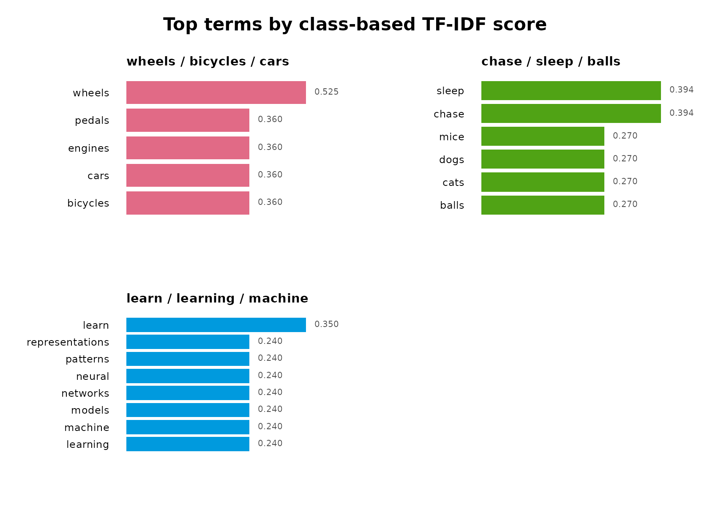
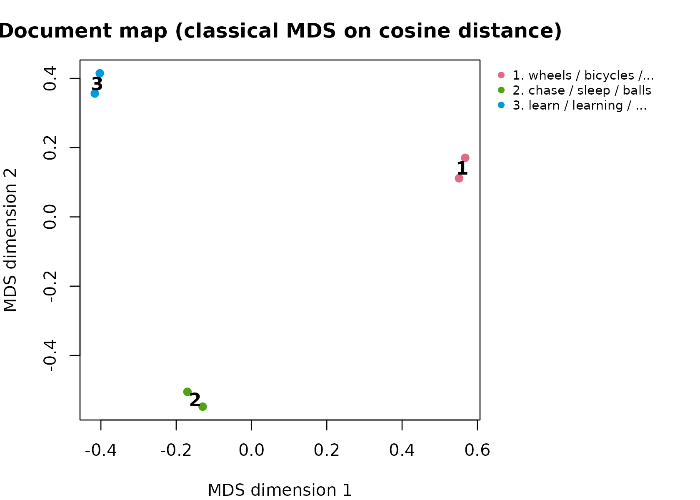

# Python-Free Sentence-BERT in R

`sbert` runs a genuine Sentence-BERT model without Python. It combines
the official Hugging Face tokenizer configuration, native ONNX Runtime
inference, attention-mask-aware mean pooling, and L2 normalization.

Downloads are never triggered by package installation, loading,
examples, tests, or this vignette. Install the native runtime and pinned
model explicitly:

``` r

library(sbert)
install_runtime()
model_download()
```

Load the verified files and encode text:

``` r

model <- load_model()
sentences <- c(
  "A student is reading a research paper.",
  "A learner studies an academic article.",
  "The bicycle is parked beside the building."
)
embeddings <- encode(sentences, model)
dim(embeddings)
topic_similarity(embeddings)
```

The output has one row per sentence and 384 columns. Normalized vectors
have unit L2 norm, so their matrix product is cosine topic_similarity.

The post-processing functions are independently usable and require no
model download. This small example masks the third token of each
sentence:

``` r

token_embeddings <- array(seq_len(12), dim = c(2, 3, 2))
attention_mask <- matrix(c(1, 1, 0, 1, 1, 0), nrow = 2, byrow = TRUE)
sentence_embeddings <- sbert::pool(
  token_embeddings,
  attention_mask
)
sentence_embeddings
#>           [,1]      [,2]
#> [1,] 0.2425356 0.9701425
#> [2,] 0.3162278 0.9486833
rowSums(sentence_embeddings^2)
#> [1] 1 1
sbert::topic_similarity(sentence_embeddings)
#>           [,1]      [,2]
#> [1,] 1.0000000 0.9970545
#> [2,] 0.9970545 1.0000000
```

Use
[`model_status()`](https://pak.dynasite.org/sbert/reference/model_status.md)
to inspect artifact validity,
[`cache_size()`](https://pak.dynasite.org/sbert/reference/cache_size.md)
to measure disk use, and
[`model_remove()`](https://pak.dynasite.org/sbert/reference/model_remove.md)
to remove the pinned model.

## Semantic topic modeling

[`topics()`](https://pak.dynasite.org/sbert/reference/topics.md)
clusters normalized sentence embeddings with deterministic k-means. It
then identifies documents nearest each semantic center and computes
class-based TF-IDF terms from the original text. The topic count is
always explicit.

The same function accepts precomputed embeddings, so this complete
example is offline-safe:

``` r

topic_text <- c(
  "Cats chase mice and sleep",
  "Dogs chase balls and sleep",
  "Neural networks learn representations",
  "Machine learning models learn patterns",
  "Bicycles have wheels and pedals",
  "Cars have wheels and engines"
)
topic_embeddings <- rbind(
  c(1, 0, 0), c(0.95, 0.05, 0),
  c(0, 1, 0), c(0.05, 0.95, 0),
  c(0, 0, 1), c(0.05, 0, 0.95)
)
topic_model <- sbert::topics(
  topic_text,
  n_topics = 3,
  embeddings = topic_embeddings,
  n_terms = 4,
  n_representatives = 1,
  keep_embeddings = TRUE
)
topic_model$topics
#>   topic                      label n_documents proportion    withinss
#> 1     1   wheels / bicycles / cars           2  0.3333333 0.001382171
#> 2     2      chase / sleep / balls           2  0.3333333 0.001382171
#> 3     3 learn / learning / machine           2  0.3333333 0.001382171
topic_model$terms
#>    topic                      label     term rank     score frequency
#> 1      1   wheels / bicycles / cars   wheels    1 0.5251788         2
#> 2      1   wheels / bicycles / cars bicycles    2 0.3599140         1
#> 3      1   wheels / bicycles / cars     cars    3 0.3599140         1
#> 4      1   wheels / bicycles / cars  engines    4 0.3599140         1
#> 5      2      chase / sleep / balls    chase    1 0.3938841         2
#> 6      2      chase / sleep / balls    sleep    2 0.3938841         2
#> 7      2      chase / sleep / balls    balls    3 0.2699355         1
#> 8      2      chase / sleep / balls     cats    4 0.2699355         1
#> 9      3 learn / learning / machine    learn    1 0.3501192         2
#> 10     3 learn / learning / machine learning    2 0.2399427         1
#> 11     3 learn / learning / machine  machine    3 0.2399427         1
#> 12     3 learn / learning / machine   models    4 0.2399427         1
topic_model$representatives
#>   topic                      label rank document_id document_name
#> 1     1   wheels / bicycles / cars    1           6              
#> 2     2      chase / sleep / balls    1           2              
#> 3     3 learn / learning / machine    1           4              
#>                                     text     distance
#> 1           Cars have wheels and engines 0.0003456024
#> 2             Dogs chase balls and sleep 0.0003456024
#> 3 Machine learning models learn patterns 0.0003456024
```

This is document-level embedding topic discovery. It is not a
probabilistic LDA model and does not estimate per-document topic
mixtures.

The term weighting follows the class-based TF-IDF of Mendonca and
Figueira (2025). Set `weighting = "bm25"` or
`reduce_frequent_words = TRUE` to switch to the BM25 and square-root
variants that more aggressively suppress terms shared across topics.

## Evaluating topic quality

Topic solutions are judged, not assumed.
[`coherence()`](https://pak.dynasite.org/sbert/reference/coherence.md)
scores how often a topic’s top terms co-occur in the same documents;
[`topic_diversity()`](https://pak.dynasite.org/sbert/reference/topic_diversity.md)
reports how distinct the topics’ vocabularies are; and
[`summary()`](https://rdrr.io/r/base/summary.html) combines both into a
single report with a tidy per-topic quality table.

``` r

sbert::coherence(topic_model, measure = "npmi")
#>   topic                      label measure n_terms coherence
#> 1     1   wheels / bicycles / cars    npmi       4 0.1399069
#> 2     2      chase / sleep / balls    npmi       4 0.4087648
#> 3     3 learn / learning / machine    npmi       4 0.8065736
sbert::topic_diversity(topic_model)
#> [1] 1
summary(topic_model)
#> Semantic topic model summary
#>   documents:            6
#>   topics:               3
#>   model:                precomputed embeddings
#>   between/total SS:      99.9%
#>   mean npmi  coherence:  0.4517
#>   topic topic_diversity:      1.000 (top 10 terms)
#> 
#>  topic                      label n_documents proportion coherence
#>      1   wheels / bicycles / cars           2     0.3333    0.1399
#>      2      chase / sleep / balls           2     0.3333    0.4088
#>      3 learn / learning / machine           2     0.3333    0.8066
```

`"umass"` coherence (Mimno et al. 2011) and `"npmi"` coherence are both
computed on the input corpus, so no external reference corpus is
required.

## Visualizing a topic model

Three deterministic base-graphics views summarize a model. The document
map projects the embeddings to two dimensions with classical
multidimensional scaling on cosine distance – a reproducible alternative
to UMAP.

``` r

plot(topic_model, type = "sizes")
```


``` r

plot(topic_model, type = "terms")
```



``` r

plot(topic_model, type = "map")
```


