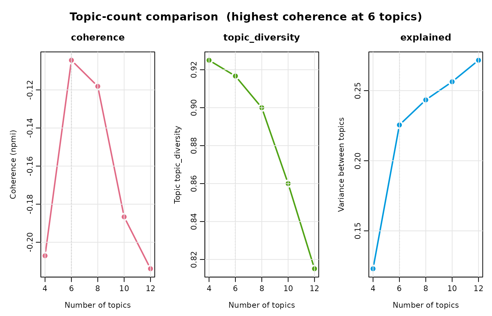
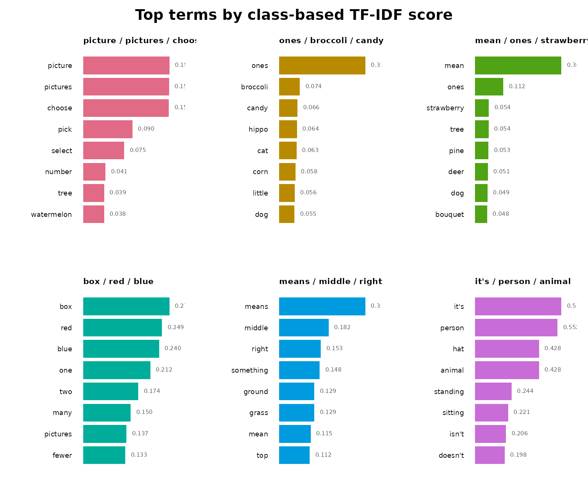
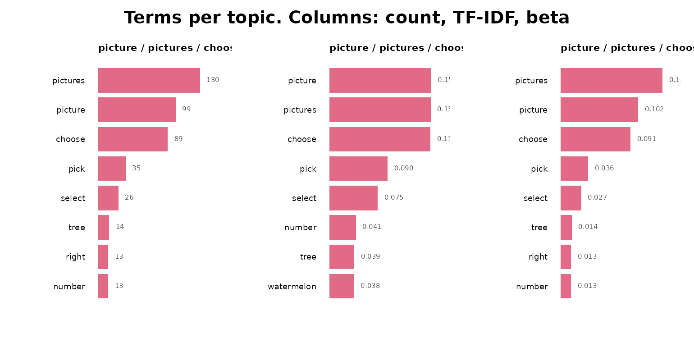
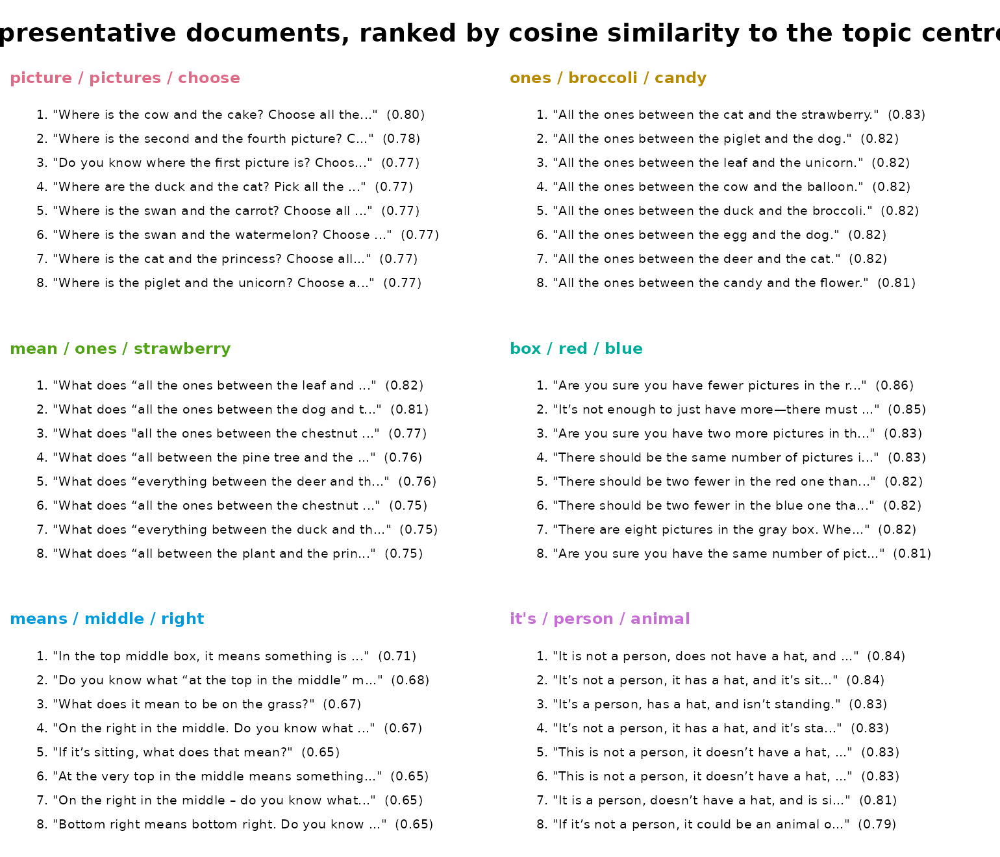
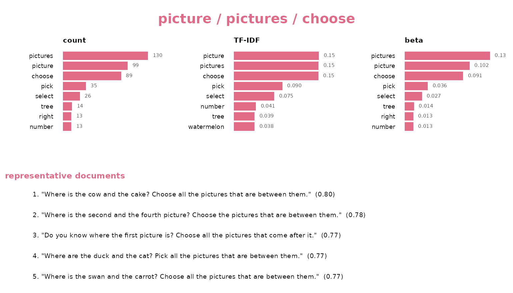

# Topic Modeling: A Tutorial

This tutorial fits a topic model end to end on real data and reads the
result. Every step is one verb with named arguments returning a data
frame you print directly.

## The data

`feedback_translations` ships with the package: 8,757 AI-generated
mathematics feedback messages from the Levebee application, each paired
with an English translation. The source languages include Czech, Slovak,
Polish, German, Hungarian, Romanian, Ukrainian, Russian, Mongolian, and
Vietnamese.

``` r

head(feedback_translations)
#>                                                       feedback
#> 1                                Víš, co znamená o jeden více?
#> 2                   V červeném má být o dva více než v modrém.
#> 3                     Když to není člověk, tak co to může být?
#> 4                                Co znamená všechny za prvním?
#> 5 V šedém rámečku je pět obrázků. Kde je o jeden obrázek méně?
#> 6                              Podle čeho se obrázky střídají?
#>                                                                 translation
#> 1                                        Do you know what “one more” means?
#> 2                     There should be two more in the red than in the blue.
#> 3                                   If it’s not a person, what could it be?
#> 4                            What does “everyone after the first one” mean?
#> 5 There are five pictures in the gray box. Where is there one picture less?
#> 6                                            How do the pictures alternate?
```

The messages are short instructional hints, and some repeat verbatim —
“Try again.” is the most common, appearing 11 times. That matters for
topic modeling, because a heavily repeated template would otherwise pull
a topic toward itself.
[`dedupe()`](https://pak.dynasite.org/sbert/reference/dedupe.md)
collapses repeats and records how often each one occurred:

``` r

corpus <- dedupe(feedback_translations$translation)
head(corpus)
```

## Embedding

Encoding is the one expensive step, so do it once and reuse the matrix:

``` r

install_runtime()
model_download()

embeddings <- encode(corpus$text, batch_size = 64)
```

To keep this vignette buildable without a download, the remaining chunks
use a precomputed matrix for 600 of those messages, encoded with the
pinned `all-MiniLM-L6-v2`:

``` r

text <- fixture$text
embeddings <- fixture$embeddings

length(text)
#> [1] 600
dim(embeddings)
#> [1] 600 384
```

## Choosing how many topics

There is no correct topic count.
[`select_topics()`](https://pak.dynasite.org/sbert/reference/select_topics.md)
fits one model per candidate and reports the numbers that justify a
choice — so you pick from a table rather than by habit:

``` r

sweep <- select_topics(
  text,
  n_topics = c(4, 6, 8, 10, 12),
  embeddings = embeddings,
  measure = "npmi"
)

sweep
#> <sbert_topic_sweep> 5 candidates, coherence measure: npmi
#>  n_topics  coherence topic_diversity explained
#>         4 -0.2070855       0.9250000 0.1229819
#>         6 -0.1044246       0.9166667 0.2255144
#>         8 -0.1181287       0.9000000 0.2433832
#>        10 -0.1866628       0.8600000 0.2563262
#>        12 -0.2138928       0.8151261 0.2716759
#> 
#> Fitted models retained: fitted(x, n_topics = 6)
```

Read it this way: coherence measures whether a topic’s top terms
actually co-occur, diversity whether topics repeat each other’s
vocabulary, and `explained` how much embedding variance sits between
topics rather than within them. Coherence usually falls as counts rise
while `explained` always rises, so the useful signal is the count *after
which coherence stops improving* — not a global maximum.

``` r

plot(sweep)
```



The sweep keeps every model it fitted, so committing to one costs
nothing:

``` r

fit <- fitted(sweep, n_topics = 6)
fit
#> <sbert_topic_model>
#>   documents: 600
#>   topics: 6
#>   model: precomputed embeddings
#>   algorithm: deterministic k-means (Lloyd)
#>   topic sizes: 223, 133, 131, 49, 37, 27
#>   between/total SS: 22.6%
```

## Reading the topics

[`summary()`](https://rdrr.io/r/base/summary.html) is the report: sizes,
quality, and the terms that define each topic.

``` r

summary(fit)
#> Semantic topic model summary
#>   documents:            600
#>   topics:               6
#>   model:                precomputed embeddings
#>   between/total SS:      22.6%
#>   mean npmi  coherence:  -0.1044
#>   topic topic_diversity:      0.917 (top 10 terms)
#> 
#>  topic                       label n_documents proportion coherence
#>      1 picture / pictures / choose         223    0.37167   -0.2368
#>      2     ones / broccoli / candy         133    0.22167   -0.4150
#>      3    mean / ones / strawberry         131    0.21833   -0.2564
#>      4            box / red / blue          49    0.08167    0.3011
#>      5      means / middle / right          37    0.06167   -0.2043
#>      6      it's / person / animal          27    0.04500    0.1849
```

Terms are ranked by class-based TF-IDF, which favours words that
separate this topic from the others:

``` r

head(terms(fit, n = 5), 15)
#>    topic                       label       term rank      score frequency
#> 1      1 picture / pictures / choose    picture    1 0.15812657        99
#> 2      1 picture / pictures / choose   pictures    2 0.15734447       130
#> 3      1 picture / pictures / choose     choose    3 0.15707789        89
#> 4      1 picture / pictures / choose       pick    4 0.09026252        35
#> 5      1 picture / pictures / choose     select    5 0.07513736        26
#> 6      2     ones / broccoli / candy       ones    1 0.30963920        82
#> 7      2     ones / broccoli / candy   broccoli    2 0.07420924         9
#> 8      2     ones / broccoli / candy      candy    3 0.06596377         8
#> 9      2     ones / broccoli / candy      hippo    4 0.06377882         8
#> 10     2     ones / broccoli / candy        cat    5 0.06277479         8
#> 11     3    mean / ones / strawberry       mean    1 0.34359216       130
#> 12     3    mean / ones / strawberry       ones    2 0.11237273        38
#> 13     3    mean / ones / strawberry strawberry    3 0.05446666         9
#> 14     3    mean / ones / strawberry       tree    4 0.05377455        10
#> 15     3    mean / ones / strawberry       pine    5 0.05259430         8
#>          beta
#> 1  0.10174717
#> 2  0.13360740
#> 3  0.09146968
#> 4  0.03597122
#> 5  0.02672148
#> 6  0.21025641
#> 7  0.02307692
#> 8  0.02051282
#> 9  0.02051282
#> 10 0.02051282
#> 11 0.26104418
#> 12 0.07630522
#> 13 0.01807229
#> 14 0.02008032
#> 15 0.01606426
```

Distinctive is not the same as frequent. To see the words a topic simply
uses most — its raw $`p(term \mid topic)`$ — sort by `beta` instead:

``` r

head(terms(fit, n = 5, sort_by = "beta"), 15)
#>    topic                       label       term rank      score frequency
#> 1      1 picture / pictures / choose   pictures    1 0.15734447       130
#> 2      1 picture / pictures / choose    picture    2 0.15812657        99
#> 3      1 picture / pictures / choose     choose    3 0.15707789        89
#> 4      1 picture / pictures / choose       pick    4 0.09026252        35
#> 5      1 picture / pictures / choose     select    5 0.07513736        26
#> 6      2     ones / broccoli / candy       ones    1 0.30963920        82
#> 7      2     ones / broccoli / candy   broccoli    2 0.07420924         9
#> 8      2     ones / broccoli / candy      candy    3 0.06596377         8
#> 9      2     ones / broccoli / candy        cat    4 0.06277479         8
#> 10     2     ones / broccoli / candy       corn    5 0.05843647         8
#> 11     3    mean / ones / strawberry       mean    1 0.34359216       130
#> 12     3    mean / ones / strawberry       ones    2 0.11237273        38
#> 13     3    mean / ones / strawberry   pictures    3 0.03783656        16
#> 14     3    mean / ones / strawberry       tree    4 0.05377455        10
#> 15     3    mean / ones / strawberry strawberry    5 0.05446666         9
#>          beta
#> 1  0.13360740
#> 2  0.10174717
#> 3  0.09146968
#> 4  0.03597122
#> 5  0.02672148
#> 6  0.21025641
#> 7  0.02307692
#> 8  0.02051282
#> 9  0.02051282
#> 10 0.02051282
#> 11 0.26104418
#> 12 0.07630522
#> 13 0.03212851
#> 14 0.02008032
#> 15 0.01807229
```

Term settings can be changed without refitting anything, because terms
depend only on the fitted assignments and the text:

``` r

head(terms(fit, n = 5, weighting = "bm25"), 10)
#>    topic                       label     term rank      score frequency
#> 1      1 picture / pictures / choose   choose    1 0.13868736        89
#> 2      1 picture / pictures / choose  picture    2 0.13374923        99
#> 3      1 picture / pictures / choose pictures    3 0.10811433       130
#> 4      1 picture / pictures / choose     pick    4 0.08680351        35
#> 5      1 picture / pictures / choose   select    5 0.07303796        26
#> 6      2     ones / broccoli / candy     ones    1 0.25452287        82
#> 7      2     ones / broccoli / candy broccoli    2 0.07265190         9
#> 8      2     ones / broccoli / candy    candy    3 0.06457947         8
#> 9      2     ones / broccoli / candy    hippo    4 0.06235970         8
#> 10     2     ones / broccoli / candy      cat    5 0.06133385         8
#>          beta
#> 1  0.09146968
#> 2  0.10174717
#> 3  0.13360740
#> 4  0.03597122
#> 5  0.02672148
#> 6  0.21025641
#> 7  0.02307692
#> 8  0.02051282
#> 9  0.02051282
#> 10 0.02051282
```

If a word appears in nearly every document it defines nothing. Exclude
it and look again:

``` r

head(terms(fit, n = 5, stop_words = stop_words(add = c("try", "click"))), 10)
#>    topic                       label     term rank      score frequency
#> 1      1 picture / pictures / choose  picture    1 0.15819045        99
#> 2      1 picture / pictures / choose pictures    2 0.15739251       130
#> 3      1 picture / pictures / choose   choose    3 0.15714708        89
#> 4      1 picture / pictures / choose     pick    4 0.09031469        35
#> 5      1 picture / pictures / choose   select    5 0.07518373        26
#> 6      2     ones / broccoli / candy     ones    1 0.30943987        82
#> 7      2     ones / broccoli / candy broccoli    2 0.07418199         9
#> 8      2     ones / broccoli / candy    candy    3 0.06593954         8
#> 9      2     ones / broccoli / candy    hippo    4 0.06375471         8
#> 10     2     ones / broccoli / candy      cat    5 0.06275073         8
#>          beta
#> 1  0.10185185
#> 2  0.13374486
#> 3  0.09156379
#> 4  0.03600823
#> 5  0.02674897
#> 6  0.21025641
#> 7  0.02307692
#> 8  0.02051282
#> 9  0.02051282
#> 10 0.02051282
```

## Evidence for each topic

Terms describe a topic; documents prove it.
[`representatives()`](https://pak.dynasite.org/sbert/reference/representatives.md)
ranks by margin — how much more a document belongs to its own topic than
to its closest rival — which surfaces the clear cases rather than merely
the central ones:

``` r

head(representatives(fit, n = 2), 8)
#>   topic rank
#> 1     1    1
#> 2     1    2
#> 3     2    1
#> 4     2    2
#> 5     3    1
#> 6     3    2
#> 7     4    1
#> 8     4    2
#>                                                                                text
#> 1 Where is the cat and the princess? Choose all the pictures that are between them.
#> 2  Where is the cup and the balloon? Select all the pictures that are between them.
#> 3                                      All the ones between the grape and the tram.
#> 4                                         All the ones between the fly and the cat.
#> 5                          What does “all between the plant and the princess” mean?
#> 6                   What does “all the ones between the leaf and the unicorn” mean?
#> 7                    There should be two fewer in the red one than in the blue one.
#> 8                    There should be two fewer in the blue one than in the red one.
#>    distance    margin
#> 1 0.2342085 0.3007396
#> 2 0.2850857 0.2922610
#> 3 0.2641428 0.3146493
#> 4 0.2080425 0.3134329
#> 5 0.2518425 0.3209479
#> 6 0.1835523 0.2937963
#> 7 0.1805440 0.5532961
#> 8 0.1838668 0.5515990
```

## Quality

``` r

coherence(fit, measure = "npmi")
#>   topic                       label measure n_terms  coherence
#> 1     1 picture / pictures / choose    npmi      10 -0.2367956
#> 2     2     ones / broccoli / candy    npmi      10 -0.4150297
#> 3     3    mean / ones / strawberry    npmi      10 -0.2563526
#> 4     4            box / red / blue    npmi      10  0.3010516
#> 5     5      means / middle / right    npmi      10 -0.2043292
#> 6     6      it's / person / animal    npmi      10  0.1849079
```

``` r

topic_diversity(fit)
#> [1] 0.9166667
```

Diversity is the share of distinct terms across all topics’ term lists:
1 means no topic repeats another’s vocabulary, low values mean the model
has split one theme several ways.

## Which topics are neighbours?

``` r

tree <- topic_hierarchy(fit)
tree
#> <sbert_topic_hierarchy> 6 topics, 5 merges (cosine distance)
#> 
#>  step    height                                  left
#>     1 0.2972668    topic 3 (mean / ones / strawberry)
#>     2 0.3199983 topic 1 (picture / pictures / choose)
#>     3 0.5163521                               merge 1
#>     4 0.6351317            topic 4 (box / red / blue)
#>     5 0.7383564      topic 6 (it's / person / animal)
#>                              right
#>   topic 5 (means / middle / right)
#>  topic 2 (ones / broccoli / candy)
#>                            merge 2
#>                            merge 3
#>                            merge 4
```

``` r

plot(tree)
```


Merging down the tree is not the same as refitting at a smaller count:
it keeps the finer structure as a nesting, which is usually what you
want for reporting.

``` r

smaller <- reduce_topics(fit, n_topics = 5)
smaller
#> <sbert_topic_model>
#>   documents: 600
#>   topics: 5
#>   model: precomputed embeddings
#>   algorithm: hierarchical merge of deterministic k-means topics
#>   topic sizes: 223, 168, 133, 49, 27
#>   between/total SS: 4.4%
```

## Assigning new messages

``` r

predict(fit, c("Well done, that is correct!", "Look at the picture again."))
```

Hard assignment gives each document one topic. When you need the full
picture — how strongly every document belongs to every topic — ask for
membership:

``` r

head(topic_membership(fit), 8)
#>   document_id topic  probability rank
#> 1           1     3 8.222489e-01    1
#> 2           1     5 9.239112e-02    2
#> 3           1     4 7.655749e-02    3
#> 4           1     2 4.998566e-03    4
#> 5           1     6 2.140314e-03    5
#> 6           1     1 1.663651e-03    6
#> 7           2     4 9.999992e-01    1
#> 8           2     1 4.087932e-07    2
```

Probabilities sum to 1 within a document, and `rank` 1 is its strongest
topic.

## Visual summary

[`plot()`](https://rdrr.io/r/graphics/plot.default.html) renders a
fitted model several ways. Sizes counts documents per topic:

``` r

plot(fit, type = "sizes")
```


`type = "terms"` defaults to the class-based TF-IDF terms. The `by`
argument switches the ranking to the raw within-topic count
(`"frequency"`) or the generative probability (`"beta"`), and accepts
several metrics at once — one column each — so the *says-most* and
*says-distinctively* views sit side by side (shown here for one topic):

``` r

plot(fit, type = "terms")
```



``` r

plot(fit, type = "terms", by = c("frequency", "score", "beta"), topics = 1)
```



`type = "representatives"` lists each topic’s centroid-nearest messages
— the evidence that a label means what it claims. Ask for more than the
model stored and they are recomputed from the retained embeddings:

``` r

plot(fit, type = "representatives", n_representatives = 8)
```



`type = "fit"` is the whole per-topic report in one figure — all three
term views beside the representative documents, one row per topic.
`per_topic = TRUE` gives each topic its own figure with the documents
stacked beneath the terms (shown here for a single topic):

``` r

plot(fit, type = "fit", per_topic = TRUE, topics = 1)
```



## Guided topics

When you already know what you are looking for, seed it. Seeds become
the starting centroids and name their topics:

``` r

guided <- topics(
  text,
  n_topics = 4,
  embeddings = embeddings,
  seeds = c(
    praise = "well done excellent correct answer",
    retry = "try again check your answer",
    instruction = "read the task and choose the picture",
    counting = "count the numbers and add them"
  )
)
```

With `fixed_seeds = TRUE` the centroids are frozen and every document is
assigned to its nearest seed — zero-shot classification into categories
you defined.

## Where to go next

- [`keywords()`](https://pak.dynasite.org/sbert/reference/keywords.md)
  extracts keywords from documents directly, without a topic model.
- [`segment()`](https://pak.dynasite.org/sbert/reference/segment.md)
  splits documents into sentences or clauses, and
  [`blend()`](https://pak.dynasite.org/sbert/reference/blend.md) carries
  each segment’s parent-document context into its embedding.
- [`?topics`](https://pak.dynasite.org/sbert/reference/topics.md)
  documents every argument used above.
